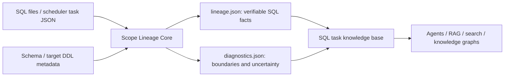

# Scope Lineage: a parsing foundation for AI-ready SQL knowledge bases

[中文](README.zh-CN.md) | English

Scope Lineage is an open-source static analyzer for Spark/Hive SQL. Its goal is not merely to
draw a table-lineage graph. It turns SQL tasks into stable, traceable facts that Agents, RAG
systems, search indexes, and knowledge graphs can consume as the foundation of an AI-ready SQL
task knowledge base.

Passing raw SQL or a simple `input table -> output table` edge to an LLM loses CTEs, subqueries,
UNION branches, field expressions, filters, aggregates, and uncertainty. Scope Lineage preserves
those intermediate structures and writes versioned `lineage.json` and `diagnostics.json`
artifacts, allowing AI applications to reason from verifiable facts instead of guessing at SQL
semantics.

> This repository is the first open-source Core layer: SQL/task ingestion, scope parsing,
> column-level lineage, and diagnostics. Embeddings, knowledge-graph storage, business-semantic
> generation, warehouse modeling, and refactoring recommendations belong to upper layers and are
> not included here.

## What one SQL task becomes

For a task that reads customer details, derives a latest-status row with `ROW_NUMBER`, aggregates
orders, joins the intermediate results, and writes a partitioned target, ordinary table lineage
usually reports only three input tables and one output table. Scope Lineage also records:

- the `latest_status` CTE as a window/dedup scope and the fields used by its partition and order;
- the `order_summary` CTE as an aggregate scope and the exact `COUNT(DISTINCT ...)` or `SUM(CASE ...)`
  expressions;
- JOIN keys separately from row filters embedded in an `ON` condition;
- every output field's expression, transformation role, grain effect, and downstream target;
- the ordered steps by which a field crosses scopes before reaching the target;
- the final proven physical fields, constants, or rowset semantics behind each target field;
- static/dynamic partition facts and authoritative target-column position binding;
- ambiguity candidates, incomplete traces, missing Schema, and other facts that could not be proven.

The output has this shape:

```json
{
  "task_id": "customer_profile_daily",
  "target_table": "mart.customer_profile_snapshot",
  "stmt_kind": "INSERT_OVERWRITE",
  "source_tables": [
    "dwd.order_detail",
    "ods.customer_base",
    "ods.customer_status_event"
  ],
  "scopes": {
    "cte:latest_status": {"kind": "cte", "role": "dedup", "logic_blocks": [], "outputs": []},
    "cte:order_summary": {"kind": "cte", "role": "aggregate", "logic_blocks": [], "outputs": []},
    "ROOT": {"kind": "root", "role": "join", "logic_blocks": [], "outputs": []}
  },
  "scope_graph": {"nodes": [], "edges": []},
  "field_mapping_chains": [],
  "end_to_end_lineage": [],
  "diagnostics": {"warning_count": 0, "lineage_fact_gap_count": 0}
}
```

`scopes` is a JSON map: each key is a stable scope ID, and each value contains that query block's
inputs, alias bindings, SQL, logic blocks, and output fields. See the detailed
[`lineage.json` contract](docs/zh-CN/lineage-json.md).

## Why these facts matter to AI systems

| Raw-SQL limitation | Structured fact | Reliable downstream capability |
| --- | --- | --- |
| Long SQL is expensive and easy for a model to misread | `scope_profile.steps[]` and `scope_graph` | staged retrieval and scope-by-scope explanation |
| Table edges cannot answer column questions | `end_to_end_lineage[].physical_sources[]` | column impact analysis and graph edges |
| Final sources do not explain intermediate calculation | `field_mapping_chains[].ordered_steps[]` | evidence-backed transformation explanations |
| JOIN/filter/aggregate logic is trapped in text | typed `logic_blocks[]` and detail objects | rule search, governance review, logic comparison |
| SQL aliases may not be target column names | `target_field_binding` and ordinals | DDL-authoritative target lineage |
| Models tend to turn ambiguity into confident answers | trace status, `ambiguities`, and fact gaps | confidence-aware RAG that can refuse unsupported claims |
| Scheduler and SQL dependencies live separately | task dependencies plus table/scope graphs | task-table-column knowledge graphs |

The value is not a fixed natural-language summary. It is a reproducible, addressable fact layer:
an upper-layer answer can point back to a scope, expression, physical field, and diagnostic reason.

## What it provides

- Offline static analysis for Spark/Hive warehouse SQL; no Spark cluster or query execution is
  required.
- Inputs from one `.sql` file, an exported scheduler task JSON, or a recursive task directory.
- `INSERT INTO`, `INSERT OVERWRITE`, CTAS, and `MERGE` write statements.
- Preserved CTE, subquery, JOIN, UNION/UNION ALL, aggregate, window, and intermediate scopes.
- Field mappings, expressions, physical source fields, end-to-end lineage, and scope dependencies.
- Optional Schema metadata for `SELECT *` expansion, field types, and comments.
- Optional target DDL/Schema metadata for authoritative positional INSERT binding.
- Declared upstream and downstream task dependencies retained from task JSON.
- Explicit status and diagnostics for parse failures, syntax recovery, ambiguity, and missing
  metadata; guesses are not presented as proven facts.
- Versioned JSON Schema contracts validated before artifacts are written.

## How it supports an AI knowledge base



The Core owns deterministic parsing and fact representation. It does not force a vector database,
graph database, or model choice. The same facts can support code search, task Q&A, impact analysis,
governance review, and later business-knowledge generation.

## Why another project

The open-source ecosystem already contains mature projects; Scope Lineage does not claim to be the
first SQL parser or lineage tool:

- [SQLGlot](https://github.com/tobymao/sqlglot) is a general SQL parser, transpiler, and optimizer,
  and is the parsing engine used by this project.
- [SQLLineage](https://sqllineage.readthedocs.io/) provides general table- and column-level SQL
  lineage.
- [OpenLineage](https://openlineage.io/docs/guides/spark/) focuses on standardized lineage events
  collected from running Spark jobs.
- [DataHub](https://github.com/datahub-project/datahub/blob/master/docs/api/tutorials/lineage.md) is
  a full metadata platform that can also infer column lineage from SQL.

Scope Lineage specializes in offline Spark/Hive tasks and unifies intermediate scopes, field
transformations, task dependencies, metadata enrichment, end-to-end evidence, and parse diagnostics
as a versioned fact contract for AI knowledge bases. Based on the published positioning of the
projects above, we have not found an open-source tool with exactly this complete objective and
artifact boundary. This is a direction for the project to validate and build—not a claim that no
other SQL-lineage solution exists.

## Install

Install the current version from source:

```bash
git clone https://github.com/realyin/sparksql-knowleage-parse.git
cd sparksql-knowleage-parse
python -m pip install -e ".[dev]"
```

The package name is `scope-lineage`; the current `0.1.x` series is Alpha.

## Quick start

Parse one SQL file:

```bash
scope-lineage parse \
  --sql-file examples/sql/customer_profile_daily.sql \
  --schema examples/metadata/schema_info.csv \
  --target-ddl-metadata examples/metadata/target_tables \
  --out /tmp/scope-lineage
```

Parse one scheduler task export in the current `meta/query_time/data_source` format:

```bash
scope-lineage parse \
  --task-file examples/tasks/customer/customer_profile_daily.json \
  --schema examples/metadata/schema_info.csv \
  --target-ddl-metadata examples/metadata/target_tables \
  --out /tmp/scope-lineage
```

Parse a task directory recursively:

```bash
scope-lineage parse \
  --input-dir examples/tasks \
  --schema examples/metadata/schema_info.csv \
  --target-ddl-metadata examples/metadata/target_tables \
  --out /tmp/scope-lineage-corpus
```

Nested input paths are preserved in the output. When one task contains multiple supported write
statements, each statement receives its own artifacts. Use `--allow-partial` only when callers
explicitly accept invalid inputs or failed statements. See the complete synthetic corpus in
[examples/README.zh-CN.md](examples/README.zh-CN.md) and the detailed
[Core input formats](docs/zh-CN/input-formats.md).

## Inputs

Task JSON may use the current scheduler-export wrapper:

```json
{
  "meta": {
    "task_id": "demo-task-1002",
    "task_name": "customer_profile_daily",
    "input_tables": ["ods.customer_base", "dwd.order_detail"],
    "output_tables": ["mart.customer_profile_snapshot"],
    "upstream_tasks": [
      {"task_id": "demo-task-1001", "task_name": "order_detail_daily"}
    ],
    "downstream_tasks": [],
    "sql": "INSERT OVERWRITE TABLE ..."
  },
  "query_time": "2026-08-02 10:00:00",
  "data_source": "scheduler_api_demo"
}
```

Schema metadata accepts CSV or JSON. A production-shaped CSV can carry types and comments:

```csv
table_name,column_name,column_type,column_comment
ods.customer_base,customer_id,bigint,Synthetic customer identifier
ods.customer_base,customer_name,string,Synthetic customer name
```

`--target-ddl-metadata` accepts one JSON file or a directory with one document per target table.
Schema metadata resolves source fields and expands `SELECT *`; target metadata provides
authoritative target order for INSERT binding.

## Outputs

Each supported write statement creates only two Core artifacts:

```text
<output>/<task-id>/
├── lineage.json
└── diagnostics.json
```

`lineage.json` groups its facts as follows:

| Questions | Keys |
| --- | --- |
| What is written, and how? | `target_table`, `stmt_kind`, `target_partition_*` |
| What physical data is read? | `source_tables`, `related_metadata` |
| How are CTEs, subqueries, UNIONs, and ROOT connected? | `scopes`, `scope_graph` |
| Where do JOINs, filters, aggregates, and windows occur? | `scopes.*.logic_blocks` |
| How does a field move through query blocks? | `scopes.*.outputs`, `field_mapping_chains` |
| Which physical fields prove each target field? | `end_to_end_lineage` |
| Is the answer complete or ambiguous? | trace status, missing reasons, and ambiguities |

`diagnostics.json` contains complete `warnings[]`, structural `stats`, and
`lineage_fact_gaps[]` with affected objects, missing facts, evidence paths, and downstream impact.
AI consumers should read both documents and must not treat recovered syntax, ambiguity candidates,
or missing metadata as proven lineage.

Documentation:

- [Documentation map and question-to-field index](docs/zh-CN/README.md)
- [`lineage.json` keys, nested values, examples, and consumption rules](docs/zh-CN/lineage-json.md)
- [`diagnostics.json` warnings, stats, and fact gaps](docs/zh-CN/diagnostics-json.md)
- [SQL, task JSON, Schema, and target-DDL inputs](docs/zh-CN/input-formats.md)

## Python API

```python
from lineage_parser import parse_scope_lineage, to_lineage_dict, write_lineage

result = parse_scope_lineage(
    "INSERT INTO mart.user_ids SELECT id FROM ods.users",
    task_id="user_ids",
    schema={"ods.users": ["id"]},
)

document = to_lineage_dict(result)
write_lineage(result, "/tmp/scope-lineage/user_ids")
```

The supported public surface is declared by `lineage_parser.PUBLIC_CORE_API`. Consumers should use
that facade or the JSON contracts instead of importing internal modules.

## Contracts and limits

Both output documents currently require `schema_version: "1.0"` and are validated before writing.
Within major version 1, consumers must tolerate additive optional fields. Removal, renaming, or a
semantic change requires a new major contract version.

- [Lineage contract (Chinese)](docs/zh-CN/lineage-json.md)
- [Diagnostics contract (Chinese)](docs/zh-CN/diagnostics-json.md)
- [Core input formats (Chinese)](docs/zh-CN/input-formats.md)

Current limits:

- Static analysis does not prove that SQL will execute successfully on a real Spark cluster.
- Standalone `UPDATE`/`DELETE` is outside the current projection model; update/insert branches
  inside `MERGE` are supported.
- Dynamic SQL, template expansion, and platform-specific syntax may require preprocessing.
- Without Schema metadata, `SELECT *` may remain an explicit degraded placeholder.
- Scope Lineage supplies facts to a knowledge base; it is not a complete knowledge-base product.

## Development

```bash
python -m pytest -q tests/core tests/architecture/test_core_boundaries.py
python -m ruff check lineage_parser tests
python -m build
python tests/architecture/verify_distribution.py dist/*
```

Read [CONTRIBUTING.md](CONTRIBUTING.md) and [SECURITY.md](SECURITY.md) before submitting changes.
All fixtures must be synthetic and free of private SQL, internal identifiers, and local paths.

## License

Apache License 2.0. See [LICENSE](LICENSE).
