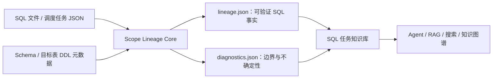

# Scope Lineage：面向 AI SQL 知识库的解析底座

中文 | [English](README.md)

Scope Lineage 是一个开源的 Spark/Hive SQL 静态解析工具。它的目标不是只画一张表血缘图，
而是把 SQL 任务转换成结构稳定、证据可追溯、可直接被 Agent、RAG、搜索和知识图谱消费的
事实层，为 AI 构建 SQL 任务知识库提供底层支撑。

很多系统把原始 SQL 或简单的“输入表 → 输出表”交给大模型。这样会丢失 CTE、子查询、
UNION 分支、字段表达式、过滤条件、聚合和解析不确定性。Scope Lineage 保留这些中间结构，
输出版本化的 `lineage.json` 与 `diagnostics.json`，让上层 AI 在可验证事实之上理解任务，
而不是直接猜测 SQL 含义。

> 当前仓库是首期开源的 Core 层：负责 SQL/任务输入、scope 解析、字段级血缘和诊断输出。
> 向量化、知识图谱存储、业务语义生成、数仓建模和重构建议属于上层能力，不包含在本仓库中。

## 先看结果：它把一段 SQL 变成什么

假设任务中有三层逻辑：

```sql
WITH latest_status AS (
  SELECT customer_id, customer_status,
         ROW_NUMBER() OVER (PARTITION BY customer_id ORDER BY event_time DESC) AS row_num
  FROM ods.customer_status_event
),
order_summary AS (
  SELECT customer_id, COUNT(DISTINCT order_id) AS order_count_30d
  FROM dwd.order_detail
  GROUP BY customer_id
)
INSERT OVERWRITE TABLE mart.customer_profile_snapshot PARTITION (dt='${bizdate}')
SELECT b.customer_id, s.customer_status, o.order_count_30d
FROM ods.customer_base b
LEFT JOIN latest_status s ON b.customer_id = s.customer_id AND s.row_num = 1
LEFT JOIN order_summary o ON b.customer_id = o.customer_id;
```

普通表血缘通常只告诉你“读取 3 张表，写入 1 张表”。Scope Lineage 还会输出：

- `cte:latest_status` 是带窗口排序的查询块，`row_num` 依赖 `customer_id` 和 `event_time`；
- `cte:order_summary` 改变了数据粒度，`order_count_30d` 来自 `COUNT(DISTINCT order_id)`；
- ROOT 使用两个 LEFT JOIN，且 `s.row_num = 1` 是 JOIN ON 中的记录筛选条件；
- 目标字段 `mart.customer_profile_snapshot.order_count_30d` 最终来自 `dwd.order_detail.order_id`；
- 该字段从上游聚合 scope 到目标字段经历了哪些表达式和变换步骤；
- 目标表按 `dt='${bizdate}'` 静态分区写入；
- 如果 `customer_id` 没有限定名且同时匹配多个来源，输出会保留歧义候选，而不会任意选一个；
- 如果缺少 Schema 导致 `SELECT *` 无法展开，诊断会明确指出缺哪张表的字段信息。

真实输出的核心骨架如下：

```json
{
  "task_id": "customer_profile_daily",
  "target_table": "mart.customer_profile_snapshot",
  "stmt_kind": "INSERT_OVERWRITE",
  "source_tables": [
    "dwd.order_detail",
    "ods.customer_base",
    "ods.customer_status_event"
  ],
  "scopes": {
    "cte:latest_status": {"kind": "cte", "role": "dedup", "logic_blocks": [], "outputs": []},
    "cte:order_summary": {"kind": "cte", "role": "aggregate", "logic_blocks": [], "outputs": []},
    "ROOT": {"kind": "root", "role": "join", "logic_blocks": [], "outputs": []}
  },
  "scope_graph": {"nodes": [], "edges": []},
  "field_mapping_chains": [],
  "end_to_end_lineage": [],
  "diagnostics": {"warning_count": 0, "lineage_fact_gap_count": 0}
}
```

这里的 `scopes` 是以 scope ID 为 key 的对象；每个 value 保存该查询块的输入、alias 绑定、SQL、逻辑块和输出字段。完整字段解释见 [`lineage.json` 输出契约](docs/zh-CN/lineage-json.md)。

## 这些事实为什么对 AI 有价值

| 原始 SQL 的问题 | Scope Lineage 提供的事实 | 上层可以可靠实现的能力 |
| --- | --- | --- |
| SQL 太长，直接塞给模型成本高且容易漏逻辑 | `scope_profile.steps[]`、scope 图和结构化逻辑块 | 分层检索、任务摘要、按查询块解释 |
| 只有表级边，无法回答字段从哪里来 | `end_to_end_lineage[].physical_sources[]` | 字段影响分析、字段知识图谱、变更问答 |
| 只知道最终来源，不知道中间怎么算 | `field_mapping_chains[].ordered_steps[]` | 展示字段逐步变换证据，解释指标计算过程 |
| JOIN/过滤/聚合被压成一段文本 | `logic_blocks[]` 及 join/filter/aggregation/window detail | 结构化搜索规则、治理审查、逻辑对比 |
| SQL 别名和目标字段名不一致 | `target_field_binding` 和目标字段位置 | 按 DDL 权威顺序建立正确目标字段血缘 |
| 大模型容易把歧义当成确定答案 | `trace_complete`、`ambiguities`、`lineage_fact_gaps` | 带可信度的 RAG，拒绝无证据推断 |
| 调度依赖和 SQL 表依赖分散 | `task_dependencies` + `scope_graph` + `source_tables` | 任务、表、字段多层知识图谱 |

Scope Lineage 的价值不是替 AI 写一段固定总结，而是提供可复算、可定位、可校验的事实。上层生成的每条业务解释都可以回到具体 scope、表达式、字段来源和诊断证据。

## 它能做什么

- 面向 Spark/Hive 数仓 SQL，离线静态解析，不需要连接 Spark 集群或执行 SQL；
- 接收单个 `.sql`、真实调度任务 JSON，或递归任务目录；
- 支持 `INSERT INTO`、`INSERT OVERWRITE`、CTAS 和 `MERGE` 写表语句；
- 保留 CTE、子查询、JOIN、UNION/UNION ALL、聚合、窗口函数和中间 scope；
- 生成字段映射、表达式、物理源字段、端到端字段血缘和 scope 依赖图；
- 结合可选 Schema 元数据展开 `SELECT *`，补充字段类型和注释；
- 结合目标表 DDL/Schema 元数据，按权威字段顺序绑定 INSERT 投影；
- 从任务 JSON 保留声明的上下游任务依赖；
- 对无法解析、语法恢复、歧义引用和元数据缺失给出显式状态与诊断，不把猜测伪装成事实；
- 通过版本化 JSON Schema 和写盘前校验，为 AI 与其他下游提供稳定契约。

## 面向 AI 知识库的工作方式



Core 负责确定性解析和事实表达，不负责替用户选择向量数据库、图数据库或大模型。这样的边界使
同一份解析结果可以服务代码检索、任务问答、影响分析、治理审查和后续业务知识生成。

## 为什么还需要这个项目

开源生态已经有成熟能力，本项目并不宣称自己是第一个 SQL 解析器或血缘工具：

- [SQLGlot](https://github.com/tobymao/sqlglot) 是通用 SQL 解析、转译和优化引擎，也是本项目的底层依赖；
- [SQLLineage](https://sqllineage.readthedocs.io/) 提供通用表级和字段级 SQL 血缘；
- [OpenLineage](https://openlineage.io/docs/guides/spark/) 侧重从运行中的 Spark 作业采集标准化血缘事件；
- [DataHub](https://github.com/datahub-project/datahub/blob/master/docs/api/tutorials/lineage.md) 是完整元数据平台，也能从 SQL 推断字段血缘。

Scope Lineage 的差异化方向，是专注 Spark/Hive 离线任务，把中间 scope、字段变换、任务依赖、
元数据补全、端到端证据和解析诊断统一成面向 AI 知识库的版本化事实契约。根据目前可见的上述
项目官方定位，我们尚未发现一个与这一完整目标和输出边界完全相同的开源工具；这是项目要验证
和持续建设的方向，不是“没有其他 SQL 血缘方案”的绝对结论。

## 安装

当前版本从源码安装：

```bash
git clone https://github.com/realyin/sparksql-knowleage-parse.git
cd sparksql-knowleage-parse
python -m pip install -e ".[dev]"
```

项目包名为 `scope-lineage`，当前处于 `0.1.x` Alpha 阶段。

## 快速开始

### 1. 解析一个 SQL 文件

```bash
scope-lineage parse \
  --sql-file examples/sql/customer_profile_daily.sql \
  --schema examples/metadata/schema_info.csv \
  --target-ddl-metadata examples/metadata/target_tables \
  --out /tmp/scope-lineage
```

### 2. 解析真实格式的任务 JSON

```bash
scope-lineage parse \
  --task-file examples/tasks/customer/customer_profile_daily.json \
  --schema examples/metadata/schema_info.csv \
  --target-ddl-metadata examples/metadata/target_tables \
  --out /tmp/scope-lineage
```

任务导出格式与当前语料一致：

```json
{
  "meta": {
    "task_id": "demo-task-1002",
    "task_name": "customer_profile_daily",
    "input_tables": ["ods.customer_base", "dwd.order_detail"],
    "output_tables": ["mart.customer_profile_snapshot"],
    "upstream_tasks": [
      {"task_id": "demo-task-1001", "task_name": "order_detail_daily"}
    ],
    "downstream_tasks": [],
    "sql": "INSERT OVERWRITE TABLE ..."
  },
  "query_time": "2026-08-02 10:00:00",
  "data_source": "scheduler_api_demo"
}
```

完整示例保留了任务类型、项目、负责人、调度、描述、输入输出表、依赖、实例和时间等实际字段；
Core 当前只消费解析需要的任务名、SQL 和依赖信息。

### 3. 批量解析任务目录

```bash
scope-lineage parse \
  --input-dir examples/tasks \
  --schema examples/metadata/schema_info.csv \
  --target-ddl-metadata examples/metadata/target_tables \
  --out /tmp/scope-lineage-corpus
```

目录会递归发现 `*.json`。嵌套目录结构会保留到输出目录中；一个任务包含多条支持的写表语句时，
每条语句分别生成产物。只有调用方明确接受失败输入或失败语句时，才使用 `--allow-partial`。

更多完整输入见 [examples/README.zh-CN.md](examples/README.zh-CN.md)，字段级说明见
[Core 输入格式](docs/zh-CN/input-formats.md)。

## 输入元数据

Schema 支持 CSV 或 JSON。实际 CSV 可以包含字段类型和注释：

```csv
table_name,column_name,column_type,column_comment
ods.customer_base,customer_id,bigint,Synthetic customer identifier
ods.customer_base,customer_name,string,Synthetic customer name
```

`--target-ddl-metadata` 接收单个 JSON 或目录；每份文件描述目标表名、字段顺序、分区、DDL 和元数据
版本。Schema 主要用于源字段解析和 `SELECT *` 展开，目标表元数据用于权威 INSERT 字段绑定，
两者用途不同。

## 输出

每条写表语句只生成两份 Core 产物：

```text
<output>/<task-id>/
├── lineage.json
└── diagnostics.json
```

### `lineage.json`：已解析事实

| 字段组 | 关键 key | 回答的问题 |
| --- | --- | --- |
| 任务与写入 | `task_id`、`target_table`、`stmt_kind`、`target_partition_*` | 谁写入哪张表、如何分区？ |
| 物理来源 | `source_tables`、`related_metadata` | 读取哪些表和字段，类型/注释是什么？ |
| 查询结构 | `scopes`、`scope_graph` | CTE、子查询、UNION、ROOT 如何连接？ |
| SQL 逻辑 | `logic_blocks`、`input_source_refs` | 在哪里 JOIN、过滤、聚合、开窗？alias 如何绑定？ |
| 字段过程 | `scopes.*.outputs`、`field_mapping_chains` | 字段表达式是什么，经历了哪些 scope 和变换？ |
| 最终血缘 | `end_to_end_lineage` | 每个目标字段最终来自哪些物理字段或生成值？ |
| 可信度 | `trace_complete`、`missing_reasons`、`ambiguities` | 这条事实是否完整，哪里仍不确定？ |

### `diagnostics.json`：边界与缺口

它保存：

- `warnings[]`：warning 类型、发生 scope 和证据消息；
- `stats`：scope、表、JOIN、UNION、CASE、窗口和聚合数量；
- `lineage_fact_gaps[]`：缺口类型、受影响字段、缺失事实、证据路径和下游影响。

AI 下游必须同时读取诊断，不能把 `recovered`、歧义候选或缺失元数据当成已经证明的血缘事实。

详细文档：

- [文档导航与问题—字段索引](docs/zh-CN/README.md)
- [`lineage.json` 全部核心 key/value、嵌套结构和消费示例](docs/zh-CN/lineage-json.md)
- [`diagnostics.json` warning、stats 和 fact gap 字段说明](docs/zh-CN/diagnostics-json.md)
- [SQL、任务 JSON、Schema 和目标 DDL 输入格式](docs/zh-CN/input-formats.md)

## Python API

```python
from lineage_parser import parse_scope_lineage, to_lineage_dict, write_lineage

result = parse_scope_lineage(
    "INSERT INTO mart.user_ids SELECT id FROM ods.users",
    task_id="user_ids",
    schema={"ods.users": ["id"]},
)

document = to_lineage_dict(result)
write_lineage(result, "/tmp/scope-lineage/user_ids")
```

稳定公共面由 `lineage_parser.PUBLIC_CORE_API` 显式声明。下游应使用公共门面或读取 JSON 契约，
不要穿透导入内部实现模块。

## 契约与限制

两份输出当前要求 `schema_version: "1.0"` 并在写盘前校验。同一 major 版本内，消费者应容忍
新增可选字段；删除、改名或改变字段语义必须升级 major。

- [Lineage JSON 契约](docs/zh-CN/lineage-json.md)
- [Diagnostics JSON 契约](docs/zh-CN/diagnostics-json.md)
- [Core 输入格式](docs/zh-CN/input-formats.md)

当前限制：

- 只做静态分析，不判断 SQL 在真实 Spark 集群上能否成功执行；
- 独立 `UPDATE`/`DELETE` 不属于当前字段投影模型，`MERGE` 内的更新/插入分支受支持；
- 动态 SQL、模板展开和平台自定义语法可能需要调用方先预处理；
- 缺少 Schema 时，`SELECT *` 可能保留显式降级占位；
- Scope Lineage 提供知识库事实输入，但本身不是完整的知识库产品。

## 开发验证

```bash
python -m pytest -q tests/core tests/architecture/test_core_boundaries.py
python -m ruff check lineage_parser tests
python -m build
python tests/architecture/verify_distribution.py dist/*
```

提交前请阅读 [CONTRIBUTING.md](CONTRIBUTING.md) 和 [SECURITY.md](SECURITY.md)。所有测试和示例
必须使用合成数据，不得包含私有 SQL、内部标识符或本机路径。

## License

Apache License 2.0，见 [LICENSE](LICENSE)。
