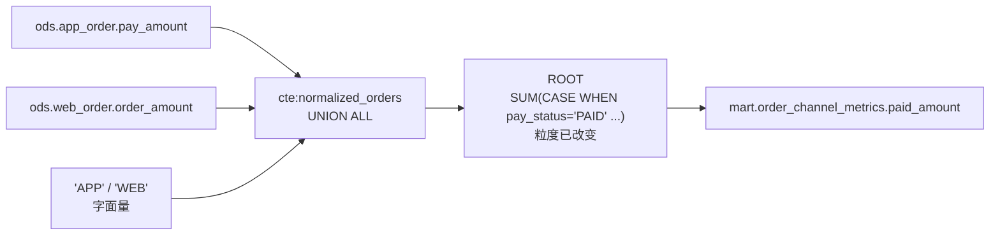
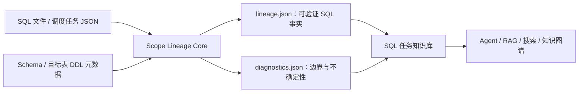

# Scope Lineage

[](https://github.com/realyin/scope-lineage/actions/workflows/ci.yml)
[](pyproject.toml)
[](LICENSE)

中文 | [English](README.md)

**把 Spark/Hive SQL 转换成结构化、可追溯的事实，供 Agent、RAG、搜索和 AI 知识库使用。**

> 普通血缘告诉你数据从哪里来；Scope Lineage 进一步告诉你，它是怎样一步一步变成当前字段的。

Scope Lineage 是一个离线静态分析器，把 CTE、子查询、字段表达式、JOIN、过滤、聚合、窗口和
不确定性保存为版本化的 `lineage.json` 与 `diagnostics.json`。上层 AI 可以引用可定位的证据，
不必根据原始 SQL 或简单的表级边猜测语义。

这个包分三层，各有边界：

1. **事实引擎**（`scope`、`metadata`、`contract`、`serialize`）：SQL/任务输入、scope 解析、
   字段级血缘、任务状态与诊断——也就是版本化契约本身。
2. **事实派生视图**（`render`）：只从契约确定性派生的文档——mapping、任务语义骨架、语料级表卡、
   术语与值域、键折叠候选。
3. **知识生产支持**（`catalog`、`semantics`、`questions`）：概念目录、表语义材料包与校验、
   确认回写、验收题单——为写业务含义的人和模型提供结构与核对，而不代写业务含义。

它不需要 Spark 集群、数据库凭据或大模型；撰写业务文字、向量化和知识图谱存储属于下游能力。

如果你更关心这个工具怎样还原复杂字段的加工过程，可以先读
[《Scope Lineage：把复杂 SQL 还原成可验证的字段加工链》](docs/zh-CN/value-and-use-cases.md)。文档用一个完整的复杂 SQL
脱敏样例，演示字段解释、问题排查、变更评估和结果可信度判断。

## 直接看区别

字段级血缘本身并不稀缺。稀缺的是：在查询里最容易出错的地方给出正确答案，并且对证明不了的部分
保持诚实。

仓库内的 [`order_channel_metrics.sql`](examples/sql/order_channel_metrics.sql) 先用 `UNION ALL`
把两张来源表归一到一个 CTE，再做聚合：

```sql
WITH normalized_orders AS (
  SELECT pay_amount, pay_status, 'APP' AS order_channel
  FROM ods.app_order
  UNION ALL
  SELECT order_amount AS pay_amount, order_status AS pay_status, 'WEB' AS order_channel
  FROM ods.web_order
)
SELECT order_channel,
       SUM(CASE WHEN pay_status = 'PAID' THEN pay_amount ELSE 0 END) AS paid_amount
FROM normalized_orders
GROUP BY order_channel;
```


```mermaid
flowchart LR
    A["ods.app_order.pay_amount"] --> N["cte:normalized_orders<br/>UNION ALL"]
    W["ods.web_order.order_amount"] --> N
    L["'APP' / 'WEB'<br/>字面量"] --> N
    N --> R["ROOT<br/>SUM(CASE WHEN pay_status='PAID' ...)<br/>粒度已改变"]
    R --> T["mart.order_channel_metrics.paid_amount"]
```

这里有两个地方容易出错。

**`order_channel` 是字面量，不是字段。** 作为对照，SQLLineage 1.5.8
（`sqllineage -f <file> -l column --dialect sparksql`）的输出是：

```text
mart.order_channel_metrics.order_channel <- normalized_orders.order_channel
```

这个字段并不存在——它的值是分支里写死的 `'APP'` 或 `'WEB'`。Scope Lineage 会把它记为生成值而
不是读取值：

```json
{
  "column": "order_channel",
  "source_kind": "generated",
  "physical_sources": [],
  "generated_sources": [
    {"source_type": "CONSTANT", "value": "'APP'", "transform": "CONSTANT"},
    {"source_type": "CONSTANT", "value": "'WEB'", "transform": "CONSTANT"}
  ]
}
```

**`paid_amount` 在两个分支里读的是不同名字的列。** 表达式被原样保留，两个分支都被解析回各自的
物理字段：

```json
{
  "column": "paid_amount",
  "transform": "AGGREGATE",
  "expression": "SUM(CASE WHEN `normalized_orders`.`pay_status` = 'PAID' THEN `normalized_orders`.`pay_amount` ELSE 0 END)",
  "physical_sources": [
    {"table": "ods.app_order", "column": "pay_amount",   "transform": "AGGREGATE"},
    {"table": "ods.web_order", "column": "order_amount", "transform": "AGGREGATE"},
    {"table": "ods.app_order", "column": "pay_status",   "transform": "AGGREGATE"},
    {"table": "ods.web_order", "column": "order_status", "transform": "AGGREGATE"}
  ],
  "trace_complete": true
}
```

以上两段都是真实产物节选，不是手写总结。可以用下面的命令复现：

```bash
scope-lineage parse \
  --sql-file examples/sql/order_channel_metrics.sql \
  --schema examples/metadata/schema_info.json \
  --target-ddl-metadata examples/metadata/target_tables \
  --out /tmp/scope-lineage
# 然后查看 /tmp/scope-lineage/order_channel_metrics/lineage.json 的 end_to_end_lineage
```

### 与 SQLLineage 的对比

| | SQLLineage 1.5.8 `-l column` | Scope Lineage |
| --- | --- | --- |
| CTE / JOIN 字段血缘 | 可以解析 | **来源集合一致——两者打平** |
| 字面量字段 | 报成一个并不存在的列 | `generated_sources` 中的 `CONSTANT` |
| UNION 分支追到物理表 | 部分字段停在 CTE | 按分支分别解析 |
| 带 Schema 的 `SELECT *` | `mart.t.* <- ods.s.*` | 展开为具体字段 |
| 变换类型与表达式 | 不提供 | `DIRECT` / `EXPRESSION` / `AGGREGATE` / `CONDITIONAL` 及 SQL |
| 目标字段按 DDL 位置绑定 | 不提供 | `target_field_binding`、序号 |
| 多写语句脚本 | 合并为一份结果 | 每条写语句一个 `statement_lineage` 条目 |
| 无法证明的部分 | 不提供 | `diagnostics.json` |

也要说清楚哪里**没有**差别：在
[`customer_profile_daily.sql`](examples/sql/customer_profile_daily.sql) 这类常规 CTE + JOIN 任务
上，两个工具对每个目标字段给出的物理来源集合完全相同。差异在于每条边上附带的证据——表达式、
变换类型、粒度变化和诊断信息——而不是边本身。

同一任务还会识别窗口/去重角色、区分 JOIN key 与行过滤条件、按目标 DDL 位置绑定字段，并显式
报告无法证明的事实。完整结构见 [`lineage.json` 输出契约](docs/zh-CN/lineage-json.md)。

## 这些事实可以支持什么问题

把一批 SQL 产物建立索引后，上层应用可以回答：

- `customer_profile_snapshot.order_count_30d` 是怎样计算出来的？
- 哪些目标字段依赖 `dwd.order_detail.order_id`？
- 哪些任务使用 `ROW_NUMBER` 做去重？
- 哪些血缘链路不完整或存在歧义，原因是什么？

## 这些事实为什么对 AI 有价值

| 原始 SQL 的问题 | Scope Lineage 提供的事实 | 上层可以可靠实现的能力 |
| --- | --- | --- |
| SQL 太长，直接塞给模型成本高且容易漏逻辑 | `scope_profile.steps[]`、scope 图和结构化逻辑块 | 分层检索、任务摘要、按查询块解释 |
| 只有表级边，无法回答字段从哪里来 | `end_to_end_lineage[].physical_sources[]` | 字段影响分析、字段知识图谱、变更问答 |
| 只知道最终来源，不知道中间怎么算 | `field_mapping_chains[].ordered_steps[]` | 展示字段逐步变换证据，解释指标计算过程 |
| JOIN/过滤/聚合被压成一段文本 | `logic_blocks[]` 及 join/filter/aggregation/window detail | 结构化搜索规则、治理审查、逻辑对比 |
| SQL 别名和目标字段名不一致 | `target_field_binding` 和目标字段位置 | 按 DDL 权威顺序建立正确目标字段血缘 |
| 大模型容易把歧义当成确定答案 | `trace_complete`、`ambiguities`、`lineage_fact_gaps` | 带可信度的 RAG，拒绝无证据推断 |
| 调度依赖和 SQL 表依赖分散 | `task_dependencies` + `scope_graph` + `source_tables` | 任务、表、字段多层知识图谱 |

Scope Lineage 的价值不是替 AI 写一段固定总结，而是提供可复算、可定位、可校验的事实。上层生成的每条业务解释都可以回到具体 scope、表达式、字段来源和诊断证据。

## 它能做什么

- 面向 Spark/Hive 数仓 SQL，离线静态解析，不需要连接 Spark 集群或执行 SQL；
- 接收单个 `.sql`、真实调度任务 JSON，或递归任务目录；
- 支持 `INSERT INTO`、`INSERT OVERWRITE`、CTAS 和 `MERGE` 写表语句；
- 保留 CTE、子查询、JOIN、UNION/UNION ALL、聚合、窗口函数和中间 scope；
- 生成字段映射、表达式、物理源字段、端到端字段血缘和 scope 依赖图；
- 结合可选 Schema 元数据展开 `SELECT *`，补充字段类型和注释；
- 结合目标表 DDL/Schema 元数据，按权威字段顺序绑定 INSERT 投影；
- 从任务 JSON 保留声明的上下游任务依赖；
- 对无法解析、语法恢复、歧义引用和元数据缺失给出显式状态与诊断，不把猜测伪装成事实；
- 通过版本化 JSON Schema 和写盘前校验，为 AI 与其他下游提供稳定契约。

## 面向 AI 知识库的工作方式


```mermaid
flowchart LR
    A["SQL 文件 / 调度任务 JSON"] --> B["Scope Lineage Core"]
    M["Schema / 目标表 DDL 元数据"] --> B
    B --> L["lineage.json：可验证 SQL 事实"]
    B --> D["diagnostics.json：边界与不确定性"]
    L --> K["SQL 任务知识库"]
    D --> K
    K --> R["Agent / RAG / 搜索 / 知识图谱"]
```

Core 负责确定性解析和事实表达，不负责替用户选择向量数据库、图数据库或大模型。这样的边界使
同一份解析结果可以服务代码检索、任务问答、影响分析、治理审查和后续业务知识生成。
发行边界是"解析器 + 版本化契约 + 契约派生产物（含语料级派生：glossary / tables / ontology）"：`mapping.md`、`semantic.json` / `semantic.md`，以及跨任务聚合的 `tables.json` / `glossary.json` / `ontology.json`，都属于契约派生产物——它们复述、重组并跨任务归并契约里已有的事实，每条断言都带来源与证据，**不生成业务语义**；业务命名、类层次与画像叙事留给上层 Agent。

## 为什么还需要这个项目

开源生态已经有成熟能力，本项目并不宣称自己是第一个 SQL 解析器或血缘工具：

- [SQLGlot](https://github.com/tobymao/sqlglot) 是通用 SQL 解析、转译和优化引擎，也是本项目的底层依赖；
- [SQLLineage](https://sqllineage.readthedocs.io/) 提供通用表级和字段级 SQL 血缘；
- [OpenLineage](https://openlineage.io/docs/guides/spark/) 侧重从运行中的 Spark 作业采集标准化血缘事件；
- [DataHub](https://github.com/datahub-project/datahub/blob/master/docs/api/tutorials/lineage.md) 是完整元数据平台，也能从 SQL 推断字段血缘。

Scope Lineage 的差异化方向，是专注 Spark/Hive 离线任务，把中间 scope、字段变换、任务依赖、
元数据补全、端到端证据和解析诊断统一成面向 AI 知识库的版本化事实契约。根据目前可见的上述
项目官方定位，我们尚未发现一个与这一完整目标和输出边界完全相同的开源工具；这是项目要验证
和持续建设的方向，不是“没有其他 SQL 血缘方案”的绝对结论。

## 安装

推荐使用 `pipx` 从 PyPI 安装独立的 CLI 环境：

```bash
pipx install scope-lineage
scope-lineage --help
```

也可以在 Python 虚拟环境中安装：

```bash
python3 -m venv .venv
source .venv/bin/activate
python -m pip install scope-lineage
```

参与开发时再从源码安装：

```bash
git clone https://github.com/realyin/scope-lineage.git
cd scope-lineage
python3 -m venv .venv
source .venv/bin/activate
python -m pip install --upgrade pip
python -m pip install .
```

PyPI distribution 和 CLI 名均为 `scope-lineage`，Python import namespace 为
`scope_lineage`。当前 `0.2.x` 系列处于 Alpha 阶段。首次使用请阅读
[安装与使用指南](docs/zh-CN/getting-started.md)。

## 快速开始

> 想先看清全流程（`parse` → `glossary` / `tables` → `describe` → `ontology`，以及人和 Agent 在哪里介入），
> 读[端到端工作流：从任务 JSON 到画像与本体](docs/zh-CN/workflow.md)。

### 1. 解析一个 SQL 文件

```bash
scope-lineage parse \
  --sql-file examples/sql/customer_profile_daily.sql \
  --schema examples/metadata/schema_info.json \
  --target-ddl-metadata examples/metadata/target_tables \
  --out /tmp/scope-lineage
```

### 2. 解析真实格式的任务 JSON

```bash
scope-lineage parse \
  --task-file examples/tasks/customer/customer_profile_daily.json \
  --schema examples/metadata/schema_info.json \
  --target-ddl-metadata examples/metadata/target_tables \
  --out /tmp/scope-lineage
```

任务导出格式与当前语料一致：

```json
{
  "meta": {
    "task_id": "demo-task-1002",
    "task_name": "customer_profile_daily",
    "input_tables": ["ods.customer_base", "dwd.order_detail"],
    "output_tables": ["mart.customer_profile_snapshot"],
    "upstream_tasks": [
      {"task_id": "demo-task-1001", "task_name": "order_detail_daily"}
    ],
    "downstream_tasks": [],
    "sql": "INSERT OVERWRITE TABLE ..."
  },
  "query_time": "2026-08-02 10:00:00",
  "data_source": "scheduler_api_demo"
}
```

完整示例保留了任务类型、项目、负责人、调度、描述、输入输出表、依赖、实例和时间等实际字段；
Core 当前只消费解析需要的任务名、SQL 和依赖信息。

### 3. 批量解析任务目录

```bash
scope-lineage parse \
  --input-dir examples/tasks \
  --schema examples/metadata/schema_info.json \
  --target-ddl-metadata examples/metadata/target_tables \
  --out /tmp/scope-lineage-corpus
```

目录会递归发现 `*.json`。嵌套目录结构会保留到输出目录中；一个任务包含多条支持的写表语句时，
它们共用该任务的同一个产物目录：每条语句作为一个 `statement_lineage` 条目（`stmt:001`、`stmt:002`…）。只有调用方明确接受失败输入或失败语句时，才使用 `--allow-partial`。

任务级 2.0 契约现在是默认值：每个任务一份有序的表状态产物，保留语句顺序，并建模
DELETE、TRUNCATE、UPDATE、字段值与行集合影响：

~~~bash
scope-lineage parse \
  --task-file examples/tasks/customer/customer_profile_daily.json \
  --schema examples/metadata/schema_info.json \
  --schema-fallback examples/metadata/schema_info.csv \
  --quality-policy strict \
  --out /tmp/scope-lineage-v2
~~~

详见 [Task Lineage 2.0](docs/zh-CN/task-lineage-v2.md)。
不确定场景该用哪份契约，见[按业务场景选契约](docs/zh-CN/contract-selection.md)：
字段血缘、加工步骤分析用默认 1.0；审计、事故排查、最终表状态用 2.0。

### 迁移到 0.9.0

格式版本都不变，也没有增删键；变的是校验器、提示词和下游读者依赖的措辞，以及分步手册的文件和命令。
完整清单见 [CHANGELOG.md](CHANGELOG.md) 0.9.0 下的 **Breaking** 条目。分步做法见
[`skills/scope-lineage/references/runbook.md`](skills/scope-lineage/references/runbook.md)。

**用 0.8.0 写的表语义运行目录**（`packets/`、`docs/`、`reviews/`）：

1. 用 0.9.0 重建材料包（`semantic packet`，参数照旧）。两类表的 `packet_digest` 会变，`semantic status <run>`
   显示 `drafted packet_stale`：列注释里的码值表含大写常量风格长码的表（现在会被认成码值），以及按时点
   JOIN 到 MERGE 写的有效期窗口的表（理由原文变了）。其他材料包 digest 不变；`packet.md` 4.1 的写法可能
   变，但不改 digest。
2. 重写过期表之前，照手册 S4「重写准备」把上一轮留下的文件归档：审读改名为 `reviews/<db.table>.prior.md`，
   修订记录改名为 `reviews/<db.table>.prior.fixlog.txt`，首审备份改名为
   `reviews_prev/<db.table>.prior.round1.md`，更早一次重写留下的 `.prior.*` 移到
   `reviews_prev/<db.table>.prior-<时间>.*`。旧运行留下的 `reviews/<db.table>.prior.<时间>.md` 要移到
   `reviews_prev/`——`semantic status` 会把它当成多出来的一张表。
3. 用 `skills/scope-lineage/scripts/make_corrections.py` 生成这张表的修正点清单（手册 S4），以
   `fill write … CORRECTIONS=@<清单文件>` 交给写作者（第一次写传 `CORRECTIONS=无`）。0.9.0 之前修订过的
   表没有修订记录：脚本会警告，并把高、中级发现放进「先核对」那一段；照常派发。
4. 此后每次修订的回复都存进 `reviews/<db.table>.fixlog.txt`（手册 S7）；下一次重写的修正点清单靠它。
5. `@10` 写的文档用 0.9.0 校验：第 10 项认可写作提示词要求的条件句「X 成立时不放大；不成立时 … 会放大」，
   0.8.0 对它仍报 WARN。

**脚本与编排**：

- 手册里的 `fill` 遇到模板没有的参数、模板没列的 `MODE`、前提不成立时退出 1。从手册复制新的 `fill`，
  每次调用照那一步的命令写：T1 要 `CORRECTIONS`，T5 要 `MODE`（新建 / 增量）和 `TOUCHED`，T4 的
  `MODE=普通` 改为 `MODE=首修`，T7 / T8 的兜底文件放在 `$SCRATCH/<题组目录名>/` 下。
- 提示词版本钉为 `table-semantics-prompt@10`、`table-semantics-review@10`、`table-semantics-fix@7`。
  解析审读回复的代码按固定的 `#### H1.` 标题和小节标题读；解析修订回复的代码按每条一行、编号在前读。
- 发布到 PyPI 要等维护者批准工作流的 `pypi` 任务。

**下游代码**：

- `glossary.json`：列注释的码值表可能读出更多码值，`comment_enum` 候选会变多（其中有原来的
  `comment_mention`），`literal_outside_comment_codes` 发现列出的码值也可能变长。
- `fan_out_risks[]`（语义画像和材料包）：MERGE 写入方的 `R-VALIDITY-WINDOW` 理由现在以本表的放大情形
  结尾；按状态和规则匹配，不按理由原文匹配。
- `packet.md` 4.1：全是直接投影的链写成 「全部 N 步都是直接投影 / 合并，没有计算步骤…」，只由
  not_matched INSERT 写入的列带 「（仅 not_matched INSERT 写入；…）」；事实从 `packet.json` 读。

### 迁移到 0.8.0

格式版本都不变；变的是若干字段的含义，以及若干命令的退出码和警告。完整清单见 [CHANGELOG.md](CHANGELOG.md)
0.8.0 下的 **Breaking** 条目。表语义运行（含重写）的分步做法见
[`skills/scope-lineage/references/runbook.md`](skills/scope-lineage/references/runbook.md)。

**用 0.7.0 写的表语义运行目录**（`packets/`、`docs/`、`reviews/`）：

1. 先用 0.8.0 重新解析任务（`parse`；传 `--tables` 的话 `tables` 也重跑），再用 `semantic packet`
   重建材料包（参数照旧）。新事实涉及的表，材料包的 `packet_digest` 会变；`semantic status <run>`
   把它们的文档显示为 `drafted packet_stale`，全量 `semantic validate` 对它们报第 8 项 FAIL。
2. 过期文档整份重写——不要把新 digest 抄进旧文档。一张表重写前，先把它的审读留作
   `reviews/<db.table>.prior.md`、文档留作 `reviews/<db.table>.prior.json`。按手册（S3、S4）分批：
   `semantic status <run> --next draft --only <db.table> ... --out <run>/next.json`，此后每一步都带
   同一组 `--only`，用随包提示词（`table-semantics-prompt@10`、`table-semantics-review@10`、
   `table-semantics-fix@7`）。
3. 在全部表重写完之前，不要用整个 `docs` 目录建本体目录（`catalog digest`）或页面
   （`semantic render`）。这两个命令现在会在 stderr 点名 `packet_stale`、`invalid` 和没有材料包的表
   （`warning:` 行，材料包取自 `--packets` 或文档旁的 `packets/`），但照样把它们算进去。
4. 要保留的文档重新跑一遍 `semantic validate`：第 5 项现在能从整句引文里认出过滤条件，第 10 项对
   只用与别的关联共用的别名点名的关联报 WARN——改用表名或 `pN` 点名。

**脚本与编排**：

- 只要有一项检查失败（含 digest 过期、没有材料包），`semantic validate` 就退出 1，不再只在 schema
  错误时退出 1；只有警告仍退出 0。在 `set -e` 下，或原来把非 0 退出当作「运行坏了」的地方，要把
  退出 1 读作「报告里列了失败」，按报告判断。
- `semantic confirm` 让审读已接受的表停在 `fixed render_stale`：重新渲染，不要派去修订。审读从
  `--reviews` 或文档旁的 `reviews/` 读；`--reviews` 与 `--out` 同用退出 2。
- `semantic render`、`catalog digest` 和 `questions sheet --pages` 会往 stderr 写 `warning:` 行；
  退出码不变。不要把 stderr 有输出当作失败。

**下游代码**：

- `nullable_by_join`：`fields[].nullable_by_join` 现在的意思是「至少一个 UNION 分支被证明可空」。
  读 `fields[].nullable_by_join_branches`（以及 `metric_spec.null_handling.nullable_by_join_branches`）：
  有这个键，它列出可空的分支（编号同 `output_shape.merge.union_branches[].branch`）；没有，就是整列。
- `sql_comments`：字段的注释只来自承载它自己取值的那些步骤；计算步骤的输入列注释不再带上。要看
  这些注释，读输入列自己的字段或血缘契约。
- 表卡：写 LEAD 有效期窗口的生产者会带 `produced_by[].validity_window`；对这种表按时点读取的
  JOIN，在 `fan_out_risks[]` 里的判定会变（整表覆盖写为 `safe`，MERGE 写为 `unknown`，规则
  `R-VALIDITY-WINDOW`）。不要按旧的理由文本匹配。
- 材料包：`right_of` 可能标在分区过滤上（看规则的 `partition_filter`）；可能出现
  `lineage.keys[].grain_columns`、`lineage.partition[].merge_columns` 和新的 MERGE 键；`packet.md`
  4.3 的表头是 「粒度键（目标列）」——按表头读表。

### 迁移到 0.7.0

除状态报告外，格式版本都不变；变的是若干字段的含义。完整清单见 [CHANGELOG.md](CHANGELOG.md)
0.7.0 下的 **Breaking** 条目。

**用 0.6.0 写的表语义运行目录**（`packets/`、`docs/`、`reviews/`）：

1. 先用 0.7.0 重新解析任务（`parse`；传 `--tables` 的话 `tables` 也重跑）——材料包要读契约的新键——
   再用 `semantic packet` 重建材料包（参数照旧）。多数材料包的 `packet_digest` 会变，
   `semantic status <run>` 因而把它们的文档显示为 `drafted packet_stale`，全量 `semantic validate`
   对它们报第 8 项 FAIL。
2. 分批重写：`semantic status <run> --next draft --only <db.table> ... --out <run>/next.json`，
   此后每一步都带同一组 `--only`（校验用
   `semantic validate <run>/docs --packets <run>/packets --only <db.table> ...`）。一张表重写前，
   先把它的审读改名为 `reviews/<db.table>.prior.md`；旧文档和旧审读里的规则编号 `pN` 现在可能指向
   别的规则。用随包提示词（`table-semantics-prompt@8`、`table-semantics-review@8`、
   `table-semantics-fix@5`）。
3. 每次修订以 `semantic fixed <run> --only <db.table>` 收尾；不跑它，修订过的文档不算 `fixed`。
   本版之前审读过、审读后文档又改过的表显示 `valid review_stale`：重新审读。
4. 在全部表重写完之前，不要用整个 `docs` 目录建本体目录（`catalog digest`）或页面
   （`semantic render`）：过期文档照样能渲染，依据的是旧材料包。只用已重写的表来建，或在结果里注明
   混用了两版材料包。
5. 要保留的文档重新跑一遍 `semantic validate`：第 3、5、11 项会让一些在 0.6.0 下通过的文档失败。

**下游代码**：

- 状态报告：检查 `doc_format == "table-semantics-status/2"`；`summary.flags` 多了
  `review_packet_stale`、`fix_unconfirmed` 和 `doc_misfiled`；`review` 多了
  `reviewed_packet_digest` 和 `fixed_doc_digest`。
- MERGE 的键：MERGE 语句的 `output_shape.grain`、`candidate_keys`、`key_confidence`、
  `key_claim`（以及表卡的 `produced_by[].grain` / `candidate_keys` / `key_confidence`）现在描述的是
  它写入的这一批，不是整张表。原来把「不是 `unknown`」当作「目标表有键」的代码，要改读表卡的
  `key_claim` 或 `output_shape.merge.table_key`（假设）。材料包里 MERGE 行的
  `lineage.keys[].proven` 恒为 `false`。
- 注释：`semantic.json` 的表达式不再含注释；规则的 `sql_comments` 只含它自己那个谓词的注释；
  注释掉的 SQL 在 `rules[].commented_out_sql`。要 SQL 原文，读血缘契约。
- 材料包取值：`partition_read` 可能是 `multi_equality`，`partition[].mode` 可能是
  `merge_row_values`，规则可能是 `kind: window`；`packet.md` 4.2 多一列。
- 血缘契约：新增可选键 `merge_spec`（MERGE 语句 ON 的键对、ON 的其他条件和各 WHEN 子句）和
  `filter_predicate_detail.conjuncts[].comments`。`display_expression` 保留 SQL 的大小写和字面量
  （比较请用 `normalized_expression`），`right_alias` 是每个 JOIN 自己的别名，多行 `VALUES` 的列
  列出每一行的值。

### 迁移到 0.4.0

只有 `ontology.json`（及其 markdown / 导出）变了形状。本体现在是概念与概念间的关系；表是概念的表现，
表间 JOIN 是证据：

| ontology-json/1 | ontology-json/2 |
| --- | --- |
| `entities[]` | `tables[]`（形状不变，多了 `concepts[]` 回链） |
| `relations[]`（表 ↔ 表） | `table_relations[]`（证据；`concept_relation` 指出折入了哪条概念关系） |
| `concept_relations[]` | `relations[]`（本体的关系，带 id） |
| `concept_representation_links[]` | `representation_links[]` |
| `unassigned_tables[]` | 取消——每张表都有概念（评审前 `tier: provisional`） |

`scope-lineage ontology --legacy-keys` 在本版里额外写出旧键。血缘契约与其他产物不变。

### 迁移到 0.3.2

两个派生形状变了，血缘事实本身没变：

- CTAS、MERGE、目录写入或没有写目标的语句，`target_field_binding` 现在是
  `{"status": "not_applicable", "reason": <token>}`；原来描述这些情形的三个
  `target_binding_absent_reason` token 取消（两个元数据缺口 token 保留）。请改按块的
  `status` 判断。
- `glossary.json` 的 `metadata_coverage.enumerable_total` 只计表单会问的取值（开关、裸数字、
  日期仅在注释枚举时计入；中文自述型取值排除），据此算的比例会变化。

### 迁移到 0.3.1

只有 `glossary.json` 变了形状：`meaning_candidates[].source` 改为写候选的来源路径
（`comment_enum` / `comment_mention` / `case_label`），不再是 `column_comment`；原来按
`column_comment` 匹配的地方改为 `comment_enum`。本版其余改动均为增量。

### 迁移到 0.3.0

解析契约没有变化。三个派生产物变了，读它们的代码各需要一处调整：

- `ontology.json`：`overrides_applied.unmatched[]` 的条目从字符串变为
  `{"key", "reason"}` 对象（`unknown_entity`、`unknown_column`、`unknown_relation` 等）。
- `tables.json`：`coverage.column_comment_ratio` 改为按表卡列出的全部列（声明列 + 用到的列）
  计算，宽表在语料里只读少数列时比例会下降；新增的 `coverage.columns_used` /
  `columns_declared` 说明原因。
- `lineage.json` 的 scope `role`：只算窗口函数的 scope 是 `window`；`dedup` 现在只指
  排名窗口且排名列被过滤到小常量的 scope。

### 从已移除的契约 1.0 迁移

契约 1.0 的独立输出模式（每条投影写一份产物）已移除。迁移主要是"重新指向"：

- 任务文档的 `statement_lineage` 以 `statement_id` 为键，每个条目就是原 v1 语句文档的
  完整形状，顺序由 `statement_sequence` 给出——原来消费 v1 `lineage.json` 的代码可以
  原样消费单个条目，`lineage.schema.json` 仍是该条目的 schema。
- 任务级事实在顶层：`end_to_end_lineage`（最终态视图）、`table_state_graph`、
  `final_table_states`、`task_dependencies`。
- `render` 与 `render_mapping_markdown` 接受任务文档（按语句逐节渲染），也仍接受单条
  语句文档。
- 库写入器是 `write_task_lineage`；语句转换器 `to_lineage_dict` 保留。`write_lineage`
  已移除。

对已生成的产物再渲染一份人和机器都可读的字段映射文档 `mapping.md`：

```bash
scope-lineage render --lineage /tmp/scope-lineage-corpus
```

每条写语句的 `mapping.md` 默认写在其 `lineage.json` 旁（`--out` 可镜像输出到其他目录）。
该文档是契约的派生视图，其中每条事实都可按契约 ID 连回 `lineage.json`。
详见 [mapping.md 字段映射文档](docs/zh-CN/mapping-doc.md)。

再派生一份确定性的任务语义骨架 `semantic.json` / `semantic.md`，回答"这个任务在做什么、输出表一行代表什么、每个字段是什么含义"：

```bash
scope-lineage describe --lineage /tmp/scope-lineage-corpus
```

同样默认写在 `lineage.json` 旁。骨架只含 `SQL事实` / `元数据事实` / `结构推断` 三类内容，每条带证据 id；业务实体命名、表类型的业务称呼、"业务目标"不在其中。
详见 [semantic.json / semantic.md 任务语义描述](docs/zh-CN/semantic-doc.md)。

单个任务说不清**输入表**的一行代表什么——但写它的那个任务早就证明过了。把整份语料聚合成每张表一张卡，
再让任务画像引用这些卡：

```bash
scope-lineage tables   --lineage /tmp/scope-lineage-corpus --out /tmp/scope-lineage-tables
scope-lineage describe --lineage /tmp/scope-lineage-corpus --tables /tmp/scope-lineage-tables/tables.json
```

`tables.json` 与每表一张的 `tables/<db.table>.md` 回答"谁写这张表、一行代表什么、谁读它读了哪些列"；
会话内关系与 `directory:` 写入不成表，只差 catalog 限定的写法算同一张表。
能导出每列几个值的团队还可以加 `--samples <文件或目录>`（`table,column,value[,count]` 的 CSV
或 `samples/1` JSON），样例值会先脱敏、再截断，然后落到卡上——Core 自己不连数据库取数。
详见 [语料级表卡](docs/zh-CN/tables-doc.md)。

证明某张表键唯一的那个任务，常常在别人那一批里。把几份语料的表卡折成一份，证明就能跨过边界，
而每个生产者、消费者仍然说得出自己来自哪份语料：

```bash
scope-lineage tables   --merge /tmp/a/tables.json --merge /tmp/b/tables.json --out /tmp/merged
scope-lineage ontology --lineage /tmp/scope-lineage-corpus --out /tmp/scope-lineage-onto \
  --tables /tmp/a/tables.json --tables /tmp/b/tables.json
```

`'SF'`、`'F_00'` 这类 code 在单个任务里只能落"待业务确认"——但整份语料里，它们可能被注释解释过，
也可能已经被人确认过一次。把语料聚合成一本按列名组织的字典，再让画像引用它：

```bash
scope-lineage glossary --lineage /tmp/scope-lineage-corpus --out /tmp/scope-lineage-dict
scope-lineage describe --lineage /tmp/scope-lineage-corpus \
  --glossary /tmp/scope-lineage-dict/glossary.json
```

`glossary.json` / `glossary.md` 把同名列的注释跨表归并（说法冲突就并列保留）、把过滤与 CASE 里的
常量按列聚成值域观察，并只在 `IN` 列表或分支穷尽的 CASE 上写"这个集合已封闭"。含义只有两个来源：
`glossary.overrides.json` 里的人工确认，与语料自己写下的候选（标 `?`）——注释里**字面出现**或
**枚举**该值的片段，或把该值标成某个标签的 CASE——Core 不猜。
`describe --glossary` 把结果接到 `fields[].value_domain`。详见 [术语与值域字典](docs/zh-CN/glossary-doc.md)。

整份语料还知道一件单张表说不清的事：哪些表共用哪些键。把表卡与字典再按键折叠成键折叠候选：

```bash
scope-lineage ontology --lineage /tmp/scope-lineage-corpus --out /tmp/scope-lineage-onto \
  --tables /tmp/scope-lineage-tables/tables.json --glossary /tmp/scope-lineage-dict/glossary.json
```

> **键折叠候选不是业务本体。** `ontology` 按键列词根把表折成概念：它是快速结构扫描、起草时的交叉证据，
> 不是回答业务问题的路线。这种规则会把码值字典折成实体、把同一个业务对象拆到两个词根下，也找不出事件。
> 业务本体（有哪些概念、哪些表承载它们、概念之间什么关系）先写成[表语义](docs/zh-CN/table-semantics.md)
> （`semantic *`），再从表语义起草进[本体目录](docs/zh-CN/ontology-catalog.md)：`catalog digest` → 起草 →
> 片段 → `catalog merge` / `build` / `render` / `query`。

`ontology.json`（`ontology-json/2`）按概念读：`concepts[]` 是键折叠提出的概念（实体 /
事件 / 汇总），`relations[]` 是**概念之间**的关系；`tables[]` 是**表现**这些概念的仓库表，
`table_relations[]` 是表与表之间的 JOIN——概念关系正是从它们读出来的**证据**。约束、矛盾与
待判定项都挂在这两层上，每条断言都标 `proven` / `implied` / `hypothesis` / `conflict` 并带
证据。`ontology.md` 是**索引**：概念总览，随后每个概念一行、链到 `concepts/<文件>.md`——
**每个概念一份文件**；表级 ER 与表清单全部在标明为证据的 `appendix.md` 里。
`tables/<db.table>.md` 则是表卡再追加五节：它表现了什么、它自己的身份、它的
JOIN 折进了哪些概念关系、约束、属性同义、待人工判定。答案通过 `--overrides` 回写，被确认的
断言升到第五级 `confirmed`。业务命名与类层次留给懂业务的人。0.4.0 把 `entities[]` 改名为
`tables[]`、把原来的 `relations[]` 改名为 `table_relations[]`，`--legacy-keys` 可以再写一个
发布周期的旧键名。加上 `--export linkml,shacl`
还会在 JSON 旁写出 `ontology.linkml.yaml` 与 `ontology.shacl.ttl`（概念层与层级一并带出），
供 RDF 工具链直接加载。详见 [键折叠候选](docs/zh-CN/ontology-doc.md)。

四个语料级命令（`describe`、`tables`、`glossary`、`ontology`）默认每次重跑都把每个任务重算
一遍。加上 `--incremental`，重跑就只重算 `lineage.json` / `diagnostics.json` 变了的任务，
其余任务从 `--out` 下的按任务事实缓存里取；语料级合并照样跑全量，因此产物与全量跑逐字节一致。
`--cache-from <目录>`（可重复）再借用另一次运行缓存下来的事实，同一个任务被另一份语料再走
一遍时就不必重算。`--no-cache` 先删掉缓存与索引再全量跑。

更多完整输入见 [examples/README.zh-CN.md](examples/README.zh-CN.md)，字段级说明见
[Core 输入格式](docs/zh-CN/input-formats.md)。

### 4. 配置 catalog 前缀规范化

Core 默认保留 SQL 中的完整表名。例如 `warehouse_catalog.ods.orders` 会原样写入
`source_tables` 和字段物理来源。如果同一个环境同时使用 `warehouse_catalog.ods.orders` 与
`ods.orders` 表示同一张物理表，应显式声明可剥离的 catalog：

```bash
scope-lineage parse \
  --input-dir examples/tasks \
  --catalog-prefixes warehouse_catalog,spark_catalog \
  --out /tmp/scope-lineage-corpus
```

也可以为 Python API 或固定部署环境设置：

```bash
export SCOPE_LINEAGE_CATALOG_PREFIXES="warehouse_catalog,spark_catalog"
```

命令行参数优先于环境变量；两者都未设置时不剥离任何 catalog。这里只能填写确认属于 catalog
的首段名称，不要填写 database 名。catalog 规范化是同一批任务共享的解析策略，不是单个任务的
业务事实，因此不写入任务 JSON；不同 catalog 策略的任务应分批运行。完整规则见
[Core 输入格式：catalog 前缀配置](docs/zh-CN/input-formats.md#catalog-前缀配置)。

## 输入元数据

源表 Schema 推荐使用带 `columnIndex` 和 DDL 的富 JSON；DDL 能解析时以 DDL 字段顺序为准，
否则按 `columnIndex` 排序：

```json
{
  "table_name": "ods.customer_base",
  "schema": [
    {"columnName": "customer_id", "columnType": "bigint", "columnIndex": 0},
    {"columnName": "customer_name", "columnType": "string", "columnIndex": 1}
  ],
  "ddl": "CREATE TABLE ods.customer_base (customer_id BIGINT, customer_name STRING)"
}
```

CSV 是兼容候补格式，按同一张表在文件中的行序作为字段顺序：

```csv
table_name,column_name,column_type,column_comment
ods.customer_base,customer_id,bigint,Synthetic customer identifier
ods.customer_base,customer_name,string,Synthetic customer name
```

CSV 没有显式 `columnIndex` 或 DDL 校验；如果导出端不能保证行序，不应依赖它展开
`SELECT *`。富 JSON 文件或目录可以传给 `--schema`；`--target-ddl-metadata` 接收同一结构的
单个 JSON 或目录，每份文件描述目标表名、
`schema[].columnIndex`、分区、DDL 和元数据版本。可解析的 DDL 是目标结构和顺序的首要依据。
源表 Schema 用于字段解析和 `SELECT *` 展开，目标表元数据用于权威 INSERT 字段绑定，两者用途不同。

## 输出

每条写表语句只生成两份 Core 产物：

```text
<output>/<task-id>/
├── lineage.json
└── diagnostics.json
```

### `lineage.json`：已解析事实

| 字段组 | 关键 key | 回答的问题 |
| --- | --- | --- |
| 任务与写入 | `task_id`、`target_table`、`stmt_kind`、`target_partition_*` | 谁写入哪张表、如何分区？ |
| 物理来源 | `source_tables`、`related_metadata` | 读取哪些表和字段，类型/注释是什么？ |
| 查询结构 | `scopes`、`scope_graph` | CTE、子查询、UNION、ROOT 如何连接？ |
| SQL 逻辑 | `logic_blocks`、`input_source_refs` | 在哪里 JOIN、过滤、聚合、开窗？alias 如何绑定？ |
| 字段过程 | `scopes.*.outputs`、`field_mapping_chains` | 字段表达式是什么，经历了哪些 scope 和变换？ |
| 最终血缘 | `end_to_end_lineage` | 每个目标字段最终来自哪些物理字段或生成值？ |
| 可信度 | `trace_complete`、`missing_reasons`、`ambiguities` | 这条事实是否完整，哪里仍不确定？ |

### `diagnostics.json`：边界与缺口

它保存：

- `warnings[]`：warning 类型、发生 scope 和证据消息；
- `stats`：scope、表、JOIN、UNION、CASE、窗口和聚合数量；
- `lineage_fact_gaps[]`：缺口类型、受影响字段、缺失事实、证据路径和下游影响。

AI 下游必须同时读取诊断，不能把 `recovered`、歧义候选或缺失元数据当成已经证明的血缘事实。

详细文档：

- [安装与使用指南](docs/zh-CN/getting-started.md)
- [文档导航与问题—字段索引](docs/zh-CN/README.md)
- [`lineage.json` 全部核心 key/value、嵌套结构和消费示例](docs/zh-CN/lineage-json.md)
- [`diagnostics.json` warning、stats 和 fact gap 字段说明](docs/zh-CN/diagnostics-json.md)
- [SQL、任务 JSON、Schema 和目标 DDL 输入格式](docs/zh-CN/input-formats.md)
- [`mapping.md` 字段映射文档](docs/zh-CN/mapping-doc.md)
- [`semantic.json` / `semantic.md` 任务语义描述](docs/zh-CN/semantic-doc.md)
- [`tables.json` / `tables.md` 语料级表卡](docs/zh-CN/tables-doc.md)
- [`glossary.json` / `glossary.md` 术语与值域字典](docs/zh-CN/glossary-doc.md)
- [`ontology.json` / `ontology.md` 键折叠候选（结构扫描，不是业务本体）](docs/zh-CN/ontology-doc.md)
- [本体目录（`catalog-yaml/1`）：业务本体，概念先行的事实来源，`catalog validate` / `catalog build` 生成 `ontology-json/3`，用 `catalog digest` / `catalog merge` 从表语义起草](docs/zh-CN/ontology-catalog.md)
- [表语义（`table-semantics/1`）：`semantic packet` / `semantic validate` / `semantic confirm` / `semantic render`，`semantic status` 分批续跑](docs/zh-CN/table-semantics.md)
- [验收问题集（`question-set/1`）：`questions validate` / `sheet` / `grading-sheet` / `score`](docs/zh-CN/questions.md)

## AI agent 集成

仓库自带一个 agent 中立的技能——[skills/scope-lineage/](skills/scope-lineage/) 下的纯
markdown 加一个查询脚本——教 AI 编码 agent 正确接线元数据、在不把 MB 级 JSON 读进上下文的
前提下从产物中提取答案，并让不确定性始终随答案呈现。

- **Claude Code**：`/plugin marketplace add realyin/scope-lineage`，安装 `scope-lineage`
  插件后，血缘类问题会自动触发该技能。
- **Codex**（以及任何有原生 Agent Skills 目录的 agent——技能目录格式即插即用；git 是
  分发渠道，`pip install` 有意**不**携带技能文件）：

  ```bash
  git clone https://github.com/realyin/scope-lineage ~/tools/scope-lineage
  ln -s ~/tools/scope-lineage/skills/scope-lineage ~/.codex/skills/scope-lineage
  # 之后更新：git -C ~/tools/scope-lineage pull（软链自动跟随）
  ```

  用户级 `~/.codex/skills/` 对所有项目生效；项目级 `.codex/skills/` 也可以。若你的
  agent 版本不跟随软链，改为复制目录、更新时重新复制。
- **没有技能机制的 agent**：先按上面 clone，然后在其规则文件（项目级 `AGENTS.md` 或
  全局等价物）加一行：

  > SQL 血缘、字段加工、影响分析、mapping 文档相关问题，先读
  > `~/tools/scope-lineage/skills/scope-lineage/SKILL.md` 并遵循它。

  技能内部的相对路径以 SKILL.md 自身所在目录为基准解析，被分析的项目里不需要有这些
  文件。
- 私有元数据路径放在 `~/.scope-lineage/defaults.json`（见
  `skills/scope-lineage/references/metadata-inputs.md`），永远不进技能本体。

`skills/` 与 `.claude-plugin/` 不进入 PyPI 发行物，发行物边界测试对此把关。

## Python API

```python
from scope_lineage import parse_task_lineage, to_lineage_dict, write_task_lineage

task = parse_task_lineage(
    "INSERT INTO mart.user_ids SELECT id FROM ods.users",
    task_name="user_ids",
    schema={"ods.users": ["id"]},
)
write_task_lineage(task, "/tmp/scope-lineage/user_ids")

# 单条语句文档（statement_lineage 每个条目内嵌的形状）：
from scope_lineage import parse_scope_lineage

statement = parse_scope_lineage(
    "INSERT INTO mart.user_ids SELECT id FROM ods.users",
    task_name="user_ids",
)
document = to_lineage_dict(statement)
```

键折叠候选也走同一个门面：先 `build_ontology(...)`，再
`render_export(ontology, "linkml")` / `render_linkml` / `render_shacl`。

稳定公共面由 `scope_lineage.PUBLIC_CORE_API` 显式声明。下游应使用公共门面或读取 JSON 契约，
不要穿透导入内部实现模块。

## 契约与限制

任务文档标注 `schema_version: "2.0"`；`statement_lineage` 每个条目保持语句文档形状（`schema_version: "1.0"`）。两者均在写盘前校验。同一 major 版本内，消费者应容忍
新增可选字段；删除、改名或改变字段语义必须升级 major。

- [Lineage JSON 契约](docs/zh-CN/lineage-json.md)
- [Diagnostics JSON 契约](docs/zh-CN/diagnostics-json.md)
- [Core 输入格式](docs/zh-CN/input-formats.md)

当前限制：

- 只做静态分析，不判断 SQL 在真实 Spark 集群上能否成功执行；
- 独立 `UPDATE`/`DELETE` 不属于当前字段投影模型，`MERGE` 内的更新/插入分支受支持；
- 动态 SQL、模板展开和平台自定义语法可能需要调用方先预处理；
- 缺少 Schema 时，`SELECT *` 可能保留显式降级占位；
- Scope Lineage 提供知识库事实输入，但本身不是完整的知识库产品。

## 开发验证

```bash
python -m pytest -q tests/core
python -m ruff check scope_lineage tests
python -m build
python tests/architecture/verify_distribution.py dist/*
```

提交前请阅读 [CONTRIBUTING.md](CONTRIBUTING.md) 和 [SECURITY.md](SECURITY.md)。所有测试和示例
必须使用合成数据，不得包含私有 SQL、内部标识符或本机路径。

## License

Apache License 2.0，见 [LICENSE](LICENSE)。
