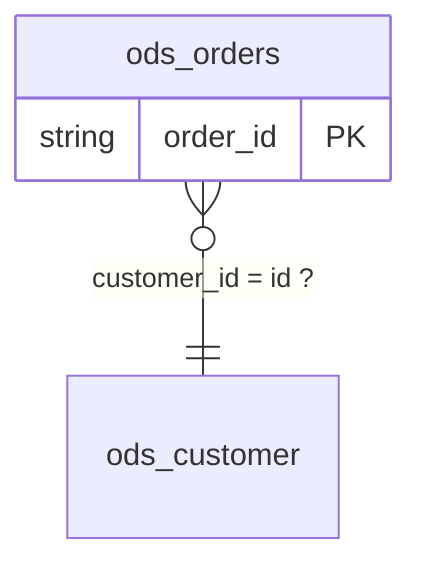

English | [中文](../zh-CN/ontology-doc.md)

# `ontology.json` / `ontology.md` corpus-level ontology candidate (`ontology-json/1`)

`scope-lineage ontology` walks every `lineage.json` under one corpus root and, on top of
the [table cards](tables-doc.md) and the [value dictionary](glossary-doc.md), answers one
question no single table can: **how do these tables relate**. Entities (a table plus its
identity keys), attributes (a column plus its comment, its observed roles and its
synonyms), relations (JOIN key pairs plus a provable cardinality), constraints (not null,
value set, unique per key, partition) and the contradictions between tasks.

Every JOIN in a corpus is an assertion about two entities and their keys; every "dedup by
k, then join" is an assertion that the deduplicated table holds many rows per k; every
closed `IN` list is an assertion about a column's value set. This document collects those
assertions and labels each with its confidence tier and its evidence.

## Position: an ontology **candidate**, not a business ontology

- Every assertion carries a `tier` and an `evidence` list and traces back to a concrete
  statement by task name, `statement_id` and `logic_block_id`; an assertion with no
  evidence is not published at all.
- Core gives no entity a business name, a type or a parent class, and does no business
  naming. `naming_hints` holds metadata facts only (table comment, domain, project,
  owner); the naming and the modelling are left to a person or an agent who knows the
  business.
- The slots deliberately line up with the usual ontology languages (entity ~ owl:Class,
  attribute ~ owl:DatatypeProperty, relation ~ owl:ObjectProperty, constraint ~
  sh:NodeShape), and `--export` writes LinkML and SHACL from that correspondence; no
  OWL file is emitted.
- Stability is graded as in the other derived documents: key names are stable within
  `ontology-json/1`, the Chinese wording may be adjusted, and a machine should read the
  JSON rather than the Markdown.

## Usage

```bash
# A corpus directory: lineage.json is searched recursively, artifacts go to --out
scope-lineage ontology --lineage /path/to/corpus --out /path/to/ontology

# Reuse the cards and the dictionary you already built (both are built in memory over
# the same corpus when they are not supplied); --overrides merges human confirmations,
# which raise an assertion to the fifth tier, confirmed
scope-lineage ontology --lineage /path/to/corpus --out /path/to/ontology \
  --tables /path/to/tables/tables.json --glossary /path/to/glossary/glossary.json \
  --overrides /path/to/ontology.overrides.json
```

Three artifacts:

| File | Read by | Contents |
| --- | --- | --- |
| `ontology.json` | machines / RAG / knowledge-graph loaders | the main artifact, `doc_format: "ontology-json/1"` |
| `ontology.md` | people | an index: the Mermaid ER overview plus the entity, relation, constraint and findings tables and the consolidated open list, `doc_format: "ontology-index-md/1"` |
| `tables/<db.table>.md` | people / RAG chunked per table | the table card's six sections plus five ontology sections, `doc_format: "ontology-md/1"`; the filename rule is exactly `scope-lineage tables`' own |

Python API (consumes the contract documents, same path the files are written from):

```python
from scope_lineage import build_ontology, build_semantic_profile, build_table_cards
from scope_lineage import render_ontology_index_markdown, render_ontology_table_card_markdown

profiles = [build_semantic_profile(document) for document in documents]
cards = build_table_cards(profiles, artifact_root="/path/to/corpus")
ontology = build_ontology(documents, profiles, tables=cards, artifact_root="/path/to/corpus")
index = render_ontology_index_markdown(ontology)
card = render_ontology_table_card_markdown(cards["tables"][0], ontology)
```

- `--lineage` behaves exactly as it does for `tables` / `glossary`: one `lineage.json`, or
  a directory tree searched recursively for them; a document of an unknown version is
  skipped and counted in directory mode.
- `--tables` / `--glossary` only save a recomputation: the bytes are identical either way.
  With `--tables`, the cards in that file are the base the ontology sections are appended
  to; without it the same cards are built in memory over the same corpus.
- `--format` takes `json`, `md` or both (default `json,md`); when `md` is not among them
  neither `ontology.md` nor `tables/` is written. Anything else is an argument error
  (exit code 2).
- `--export` takes `linkml`, `shacl` or both (repeatable, or one comma-separated list)
  and exports nothing by default; it is independent of `--format`. See
  [Exporting LinkML / SHACL](#exporting-linkml--shacl).
- Determinism: the same corpus produces the same bytes whatever order it was walked in.

## Incremental runs: `--incremental` / `--no-cache`

One or two tasks changed, and the rerun still reads and re-derives every task in the
corpus. `--incremental` narrows that pass to the tasks whose fingerprints moved:

```bash
scope-lineage ontology --lineage /path/to/corpus --out /path/to/ontology --incremental
```

- It writes two disposable things under `--out`: `.scope-lineage-corpus-index.json` (the
  sha256 of each task's `lineage.json` / `diagnostics.json`, plus one sha256 over the
  options that steer the derivation) and `.cache/` (the facts each task contributed
  before the corpus-level merge).
- **The corpus-level merge still runs over every task**: only the per-task half is
  reused, which is what makes an incremental run byte-identical to a full one.
- A changed option invalidates the whole index and recomputes everything: the **content**
  of the `--overrides` file, `--format`, the `glossary.json` / `tables.json` read back,
  and the tool version. An index or a cache file written by another subcommand (a
  `command` or `doc_format` that disagrees) is ignored the same way.
- The summary line gains `reused=N, recomputed=M, removed=K`: how many tasks were reused,
  re-derived, and have disappeared from the corpus.
- Without `--incremental` the run is the full one it always was, reading and writing
  neither index nor cache; `--no-cache` deletes both first and then runs in full.

## The five confidence tiers

| Tier | In the Markdown | Definition | Example |
| --- | --- | --- | --- |
| `proven` | 已证明 | written in the SQL | the join key pair exists; a partition column; a key a producing task proved; a DIRECT rename |
| `implied` | 可推得 | follows from what the SQL does | a task deduplicates a table by k before joining it → that table holds many rows per k (otherwise the dedup is pointless); a UNION column alignment |
| `hypothesis` | 作者假设 | the author assumed it and the SQL does not prove it | joining a physical table directly on k assumes it is unique by k; whether an observed value set is the complete one |
| `conflict` | 矛盾 | two tasks disagree | T1 deduplicates a table by k, T2 joins the same table directly on k — a governance finding, not an ontology fact |
| `confirmed` | 已确认 | **only ever from a human write-back**; the corpus can never reach this tier on its own | somebody confirmed a relation's cardinality or a table's identity key in `ontology.overrides.json` |

## The `ontology.json` structure

```jsonc
{
  "doc_format": "ontology-json/1",
  "corpus": {"artifact_root": "…", "task_count": 12, "lineage_digests": {"task_a": "…"}},
  "entities": [
    {"id": "ods.customer", "kind": "physical_table",
     "comment": null,
     "identity": {
       "candidate_keys": [{"columns": ["id"], "tier": "hypothesis",
                           "evidence": [{"task": "task_a", "statement_id": "stmt:001",
                                         "kind": "joined_as_right_without_dedup",
                                         "logic_block_id": "logic:ROOT:join:001"}]}],
       "declared_hints": [{"columns": ["id"], "evidence": "column_comment",
                           "text": "customer primary key"}],
       "multiplicity": [{"columns": ["driver_id"], "tier": "implied",
                         "claim": "multiple_rows_per_key", "evidence": [{"kind": "group_by"}]}],
       "partition_columns": ["dt"]},
     "attributes": [
       {"column": "state", "type": "string", "comment": null,
        "observed_roles": ["filter", "output"], "used_in_corpus": true,
        "not_null_observed": false,
        "synonyms": [{"entity": "mart.t", "column": "order_state", "tier": "proven",
                      "via": "direct_rename", "evidence": [{"task": "task_a"}]}],
        "samples": ["PAID", "NEW"]}],
     "naming_hints": {"table_comment": null, "domain": null, "project": null, "owner": null}}
  ],
  "relations": [
    {"id": "rel:001",
     "from": {"entity": "ods.driver", "columns": ["id"]},
     "to": {"entity": "ods.pay", "columns": ["driver_id"]},
     "kind": "join_association",
     "cardinality": {"claim": "one_to_many", "tier": "implied", "basis": "group_by"},
     "join_types": ["LEFT_OUTER"], "task_count": 1,
     "evidence": [{"task": "task_a", "statement_id": "stmt:001",
                   "scope_id": "ROOT", "logic_block_id": "logic:ROOT:join:001"}]}
  ],
  "constraints": [
    {"target": {"entity": "ods.orders", "column": "state"}, "kind": "in_set",
     "tier": "proven", "values": ["NEW", "PAID"], "completeness": "complete",
     "evidence": [{"task": "task_a", "statement_id": "stmt:001", "context": "filter_in"}]}
  ],
  "findings": [
    {"kind": "cardinality_conflict", "entity": "ods.pay", "columns": ["driver_id"],
     "tasks": {"multiple_rows_per_key": ["task_a"], "assumed_unique": ["task_b"]},
     "text": "…"},
    {"kind": "competing_candidate_keys", "entity": "ods.pay",
     "columns": ["driver_id", "dt"],
     "keys": [{"columns": ["driver_id"], "evidence": [{"task": "task_a"}]},
              {"columns": ["driver_id", "dt"], "evidence": [{"task": "task_b"}]}],
     "tasks": {"assumed_unique": ["task_a", "task_b"]}, "text": "…"}
  ],
  "open_items": [
    {"id": "open:key:ods.customer=id", "kind": "candidate_key",
     "entity": "ods.customer", "columns": ["id"], "tier": "hypothesis",
     "write_back": "键:ods.customer=id", "text": "…"}
  ],
  "overrides_applied": {"relations": 0, "keys": 0, "unmatched": [],
                        "ignored_fields": []}
}
```

Slot by slot (every slot `ontology-json/1` publishes):

| Slot | Values | Meaning |
| --- | --- | --- |
| `corpus` | `artifact_root` / `task_count` / `lineage_digests` | the same corpus block the table cards carry: the walked root, the task count, and one lineage digest per task |
| `entities[].kind` | `physical_table` / `produced_table` | a table some task in the corpus writes is a `produced_table` |
| `entities[].comment`, `naming_hints` | table comment / domain / project / owner | metadata carried over verbatim; Core infers no business semantics from it |
| `entities[].identity.candidate_keys[]` | `columns` + `tier` + `evidence` | the key a producing task proved (`producer_key_confidence`) and the key a consuming task assumed (`joined_as_right_without_dedup`) stand side by side; they are never merged into one "primary key" |
| `entities[].identity.candidate_keys[].scope_columns` | a list of column names | H2: the key is unique only within one value of these columns (the normal shape of a snapshot table); it can only come from a human confirmation |
| `entities[].identity.declared_hints[]` | `columns` + `evidence: column_comment` + `text` | H3: a column comment calling the column a key, carried over verbatim; it is a metadata hint and not a candidate key, and where it agrees with one, that key rises from `hypothesis` to `implied` |
| `entities[].identity.multiplicity[]` | `claim: multiple_rows_per_key` | O3: some task grouped or window-partitioned this table by these columns |
| `entities[].identity.partition_columns` | a list of column names | the partition columns a producing task writes (a metadata fact) |
| `entities[].attributes[].type`, `comment` | metadata | the column type and comment from the table card, carried over verbatim |
| `entities[].attributes[]` | one per column the metadata declares | attributes cover the whole table, not only the columns the corpus read or wrote, and follow the order of the table card's `columns[]` |
| `entities[].attributes[].observed_roles` | `filter`, `partition_filter`, `join_key`, `group_by`, `window_partition`, `window_order`, `output` | the consumer usages the table card recorded; a column nobody read carries an empty list |
| `entities[].attributes[].used_in_corpus` | `true` / `false` | whether any task in this corpus wrote or read the column; `false` alongside an empty `observed_roles` reads as "the metadata declares it and this corpus never went near it" |
| `entities[].attributes[].not_null_observed` | `true` / `false` | some task in the corpus filtered this column with `NOT x IS NULL` |
| `entities[].attributes[].synonyms[].via` | `direct_rename` / `union_alignment` | O5: two column names for one value |
| `entities[].attributes[].samples[]` | array of strings | A6: the table card's sample values, carried across unchanged — they come only from a file passed to `tables --samples` (already redacted and cut), and the key is absent when that column has none |
| `relations[].id` | `rel:NNN` | numbered after sorting, stable for one corpus |
| `relations[].kind` | `join_association` / `union_sibling` | a JOIN key pair, or two branches of one UNION |
| `relations[].cardinality.claim` | `one_to_many` / `many_to_one` / `many_to_one_assumed` / `one_to_one_assumed` / `unknown` | O2, in the direction `from` → `to`; `one_to_one_assumed` can only come from a human confirmation |
| `relations[].cardinality.tier` | one of the five tiers | the confidence tier of this cardinality claim |
| `relations[].cardinality.basis` | `group_by` / `ranking_window` / `producer_key_confidence` / `right_side_not_deduplicated` / `union_branch_alignment` / `no_uniqueness_evidence` / `human_confirmation` | what the cardinality rests on |
| `relations[].join_types`, `task_count` | the union of JOIN types, the task count | the JOIN types the same entity pair was joined with across tasks, merged |
| `relations[].evidence[].left_via_scopes` | a list of scope ids | where one side of the JOIN was a CTE, the scopes the walk pierced through to reach a physical table (`right_via_scopes` for the other side) |
| `constraints[].kind` | `not_null` / `in_set` / `unique_per` / `partition` | O6 |
| `constraints[].values`, `completeness` | a value list, `complete` / `unknown` | `in_set` only: only a closed `IN` list or an exhaustive CASE is `complete` |
| `constraints[].columns` | a list of column names | `unique_per` only: the candidate keys plus the partition columns |
| `constraints[].note` | one sentence | `not_null` only: "the task discarded the NULLs with a filter; the source itself may still hold some" |
| `findings[].kind` | `cardinality_conflict` / `competing_candidate_keys` / `key_hint_conflict` / `producer_key_conflict` / `ambiguous_bare_name` | O7 and O8; the last two are carried over from the table cards |
| `findings[].tasks` | role → task names | which tasks stand on each side of the contradiction |
| `findings[].keys[]` | two sets of `columns` + `evidence` | `competing_candidate_keys` only: the two competing key sets with the evidence behind each |
| `open_items[]` | `id` / `kind` / `entity` / `relation` / `columns` / `tier` / `write_back` / `text` | H5: the whole corpus's open list, one entry per `hypothesis` key, `hypothesis` relation and finding; a relation appears once, not once per side |
| `open_items[].id` | `open:key:<table>=<col+col>` / `open:rel:<relation write-back key>` / `open:finding:<kind>:<table>=<cols>` | derived from the question itself, so the same question keeps the same id in the next round |
| `open_items[].kind` | `candidate_key` / `relation` / `finding` | the array order is the suggested answering order: findings, then relations by `task_count` descending, then candidate keys |
| `open_items[].write_back` | `键:<table>=<col+col>` / `关系:<write-back key>` / `null` | where the answer is filed in `ontology.overrides.json`; a cross-task contradiction has no single target and carries `null` |
| `overrides_applied` | `relations` / `keys` / `unmatched` / `ignored_fields` | how many human confirmations this run merged, which of them matched nothing in the corpus, and which fields this release does not understand |

## The inference rules

| Rule | Content |
| --- | --- |
| O1 relations | a JOIN's `join_key_pairs` are grouped into edges by (left table, right table); a CTE side is pierced to its physical table by R3's driving-input walk and the path is recorded; the branches of a UNION pair up as `union_sibling` with columns aligned by position |
| O2 cardinality | the right side grouped or ranked by the join keys before the JOIN → `one_to_many` (`implied`); a physical right side whose key some producing task proved unique → `many_to_one` (`proven`); a physical table joined directly → `many_to_one_assumed` (`hypothesis`); anything else `unknown` |
| O3 multiplicity | any task grouping or window-partitioning table T by key set K → T holds many rows per K (`implied`); a key set spanning two tables asserts nothing about either |
| O5 synonyms | a DIRECT `end_to_end_lineage` entry whose column names differ → `direct_rename` (`proven`); differently named columns in the same UNION position → `union_alignment` (`implied`); both ends record each other |
| O6 constraints | a `NOT x IS NULL` filter → `not_null` (`hypothesis`, with the note that the task discarded NULLs and the source may still hold some); an enumerable code → `in_set`; a partition column → `partition` (`proven`); a produced table's candidate keys plus its partition columns → `unique_per` (key confidence `proven` → `proven`, `candidate` → `hypothesis`). **One claim, one entry**: constraints sharing an (entity, kind, columns/values) are merged into one, keeping the strongest `tier` among them and the union of their `evidence[]` in corpus order -- a table two tasks write with the same key set is one constraint proved twice, not two constraints |
| O7 conflicts | "deduplicated" and "joined directly" on the same (table, key set) → `cardinality_conflict`; two `hypothesis` candidate keys on one table where one is a strict subset of the other or the two are disjoint → `competing_candidate_keys` (at most one of them is the identity); the cards' `producer_key_conflict` and `ambiguous_bare_name` are carried over verbatim |
| O8 metadata key hints | a column comment holding `主键` / `唯一键` / `唯一编号` / `主键id` / `primary key` / `unique` (case-insensitive) → `declared_hints`; a hint that agrees with a `hypothesis` candidate key (hint columns are a subset of the key's) raises that key to `implied` (comment and structure are two independent sources pointing at one column); candidate keys that are all `hypothesis` and none of which hold the hinted column → `key_hint_conflict` |

## The per-table card: five sections appended to the table card

`<dir>/tables/<db.table>.md`, written by `ontology --out <dir>`, *is* the `scope-lineage
tables` card (1 what this table is / 2 what one row means / 3 columns / 4 who writes it /
5 who reads it / 6 governance leads), with these appended after it:

| Section | Contents |
| --- | --- |
| 7. 身份（本体） | opens with 「属性 N（语料用到 n）」, the same count the entity table in `ontology.md` carries; then candidate keys, the metadata key hints, multiplicity and partition columns side by side, each with its tier in Chinese and its evidence ids; a confirmed key prints who confirmed it, when, and on what basis on the same line, and a key with `scope_columns` reads 「在 `dt` 内唯一」; the four answer four different questions and are never merged into one "primary key" |
| 8. 关系 | one table for outgoing and one for incoming edges: the other end (linked to its card), the key pair, the JOIN types, the cardinality claim, the tier, the basis token in plain words, the task count and the evidence ids |
| 9. 约束 | a SHACL-shaped list: the constraint kind, the target column or the whole table, the value set and its completeness, the tier, the evidence |
| 10. 属性同义 | this table's column ↔ the synonym, the basis (a renaming projection / the same UNION position), the tier, the evidence |
| 11. 待人工判定 | the findings about this table plus every `hypothesis` assertion (candidate key / cardinality / constraint), each marked `[待确认]`, carrying the write-back key its answer is filed under, and citing its id in `open_items[]` |

The filename rule is exactly `tables`' own (`<db.table>.md`, with anything a file system
would choke on replaced by `_`), so a corpus can be run through `tables` and then through
`ontology`, the latter overwriting the former's card directory in place, and the relative
links between the cards still hold.

## The Mermaid ER mapping rules

The first section of `ontology.md` is an `erDiagram` block. Mermaid entity names are
identifiers, so every character of an entity id outside `[A-Za-z0-9_]` — including `.` and
`-` — is replaced by `_`; when two different entities flatten to the same name, the later
one (in the corpus's own sort order) takes a numeric suffix rather than merging two
entities into one box. The entity table's "图中 id" column is that lookup. An entity block
lists the candidate-key columns and marks them `PK`; an entity without candidate keys is
declared bare rather than with an empty `{}`.

| Cardinality claim | ER symbol | Reading |
| --- | --- | --- |
| `one_to_many` | `\|\|--o{` | one row on the left, many on the right |
| `many_to_one` | `}o--\|\|` | many rows on the left, one on the right (proved by some producing task) |
| `many_to_one_assumed` | `}o--\|\|` | the same shape, but only the author's assumption |
| `one_to_one_assumed` | `\|\|--\|\|` | one to one; only ever from a human confirmation |
| `unknown` | `}o--o{` | no uniqueness evidence, which also covers every `union_sibling` edge |

The edge label carries the join keys (`a = b`, comma separated for several columns); an
edge at tier `hypothesis` gets a trailing `?`, and an edge whose key set is named by a
`cardinality_conflict` gets a `!`. Past 60 entities the diagram keeps the 60 with the
highest relation degree and says above it how many were left out; the full list is still
in the entity table.



## Writing confirmations back: `ontology.overrides.json`

Every line under 待人工判定 is a question, and a question that has been answered must stop
being asked. An agent turns those items into a list a business owner can answer, following
`skills/scope-lineage/references/ontology-review-prompt.md`, the answers are merged into
`ontology.overrides.json`, and the corpus is re-run with `--overrides`:

```json
{
  "relations": {
    "ods.orders.customer_id->ods.customer.id": {
      "cardinality": "many_to_one",
      "basis": "two tasks join on this key set",
      "confirmed_by": "王某",
      "date": "2026-09-19"
    }
  },
  "keys": {
    "ods.customer": {
      "columns": ["id"],
      "scope_columns": ["dt"],
      "basis": "the column comment names it the primary key",
      "note": "a snapshot table: one full copy per partition",
      "confirmed_by": "王某",
      "date": "2026-09-19"
    }
  }
}
```

| Slot | Values | Meaning |
| --- | --- | --- |
| the key of `relations` | `<from entity>.<col+col>-><to entity>.<col+col>` | character for character the write-back key the card prints under 待人工判定; copy it rather than reconstructing it |
| `relations[].cardinality` | one of the five claims | the confirmed cardinality; leaving it out keeps the corpus's own claim and only raises the tier to `confirmed` |
| the key of `keys` | an entity id | that table's identity key; a key the corpus never guessed can be added outright |
| `keys[].columns` | a list of column names | the columns that make up the identity, in the order the card shows them; every one of them must be an attribute of that entity (declared or used by the corpus), or the whole entry is not merged |
| `keys[].scope_columns` | a list of column names | the key is unique only within one value of these columns (the normal shape of a snapshot table); the card renders it as 「在 `dt` 内唯一」 |
| `confirmed_by`, `date` | free text | who confirmed it and when, written into the evidence verbatim |
| `basis`, `note` | free text | why the answer is believed, and anything else worth recording, published beside `confirmed_by` / `date`; `basis` is published as `confirmed_basis` — `basis` on a cardinality is a machine token, and one slot cannot be a vocabulary and a sentence at once |
| `overrides_applied.unmatched` | a list of `{"key": …, "reason": …}` | confirmations with nothing to match in the corpus — never dropped, listed so a reviewer can see them; `reason` is `unknown_entity: X` / `unknown_column: X` / `missing_columns` / `unknown_relation` / `unparsable_key` |
| `overrides_applied.ignored_fields` | a list of `{"key": …, "fields": ["…"]}` | fields this release does not understand (usually a misspelled slot name) — listed rather than silently dropped |

After the merge those assertions carry `tier: "confirmed"` and `basis:
"human_confirmation"`, and one more evidence item, `{"kind": "human_confirmation",
"confirmed_by": …, "date": …, "confirmed_basis": …, "note": …}`. `confirmed` is the one tier the corpus can never produce
by itself. A confirmation does not silence the corpus's own `findings`: whether a
contradiction still exists is decided by O7 the next time the corpus is parsed.

## Slot correspondence with OWL / SHACL / LinkML

The JSON carries everything, and the exporter (`--export linkml,shacl`, the next
section) is a thin layer. The slots are deliberately aligned as below so that layer did
not need this document's structure to change; the OWL column is a correspondence only,
with no exporter behind it:

| ontology.json | OWL / RDFS | SHACL | LinkML |
| --- | --- | --- | --- |
| `entities[]` | `owl:Class` | `sh:NodeShape` | `class` |
| `entities[].attributes[]` | `owl:DatatypeProperty` | `sh:property` + `sh:datatype` | `attribute` / `slot` |
| `relations[]` | `owl:ObjectProperty` (+ cardinality axioms) | `sh:property` + `sh:class` + `sh:maxCount` | a slot with a `range` |
| `constraints[].kind = in_set` / `not_null` | — | `sh:in` / `sh:minCount` | `enum` / `required` |
| `constraints[].kind = unique_per` | — | no native uniqueness; needs a SPARQL constraint | `unique_keys` |
| `tier` / `evidence` | annotation properties (`rdfs:comment` or a custom annotation) | annotations | `annotations` |

## Exporting LinkML / SHACL

`--export` turns the table above into files. That layer is a **rename, not a
re-derivation**: the JSON already carries everything, and the exporter only translates
the slots into another vocabulary. If an export says something the JSON does not, that is
a bug.

```bash
# Writes ontology.linkml.yaml and ontology.shacl.ttl beside ontology.json
scope-lineage ontology --lineage /path/to/corpus --out /path/to/ontology \
  --export linkml,shacl

# --export repeats, and is independent of --format: json only still exports
scope-lineage ontology --lineage /path/to/corpus --out /path/to/ontology \
  --format json --export linkml --export shacl
```

| File | Target format | Contents |
| --- | --- | --- |
| `ontology.linkml.yaml` | a LinkML schema | a class per entity, a slot per attribute, an enum per closed value set |
| `ontology.shacl.ttl` | SHACL (Turtle) | an `sh:NodeShape` per entity, an `sh:property` per assertion |

Nothing is exported by default; `--export` accepts `linkml` and `shacl` only, and any
other value is an argument error (exit code 2). Both formats are emitted as text by this
repository's own deterministic writers, so the export adds **no new runtime dependency**;
the same corpus twice gives the same bytes, for the same reason `ontology.json` does.

### How the slots land

| ontology.json | LinkML | SHACL |
| --- | --- | --- |
| `entities[]` | a `class`, whose id is the safe identifier the Mermaid ER already uses, with the warehouse name in `title` | `sh:NodeShape` + `sh:targetClass`, with the warehouse name in `rdfs:label` |
| `entities[].attributes[]` | a slot under `attributes`, `range` from the SQL type, `description` from the column comment | `sh:property` + `sh:path` + `sh:datatype` |
| a single-column `proven` / `confirmed` candidate key | `identifier: true` on the slot | no native form, see the limitations below |
| every other candidate key (composite, or unproven) | a `unique_keys` entry, with the tier in `annotations.tier` | an `sl:candidateKey` annotation block |
| `relations[]` | a slot on the source class, `range` is the target class, `multivalued` from the cardinality | `sh:property` + `sh:class` (plus `sh:maxCount 1` when it is many-to-one) |
| `constraints[].kind = not_null` | `required: true` on the slot | `sh:minCount 1` |
| `constraints[].kind = in_set` (closed) | an `enum`, and the slot's `range` points at it | `sh:in ( … )` |
| `constraints[].kind = in_set` (open) | an annotation only, no enum | an `rdfs:comment` only |
| `constraints[].kind = unique_per` | a `unique_keys` entry | an `sl:compositeKey` annotation block, see the limitations below |
| `constraints[].kind = partition` | one annotation on the slot | an `sh:property` carrying only an `rdfs:comment` |
| `tier` | `annotations.tier` | `sl:tier` |

SQL types map as below, and a parameterized type is matched on its head: `decimal(18,2)`
is `decimal` and `map<string,string>` is `map`. A type nothing recognizes lands on
`string` rather than dropping the column -- the corpus usually does not know a physical
table's types at all.

| SQL type | LinkML `range` | SHACL `sh:datatype` |
| --- | --- | --- |
| `string` / `varchar` / `char` / anything else | `string` | `xsd:string` |
| `tinyint` / `smallint` / `int` / `bigint` | `integer` | `xsd:integer` |
| `decimal` / `numeric` | `float` | `xsd:decimal` |
| `float` / `double` / `real` | `float` | `xsd:double` |
| `date` | `date` | `xsd:date` |
| `timestamp` | `datetime` | `xsd:dateTime` |
| `boolean` | `boolean` | `xsd:boolean` |

### No tier is lost on the way out

Every element that came from an assertion carries that assertion's tier:
`annotations.tier` in LinkML, `sl:tier` in SHACL.

```yaml
      channel_code:
        range: "string"
        annotations:
          tier: "proven"
          key_tier: "hypothesis"
```

```turtle
    sh:property [
        sh:path sl:rel_001 ;
        sh:class sl:dim_channel ;
        sh:maxCount 1 ;
        sl:relation "rel:001" ;
        sl:claim "many_to_one_assumed" ;
        sl:taskCount 2 ;
        sl:tier "hypothesis"
    ] ;
```

An entity and an attribute carry `proven` themselves: they were not inferred, the corpus
read their names out of the SQL. A relation carries the tier of its cardinality, and a
constraint carries its own.

### Limitations: neither format is stretched to fit

- **SHACL core has no composite uniqueness constraint.** A `unique_per` and a candidate
  key are both "this tuple of columns is unique", and SHACL core has no constraint
  component for that (expressing it takes `sh:sparql`, a different dialect and a
  different runtime). So both are published as `sl:compositeKey` / `sl:candidateKey`
  annotation blocks whose `rdfs:comment` states this limitation, rather than as a shape
  that validates something weaker.
- **An open value set gets no enum.** `completeness: "unknown"` means the corpus observed
  these values and could not prove the set closed; writing that as an enum would pass an
  observation off as a fact. Both formats emit an annotation listing the observed values
  instead.
- **A constraint's id in the exports is its position.** A constraint has no id of its own
  in `ontology.json`, so the exports number it `cst:001` .. by its position in
  `constraints[]`; that array is already deterministically sorted, so the position *is* a
  stable identity.
- **The base IRI is a placeholder** (`https://example.org/scope-lineage/ontology#`). The
  corpus has no namespace of its own, and minting one that looks authoritative would be
  the export inventing a fact; whoever loads the graph replaces it with theirs.
- **What is not exported**: `findings`, `open_items`, `evidence`, `naming_hints`'
  `domain` / `project` / `owner`, `identity.declared_hints`, `identity.multiplicity` and
  an attribute's `synonyms` stay in `ontology.json` -- they are governance and metadata
  material for a reviewer, not schema.
- **No OWL.** Of the three targets only OWL needs an extra ontological commitment for
  assertions such as cardinality axioms, and that is not a choice an exporter should make
  on its user's behalf.

## Relationship with `tables` / `glossary`

The three corpus artifacts stack, answer three different questions, and do not substitute
for one another:

- [`tables`](tables-doc.md) answers "**what is this table**": who writes it, what one row
  means, who reads it and which columns. The ontology's entities, attributes, candidate
  keys and partition columns all come from the cards, which is why `--tables` changes
  nothing but the runtime.
- [`glossary`](glossary-doc.md) answers "**what does this value mean**": comments merged
  across tables, observed constant values, the enums the SQL proved closed. The ontology's
  `in_set` constraints *are* the dictionary's enumerable codes, and `completeness` is the
  dictionary's own `closed_set` verdict, so `--glossary` changes nothing but the runtime
  either.
- `ontology` answers "**how do these tables relate**": relation edges, cardinality,
  multiplicity, synonyms, cross-task contradictions. It is the first conclusion that
  requires more than one task — a single task's `describe` can never reach it.

All three share one semantic profile: the CLI parses and profiles one corpus exactly once.

## Determinism and the golden files

- The same corpus run twice, or walked in any order, yields byte-identical
  `ontology.json`, `ontology.md` and cards.
  `tests/core/test_ontology_properties.py` holds that as a property, together with
  "nothing was invented" and "every assertion below `proven` carries a tier and evidence
  that dereferences".
- `tests/core/fixtures/ontology/` pins the whole output of a five-task corpus
  (`ontology.json`, the `ontology.md` with its ER diagram, and three merged cards), so any
  change of wording or ordering shows up on the golden.

## Boundaries and what comes next

- `--export` emits LinkML and SHACL only; OWL is still a slot correspondence with no
  exporter behind it.
- No embedding, no storage, no LLM call, no business vocabulary — those belong to
  downstream projects.
- Incremental runs within one corpus now exist (`--incremental`, see "Incremental
  runs"); reuse *across* corpora -- one corpus's index feeding another -- is later work.
