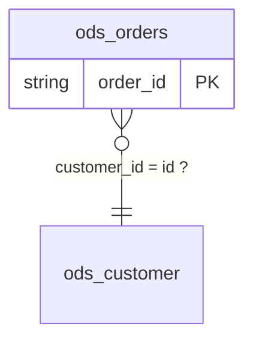

English | [中文](../zh-CN/ontology-doc.md)

# `ontology.json` / `ontology.md` corpus-level ontology candidate (`ontology-json/2`)

`scope-lineage ontology` walks every `lineage.json` under one corpus root and, on top of
the [table cards](tables-doc.md) and the [value dictionary](glossary-doc.md), answers one
question no single table can: **what is this warehouse about, and how do those things
relate**. Concepts (entity / event / summary) and the relations between them; the tables
that represent those concepts, with their identity keys and their attributes (a column
plus its comment, its observed roles and its synonyms); the table-to-table JOINs that are
the evidence each concept relation was read off; constraints (not null, value set, unique
per key, partition); and the contradictions between tasks.

Every JOIN in a corpus is an assertion about two entities and their keys; every "dedup by
k, then join" is an assertion that the deduplicated table holds many rows per k; every
closed `IN` list is an assertion about a column's value set. This document collects those
assertions and labels each with its confidence tier and its evidence.

> **Terminology** (0.4.0 / `ontology-json/2`, already landed): `concepts[]` holds the
> **business concepts** (entity / event / summary) and `relations[]` the relations **between
> concepts**; `tables[]` holds the warehouse's **representations** of those concepts (one row
> per table) and `table_relations[]` the table-to-table JOINs, which are the **evidence** the
> concept relations were read off. 「客户」 is a concept, `dwd.customer_df` is one of its
> representations. The previous release called `tables[]` `entities[]` and
> `table_relations[]` `relations[]`; see
> "[Migrating from ontology-json/1](#migrating-from-ontology-json1)" below.

## Position: an ontology **candidate**, not a business ontology

- Every assertion carries a `tier` and an `evidence` list and traces back to a concrete
  statement by task name, `statement_id` and `logic_block_id`; an assertion with no
  evidence is not published at all.
- Core gives no entity a business name, a type or a parent class, and does no business
  naming. `naming_hints` holds metadata facts only (table comment, domain, project,
  owner); the naming and the modelling are left to a person or an agent who knows the
  business.
- The slots deliberately line up with the usual ontology languages (entity ~ owl:Class,
  attribute ~ owl:DatatypeProperty, relation ~ owl:ObjectProperty, constraint ~
  sh:NodeShape), and `--export` writes LinkML and SHACL from that correspondence; no
  OWL file is emitted.
- Stability is graded as in the other derived documents: key names are stable within
  `ontology-json/2`, the Chinese wording may be adjusted, and a machine should read the
  JSON rather than the Markdown.

## Usage

```bash
# A corpus directory: lineage.json is searched recursively, artifacts go to --out
scope-lineage ontology --lineage /path/to/corpus --out /path/to/ontology

# Reuse the cards and the dictionary you already built (both are built in memory over
# the same corpus when they are not supplied); --overrides merges the table-level human
# confirmations and --concept-overrides the concept layer's, and a confirmed assertion
# is published at the fifth tier, confirmed
scope-lineage ontology --lineage /path/to/corpus --out /path/to/ontology \
  --tables /path/to/tables/tables.json --glossary /path/to/glossary/glossary.json \
  --overrides /path/to/ontology.overrides.json \
  --concept-overrides /path/to/concepts.overrides.json

# Across corpora: --tables repeats, and the cards are merged before anything is built
scope-lineage ontology --lineage /path/to/corpus --out /path/to/ontology \
  --tables /path/to/a/tables.json --tables /path/to/b/tables.json

# N1b: cut the provisional concepts into review batches under <dir>/batches/
scope-lineage ontology --lineage /path/to/corpus --out /path/to/ontology \
  --review-batches /path/to/review \
  --review-batches-by family --review-batch-size 30

# N1a: --concept-overrides repeats, applies in order, and the later file wins a clash
scope-lineage ontology --lineage /path/to/corpus --out /path/to/ontology \
  --concept-overrides /path/to/review/batches/batch-01.overrides.json \
  --concept-overrides /path/to/review/batches/batch-02.overrides.json
```

Five artifacts:

| File | Read by | Contents |
| --- | --- | --- |
| `ontology.json` | machines / RAG / knowledge-graph loaders | the main artifact, `doc_format: "ontology-json/2"` |
| `ontology.md` | people | **an index**, and since N2 nothing but an index: `本体总览` (counts by kind, the concept ER, the concept table whose names link to their own files, the relation table) → `概念` (one line saying where the files are, plus the provisional concepts' count, where the rest of them are, and the top 20 by impact) → `附录索引` (one line per section: the count and the link into `appendix.md`), `doc_format: "ontology-index-md/2"` |
| `concepts/<file>.md` | people / RAG chunked per concept | N2: **one file per folded concept** — 表现 / 属性 / 约束 / 关系 / 待人工判定 / 命名与类别依据 / 评审回写键, `doc_format: "concept-md/1"`. A provisional concept gets no file |
| `appendix.md` | people | N2: everything table-level (the table-level ER, the tables, the table relations, the constraints, the families, **the whole provisional-concept list**, the retired key stems, the findings and the folded open list), `doc_format: "ontology-appendix-md/1"` |
| `tables/<db.table>.md` | people / RAG chunked per table | the table card's six sections plus five ontology sections, `doc_format: "ontology-md/2"`; the filename rule is exactly `scope-lineage tables`' own |

Python API (consumes the contract documents, same path the files are written from):

```python
from scope_lineage import build_ontology, build_semantic_profile, build_table_cards
from scope_lineage import render_ontology_index_markdown, render_ontology_table_card_markdown

profiles = [build_semantic_profile(document) for document in documents]
cards = build_table_cards(profiles, artifact_root="/path/to/corpus")
ontology = build_ontology(documents, profiles, tables=cards, artifact_root="/path/to/corpus")
index = render_ontology_index_markdown(ontology)
card = render_ontology_table_card_markdown(cards["tables"][0], ontology)
```

- `--lineage` behaves exactly as it does for `tables` / `glossary`: one `lineage.json`, or
  a directory tree searched recursively for them; a document of an unknown version is
  skipped and counted in directory mode.
- `--tables` / `--glossary` only save a recomputation: the bytes are identical either way.
  With `--tables`, the cards in that file are the base the ontology sections are appended
  to; without it the same cards are built in memory over the same corpus.
- `--tables` **repeats**: several documents are folded into one with the
  [card merge rules](tables-doc.md#merging-across-corpora---merge) before the ontology is
  built, so a key proven in another corpus can carry a relation here. See "Cross-corpus
  evidence" below.
- `--format` takes `json`, `md` or both (default `json,md`); when `md` is not among them
  neither `ontology.md` nor `tables/` is written. Anything else is an argument error
  (exit code 2).
- `--export` takes `linkml`, `shacl` or both (repeatable, or one comma-separated list)
  and exports nothing by default; it is independent of `--format`. See
  [Exporting LinkML / SHACL](#exporting-linkml--shacl).
- `--legacy-keys` (**deprecated**, off by default) additionally writes the
  `ontology-json/1` key spellings as aliases of the new ones, giving a consumer one
  release to migrate. See
  [Migrating from ontology-json/1](#migrating-from-ontology-json1).
- Determinism: the same corpus produces the same bytes whatever order it was walked in.

## Incremental runs: `--incremental` / `--no-cache` / `--cache-from`

One or two tasks changed, and the rerun still reads and re-derives every task in the
corpus. `--incremental` narrows that pass to the tasks whose fingerprints moved:

```bash
scope-lineage ontology --lineage /path/to/corpus --out /path/to/ontology --incremental
```

- It writes two disposable things under `--out`: `.scope-lineage-corpus-index.json` (the
  sha256 of each task's `lineage.json` / `diagnostics.json`, plus one sha256 over the
  options that steer the derivation) and `.cache/` (the facts each task contributed
  before the corpus-level merge).
- The cache holds **only the fields the corpus-level merge reads**. The reader-facing
  half of a semantic profile -- `stages`, `confidence`, each field's step-by-step
  `derivation` -- is never merged and so is never stored. Which fields count is each
  builder's own list (`PROFILE_FIELDS_READ`, beside the code that reads it); editing
  one invalidates the whole index and recomputes everything.
- The stored facts are **versioned**: `payload_version` (`corpus-cache/3` today). A
  cache file or an index of another version is ignored and recomputed -- an older
  version held something else, not the same thing with fewer keys.
- **The corpus-level merge still runs over every task**: only the per-task half is
  reused, which is what makes an incremental run byte-identical to a full one.
- **Another corpus's cache can be reused too** (Q7): `--cache-from <dir>` names a further
  fact cache -- the `--out` of another run, or the `.cache/` inside it. The same task parsed
  into another directory (re-parsed, or walked again as part of a larger corpus) is borrowed
  rather than re-derived when its `lineage.json` / `diagnostics.json` bytes and the options
  digest match, and the borrowed file is copied into this run's own `.cache/`, so the next
  run finds it locally and the lending directory can go away. Repeatable, tried in the order
  given and after this run's own cache; it implies `--incremental`, and `--no-cache` still
  wins. The corpus path is **not** part of the options digest: the same task has to derive
  the same facts wherever it was parsed.
- Fact files are keyed by task name, and two corpora may hold different tasks under one
  name. What decides a borrow is the fingerprint and the options digest recorded inside the
  file, not the file's name, so a task of the same name and other contents is recomputed.
- A changed option invalidates the whole index and recomputes everything: the **content**
  of the `--overrides` file, `--format`, the `glossary.json` / `tables.json` read back,
  and the tool version. An index or a cache file written by another subcommand (a
  `command` or `doc_format` that disagrees) is ignored the same way.
- The summary line gains `reused=N, recomputed=M, removed=K`: how many tasks were reused,
  re-derived, and have disappeared from the corpus. With `--cache-from` the first counter
  reads `reused=N (borrowed=B)`, `B` being the tasks borrowed from another corpus.
- Without `--incremental` the run is the full one it always was, reading and writing
  neither index nor cache; `--no-cache` deletes both first and then runs in full.

## The five confidence tiers

| Tier | In the Markdown | Definition | Example |
| --- | --- | --- | --- |
| `proven` | 已证明 | written in the SQL | the join key pair exists; a partition column; a key a producing task proved; a DIRECT rename |
| `implied` | 可推得 | follows from what the SQL does | a task deduplicates a table by k before joining it → that table holds many rows per k (otherwise the dedup is pointless); a UNION column alignment |
| `hypothesis` | 作者假设 | the author assumed it and the SQL does not prove it | joining a physical table directly on k assumes it is unique by k; whether an observed value set is the complete one |
| `conflict` | 矛盾 | two tasks disagree | T1 deduplicates a table by k, T2 joins the same table directly on k — a governance finding, not an ontology fact |
| `confirmed` | 已确认 | **only ever from a human write-back**; the corpus can never reach this tier on its own | somebody confirmed a relation's cardinality or a table's identity key in `ontology.overrides.json` |

## The `ontology.json` structure

```jsonc
{
  "doc_format": "ontology-json/2",
  "corpus": {"artifact_root": "…", "task_count": 12, "lineage_digests": {"task_a": "…"},
             "external_evidence_tables": 2},   // only when merged cards hold tables this corpus never touched
  "concepts": [
    {"id": "concept:cust", "name": "客户", "name_tier": "hypothesis",
     "name_candidates": [
       {"text": "客户", "source": "key_column_comment", "count": 2,
        "name_evidence": [{"table": "ods.customer_base", "column": "cust_no"}]},
       {"text": "cust", "source": "key_stem", "count": 1, "name_evidence": []}],
     "possible_duplicate_of": ["concept:customer"],   // another concept proposed the same name
     "kind": "entity", "kind_tier": "implied",
     "kind_evidence": [{"signal": "word_hint", "vote": "entity",
                        "table": "ods.customer_base",
                        "detail": "ods.customer_base 客户信息表"}],
     "identity": {"stem": "cust", "columns_seen": ["cust_no", "customer_id"]},
     "tables": [{"table": "dwd.customer_df", "role": "primary",
                 "membership_basis": "key:proven",
                 "key_columns": ["cust_no"], "grain": "group_by"},
                {"table": "ods.customer_base", "role": "primary",
                 "membership_basis": "declared_hint",
                 "key_columns": ["cust_no"], "grain": null},
                {"table": "dwd.message_send_di", "role": "reference",
                 "membership_basis": "reference",
                 "key_columns": ["cust_no"], "grain": null}],
     "attributes": [{"stem": "cust", "type": "string", "comment": "客户编号",
                     "sources": [{"table": "ods.customer_base", "column": "cust_no"}]}],
     "tier": "implied"},
    {"id": "concept:table:ods_staging_rows",       // M1: a table no key placed is its own concept
     "name": "staging_rows", "name_tier": "stem_only",
     "name_candidates": [{"text": "staging_rows", "source": "key_stem",
                          "count": 1, "name_evidence": []}],
     "kind": "entity", "kind_tier": "hypothesis",
     "kind_evidence": [{"signal": "no_signal", "vote": "entity"}],
     "identity": {"stem": "ods_staging_rows", "columns_seen": ["id"]},
     "tables": [{"table": "ods.staging_rows", "role": "primary",
                 "membership_basis": "provisional",
                 "key_columns": ["id"], "grain": null}],
     "attributes": [{"stem": "id", "type": "string", "comment": null,
                     "sources": [{"table": "ods.staging_rows", "column": "id"}]}],
     "tier": "provisional", "origin": "provisional"}
  ],
  "provisional_count": 1,                        // M1: how many of the above are provisional
  "retired_stems": [                             // K4c: the stems a generic rule refused
    {"stem": "rowkey", "tables": [{"table": "ods.rows_a", "role": "primary",
                                   "key_columns": ["rowkey"]}]}
  ],
  "concept_overrides_applied": {"concepts": 0, "created": [],             // K4b / K4c
                                "tables_added": 0,
                                "merges": 0, "splits": 0,
                                "dissolved": [],                        // M1
                                "unmatched": [], "warnings": [],
                                "ignored_fields": []},
  "relations": [
    {"id": "crel:001",
     "from": "concept:msg", "to": "concept:cust", "type": "participation",
     "roles": ["发送方", "接收方"],          // the entity's roles in the event
     "cardinality": {"claim": "many_to_one", "tier": "proven",
                     "basis": ["rel:003"]},  // the table-level edges that claimed it
     "task_count": 2, "evidence": ["rel:003", "rel:004"]}
  ],
  "provisional_relations": 1,                // M1: relations touching a provisional concept
  "representation_links": [          // two tables of one concept, joined
    {"concept": "concept:cust", "from_table": "dwd.customer_df",
     "to_table": "ods.customer_base", "evidence": ["rel:005"]}
  ],
  "concept_relations_unmapped": {"edges_total": 5, "mapped": 4,  // a fixed denominator
     "total": 1,                              // counted by the end that failed
     "by_reason": {"from_table_unplaced": 1, "to_table_unplaced": 0,
                   "reference_only_edge": 0}},
  "tables": [
    {"id": "ods.customer", "kind": "physical_table",
     "family": "ods.customer",   // Q3: the family key, the name without _di / _tmp / _mid01
     "comment": null,
     "identity": {
       "candidate_keys": [{"columns": ["id"], "tier": "hypothesis",
                           "evidence": [{"task": "task_a", "statement_id": "stmt:001",
                                         "kind": "joined_as_right_without_dedup",
                                         "logic_block_id": "logic:ROOT:join:001"}]}],
       "declared_hints": [{"columns": ["id"], "evidence": "column_comment",
                           "text": "customer primary key"}],
       "multiplicity": [{"columns": ["driver_id"], "tier": "implied",
                         "claim": "multiple_rows_per_key", "evidence": [{"kind": "group_by"}]}],
       "partition_columns": ["dt"]},
     "attributes": [
       {"column": "state", "type": "string", "comment": null,
        "observed_roles": ["filter", "output"], "used_in_corpus": true,
        "not_null_observed": false,
        "synonyms": [{"entity": "mart.t", "column": "order_state", "tier": "proven",
                      "via": "direct_rename", "evidence": [{"task": "task_a"}]}],
        "samples": ["PAID", "NEW"]}],
     "naming_hints": {"table_comment": null, "domain": null, "project": null, "owner": null},
     "relation_hints": [{"from_column": "pay_id",
                         "to": {"entity": "ods.pay", "column": "id"},
                         "evidence": "column_comment", "text": "payment, references ods.pay.id"}],
     "concepts": [{"id": "concept:cust", "role": "primary",
                   "membership_basis": "key:hypothesis"},
                  {"id": "concept:pay", "role": "reference",
                   "membership_basis": "reference"}]}
  ],
  "families": [
    {"family": "ods.pay", "tables": ["ods.pay_df", "ods.pay_di"], "size": 2}
  ],
  "table_relations": [
    {"id": "rel:001",
     "from": {"entity": "ods.driver", "columns": ["id"]},
     "to": {"entity": "ods.pay", "columns": ["driver_id"]},
     "kind": "join_association",
     "cardinality": {"claim": "one_to_many", "tier": "implied", "basis": "group_by"},
     "join_types": ["LEFT_OUTER"], "task_count": 1,
     "evidence": [{"task": "task_a", "statement_id": "stmt:001",
                   "scope_id": "ROOT", "logic_block_id": "logic:ROOT:join:001"}],
     "concept_relation": "crel:001"},
    {"id": "rel:002",
     "from": {"entity": "ods.driver", "columns": ["pay_id"]},
     "to": {"entity": "ods.pay", "columns": ["id"]},
     "kind": "hinted",
     "cardinality": {"claim": "many_to_one_assumed", "tier": "hypothesis",
                     "basis": "column_comment"},
     "join_types": [], "task_count": 0,
     "evidence": [{"kind": "column_comment", "column": "pay_id",
                   "text": "payment, references ods.pay.id"}],
     "concept_relation": null}
  ],
  "constraints": [
    {"target": {"entity": "ods.orders", "column": "state"}, "kind": "in_set",
     "tier": "proven", "values": ["NEW", "PAID"], "completeness": "complete",
     "evidence": [{"task": "task_a", "statement_id": "stmt:001", "context": "filter_in"}],
     "concept": "concept:order"}
  ],
  "findings": [
    {"kind": "cardinality_conflict", "entity": "ods.pay", "columns": ["driver_id"],
     "tasks": {"multiple_rows_per_key": ["task_a"], "assumed_unique": ["task_b"]},
     "text": "…", "concept": "concept:pay"},
    {"kind": "competing_candidate_keys", "entity": "ods.pay",
     "columns": ["driver_id", "dt"],
     "keys": [{"columns": ["driver_id"], "evidence": [{"task": "task_a"}]},
              {"columns": ["driver_id", "dt"], "evidence": [{"task": "task_b"}]}],
     "tasks": {"assumed_unique": ["task_a", "task_b"]}, "text": "…",
     "concept": "concept:pay"}
  ],
  "finding_groups": [],   // the groups in open_item_groups whose kind is finding
  "open_items": [
    {"id": "open:key:ods.customer=id", "kind": "candidate_key",
     "entity": "ods.customer", "columns": ["id"], "tier": "hypothesis",
     "write_back": "键:ods.customer=id", "text": "…",
     "concept": "concept:cust"}
  ],
  "open_item_groups": [
    {"group_id": "open:group:key:ods.customer=id", "kind": "candidate_key",
     "family": "ods.customer", "shape": "id",
     "representative": "open:key:ods.customer=id",
     "items": ["open:key:ods.customer=id"], "count": 1, "impact": 2,
     "write_back_pattern": "键:<table>=id", "concept": "concept:cust"}
  ],
  "overrides_applied": {"relations": 0, "keys": 0, "unmatched": [],
                        "ignored_fields": []}
}
```

Slot by slot (every slot `ontology-json/2` publishes):

| Slot | Values | Meaning |
| --- | --- | --- |
| `corpus` | `artifact_root` / `task_count` / `lineage_digests` / `external_evidence_tables` | the same corpus block the table cards carry: the walked root, the task count, one lineage digest per task, and how many tables lent evidence only without becoming entities (P7; absent when none did) |
| `tables[].concepts[]` | `id` + `role` + `membership_basis` | M2: which concepts this table **represents** and in which role -- the back-link of `concepts[].tables[]`. A table may carry several: one is its own identity, the rest are concepts whose key it merely **carries** (`reference`). The two layers can therefore be walked from either end |
| `tables[].kind` | `physical_table` / `produced_table` | a table some task in the corpus writes is a `produced_table` |
| `tables[].family` | `<database>.<table name without its copy suffixes>` | Q3: which table family this table belongs to, derived from its own name alone (the rule is under "Table families and the folded open list"); the same table name in two databases is two families |
| `tables[].comment`, `naming_hints` | table comment / domain / project / owner | metadata carried over verbatim; Core infers no business semantics from it |
| `tables[].identity.candidate_keys[]` | `columns` + `tier` + `evidence` | the key a producing task proved (`producer_key_confidence`) and the key a consuming task assumed (`joined_as_right_without_dedup`) stand side by side; they are never merged into one "primary key" |
| `tables[].identity.candidate_keys[].scope_columns` | a list of column names | H2: the key is unique only within one value of these columns (the normal shape of a snapshot table); it can only come from a human confirmation |
| `tables[].identity.declared_hints[]` | `columns` + `evidence: column_comment` + `text` | H3: a column comment calling the column a key, carried over verbatim; it is a metadata hint and not a candidate key, and where it agrees with one, that key rises from `hypothesis` to `implied` |
| `tables[].relation_hints[]` | `from_column` + `to.entity` / `to.column` + `evidence: column_comment` + `text` (+ `unresolved`) | O9: a column comment pointing at another table's column (「关联 <表>.<列>」 and its kin), carried over verbatim and resolved against the corpus's own entities; one that cannot be resolved carries `unresolved` (`unknown_entity: X` / `ambiguous_entity: X` / `unknown_column: X`) and acts on nothing; the key is absent when a table's comments point at nothing |
| `tables[].identity.multiplicity[]` | `claim: multiple_rows_per_key` | O3: some task grouped or window-partitioned this table by these columns |
| `tables[].identity.partition_columns` | a list of column names | the partition columns a producing task writes (a metadata fact) |
| `tables[].attributes[].type`, `comment` | metadata | the column type and comment from the table card, carried over verbatim |
| `tables[].attributes[]` | one per column the metadata declares | attributes cover the whole table, not only the columns the corpus read or wrote, and follow the order of the table card's `columns[]` |
| `tables[].attributes[].observed_roles` | `filter`, `partition_filter`, `join_key`, `group_by`, `window_partition`, `window_order`, `output` | the consumer usages the table card recorded; a column nobody read carries an empty list |
| `tables[].attributes[].used_in_corpus` | `true` / `false` | whether any task in this corpus wrote or read the column; `false` alongside an empty `observed_roles` reads as "the metadata declares it and this corpus never went near it" |
| `tables[].attributes[].not_null_observed` | `true` / `false` | some task in the corpus filtered this column with `NOT x IS NULL` |
| `tables[].attributes[].synonyms[].via` | `direct_rename` / `union_alignment` | O5: two column names for one value |
| `tables[].attributes[].samples[]` | array of strings | A6: the table card's sample values, carried across unchanged — they come only from a file passed to `tables --samples` (already redacted and cut), and the key is absent when that column has none |
| `families[]` | `family` + `tables[]` + `size` | Q3: every table family the corpus names and the tables inside it, sorted by `family`; read it before answering a group, to check that the family really is one table written several times |
| `concepts[]` | `id` / `name` / `kind` / `identity` / `tables[]` / `attributes[]` / `tier` | K1: the tables that share one business key, folded into one concept; `tables[]` stay the table-level representations a concept merely points at (rules under "The concept layer" below) |
| `concepts[].kind`, `kind_tier`, `kind_evidence[]` | `entity` / `event` / `summary`; one of the five tiers; one vote per signal | K1: signals that agree earn `implied`, signals that disagree earn `hypothesis`, and every signal's vote is published as it was cast |
| `concepts[].tables[].role` | `primary` / `snapshot` / `detail` / `summary` / `intermediate` / `reference` | K1: which copy of the concept this table is; `reference` is a table that is not unique by the key but *carries* it, which is how an event table takes part in 客户 |
| `concepts[].tables[].membership_basis` | `key:<tier>` / `declared_hint` / `reference` / `override` | K1: what makes this table a member -- a candidate key the corpus read (carrying its own tier), a primary-key hint the catalog declared, or a JOIN; `override` is K4b's fourth: a reviewer put it there by hand with `add_tables`, and that member also carries `role_tier: "confirmed"`. K4d: a reviewed add whose role is `reference` publishes **`reference`**, not `override` -- "it merely carries this key" is exactly what `reference` means, and it must not turn round and change what the table itself is; the basis can then no longer say who put it there, so `confirmed_by` / `confirmed_basis` and the rest of the stamp stay on that member row |
| `concepts[].identity` | `stem` + `columns_seen[]` (+ `merged_stems[]`) | K1: the concept's key stem, and the key columns the corpus reduced to it. `merged_stems[]` is every *other* stem the concept answers to: the ones K4b merged into it, and (K4d) the stems a created concept's own `key_columns` reduce to -- `concept:slot` spells `slot` in its id while the corpus writes `ad_slot_code`, and unless `ad_slot` joins the index the edge can never find it. Generic stems stay out (`dt` names nothing, whoever wrote it down) |
| `concepts[].name`, `name_tier`, `name_candidates[]` | text; `stem_only` (K2c: only the key stem proposed a name), `hypothesis`, or `confirmed` once a review round answered; `text` / `source` / `count` / `name_evidence[]`, plus K2b's `junk_reason`, written only when one matched | K2: candidates ranked by `count` desc, then by source order (key column comment → table comment → key stem); `name` is the first of them, and from K2b a candidate that names a period, a measure or a filter (`junk_reason`) ranks below every clean one, and a comment is metadata that goes stale, so the corpus alone never proposes a name above `hypothesis`. A K4b confirmation raises `name_tier` to `confirmed` and moves the confirmed name to the head of the candidates with `source: override` (a candidate the corpus proposed under the same text keeps its `name_evidence` and only changes hands) |
| `concepts[].possible_duplicate_of[]` | concept ids | K2: another concept's first name candidate is the same word. They are **not** merged; both point at each other and the review round decides. The key is absent when nothing else claimed the name |
| `concepts[].tier` | `implied` / `hypothesis` / `confirmed` / **`provisional`** (M1) | K1: how sure the corpus is of the concept. `provisional` is M1's fourth value and is not the same kind of statement as the other three -- it does not say how believable the concept is, it says this is not a concept yet but a table waiting to be merged |
| `concepts[].origin` | `override` (K4c) / `provisional` (M1) | Present only when a business key of the corpus did not grow the concept: `override` means a reviewer created it, `provisional` means M1 made one out of a table |
| `provisional_count` | integer | M1: how many of `concepts[]` are provisional. It is what a review round reads for its own progress -- every merge takes one off |
| `retired_stems[]` | `stem` + `tables[]` (`table` / `role` / `key_columns[]`) | K4c: the key stems a generic rule refused (the surrogate list, the log and tracing ids, the comment rule) although the corpus really keys tables by them -- without that rule each would have seeded a concept. Published so that an answer an earlier round wrote about `concept:<stem>` stays addressable when the rule changes: naming it in `concepts.overrides.json` rebuilds the concept from exactly these tables and roles, and the stem leaves this list in the same run (K4d; see "Writing the concept review back") |
| `table_relations[].id` | `rel:NNN` | numbered after sorting, stable for one corpus |
| `table_relations[].concept_relation` | `crel:NNN` or `null` | M2: which concept relation this JOIN folded into. `null` has two readings: the edge is a seam between two representations of one concept (it is in `representation_links[]`), or it never travelled on the key that placed its two ends (counted under `concept_relations_unmapped.by_reason.reference_only_edge`). Since M1 the `*_unplaced` reasons are always 0, so every table relation is either folded or one of those two |
| `table_relations[].kind` | `join_association` / `union_sibling` / `hinted` | a JOIN key pair, or two branches of one UNION; `hinted` is O9's edge -- proposed by a column comment and written by no task in the corpus (`task_count` 0, empty `join_types`) |
| `table_relations[].cardinality.claim` | `one_to_many` / `many_to_one` / `many_to_one_assumed` / `one_to_one_assumed` / `unknown` | O2, in the direction `from` → `to`; `one_to_one_assumed` can only come from a human confirmation |
| `table_relations[].cardinality.tier` | one of the five tiers | the confidence tier of this cardinality claim |
| `table_relations[].cardinality.basis` | `group_by` / `ranking_window` / `producer_key_confidence` / `right_side_not_deduplicated` / `union_branch_alignment` / `no_uniqueness_evidence` / `human_confirmation` / `column_comment` | what the cardinality rests on |
| `table_relations[].join_types`, `task_count` | the union of JOIN types, the task count | the JOIN types the same entity pair was joined with across tasks, merged |
| `table_relations[].evidence[].left_via_scopes` | a list of scope ids | where one side of the JOIN was a CTE, the scopes the walk pierced through to reach a physical table (`right_via_scopes` for the other side) |
| `relations[].id` | `crel:NNN` | M2: concept relations are numbered by publication order; this is what `table_relations[].concept_relation` names |
| `relations[]` | `id` / `from` / `to` / `type` / `cardinality` / `task_count` / `evidence[]` | K3: the table-level relations above, folded onto the concepts -- `evidence[]` is the member edges' ids and `task_count` the distinct tasks behind them (rules under "Concept relations" below) |
| `relations[].from`, `to` | concept ids | K3: the two ends answer two different questions -- `from` is **what this table is** (the concept its own key or a declared hint placed it on, never a `reference` and never the columns this edge joined on), `to` is **what it points at** (the `to` table's own identity first, and only failing that the concept its columns name; when those columns name the very concept the `from` table already is, the membership a JOIN lent the far table answers instead). K4d: when several concepts hold the `to` table, **the identity one wins** -- exactly one identity membership plus any number of `reference` ones reads as that identity; only several identity memberships, or none at all with several references, leave the tie to the stem rule |
| `relations[].type` | `association` / `participation` / `aggregation` / `derivation` / `self_reference` | K3: read off the two endpoints' `kind`, never off a word |
| `relations[].roles[]` | a list of texts | K3: `participation` only -- what the entity is to the event, taken from the `from` side's column comment and stripped as a key comment is (发送方编号 → 发送方); when the comment says nothing it falls back to the column *name*, read as words rather than as an identifier (K4d). The key markers come off the segments the corpus itself marked with `_` (the rule `key_stem` uses) and **only** those; whatever survives is then split into words at its camelCase humps: `collection_unit_id` → `collection unit` and `trace_node_code` → `trace node`, while `openId` → `open id` -- a hump is not a segment anybody declared, `openId` is one word the warehouse wrote, and reading it as `open` throws half of it away. A CJK name is used as it stands. **The raw identifier is never published** -- a role is a word a business uses, and putting the warehouse's spelling there says the business calls it that. "The comment says nothing" takes the widest reading: an empty comment, a bare key marker (「ID」), and **a comment that is the column identifier over again** (which is how many catalogs fill them) all fall through to the name -- otherwise the comment route hands back `openId` whatever the fallback does. One group can carry several (发送方 and 接收方 are two edges between the same two concepts) |
| `relations[].cardinality` | `claim` / `tier` / `basis[]` | K3: the strongest member claim -- tier first (`proven` > `confirmed` > `implied` > `hypothesis`), then a definite claim over `unknown`; `basis[]` names the table-level relations that carried it |
| `provisional_relations` | integer | M1: how many of `relations[]` touch a provisional concept. Such an edge says "some table takes part", not yet "the business has this relation"; the number falls as the review merges the provisional concepts away |
| `representation_links[]` | `concept` + `from_table` + `to_table` + `evidence[]` | K3: both ends on one concept while the two *tables* are both representations of it (a snapshot joined onto its primary) -- a seam in K1's fold rather than a relation, so it gets its own section |
| `concept_relations_unmapped` | `edges_total` + `mapped` + `total` + `by_reason` (`from_table_unplaced` / `to_table_unplaced` / `reference_only_edge`) | K3: the table-level relations that could not be folded, counted by **which end** failed to answer; the `from` end is asked first, so an edge that fails both is counted once under `from_table_unplaced`, and an edge whose two ends answered while never travelling on that key is counted under `reference_only_edge`. A wrong fold is worse than a missing one. `edges_total` is every table-level relation this fold read and `mapped` the ones that folded: **`by_reason` shifts as tables get placed** (a `from_table_unplaced` edge becomes a folded one the moment a reviewer places its table), so the denominator is published beside it and two runs are comparable |
| `constraints[].concept` | a concept id or `null` | M2: the concept the target table **represents**. The target is still a table -- a constraint is a fact about one representation -- and this key only lets the document be read concept-first. `null` when the table has two identity concepts, which is exactly the case K1 refuses to choose between |
| `constraints[].kind` | `not_null` / `in_set` / `unique_per` / `partition` | O6 |
| `constraints[].values`, `completeness` | a value list, `complete` / `unknown` | `in_set` only: only a closed `IN` list or an exhaustive CASE is `complete` |
| `constraints[].columns` | a list of column names | `unique_per` only: the candidate keys plus the partition columns |
| `constraints[].note` | one sentence | `not_null` only: "the task discarded the NULLs with a filter; the source itself may still hold some" |
| `findings[].concept`, `open_items[].concept`, `open_item_groups[].concept` | a concept id or `null` | M2: which concept the subject table belongs to, so the index can file the question under that concept's section. A group takes it from its representative item |
| `findings[].kind` | `cardinality_conflict` / `competing_candidate_keys` / `key_hint_conflict` / `relation_hint_conflict` / `producer_key_conflict` / `ambiguous_bare_name` | O7, O8 and O9; the last two are carried over from the table cards |
| `findings[].tasks` | role → task names | which tasks stand on each side of the contradiction |
| `findings[].keys[]` | two sets of `columns` + `evidence` | `competing_candidate_keys` only: the two competing key sets with the evidence behind each |
| `open_items[]` | `id` / `kind` / `entity` / `relation` / `columns` / `tier` / `write_back` / `text` | H5: the whole corpus's open list, one entry per `hypothesis` key, `hypothesis` relation and finding; a relation appears once, not once per side |
| `open_items[].id` | `open:key:<table>=<col+col>` / `open:rel:<relation write-back key>` / `open:finding:<kind>:<table>=<cols>` | derived from the question itself, so the same question keeps the same id in the next round |
| `open_items[].kind` | `candidate_key` / `relation` / `finding` | the array order is the suggested answering order: findings, then relations by `task_count` descending, then candidate keys |
| `open_items[].write_back` | `键:<table>=<col+col>` / `关系:<write-back key>` / `null` | where the answer is filed in `ontology.overrides.json`; a cross-task contradiction has no single target and carries `null` |
| `open_item_groups[]` | `group_id` / `kind` / `family` / `shape` / `representative` / `items[]` / `count` / `impact` / `write_back_pattern` | Q3: the list above folded by (kind, table family, question shape) -- one group is one question asked of a whole family; a relation groups by its **far** side, so `family` is the far table's; `items[]` holds every item id in it and `representative` the highest-ranked one |
| `open_item_groups[].group_id` | `open:group:key:<family>=<col+col>` / `open:group:rel:<far family>=<far col+col>` / `open:group:finding:<family>=<kind>` | derived from the content as well, so it survives the next round; section 11 of a card cites it beside the item id |
| `open_item_groups[].impact` | a non-negative integer | what answering the group unblocks: for a relation the tables joining the far side plus the tasks that do, for a candidate key the assumed edges confirming it would prove, for a finding the items it holds; the array order is `impact` descending, then `count` descending, then the representative's rank |
| `open_item_groups[].write_back_pattern` | `键:<table>=<col+col>` / `关系:<near end>.<col+col>-><table>.<col+col>` / `null` | the group's write-back key, where `<table>` is the table the group is about (the far one for a relation) and a near side the members disagree on reads `<from_table>` / `<from_columns>`: answer once, then file it per table in the family; a finding with no single target carries `null` |
| `finding_groups[]` | the same shape as `open_item_groups[]` | the subset of `open_item_groups[]` whose `kind` is `finding`, published on its own because the index's 待人工判定 table renders only those |
| `overrides_applied` | `relations` / `keys` / `unmatched` / `ignored_fields` | how many human confirmations this run merged, which of them matched nothing in the corpus, and which fields this release does not understand |
| `concept_overrides_applied` | `concepts` / `created[]` / `tables_added` / `merges` / `splits` / `dissolved[]` / `unmatched` / `warnings` / `ignored_fields` | K4b/K4c: how many field confirmations the reviewed `concepts.overrides.json` applied, which concepts it created (`created[]` carries one `{id, tables[]}` each, and a revived retired stem carries `revived: true`), how many member tables it added, how many merges and splits, and which ids, tables or field names matched nothing in the corpus. `warnings[]` (K4d) is what **was** applied and is still worth a second look: one `{key, warning}` each, so far only `merge_kept_two_primaries: <t1>, <t2>` -- a merge folded two concepts that each had their own `primary` copy. `dissolved[]` (M1) is the provisional concepts an `add_tables` or a `new_concepts` entry took the table of, one `{id, table, into}` each: a person put that table on a real concept, so it no longer stands for one on its own. A `merge_into` dissolves one too and is counted as the merge it is, never twice |

## Migrating from ontology-json/1

0.4.0 is a **breaking** rename: the document reads concept-first, and so do the keys.

| `ontology-json/1` | `ontology-json/2` | Notes |
| --- | --- | --- |
| `entities[]` | `tables[]` | same shape, plus the `concepts[]` back-link |
| `relations[]` | `table_relations[]` | same shape, plus `concept_relation` |
| `concept_relations[]` | `relations[]` | same shape, plus `id` |
| `concept_representation_links[]` | `representation_links[]` | same shape |
| `unassigned_tables[]` | — | empty by construction since M1 and dropped here; a table no business key placed is a concept with `tier: "provisional"` |
| every other key | unchanged | `concepts` / `families` / `constraints` / `findings` / `open_items` / `open_item_groups` / `retired_stems` / `overrides_applied` / `concept_overrides_applied` / `corpus` |

**The one an alias cannot soften**: `relations[]` did not disappear, it changed meaning --
it now holds the **concept** relations. A consumer that keeps reading `relations[]` gets
no error and the wrong layer, so it must move to `table_relations[]`. That is why this
release is breaking.

`ontology --legacy-keys` writes the left column's keys beside the new ones as aliases
(`unassigned_tables` as `[]`), each **the same object** as its right-column key. It is
**deprecated** and kept for exactly one release; `relations` is not among the aliases, for
the reason above.

## The inference rules

| Rule | Content |
| --- | --- |
| O1 relations | a JOIN's `join_key_pairs` are grouped into edges by (left table, right table); a CTE side is pierced to its physical table by R3's driving-input walk and the path is recorded; the branches of a UNION pair up as `union_sibling` with columns aligned by position |
| O2 cardinality | the right side grouped or ranked by the join keys before the JOIN → `one_to_many` (`implied`); a physical right side whose key some producing task proved unique → `many_to_one` (`proven`); a physical table joined directly → `many_to_one_assumed` (`hypothesis`); anything else `unknown` |
| O3 multiplicity | any task grouping or window-partitioning table T by key set K → T holds many rows per K (`implied`); a key set spanning two tables asserts nothing about either |
| O5 synonyms | a DIRECT `end_to_end_lineage` entry whose column names differ → `direct_rename` (`proven`); differently named columns in the same UNION position → `union_alignment` (`implied`); both ends record each other |
| O6 constraints | a `NOT x IS NULL` filter → `not_null` (`hypothesis`, with the note that the task discarded NULLs and the source may still hold some); an enumerable code → `in_set`; a partition column → `partition` (`proven`); a produced table's candidate keys plus its partition columns → `unique_per` (key confidence `proven` → `proven`, `candidate` → `hypothesis`). **One claim, one entry**: constraints sharing an (entity, kind, columns/values) are merged into one, keeping the strongest `tier` among them and the union of their `evidence[]` in corpus order -- a table two tasks write with the same key set is one constraint proved twice, not two constraints |
| O7 conflicts | "deduplicated" and "joined directly" on the same (table, key set) → `cardinality_conflict`; two `hypothesis` candidate keys on one table where one is a strict subset of the other or the two are disjoint → `competing_candidate_keys` (at most one of them is the identity); the cards' `producer_key_conflict` and `ambiguous_bare_name` are carried over verbatim |
| O8 metadata key hints | a column comment holding `主键` / `唯一键` / `唯一编号` / `主键id` / `primary key` / `unique` (case-insensitive) → `declared_hints`; a hint that agrees with a `hypothesis` candidate key (hint columns are a subset of the key's) raises that key to `implied` (comment and structure are two independent sources pointing at one column); candidate keys that are all `hypothesis` and none of which hold the hinted column → `key_hint_conflict` |
| O9 comment relation hints | a column comment pointing at `<table>.<column>` or `<表> 的 <列>` with `关联` / `对应` / `引用` / `见` / `外键` / `FK` / `references` / `->` (case-insensitive; the table name is matched by the cards' own dotted-suffix rule, case-folded, and a bare name resolves only when one entity could be it) → `relation_hints[]`; a `hypothesis` relation already published for the same (from entity, to entity) and the same column pair → raised to `implied` with a `column_comment` evidence item; none → a new `kind: hinted` relation (`many_to_one_assumed` / `hypothesis` / `column_comment`, `task_count` 0) that joins the open list for a person to confirm; a `proven` relation out of the same column landing on another table → `relation_hint_conflict` |

## The concept layer (entity / event / summary)

`tables[]` answer "what is this **table**". That is not what a business asks. A business
asks about 客户 (the customer), and the warehouse spells the customer as
`ods.customer_base`, `dwd.customer_df`, `dwd.customer_di` and a few staging copies. It
also asks about 消息发送 (message sending), which is not a thing but something that
*happened* -- a sibling of the customer, not a child of it.

K1/K2 fold that layer on top of the table-level ontology: **the entity is 「客户」, not
「客户信息表」; a table is how a concept is represented.** Not one field of `tables[]`
changes -- a concept merely points at them, and the table-level reading is the only way
to check the fold.

### The seed: a key stem

| # | Rule |
| --- | --- |
| 1 | **Key stem**: lowercase the column, split on `_`, drop the leading and trailing whole segments that only say "this is a key" (`_no` / `_id` / `_code` / `_cd` / `_num` / `_key`), never the last segment left -- `cust_no` and `cust_id` are both `cust`. Columns the corpus itself proved synonymous (O5) are folded to one spelling first, so `customer_id` reaches `cust` because some task proved the two columns hold the same value, never because the two words look alike |
| 2 | **Generic stems**: `id` / `uuid` / `dt` / `etl` / `create` / `update` / `row` / `seq` / `rn` / `pk` are the closed list, plus a group of **log and tracing ids** (`rowkey` / `rowid` / `logid` / `log` / `traceid` / `trace` / `reqid` / `requestid` / `request` / `req` / `msgid` / `md5` / `hash` / `guid` / `snowflake` / `random` / `rand`) -- three unrelated tables sharing a `rowkey` share a log pipeline, not a business thing. Two evidence rules add to it: a key column whose **comment** carries 日志id / 日志编号 / 日志主键 / md5 / hash / 哈希 / 随机 / 雪花 / snowflake (case-insensitive) is set aside exactly as an event column is (it stays in the member's `key_columns`, because it may well be what identifies one row *inside* the concept); `uuid` / `guid` as a *comment* do **not** count, being `NAME_STOPLIST` words -- 「UUID」 says the comment named nothing, and a `cust_no` holding uuids is still 客户's key. And the older rule -- a stem whose key columns carry three or more *different* non-empty comments that share no two-character Chinese fragment once 编号/编码/代码 are taken off is generic too (渠道编码 / 省份编码 / 状态编码 agree on nothing that matters) |
| 3 | **Seeding**: an entity whose candidate key at **any** tier (a warehouse rarely proves its own keys, and reading only `proven` leaves nearly every table unplaced) reduces, once time and partition columns are set aside, to exactly one non-generic stem seeds that stem's concept and joins it as `key:<tier>`; the tier travels with the membership |
| 4 | **Declared hints**: when no candidate key lands, `identity.declared_hints[]` is read -- a column comment calling a column the primary or unique key seeds the same way, with basis `declared_hint` |
| 5 | **JOIN participation**: when a relation's (`join_association` / `hinted`) **`to`** columns reduce to a concept's stem, the `from` entity joins that concept as `reference`. An event table is never unique by 客户 -- it merely *carries* the customer number, and that is how it takes part. A `reference` membership is deliberately the weakest one: it casts no kind vote and lends no attribute |
| 6 | **Provisional concept** (M1): when rules 3--5 gave the table no **identity** membership (a key that is all generic, a key that spans two stems, no key and no hint at all, or only a `reference` a JOIN lent it) the table becomes a concept of its own: the id is `concept:table:<table name, dots folded to _>`, `tier` and `origin` are both `provisional`, its one member carries `membership_basis: "provisional"`, `identity.stem` is that table key and `identity.columns_seen` its candidate-key columns, generic ones included. The name, the kind and the role are read by the rules above exactly as they are anywhere else: the name off the table comment (same suffix trim, same junk ranking, same recovery), or, with no comment, the short table name with its storage suffixes off and `name_tier: "stem_only"`; the kind off the signals, a tie landing on `entity` at `hypothesis`. A generic stem does **not** block this -- a provisional concept is the table itself, not a key family -- so `retired_stems[]` is unchanged |
| 7 | **A refused stem is remembered** (K4c): when rule 2 refuses a stem that really is some table's candidate key, the stem goes to `retired_stems[]` with those tables and the roles they carry -- the judgement changes between releases, and an answer an earlier round wrote about `concept:<stem>` should not become an `unknown_concept` because of it. Naming it rebuilds the concept (see `new_concepts` under "Writing the concept review back") |

### Member roles

The cascade runs from the most specific evidence to the least, first match wins:

| Role | Test |
| --- | --- |
| `intermediate` | the table name ends in `_tmp` / `_mid<n>` / `_step<n>` / `_stage<n>` / `_bak`, or exactly one task both writes and reads it |
| `detail` | the key carries a time or event column beyond the stem (and it is not a partition column). K2d: a **validity window** does not count -- `start` / `end` / `begin` / `eff` / `effective` / `valid` / `expire` / `expiry` plus `dt` / `date` / `time` (`end_dt`, `eff_date`, `valid_from`, `out_agent_start_dt`) says when the row *is true*, which is the shape of a slowly-changing dimension, not of something that happened |
| `primary` | a full snapshot (`_df` / `_hf` / `_mf` / `_wf` / `_all`) or no period suffix at all, and the key is the stem alone once partition columns are set aside |
| `summary` | the producing statement's `output_shape.grain.basis` is `group_by` or `single_row`; from K2d a **summary word in the table name or comment** (汇总 / 日报 / 统计 / `report` / `agg`) is read here too, and only here -- 「机构外包日报」 says this *table* is a daily report, and says nothing about what it is a report **of** |
| `snapshot` | a period increment (`_di` / `_hi` / `_mi` / `_wi`), the key is the stem alone once partition columns are set aside, and there is no event time |
| `reference` | not unique by the key, merely carrying it -- the membership came from a JOIN rather than from the table's own key |

### The concept kind

| Signal | Vote | What it reads |
| --- | --- | --- |
| `key_event_column` | `event` | a member's key holds a timestamp or event-id column that is not a partition column |
| `driving_rows_over_log_source` | `event` | the producing grain is "one row of the driving table", and that driving table looks log-like by name or comment |
| `increment_with_event_time` | `event` | the member is a `_di` / `_hi` increment and carries a non-partition time column |
| `all_members_summary` | `summary` | every member's role is `summary` **and** the concept's own key carries a period column (K2d): a plain time column such as `dt` / `date` / `month`, never a validity window. What makes a summary a summary is its grain -- 客户日汇总 is one row per customer **per day**. Tables that merely look like reports are not: 「机构外包日报」 keyed by the 机构 and the window it was valid in is three copies of the 机构, and calling the concept a summary would tell everyone downstream to aggregate something that never aggregated |
| `all_members_full_snapshot` | `entity` | K2b: every non-`reference` member is a full snapshot (no `_di` / `_hi` period-increment suffix), no member's key holds a time or event column outside the partitions, no member's name or comment carries an event word, and at least one of them says 信息 / 档案 / 主数据 / 维 / `dim` / `info` about itself. Under that shape `driving_rows_over_log_source` does **not** vote: a snapshot rebuilt one row per row of a change log says how it is built, not what it holds -- which is exactly how a 机构-shaped concept came out an `event`. A table that says nothing about itself has not claimed to be a dimension, so the log evidence still stands for it |
| `word_hint` | any of the three | words in the name and the comment. Chinese matches as a **substring**: 发送/回款/交易/日志/记录/流水/事件 → `event`; 信息/档案/主数据/维 → `entity`; 汇总/日报/统计 → `summary`. From K2c latin matches as a **whole word**, case-insensitively, over the table name and the comment alike (`.`, `_` and spaces all separate words): log/event/hist/history/record/txn/transaction/send/sent/recv/click/expo/exposure/resp/response → `event`; agent/org/organization/dept/department/staff/user/customer/product/channel/dim/dimension/info/master → `entity`; agg/report → **no concept-kind vote at all** (K2d: 汇总 / 日报 / 统计 / `report` / `agg` decide that table's `role` instead, in the role table above -- a table being a daily report does not make the thing it reports on an aggregate). Whole words are the point -- `catalogue` is not a `log`, and reading it as one turned a dimension into an event -- and the latin lists were widened at the same time, because a corpus whose comments are all latin matched no dimension word at all and so never satisfied `all_members_full_snapshot`. **Secondary evidence**: it never decides once a structural signal has spoken |

`event` among the structural signals wins; otherwise `summary` among them; otherwise the
word hints decide, and an unvoted concept is an `entity`. When **every** signal voted the
same way, `kind_tier` is `implied`; as soon as two votes differ it is `hypothesis`, and
`kind_evidence[]` names each signal, its vote and the table it read, so a reviewer sees
exactly where the disagreement is.

### Naming candidates

| Source | How | Negative |
| --- | --- | --- |
| `key_column_comment` | **annotation blocks** (`【…】` / `[…]`) and the trailing aside come off first, then **at most one** trailing key marker -- K2b widened that set to 编号/编码/代码/号码/标识/名称/号/名/键 plus a bare latin `ID` with no `_` in front of it (any case): 合同号 → 合同, 交易流水号 → 交易流水, 客户ID → 客户, 机构名称 → 机构, 合同键 → 合同. Then the catalog's punctuation comes off either end (space, `_`, `-`, `—`, `:`, `：`, `/`, commas): 客户-编号 → 客户, 机构名称： → 机构. Fewer than two Chinese characters left means no candidate at all (编号, 客编号, 姓名), and the 号 inside a whole word -- `账号`, `卡号`, `型号` -- never comes off (贷款账号 stays 贷款账号) | from K2b the Chinese stoplist matches as a **substring**, in two strengths: 主键 / 唯一 / 去重键 are read on the **comment as written** and nothing survives them -- 逻辑主键, 原始表主键 and 唯一去重键 say which kind of key this is, not what it keys; 标识 / 编号 / 编码 / 代码 / 序号 / 流水号 are read on the **name that is left**, which is what keeps 交易流水号 as 交易流水 and 客户标识 as 客户 while 业务标识码, whose marker is still sitting in the middle, yields nothing. The latin stoplist (id, unique, key, guid, uuid, pk, no, code) matches whole, because `id` and `key` open plenty of real English phrases; a single Chinese character, or no Chinese and equal to the stem, also yields nothing |
| `table_comment` | annotation blocks (`【…】` / `[…]`) and the trailing aside come off first, then pipeline words (中间过程/过程表/临时/备份/backup/tmp) wherever they sit, then the storage words (信息表/明细表/汇总表/临时表/记录表/快照/维表/日表/表 …); only the **most representative** rank of members is read (`primary` / `snapshot` → `detail` / `summary` → `intermediate` / `reference`, the first rank that answers at all), and members of that rank that disagree keep their longest common prefix -- which from K2d is **read again as a comment in its own right** (punctuation off either end, then the storage suffixes): 「UBS流量日志表-客户端日志」 and 「UBS流量日志表-服务端日志」 fold to 「UBS流量日志表-」 and publish `UBS流量日志` | a comment that is only a suffix (「信息表」) yields nothing; a fold that holds fewer than two Chinese characters once it is read again -- two comments agreeing on a latin prefix and nothing else -- is no fold at all, and each comment becomes its own candidate |
| `key_stem` | the stem itself (`cust`), as a last resort | -- |

Stripping suffixes is a Chinese metadata convention, so it **only applies to text that
holds Chinese**: an English snake-case comment is kept exactly as the catalog wrote it,
and the only latin suffixes stripped are the ones already marked as a segment (`_id` /
`_no` / `_df` …) -- from K2c a `-` marks one as surely as a `_` does, for the declared
words `df` / `di` / `hf` / `hi` / `id` / `no` / `code` / `cd`, because a corpus writes
「…日志表-DF」 as readily as 「…日志表_df」 and while that tail sits there no suffix rule
can see the `表` in front of it. A tail nobody declared a storage marker stays put
(「客户信息表-v2」 keeps its tail). The punctuation comes off either end **before and
after** every suffix, whatever latin prefix the comment has. Ranking asks first whether a candidate still reads as a table
name -- anything that kept an `_`, a `backup` or a `tmp` sinks below everything else,
and is kept rather than dropped because it is still evidence -- then K2b's
`junk_reason`, and only then by `count` desc and the source order above.

A `junk_reason` says the candidate names a *facet* of the concept rather than the
concept. Three of them:

| `junk_reason` | Matches | Example |
| --- | --- | --- |
| `names_a_period` | starts with a digit, or with 本月/当月/上月/本年/当年/本期/当期/当日/昨日/今日 | `2月时段合同`, `2024年…` |
| `names_a_filter` | carries 已到期/未到期/已还/未还/已结清/未结清/首期/当日/本月 | `已到期合同欠款`, `未到期合同首期欠款` |
| `names_a_measure` | ends in 欠款/金额/目标/分数据/统计/数量/次数/率 | `合同欠款`, `合同分数据` |

A candidate carrying one ranks below **every** clean candidate -- the key column
comment, a plain table comment and the stem all come first -- so three tables sharing
one 「已到期…」 table comment no longer outvote the single key column comment on `count`.
It is still published, because it is genuinely evidence about those members; it is only
not the concept's name.

**When the stem is all that is left, one more look** (K2c). A stem like `queue` or `key`
is the warehouse's spelling, not a business word. When the first candidate's source is
`key_stem`, every junk candidate is read again with its period head, its filter words
and its measure tail taken off; among the results that still hold **two or more Chinese
characters and are no longer junk**, the **shortest** goes to the head of the candidates
and becomes `name`, keeping the source and `name_evidence` of the candidate it came out
of. 「2月时段队列欠款」 was never about 2月 and never about the 欠款: it was about 队列. The
comment it was recovered from stays in the list with its `junk_reason` -- it is evidence,
not a mistake.

When nothing can be recovered, the stem stands, but `name_tier` is **`stem_only`** rather
than `hypothesis`: "we guess it is called 客户" and "nothing ever named this" are different
answers, and the review round reads exactly this tier to pick the concepts to ask a name
for. `name_tier` therefore has three values: `stem_only` (only the stem), `hypothesis` (a
comment proposed a name) and `confirmed` (a K4b review round answered). `name` is the first of them, `name_tier` is always
`hypothesis`, and every candidate keeps a `name_evidence` saying which table and column
supplied it -- so disagreeing metadata is visible rather than averaged away.

When two concepts' first candidates land on the same word (the stems `contr` and
`contra` both proposing 「合同」), they are **not** merged: the corpus proved two
distinct keys, and whether that is one thing spelled twice or two things sharing a
word is not a question this layer can answer. Each gets a `possible_duplicate_of`
pointing at the other, and the review round decides.

### Concept relations

The table-level `table_relations[]` answer "which two **tables** did a task join, on which
columns, and how many rows does that imply". That is not what a business asks. It asks
whether 「消息发送」 involves 「客户」 and in which role -- 发送方 or 接收方 -- and whether
「客户日汇总」 aggregates that event or that entity. K3 folds each table-level edge onto
two concepts, groups the result by (from concept, to concept), and publishes it as
`relations[]`.

**The two ends of an edge answer two different questions.** Reading both the same way
folds nearly every edge onto itself:

| End | The question | How it is answered |
| --- | --- | --- |
| `from` | what this table **is** | the concept its own candidate key (at any tier) or a declared primary-key hint placed it on. **Not** the columns this edge joined on, and **never** a `reference` membership a JOIN lent it -- an event table joins 客户 precisely **on** `cust_no`, and is a `reference` member of 客户 for that very reason, so reading its columns answers 客户 → 客户. M1: when none of that answered, the end falls back to the table's own **provisional** concept -- the corpus cannot say what the table is, but it is still that table |
| `to` | what it **points at** | **the `to` table's own identity first** (the concept its key or a declared hint placed it on): that is the corpus's reading of that table over the whole warehouse, while the join columns are one task's spelling of one key, and two tables share a key precisely *because* the edge could be written. 申请 joined onto 合同 on `cust_no` points at 合同, not at 客户 -- reading the columns there publishes an edge to a concept neither end is. Only a `to` table nothing identified is read off its columns' stem (the same `key_stem` K1 seeds with, folded across the same O5 synonyms). **One mirror-image exception**: when that stem names the very concept the `from` table *is*, it says nothing new, so the membership a JOIN lent the far table answers instead when exactly one did -- 客户 joined onto 消息发送 on `cust_no` is a participation written the other way round, not 客户 → 客户. A `to` table that really is the same concept (a self-join, or a snapshot of it) has nothing else to reach for and keeps the stem's answer. Columns that name nothing, on a table nothing identified, fall back to that table's own **provisional** concept (M1) -- still never onto a `reference` membership, because a wrong fold is worse than a missing one. The provisional concept is deliberately last: it says "the corpus could not read this table", and must never outrank something the corpus did read |

`concept_relations_unmapped` still counts by **which end** could not answer:
`from_table_unplaced` is a `from` table with no membership at all, and
`to_table_unplaced` a `to` side whose columns named no stem and whose table has no
identity either. The `from` end is asked first, so an edge that fails both is counted
once. **From M1 on, both are 0 in a document the corpus built on its own**: every table
has a provisional concept to fall back on, so both ends always answer. The keys stay in
`by_reason` (a consumer reads the same set of keys) and can still be non-zero -- a review
that puts one table on two concepts with `add_tables` dissolves that table's provisional
concept and leaves two identity memberships with nothing to choose between, which is a
`to` end unanswered again.

Two ends that both answer can still say nothing: `reference_only_edge` is an edge that
**never travelled on that key** (K4c). Two shapes, one rule -- a table joined to
**itself** (a hierarchy self-join, a dedup rejoin), or a `from` table that merely
**carries** the far concept's key (a `reference` member, with no non-`reference`
membership placing it there) -- and join columns that reduce to no stem that concept
answers to. Such an edge is not published and is counted under `reference_only_edge`: it
reached the concept only because the `to` table happens to be one of its copies. A
self-join that really is on the key -- 上级客户 → 客户 on `cust_no` -- names the stem on
one of its ends and stays the `self_reference` it is.

`concept_relations_unmapped` publishes the denominator beside the reasons: `edges_total`
is every table-level relation this fold read, `mapped` the ones that folded (the seams
published as `representation_links[]` included), and `total` / `by_reason` what
is left. **`by_reason` shifts as tables get placed** -- a `from_table_unplaced` edge
becomes a folded one the moment a reviewer places its table with `add_tables` or
`new_concepts` -- so only read against that fixed denominator are two runs comparable.

The type is read off the two endpoints' `kind`, never off a word:

| Type | The endpoints | What it says |
| --- | --- | --- |
| `association` | entity ↔ entity | an association between two entities |
| `participation` | event ↔ entity | the entity takes part in the event; `roles[]` says as what (发送方 / 接收方 / 客户) |
| `aggregation` | summary ↔ event, summary ↔ entity | the summary aggregates that event or that entity |
| `derivation` | event ↔ event, summary ↔ summary | one is derived from the other of the same kind |
| `self_reference` | one concept on both sides | 上级客户 → 客户 and its like; the business really has that relation, so it is kept |

When both ends land on one concept and the two *tables* are both representations of it
(a snapshot joined onto its own primary), that is not a relation the business has -- it
is a seam in K1's fold. Those edges stay out of `relations[]` and are published
in `representation_links[]` instead: the concept, the two tables, and the
table-level relation ids that said so. A table joined to **itself** is the other case,
and stays a `self_reference`.

`cardinality` is the **strongest** member claim: tier first (`proven` > `confirmed` >
`implied` > `hypothesis` -- what the corpus proved outranks what a reviewer confirmed for
a single pair of tables, because this layer folds the corpus), then a definite claim over
`unknown`; `basis[]` names the table-level relations that carried it. `evidence[]` is
every member relation's id and `task_count` the distinct tasks behind them (the tasks
that **wrote** the edge, the same discipline `table_relations[].task_count` keeps).

A concept carrying `possible_duplicate_of` is **not** merged: its relations stay on its
own id. Whether the two are one thing is the review round's question, and answering it
here would only hide it.

The order is fixed: by type (`association` → `participation` → `aggregation` →
`derivation` → `self_reference`), then by the `from` concept id, then by the `to`
concept id; `representation_links[]` is ordered by concept, then the two tables.

### How the markdown is rendered

N2: three kinds of document, and which one a reader opens is the point.
`ontology.md` is the **index** -- three parts in a fixed order, `## 本体总览`, `## 概念`,
`## 附录索引`. Each folded concept's own story is a file of its own under `concepts/`,
and everything table-level is in `appendix.md` beside them, marked as what it is,
evidence rather than model: printing the JOINs in the main line taught every reader to
model the business on the warehouse's own shape.

M3 had both of those inside the index, capped at 40 concept sections. That made the
index the whole model in one file and still hid the tail. N2 replaced the cap with a
**bound**: the index grows by one row per folded concept and one per relation. The one
part that could still grow without limit is the provisional pile -- one row per table no
key placed -- so that one place, and only that one, keeps a ceiling:
`PROVISIONAL_SHOWN` (20) of them, ranked, with the rest in the appendix. No folded
concept is summarised away and nothing says 「另有 N 个概念未展开」 any more.

| Block | Contents |
| --- | --- |
| 本体总览 | Two sentences. The first is about concepts: how many, broken down by kind (entity N / event N / summary N), how many concept relations, how many **provisional concepts** and how many relations touch one. Only the second is about the warehouse: tasks, tables, table-level relations, constraints, findings, and the open list (N items / N groups, N already confirmed). Then the five-tier legend, and the count of tables that only lent evidence (P7, absent when there are none) |
| The concept ER | one box per concept, labelled `<name>（<kind>）` and filled by kind (`classDef entity` / `event` / `summary`). It is a `flowchart LR` rather than an `erDiagram` because Mermaid's ER diagram has no `classDef`, and the boxes here carry a business name and a kind -- the kind being half of what there is to see. The edges come from `relations[]`, labelled 「type: cardinality」, with `?` for a cardinality that is only the author's assumption and a `participation`'s roles in brackets. `representation_links[]` is **not** drawn: that is a seam in K1's fold, not a relation. Past 40 concepts (`CONCEPT_MERMAID_LIMIT`) it keeps the 40 with the most concept relations and says how many it left out. **Provisional concepts are never drawn** (M1) |
| The concept table (`### 概念`) | one row per concept: the name **with its tier** (「授信合同（`confirmed`）」 is a name a review round answered, 「合同（`hypothesis`）」 is the author's guess -- the two must not read alike) and **linked to the concept's own file** (N2), the kind with its tier, how many tables represent it (counted per `role`, **not** listed), the first three name candidates (`CONCEPT_NAME_CANDIDATES_SHOWN`), and whatever `possible_duplicate_of` points at |
| The relation table (`### 关系`) | one row per concept relation: the type, both concept names, the participation roles, the cardinality with its tier, and how many table-level edges are behind it. A row touching a provisional concept carries `（临时）` after the type (M1) -- that row is a reading of the corpus, not yet one of the business |
| The concept part (`## 概念`) | N2: one line saying every folded concept has a file under `concepts/`, and that the names in the concept table above link to it. Nothing else -- the sections M3 printed here are those files now |
| The provisional concepts (`### 临时概念（每表一个，待归并）`) | N2: **one paragraph and a short table**. The paragraph says how many there are, how each of the three ways out is written, that the whole list is in `appendix.md` under the same heading, and where the review queue is — a link to the directory when `--review-batches` cut one this run, and the command that would cut one when it did not. The table is the **top `PROVISIONAL_SHOWN` (20) by impact**, ranked by `concept_impact` (concept relations it carries, then tasks, then id) — the same order `--review-batches` queues them in, because a reviewer must not get one answer to "which first" from one document and a different one from another. Past the cap, one line: 「另有 N 个，见附录」 |
| The provisional concepts (M1) | the last table of the concept part: one row per provisional concept -- its name with its tier, its kind, which table it is, and the key to write the answer under (`merge_into` on `concept:table:<…>`). A line above it says this is the review's **first** step and how each of the three ways out is written (merge into an existing concept / gather several into a new one / it really is its own thing). With none of them, the section says every table landed on a concept a business key grew |
| The full list in the appendix | `appendix.md`'s 「临时概念（每表一个，待归并）」: **one row per** provisional concept -- its name with its tier, its kind, which table it is, its impact (how many concept relations / tasks), and the key to write the answer under (`merge_into` on `concept:table:<…>`). Same order as the index's short table, of which the index prints the first 20. With none of them, both documents say every table landed on a concept a business key grew |

The rows themselves are in `appendix.md` (`ontology-appendix-md/1`): `# 附录：表与证据`
and then, each under its own `###`, `表级关系（证据）` (the table-level Mermaid ER), `表`
(the entity table), `表级关系` (each edge naming the concept relation it folded into),
`约束` (with a 概念 column), `表族` (`families[]`, for checking that a family really is
copies of one table before answering for all of it), `临时概念（每表一个，待归并）` (M1's
whole list, of which the index prints the first 20), `退役键词根` (K4c), `矛盾发现` and
`待人工判定清单` (the whole folded list, capped at `OPEN_ITEM_GROUPS_SHOWN`).

Two caps remain, both inside a document rather than on the index: `CONCEPT_MERMAID_LIMIT`
(40 concepts) on the diagram and `OPEN_ITEM_GROUPS_SHOWN` (50) on the folded lists.
Whatever is past one is summarised in a line that points back into `ontology.json`.

### One file per concept (`concepts/<file>.md`)

`doc_format: "concept-md/1"`. The filename is the concept id with `concept:` stripped,
`:` written `-` and everything else escaped as `~<hex>~`: `concept:cust` is `cust.md`,
`concept:table:ods_orders` is `table-ods_orders.md`. The escape is reversible, so two
concepts can never land in one file -- a reviewed `new_concepts` entry may carry any id
at all. **A provisional concept gets no file**: it is one table asking to be placed, and
its whole content is the row the index's 「临时概念」 table already prints (M1).

| Section | Contents |
| --- | --- |
| front matter | `doc_format`, `id`, `name`, `kind`, `tier`, `name_tier`, `table_count`, `relation_count` |
| `# <name>（<kind>）` | the identity line (id, name tier, kind tier, concept tier, how many representations, how many attributes, possible duplicates), then links back to `../ontology.md` and `../appendix.md` |
| `## 表现` | table / role / basis / grain, each table linked to its card at `../tables/<db.table>.md` |
| `## 属性` | **every** attribute (N2 -- the index summarised because it had a paragraph): stem, type, comment, and the source columns each was folded from |
| `## 约束` | the constraints filed under this concept, by table / target / kind / body / tier |
| `## 关系` | outgoing and incoming in one table (direction, other concept, type, roles, cardinality, tier, evidence count, relation id), and beneath it **证据：表级 JOIN** -- the table-level edges each of those was read off, with which concept relation they fed, their cardinality, tier, basis and task count |
| `## 待人工判定` | the question groups filed under this concept, with group id, count, impact and the write-back pattern |
| `## 命名与类别依据` | the ranked `name_candidates[]` with their source and evidence tables, then `kind_evidence[]` -- which signal voted for which kind, on which table |
| `## 评审回写键` | the exact key to write in `concepts.overrides.json` and which slots it takes; a provisional concept is answered with `merge_into` instead |

The YAML front matter is concept-first too: `concept_count` / `relation_count` /
`table_count` / `table_relation_count` / `open_item_count` / `open_item_group_count` (the
previous release wrote `entity_count` / `relation_count`, the latter meaning the
table-level edges).

## Table families and the folded open list

A warehouse writes one logical table many times: `_di` is today's increment, `_df` the
full snapshot, `_tmp` and `_mid01` the steps that built it. The ontology asks each copy
the same question, so the flat list repeats one decision a dozen times -- honest, and
unreadable. Q3 folds it, mechanically:

| # | Rule |
| --- | --- |
| 1 | **Table family**: lowercase the name, split it on `_`, and strip trailing segments while they are period suffixes (`_di` / `_df` / `_hi` / `_hf` / `_mi` / `_mf` / `_wi` / `_wf` / `_all`), stage suffixes (`_tmp` / `_mid<digits>` / `_step<digits>` / `_stage<digits>` / `_bak` / `_new` / `_old` / `_v<digits>`) or a purely numeric tail. Whole segments only, so `_dim` is not `_di` and `_info` is not `_i`; the database stays, and the last segment is never stripped (a table really called `tmp` is its own family) |
| 2 | **Group key**: (kind, table family, question shape). A candidate key's shape is its column set; a finding's is the finding `kind`; **a relation groups by its far side** -- an edge's open question is "is that table unique on these columns", which neither the producer nor the name it gives its own column changes, so the key is (far table's family, far columns) and the family fold only merges the copies of that far table |
| 3 | **Inside a group**: the items keep the flat list's order, the first of them is the `representative`, and `count` is how many there are |
| 4 | **Impact**: `impact` is what answering the group unblocks -- for a relation, the number of tables that join the far side plus the number of tasks that do; for a candidate key, the number of assumed edges that confirming it would prove; for a finding, the number of items it holds |
| 5 | **Between groups**: by `impact` descending, then `count` descending, then where the representative ranks in the flat list. Ranking a folded list by size still reads "most repeated" rather than "most worth answering"; findings are no longer forced to the front, because they already have their own section above |
| 6 | **Write-back pattern**: the group's write-back key, where `<table>` is **the table the group is about** (the entity for a key or a finding, the far table for a relation); everything else in the key becomes a placeholder only when the members disagree on it (a relation's near table → `<from_table>`, its near columns → `<from_columns>`), because a placeholder that can only be filled one way is noise |

The fold is **a view, not a merge**: every question is still in `open_items[]`, and an
answer in `ontology.overrides.json` still binds one concrete table. A group that has been
answered therefore shrinks by the number of tables confirmed rather than disappearing
whole -- `items[]` and the cards say which tables those were.

So both index sections print one row per group: 「待人工判定（N 条，折叠为 G 组）」 for the
findings and 「待人工判定清单（N 条，折叠为 G 组）」 for everything open, the latter with an
`影响` column carrying the number it is ranked on. Each prints the first 50 groups
(`OPEN_ITEM_GROUPS_SHOWN`) and summarises the rest in one line, 「另有 K 组 M 条」, pointing
at `open_item_groups[]` / `finding_groups[]` in `ontology.json`. The flat, item-by-item
list is no longer in the markdown; it is in the JSON.

## The per-table card: five sections appended to the table card

`<dir>/tables/<db.table>.md`, written by `ontology --out <dir>`, *is* the `scope-lineage
tables` card (1 what this table is / 2 what one row means / 3 columns / 4 who writes it /
5 who reads it / 6 governance leads), with these appended after it:

| Section | Contents |
| --- | --- |
| 7. 身份（本体） | opens with which copy of which concept this table is, the concept name linked to its own file at `../concepts/<file>.md` (N2) (「本表是「客户」 (linked to `../concepts/cust.md`)（`concept:cust`，实体）的主表视图（`key:proven`）。」, one line per membership), or 「本表暂自成概念「<name>」（provisional），待评审归并（`concept:table:…`）。」 when nothing placed it (M1); then M3's **「概念中的其他表现」**: the other tables representing the same concept, each with its role and basis and linked to its own card -- a reader just told this table is 客户's snapshot asks next where the primary is; then 「属性 N（语料用到 n）」, the same count the appendix's table carries; then candidate keys, the metadata key hints, multiplicity and partition columns side by side, each with its tier in Chinese and its evidence ids; a confirmed key prints who confirmed it, when, and on what basis on the same line, and a key with `scope_columns` reads 「在 `dt` 内唯一」; the four answer four different questions and are never merged into one "primary key" |
| 8. 关系 | M3: **「概念关系」** first -- which concept relations this table's JOINs fed (the relation id, both concept names, the type, the participation roles, the cardinality, the tier, and the table-level edge ids this table contributed); with none, one line, 「本表所属概念没有可发布的概念关系。」. **「表级 JOIN（证据）」** sits beneath it: one table for outgoing and one for incoming edges, the other end (linked to its card), the key pair, the JOIN types, the cardinality claim, the tier, the basis token in plain words, the task count and the evidence ids. The business relation is the answer and the JOIN is why it was published; printing the JOIN first taught every reader to model on the warehouse's shape. A 「注释线索」 sub-block follows when this table's column comments point somewhere (O9): own column → other table.column, the comment verbatim, and the reason where it could not be resolved; no hints, no sub-block |
| 9. 约束 | opens with one line naming which concept, and which representation of it, these facts belong to (M3), then a SHACL-shaped list: the constraint kind, the target column or the whole table, the value set and its completeness, the tier, the evidence |
| 10. 属性同义 | names the concept the same way (M3), then: this table's column ↔ the synonym, the basis (a renaming projection / the same UNION position), the tier, the evidence |
| 11. 待人工判定 | the findings about this table plus every `hypothesis` assertion (candidate key / cardinality / constraint), each marked `[待确认]`, carrying the write-back key its answer is filed under, and citing both its id in `open_items[]` and its group in `open_item_groups[]` (「清单 `open:…`，组 `open:group:…`」 -- the group id tells whoever answers which other tables of the family the answer covers) |

The filename rule is exactly `tables`' own (`<db.table>.md`, with anything a file system
would choke on replaced by `_`), so a corpus can be run through `tables` and then through
`ontology`, the latter overwriting the former's card directory in place, and the relative
links between the cards still hold.

## The Mermaid ER mapping rules

The first section of `ontology.md` is an `erDiagram` block. Mermaid entity names are
identifiers, so every character of an entity id outside `[A-Za-z0-9_]` — including `.` and
`-` — is replaced by `_`; when two different entities flatten to the same name, the later
one (in the corpus's own sort order) takes a numeric suffix rather than merging two
entities into one box. The entity table's "图中 id" column is that lookup. An entity block
lists the candidate-key columns and marks them `PK`; an entity without candidate keys is
declared bare rather than with an empty `{}`.

| Cardinality claim | ER symbol | Reading |
| --- | --- | --- |
| `one_to_many` | `\|\|--o{` | one row on the left, many on the right |
| `many_to_one` | `}o--\|\|` | many rows on the left, one on the right (proved by some producing task) |
| `many_to_one_assumed` | `}o--\|\|` | the same shape, but only the author's assumption |
| `one_to_one_assumed` | `\|\|--\|\|` | one to one; only ever from a human confirmation |
| `unknown` | `}o--o{` | no uniqueness evidence, which also covers every `union_sibling` edge |

The edge label carries the join keys (`a = b`, comma separated for several columns); an
edge at tier `hypothesis` gets a trailing `?`, and an edge whose key set is named by a
`cardinality_conflict` gets a `!`. Past 60 entities the diagram keeps the 60 with the
highest relation degree and says above it how many were left out; the full list is still
in the entity table.



## Writing confirmations back: `ontology.overrides.json`

Every line under 待人工判定 is a question, and a question that has been answered must stop
being asked. Folded, the unit of answering is a group: take its `write_back_pattern`,
replace `<table>` with each table the family holds in `families[]`, and file one override
per table -- **a confirmation always binds a concrete table**; there is no such thing as
confirming a family. An agent turns those items into a list a business owner can answer,
following
`skills/scope-lineage/references/ontology-review-prompt.md`, the answers are merged into
`ontology.overrides.json`, and the corpus is re-run with `--overrides`:

```json
{
  "relations": {
    "ods.orders.customer_id->ods.customer.id": {
      "cardinality": "many_to_one",
      "basis": "two tasks join on this key set",
      "confirmed_by": "王某",
      "date": "2026-09-19"
    }
  },
  "keys": {
    "ods.customer": {
      "columns": ["id"],
      "scope_columns": ["dt"],
      "basis": "the column comment names it the primary key",
      "note": "a snapshot table: one full copy per partition",
      "confirmed_by": "王某",
      "date": "2026-09-19"
    }
  }
}
```

| Slot | Values | Meaning |
| --- | --- | --- |
| the key of `relations` | `<from entity>.<col+col>-><to entity>.<col+col>` | character for character the write-back key the card prints under 待人工判定; copy it rather than reconstructing it |
| `relations[].cardinality` | one of the five claims | the confirmed cardinality; leaving it out keeps the corpus's own claim and only raises the tier to `confirmed` |
| the key of `keys` | an entity id | that table's identity key; a key the corpus never guessed can be added outright |
| `keys[].columns` | a list of column names | the columns that make up the identity, in the order the card shows them; every one of them must be an attribute of that entity (declared or used by the corpus), or the whole entry is not merged |
| `keys[].scope_columns` | a list of column names | the key is unique only within one value of these columns (the normal shape of a snapshot table); the card renders it as 「在 `dt` 内唯一」 |
| `confirmed_by`, `date` | free text | who confirmed it and when, written into the evidence verbatim |
| `basis`, `note` | free text | why the answer is believed, and anything else worth recording, published beside `confirmed_by` / `date`; `basis` is published as `confirmed_basis` — `basis` on a cardinality is a machine token, and one slot cannot be a vocabulary and a sentence at once |
| `overrides_applied.unmatched` | a list of `{"key": …, "reason": …}` | confirmations with nothing to match in the corpus — never dropped, listed so a reviewer can see them; `reason` is `unknown_entity: X` / `unknown_column: X` / `missing_columns` / `unknown_relation` / `unparsable_key` |
| `overrides_applied.ignored_fields` | a list of `{"key": …, "fields": ["…"]}` | fields this release does not understand (usually a misspelled slot name) — listed rather than silently dropped |

After the merge those assertions carry `tier: "confirmed"` and `basis:
"human_confirmation"`, and one more evidence item, `{"kind": "human_confirmation",
"confirmed_by": …, "date": …, "confirmed_basis": …, "note": …}`. `confirmed` is the one tier the corpus can never produce
by itself. A confirmation does not silence the corpus's own `findings`: whether a
contradiction still exists is decided by O7 the next time the corpus is parsed.

## Writing concept confirmations back: `concepts.overrides.json`

Everything the concept layer publishes is a **candidate**: the name is always a
`hypothesis`, the kind is decided by votes, and whether two stems are one thing is a
question this layer refuses to answer for anybody. `concepts.overrides.json`
(`doc_format: "concept-overrides/1"`) is the only way those candidates reach `confirmed`.
An agent works one round following
`skills/scope-lineage/references/concept-review-prompt.md` -- **the provisional concepts
first**, then kind → name → merges → splits → roles -- writing what the corpus itself
answers into this file, turning the rest into questions, merging the answers when they
come back, and re-running the corpus with `--concept-overrides`. M1's provisional
concepts come first for a reason: leave them standing and every later step judges the
kind, the name and the relations of a pile of pseudo-concepts that are really parts of
something else. A provisional concept's id is written like any other, and `merge_into` /
`name` / `kind` / `roles` all work on it; when an `add_tables` or a `new_concepts` entry
claims its table, the provisional concept **dissolves** and is reported in
`concept_overrides_applied.dissolved[]` (the `reference` role excepted -- "it merely
carries this key" is not an answer to "what is this table"):

```json
{
  "doc_format": "concept-overrides/1",
  "concepts": {
    "concept:cust": {
      "name": "客户",
      "kind": "entity",
      "roles": {"tmp.cust_step01": "intermediate"},
      "add_tables": {"ods.cust_wide": "detail"},
      "basis": "the key column comment names it 客户编号",
      "note": "reviewed with the owner of the 客户 domain",
      "confirmed_by": "agent:concept-review",
      "date": "2026-09-22"
    },
    "concept:party": {
      "merge_into": "concept:cust",
      "basis": "O5 proved the two key columns hold the same value",
      "confirmed_by": "王某",
      "date": "2026-09-22"
    }
  },
  "new_concepts": [
    {
      "id": "concept:party",
      "name": "往来方",
      "kind": "entity",
      "tables": {"ods.party_base": "primary", "ods.cust_base": "reference"},
      "key_columns": ["party_no"],
      "basis": "no key seeded it; the card shows every table keyed by a surrogate",
      "confirmed_by": "agent:concept-review",
      "date": "2026-09-22"
    }
  ],
  "splits": [
    {
      "from": "concept:acct",
      "into": [
        {"name": "签约账户", "tables": ["ods.acct_base"]},
        {"name": "申请账户", "tables": ["ods.acct_apply"]}
      ]
    }
  ]
}
```

| Slot | Values | Meaning |
| --- | --- | --- |
| the key of `concepts` | `concept:<stem>` | the concept id, character for character as the concept table and card section 7 print it |
| `name` | free text | the confirmed business name; `name_tier` becomes `confirmed` |
| `kind` | `entity` / `event` / `summary` | the confirmed kind; `kind_tier` becomes `confirmed`. Anything else is reported as `unknown_kind: X` and does not take effect |
| `roles` | `{"<table>": "<role>"}` | moves one member table to another role, one of K1's six; that member gains `role_tier: "confirmed"` |
| `add_tables` | `{"<table>": "<role>"}` | **adds** a table of this corpus to the concept (`roles` can only move a member the corpus already found). The table must appear in `tables[]` and the role is still one of the six; the member carries `membership_basis: "override"` and `role_tier: "confirmed"`, its columns join the concept's `attributes[]`, and that table's **provisional concept dissolves** (M1), reported in `concept_overrides_applied.dissolved[]`. **The `reference` role is the exception** (K4d): it publishes `membership_basis: "reference"` with the stamp kept on the member row, and what the table itself is does not move -- "it merely carries this key" must not turn round and lend an identity. One table may be added to several concepts (a detail table carrying two keys), but **identity is single**: a table its own key already placed on a concept only *carries* the key of any concept it is added to, and K3 still folds its edges from the concept that identified it. This runs before the concept relations are folded, so the JOINs that start at the table land on the concept the reviewer named |
| `merge_into` | another concept id | folds this concept into that one: its tables, attributes and key stem all travel, and its id is kept in the survivor's `merged_from[]`. K4d: a table both sides hold keeps the **stronger** of the two roles (`primary` > `snapshot` > `detail` > `summary` > `intermediate` > `reference`) rather than always the survivor's row -- what the folded concept read off that table should not be lost to the merge. When each side has its own, *different*, `primary` copy both rows stay (which one is *the* copy is the business's answer, not this layer's) and `warnings[] = {key, warning: "merge_kept_two_primaries: <t1>, <t2>"}` is published: a merge has a direction, and the side with fewer primaries goes into the other |
| `new_concepts[]` | `{id, name, kind, tables, key_columns?, …}` | K4c: **creates** a concept the corpus never seeded. The `id` must be unused and slug-shaped, `concept:<lowercase stem>` (otherwise `already_a_concept: <id>` / `invalid_concept_id: <id>`); the keys of `tables` are tables of this corpus and the values their roles, and a table another concept already holds **by identity** may only take the `reference` role (otherwise `already_a_member: <table>`). The created concept carries `tier` / `name_tier` / `kind_tier` all `confirmed` and `origin: "override"`, its `identity.stem` is the id's stem, its `identity.columns_seen` is `key_columns` or the key columns its tables share, its attributes come from its members, and those members' **provisional concepts dissolve** (M1), reported in `dissolved[]`; a provisional concept does not count as "another concept", so a member never reports `already_a_member` because of one. K4d: the stems those key columns themselves reduce to (the non-generic ones that are not already the id's stem) join `identity.merged_stems[]`, which is the stem index K3 reads when it folds an edge -- that is how an edge written on `ad_slot_code` reaches `concept:slot`. It lands **before** the merges and the splits, and before the concept relations are folded |
| a retired stem, named | a key of `concepts` spelled `concept:<a stem from retired_stems[]>` | K4c: the stem seeded nothing this run, but it is in `retired_stems[]` -- so that entry is applied as an implicit `new_concepts` entry over the tables and roles recorded there, reported in `created[]` with `revived: true` instead of as an `unknown_concept`; the stem **leaves `retired_stems[]`** in that same run (K4d: one document cannot both publish the concept and go on saying the stem was refused, and the 概念层 line stops naming it too). This is how a rule change does not invalidate the previous round's answers |
| `splits[]` | `{"from": …, "into": [{"name", "tables"}]}` | splits one concept by naming tables; the new ids are `concept:<stem>-<n>`, numbered as `into[]` lists them. Tables nobody claimed stay on the original, which stops being published when they all leave |
| `confirmed_by`, `date` | free text | who confirmed it and when; an agent answering on evidence writes `agent:<name>` rather than impersonating a person |
| `basis`, `note` | free text | why the answer is believed and anything else worth recording, published in the concept's `confirmation` (`basis` as `confirmed_basis` -- `membership_basis` beside it is a machine token, and one word cannot be a vocabulary and a sentence at once) |
| `concept_overrides_applied.concepts` / `created[]` / `tables_added` / `merges` / `splits` | integers and a list | how many field confirmations took effect, which concepts were created (one `{id, tables[]}` each, a revived retired stem carrying `revived: true`), how many member tables were added, how many merges and splits |
| `concept_overrides_applied.unmatched` | a list of `{"key": …, "reason": …}` | confirmations with nothing to match in the corpus — never dropped, listed; `reason` is `unknown_concept` / `unknown_concept: <id>` / `unknown_table: <table>` / `unknown_kind: <value>` / `unknown_role: <value>` / `already_a_member: <table>` (`add_tables` or `new_concepts` named a table identity already holds -- use `roles` to change its role, or give it `reference`) / `merge_into_self` / `already_a_concept: <id>` / `invalid_concept_id: <id>` / `no_tables` (a `new_concepts` entry named no table at all). What *was* applied and is still worth a look is not here but in `warnings[]` |
| `concept_overrides_applied.ignored_fields` | a list of `{"key": …, "fields": ["…"]}` | fields this release does not understand (usually a misspelled slot name) — listed rather than silently dropped; stray keys on the document itself are filed under `(document)` |
| `concept_overrides_applied.conflicts` | a list of `{"key": …, "field": …, "earlier": …, "later": …}` | N1a: two overrides files named the **same target key**. `key` is the concept id (the created id for `new_concepts`, the `from` id for `splits`), `field` the field name (`add_tables` / `roles` are spelled `add_tables.<table>` / `roles.<table>`, a whole entry is `new_concepts` / `splits`), and `earlier` / `later` the two files. **The later file wins**, and the row is left for a person to settle; a confirmation stamp (`confirmed_by` / `date` / `basis` / `note`) is not a target key and simply travels with the answer that won |
| `concept_overrides_applied.sources` | a list of `{"file": …, "applied": N}` | N1a: which files were read, in the order they were given, and how many **leaf entries** each one won (one per `concepts[<id>].<field>`, per `roles` / `add_tables` table, per `new_concepts[]` and per `splits[]`). An entry a later file overrode is not counted for the earlier one, so this column answers "did the batch I just wrote actually land". Empty for a library call that hands one document and names no file |

**The order is deliberate**: the created concepts first (`new_concepts` and any retired
stem a key of `concepts` names), then the field edits (name, kind, roles, added members),
then the merges, then the splits -- the order a reviewer arrives at them; the last two
change which tables a concept holds, and a created concept has to be on the books before
the later steps can address it. The whole pass runs **before** K3 folds the concept
relations, so a merge carries the folded concept's edges with it instead of leaving them
on an id nothing publishes any more, and the JOINs that start at a created concept's
tables fold onto the concept the reviewer created.

## Reviewing in batches: several overrides files and `--review-batches`

A wide corpus publishes tens or hundreds of provisional concepts in `concepts[]`, while
one review round is capped at eight human questions and a single overrides file -- the
round simply cannot be finished. N1 splits it into **one file per batch**.

### 1. `--concept-overrides` repeats

`--concept-overrides` is `action="append"`: every file given is read, they are folded
together **in the order they appear on the command line**, and the result is applied as
one (still in the order of the previous section: created, fields, merges, splits).

- **What does not collide accumulates**: two files naming different concepts, or
  different fields of one concept, both land.
- **One target key named by two files**: **the later file wins**, and a `conflicts[]`
  row is published. A target key is "concept id + field", where `roles` / `add_tables`
  go down to **each table**, `new_concepts` down to **each created id**, and
  `merge_into` is simply the concept id the entry is written under. A confirmation stamp
  (`confirmed_by` / `date` / `basis` / `note`) is not a target key and travels with the
  answer that won.
- **A conflict is left to a person**: `conflicts[]` is not an error and never fails the
  command -- it says two batches gave two answers to one question, and reordering the
  command line to make it go away is hiding the question.
- **A blank is not an answer**: an entry whose value is the empty string (the skeleton's
  unfilled `merge_into` is exactly that) **claims no target key** -- it is not counted in
  `sources[].applied`, two files that both left it blank have not disagreed, and it can
  never **overwrite** a real answer another file gave. An unfilled skeleton can only ever
  do nothing.
- **The same file twice is the same as once**: a repeated `(file, content)` pair is
  dropped before the fold, and the output is byte-identical.
- **Document-level keys like `doc_format` and `comments` are the last file's**: neither
  is an answer about a concept.

The summary line says all of it: `reviewed N concept(s) from M file(s), …, K conflict(s)`.

### 2. `--review-batches`: cutting the provisional concepts up

```bash
scope-lineage ontology --lineage /path/to/corpus --out /path/to/ontology \
  --review-batches /path/to/review \
  --review-batches-by family --review-batch-size 30
```

It runs **after the ontology is built**, over the `ontology.json` this very run
published, so it costs no second walk of the corpus. Three kinds of file land under
`<dir>/batches/`:

| File | Contents | Read by |
| --- | --- | --- |
| `index.md` | the batch list: order, batch id, concept count, groups, relation count, open-item-group count, and links to the two files | the reviewer, **top to bottom** |
| `batch-NN.md` | this batch's worksheet: the concept table (name and tier, kind, tables, relation and task counts, the first three name candidates, the write-back key), the candidate merge targets (the concepts the corpus already folded, ranked by relations to this batch and by shared key stems), the evidence (table and key-column comments) and this batch's open item groups | the reviewer (an agent or a person) |
| `batch-NN.overrides.json` | the skeleton: one `merge_into: ""` per provisional concept of the batch, plus a `comments` block with one line per open item group | filled in place; filled, it *is* the `--concept-overrides` input |

`--review-batches-by` cuts three ways:

| Value | How it groups | How it packs |
| --- | --- | --- |
| `family` (default) | by `table_family` -- `_di` / `_df` / `_tmp` are copies of one logical table, and so one question | groups are packed into batches and **a family is never split**; a family larger than `--review-batch-size` takes a batch of its own |
| `domain` | by the table's `naming_hints.domain`, falling back to `project`, then to one unlabelled group | the same, with the domain as the unit |
| `size` | no grouping | the ranked list flattened and chunked by `--review-batch-size` |

The ordering is one thing throughout: **impact**, the number of concept relations the
concept carries (ties broken by task count, then by id). Batches, the groups inside them
and the concepts inside those are all ranked by it, so the first batch in `index.md` is
the one whose answers unblock the most edges.

An empty `merge_into` in the skeleton **is a real value**: `apply_concept_overrides`
reads the empty string as "not answered this round", so a skeleton applied untouched
changes nothing and reports nothing -- `unmatched` and `ignored_fields` are both empty,
and the reviewer learns they have not answered from the counters rather than from a
document that quietly grew a merge. `comments` is a known document-level key and is
never reported as an `ignored_fields` typo.

Two runs over one `ontology.json` write the same bytes; every ordering in this section
is total.

## Slot correspondence with OWL / SHACL / LinkML

The JSON carries everything, and the exporter (`--export linkml,shacl`, the next
section) is a thin layer. The slots are deliberately aligned as below so that layer did
not need this document's structure to change; the OWL column is a correspondence only,
with no exporter behind it:

| ontology.json | OWL / RDFS | SHACL | LinkML |
| --- | --- | --- | --- |
| `tables[]` | `owl:Class` | `sh:NodeShape` | `class` |
| `tables[].attributes[]` | `owl:DatatypeProperty` | `sh:property` + `sh:datatype` | `attribute` / `slot` |
| `table_relations[]` | `owl:ObjectProperty` (+ cardinality axioms) | `sh:property` + `sh:class` + `sh:maxCount` | a slot with a `range` |
| `constraints[].kind = in_set` / `not_null` | — | `sh:in` / `sh:minCount` | `enum` / `required` |
| `constraints[].kind = unique_per` | — | no native uniqueness; needs a SPARQL constraint | `unique_keys` |
| `tier` / `evidence` | annotation properties (`rdfs:comment` or a custom annotation) | annotations | `annotations` |

## Exporting LinkML / SHACL

`--export` turns the table above into files. That layer is a **rename, not a
re-derivation**: the JSON already carries everything, and the exporter only translates
the slots into another vocabulary. If an export says something the JSON does not, that is
a bug.

```bash
# Writes ontology.linkml.yaml and ontology.shacl.ttl beside ontology.json
scope-lineage ontology --lineage /path/to/corpus --out /path/to/ontology \
  --export linkml,shacl

# --export repeats, and is independent of --format: json only still exports
scope-lineage ontology --lineage /path/to/corpus --out /path/to/ontology \
  --format json --export linkml --export shacl
```

| File | Target format | Contents |
| --- | --- | --- |
| `ontology.linkml.yaml` | a LinkML schema | a class per table entity, a slot per attribute, an enum per closed value set, plus the three concept kind bases and a class per concept |
| `ontology.shacl.ttl` | SHACL (Turtle) | an `sh:NodeShape` per table entity, an `sh:property` per assertion, plus a node shape per concept |

Nothing is exported by default; `--export` accepts `linkml` and `shacl` only, and any
other value is an argument error (exit code 2). Both formats are emitted as text by this
repository's own deterministic writers, so the export adds **no new runtime dependency**;
the same corpus twice gives the same bytes, for the same reason `ontology.json` does.

### How the slots land

| ontology.json | LinkML | SHACL |
| --- | --- | --- |
| `tables[]` | a `class`, whose id is the safe identifier the Mermaid ER already uses, with the warehouse name in `title` | `sh:NodeShape` + `sh:targetClass`, with the warehouse name in `rdfs:label` |
| `tables[].attributes[]` | a slot under `attributes`, `range` from the SQL type, `description` from the column comment | `sh:property` + `sh:path` + `sh:datatype` |
| a single-column `proven` / `confirmed` candidate key | `identifier: true` on the slot | no native form, see the limitations below |
| every other candidate key (composite, or unproven) | a `unique_keys` entry, with the tier in `annotations.tier` | an `sl:candidateKey` annotation block |
| `table_relations[]` | a slot on the source class, `range` is the target class, `multivalued` from the cardinality | `sh:property` + `sh:class` (plus `sh:maxCount 1` when it is many-to-one) |
| `constraints[].kind = not_null` | `required: true` on the slot | `sh:minCount 1` |
| `constraints[].kind = in_set` (closed) | an `enum`, and the slot's `range` points at it | `sh:in ( … )` |
| `constraints[].kind = in_set` (open) | an annotation only, no enum | an `rdfs:comment` only |
| `constraints[].kind = unique_per` | a `unique_keys` entry | an `sl:compositeKey` annotation block, see the limitations below |
| `constraints[].kind = partition` | one annotation on the slot | an `sh:property` carrying only an `rdfs:comment` |
| `tier` | `annotations.tier` | `sl:tier` |
| `tables[].naming_hints` `domain` / `project` / `owner` | one annotation each on the class | `sl:domain` / `sl:project` / `sl:owner` on the node shape |
| `tables[].identity.declared_hints[]` | one `declared_hint_<column>` annotation per hint, column and text | an `sl:declaredKeyHint` annotation block |
| `tables[].relation_hints[]` | one `relation_hint_<column>` annotation per hint, resolved target or the reason it is not | an `sl:relationHint` annotation block |
| `tables[].identity.multiplicity[]` | one `multiplicity_<columns>` annotation, claim and tier | an `sl:multiplicity` annotation block |
| `tables[].attributes[].synonyms[]` | a `synonyms` list annotation on the slot, each entry with its `via` and tier | an `sl:synonym` annotation block |
| `findings[]` | a schema-level `sl:finding_NNN` annotation | an `sl:finding` block on the `sl:Ontology` node |
| `open_items[]` | a schema-level `sl:open_item_<id>` annotation | an `sl:openItem` block on the `sl:Ontology` node |
| `evidence[]` | `evidence_count` plus `evidence_task`, never the list | `sl:evidenceCount` plus `sl:evidenceTask` |
| the three concept kinds | three abstract base classes `Entity` / `Event` / `Summary`, each with a `category` annotation | `sl:Entity` / `sl:Event` / `sl:Summary`, each `rdfs:subClassOf sl:Concept` |
| `concepts[]` | one class per concept, `is_a` its kind's base, `title` the `name`, the description listing the name candidates and the kind tier, annotations `kind_tier` / `name_tier` / `tables` / `possible_duplicate_of` | one `sh:NodeShape` with `sh:targetClass` the concept class and `rdfs:subClassOf` the kind class, carrying `sl:concept` / `sl:kindTier` / `sl:nameTier` / `sl:conceptTable` |
| `concepts[].attributes[]` | a slot on the concept class, `range` from the source column's type, `description` the comment, annotation `sources` naming the source columns | `sh:property` plus `sh:datatype`, one `sl:source` per source column |
| `relations[]` | a slot on the `from` concept class, `range` the `to` concept class, `multivalued` from the cardinality, annotations `relation_type` / `roles` / `tier` / `evidence_count` | `sh:property` plus `sh:class` (plus `sh:maxCount 1` for many-to-one), with `sl:relationType` / `sl:role` / `sl:evidenceCount` |
| `concepts[].tables[]` | a `represents` annotation on the table class: `concept:<stem> (<role>)` | `sl:represents` on the node shape |
| `representation_links[]` | a `representation_link` annotation on each of the two table classes | one `sl:representationLink` on each of the two node shapes |
| `table_relations[].concept_relation` | an `evidence_for` annotation on the table class's relation slot | `sl:evidenceFor` on that property shape |
| Provisional concepts (M1) | one more annotation on the concept class, `provisional: true` | one more line on the concept shape, `sl:provisional true` |

An element of the concept layer carries the tier of the **fold**: the concept class and
its attribute slots carry `concepts[].tier`, and a concept relation carries the tier of
its cardinality. The kind bases are written only when the corpus actually folded a
concept -- an abstract base with nothing under it reads as "this corpus has a concept
layer", and a corpus that folded none does not.

SQL types map as below, and a parameterized type is matched on its head: `decimal(18,2)`
is `decimal` and `map<string,string>` is `map`. A type nothing recognizes lands on
`string` rather than dropping the column -- the corpus usually does not know a physical
table's types at all.

| SQL type | LinkML `range` | SHACL `sh:datatype` |
| --- | --- | --- |
| `string` / `varchar` / `char` / anything else | `string` | `xsd:string` |
| `tinyint` / `smallint` / `int` / `bigint` | `integer` | `xsd:integer` |
| `decimal` / `numeric` | `float` | `xsd:decimal` |
| `float` / `double` / `real` | `float` | `xsd:double` |
| `date` | `date` | `xsd:date` |
| `timestamp` | `datetime` | `xsd:dateTime` |
| `boolean` | `boolean` | `xsd:boolean` |

### No tier is lost on the way out

Every element that came from an assertion carries that assertion's tier:
`annotations.tier` in LinkML, `sl:tier` in SHACL.

```yaml
      channel_code:
        range: "string"
        annotations:
          tier: "proven"
          key_tier: "hypothesis"
```

```turtle
    sh:property [
        sh:path sl:rel_001 ;
        sh:class sl:dim_channel ;
        sh:maxCount 1 ;
        sl:relation "rel:001" ;
        sl:claim "many_to_one_assumed" ;
        sl:taskCount 2 ;
        sl:tier "hypothesis"
    ] ;
```

An entity and an attribute carry `proven` themselves: they were not inferred, the corpus
read their names out of the SQL. A relation carries the tier of its cardinality, and a
constraint carries its own.

### Limitations: neither format is stretched to fit

- **SHACL core has no composite uniqueness constraint.** A `unique_per` and a candidate
  key are both "this tuple of columns is unique", and SHACL core has no constraint
  component for that (expressing it takes `sh:sparql`, a different dialect and a
  different runtime). So both are published as `sl:compositeKey` / `sl:candidateKey`
  annotation blocks whose `rdfs:comment` states this limitation, rather than as a shape
  that validates something weaker.
- **An open value set gets no enum.** `completeness: "unknown"` means the corpus observed
  these values and could not prove the set closed; writing that as an enum would pass an
  observation off as a fact. Both formats emit an annotation listing the observed values
  instead.
- **A constraint's id in the exports is its position.** A constraint has no id of its own
  in `ontology.json`, so the exports number it `cst:001` .. by its position in
  `constraints[]`; that array is already deterministically sorted, so the position *is* a
  stable identity.
- **The base IRI is a placeholder** (`https://example.org/scope-lineage/ontology#`). The
  corpus has no namespace of its own, and minting one that looks authoritative would be
  the export inventing a fact; whoever loads the graph replaces it with theirs.
- **Only `evidence` is summarized rather than exported whole.** Every other slot of
  `ontology-json/2` reaches both exports: a downstream tool that reads only the export
  must not end up with a smaller corpus than the one that was published, and `findings`
  and `open_items` are the sharp case -- an export without them reads as a corpus with no
  open questions, so they are published on the schema itself. `evidence` is the exception
  because of size: each assertion carries how much evidence it has and the first task to
  read, and the statements stay in `ontology.json`.
- **A metadata hint carries no tier, because the JSON gives it none.** A declared key hint
  and a relation hint are the catalog's prose, not a corpus assertion; they are published
  with their `column_comment` evidence and a note saying exactly that, rather than with an
  invented tier. Every other exported assertion carries its own.
- **No OWL.** Of the three targets only OWL needs an extra ontological commitment for
  assertions such as cardinality axioms, and that is not a choice an exporter should make
  on its user's behalf.

## Cross-corpus evidence: repeating `--tables`

A JOIN straight onto a physical table can only be `proven` when **somebody else** proved
that table unique by the join keys (`cardinality.basis` is `producer_key_confidence`), and
the task that proved it need not be in the tree this run walked:

```bash
scope-lineage tables   --lineage /path/to/a --out /path/to/a-tables
scope-lineage ontology --lineage /path/to/b --out /path/to/onto \
  --tables /path/to/a-tables/tables.json --tables /path/to/b-tables/tables.json
```

- The `--tables` documents are merged first (`merge_table_cards`), so the ontology faces a
  single set of cards and asks "what does the card say" in exactly one way, whichever
  corpus the answer came from.
- **Only the part this corpus can use is merged** (Q6). Before merging, the table names
  this corpus wrote in its contracts are turned into their **bucket keys** (`table_key`:
  the last segment, without the database prefix), and only cards falling into those
  buckets come in. This is not a sampling: `same_table` holds only between two names
  ending in the same segment, so grouping never crosses a bucket, and taking a whole
  bucket yields exactly the groups the full merge would have published -- including the
  `ambiguous_bare_name` finding, which needs every qualified card in the bucket to be
  present. Memory, the name index and every per-card scan therefore scale with **this
  corpus**, not with the batch it borrowed from: a corpus of a few tasks reaching for a
  whole warehouse's cards no longer pays for the warehouse.
- `corpus.external_evidence_tables` still counts the tables that were **on offer**: a card
  that was never merged was never read, not decided against, and the number may not change
  meaning because the merge changed internally. The merged document gains a top-level
  `cards_narrowed` (`tables_considered` / `tables_merged`) accordingly, absent when nothing
  was narrowed.
- A relation whose right side a **foreign** card proved is published `proven` as usual, and
  its `evidence[]` gains one more entry:
  `{"task": …, "statement_id": …, "corpus": …, "kind": "producer_key_confidence"}`. A proof
  from this corpus adds nothing — that task is already in the reader's own artifacts and
  `cardinality.producer` names it. Across corpora the `corpus` is mandatory, or the
  evidence line points at a task the reader cannot find.
- `table_relations[].task_count` counts **only the tasks that wrote the JOIN**. A borrowed proof
  is evidence, never another author of the edge, so foreign evidence is not counted.
- Identity keys and partition constraints carry the same stamp: a producer that came from a
  merged card carries its `corpus`, one from this corpus does not.
- The evidence ids in `ontology.md` read `` `<corpus>/<task>/<statement_id>` `` accordingly;
  without a `corpus` they are byte-identical to what they always were.
- **Evidence is not scope**: an entity is published only for a table the `--lineage` corpus
  **read or wrote**. A merged-in table this corpus never touched lends its proven keys,
  producers and consumers to the verdicts above and nothing else: no `tables[]` row, no
  box in the ER diagram, no constraints or findings, and no `tables/<db.table>.md`. A
  corpus of a few tasks would otherwise publish an ER diagram of thousands of entities
  that nobody can read and that is not this corpus's model.
- The one exception is a table **a relation of this corpus references**: both ends of a
  relation must be entities, or the ER diagram is missing a box and the reader sees an
  omission rather than a deliberate exclusion.
- The number left out is published as `corpus.external_evidence_tables` (absent when there
  is none), and `ontology.md` says so in one line: 「另有 N 张表仅作为外部证据参与，未建实体」.

## Relationship with `tables` / `glossary`

The three corpus artifacts stack, answer three different questions, and do not substitute
for one another:

- [`tables`](tables-doc.md) answers "**what is this table**": who writes it, what one row
  means, who reads it and which columns. The ontology's entities, attributes, candidate
  keys and partition columns all come from the cards, which is why `--tables` changes
  nothing but the runtime.
- [`glossary`](glossary-doc.md) answers "**what does this value mean**": comments merged
  across tables, observed constant values, the enums the SQL proved closed. The ontology's
  `in_set` constraints *are* the dictionary's enumerable codes, and `completeness` is the
  dictionary's own `closed_set` verdict, so `--glossary` changes nothing but the runtime
  either.
- `ontology` answers "**how do these tables relate**": relation edges, cardinality,
  multiplicity, synonyms, cross-task contradictions. It is the first conclusion that
  requires more than one task — a single task's `describe` can never reach it.

All three share one semantic profile: the CLI parses and profiles one corpus exactly once.

## Determinism and the golden files

- The same corpus run twice, or walked in any order, yields byte-identical
  `ontology.json`, `ontology.md` and cards.
  `tests/core/test_ontology_properties.py` holds that as a property, together with
  "nothing was invented" and "every assertion below `proven` carries a tier and evidence
  that dereferences".
- `tests/core/fixtures/ontology/` pins the whole output of a five-task corpus
  (`ontology.json`, the `ontology.md` with its ER diagram, and three merged cards), so any
  change of wording or ordering shows up on the golden.

## Boundaries and what comes next

- `--export` emits LinkML and SHACL only; OWL is still a slot correspondence with no
  exporter behind it.
- No embedding, no storage, no LLM call, no business vocabulary — those belong to
  downstream projects.
- Incremental runs within one corpus exist (`--incremental`, see "Incremental runs"), and
  so does reuse *across* corpora: `tables --merge` folds several corpora's cards into one,
  `ontology --tables` repeats and merges them first, and foreign evidence always carries
  its `corpus` (see "Cross-corpus evidence"). Cross-corpus reuse of the *profiles* now
  exists too -- `--cache-from` feeds one corpus's per-task fact cache to another's run
  (Q7, see "Incremental runs").
- Only the per-task half is ever borrowed: the corpus-level merge still runs over every
  task, so a `--cache-from` run is byte-identical to a full one. What does not exist is a
  cross-corpus *index* -- several corpora sharing one content-addressed cache directory --
  so it is on the caller to point `--cache-from` at the right place.
