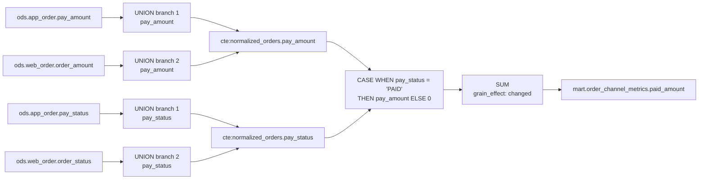
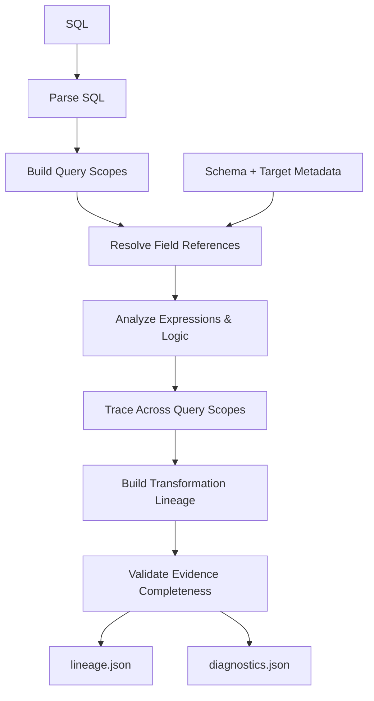
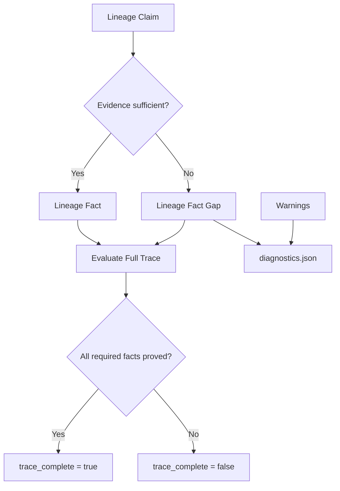
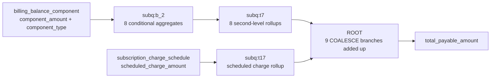
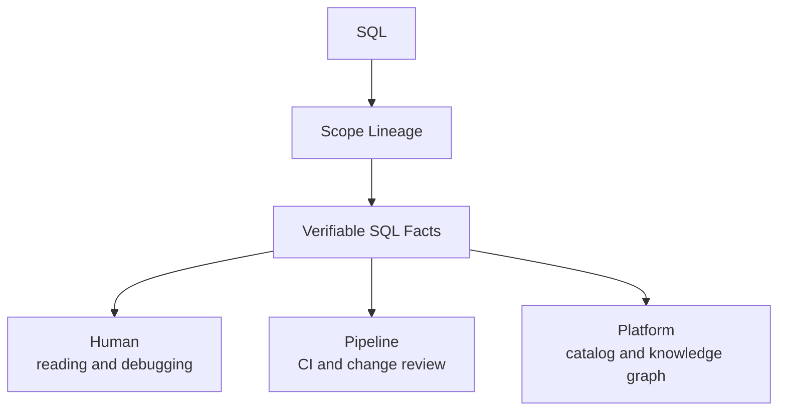
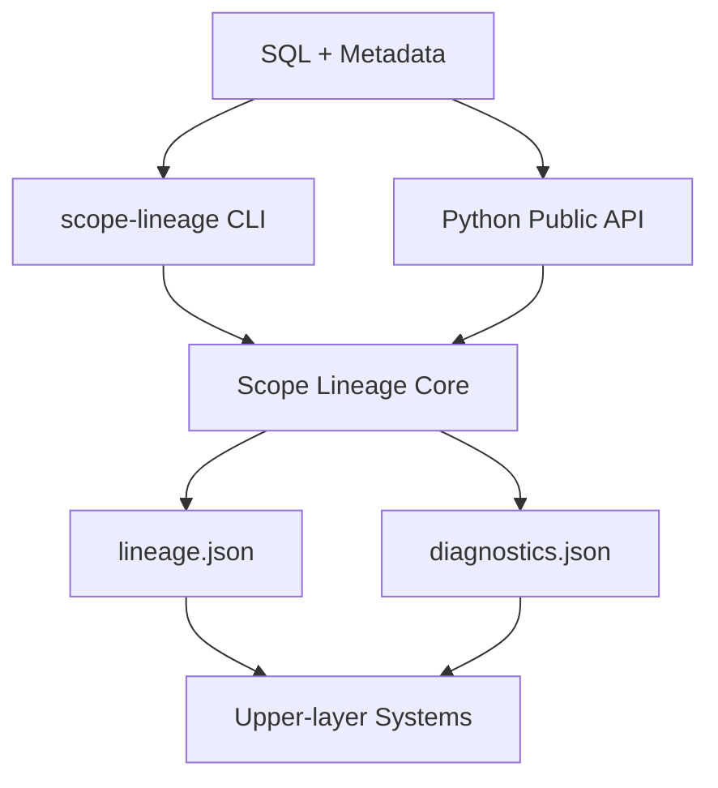

[中文](../zh-CN/value-and-use-cases.md) | English

# Scope Lineage: turning complex SQL back into verifiable field transformation chains

Scope Lineage is an open-source offline static analyzer for Spark/Hive SQL. It reads SQL, plus
optional source-table Schema and target-table metadata, and turns the field relationships hidden
inside CTEs, subqueries, `UNION`, `JOIN`, `CASE`, aggregates, and window functions into structured
facts you can query, trace, and verify.

It mainly helps data engineers, data governance teams, and platform engineers answer three
questions:

- Which physical tables and physical fields does a target field ultimately come from?
- Which query layers did it pass through, and what expressions, conditional judgments, and grain changes did it undergo?
- Is the current lineage fully proven, and what information is still missing?

Every parse produces `lineage.json` and `diagnostics.json`. The former records table-level lineage,
field-level lineage, transformation steps, and SQL evidence; the latter states the risks and
information gaps found while parsing. The whole process requires no Spark cluster or database
connection, and no large language model.

> SQL lineage you can inspect, trace, and verify.

## 1. How exactly is a field computed?

Start with a piece of SQL that is easy to read yet still shows the problem.

The task normalizes orders from the App and Web channels into one CTE, then computes the paid
amount per channel. Here is the part relevant to `paid_amount`:

```sql
WITH normalized_orders AS (
    SELECT
        pay_amount,
        pay_status
    FROM ods.app_order

    UNION ALL

    SELECT
        order_amount AS pay_amount,
        order_status AS pay_status
    FROM ods.web_order
)
SELECT
    SUM(
        CASE WHEN pay_status = 'PAID'
             THEN pay_amount
             ELSE 0 END
    ) AS paid_amount
FROM normalized_orders;
```

The complete example is at [`examples/sql/order_channel_metrics.sql`](../../examples/sql/order_channel_metrics.sql).

Looking only at the final field, the question seems simple: `paid_amount` comes from `pay_amount`.
Follow it further and at least four questions appear:

1. Does `normalized_orders.pay_amount` come from the App's `pay_amount` or the Web's `order_amount`?
2. Is `pay_status` also a lineage source? It supplies no amount, yet it decides which amounts reach the result.
3. How do the two UNION branches align into a unified `pay_amount` and `pay_status`?
4. Which query layers lie between the physical field, the `CASE`, and the `SUM`?

Traditional field dependency edges usually compress this into a few source-to-target relations.
When investigating a metric definition, the engineer still has to go back to the SQL and reassemble
the UNION, the condition, and the aggregation by hand.

## 2. The answer Scope Lineage gives

After parsing this task, Scope Lineage yields this result summary directly:

```text
Target field:
  mart.order_channel_metrics.paid_amount

Upstream physical tables: 2
  - ods.app_order
  - ods.web_order

Physical dependencies (`root_source_fields`): 4
  - ods.app_order.pay_amount
  - ods.web_order.order_amount
  - ods.app_order.pay_status
  - ods.web_order.order_status

Scopes in chain (`ordered_steps[].scope_id`): 5
Transformation steps (`ordered_steps`): 9
chain_status: resolved
trace_status: complete
missing_reasons: []
```

The tool confirms that `paid_amount` depends on 4 physical fields across 2 upstream physical
tables. `pay_amount` and `order_amount` take part in the amount computation; `pay_status` and
`order_status` take part in the conditional judgment.

The statement contract records these 4 proven physical dependency fields flat in
`root_source_fields`, without labelling them with a value or condition role. The role explanation
above comes from the expression evidence preserved on the same chain.

The 9 `ordered_steps` reconstruct the transformation process as follows:



This diagram is a visualization of `ordered_steps`. Scope Lineage found the final physical
dependencies and also preserved the UNION alignment, the conditional judgment, and the aggregation.

## 3. Why is ordinary field lineage not enough?

A field lineage edge can answer three questions, layer by layer: where it came from, how it was
transformed, and why you can trust the conclusion.

| Layer | Question it answers | What Scope Lineage provides |
| --- | --- | --- |
| Field lineage (Lineage) | Where did it come from? | Physical Dependencies |
| Transformation lineage | How was it transformed? | Scope + Expression + Logic + Grain |
| Verifiable lineage | Why can I trust the result? | Evidence + Completeness + Diagnostics |

### 3.1 Where: where did it come from?

Ordinary field lineage usually outputs a number of "source field → target field" relations. In a
simple case, this layer can tell the user: `paid_amount` depends on 4 physical fields from two
channels.

Knowing the sources still does not explain how the status field affects the amount, and it does not
show the UNION, the `CASE`, or the `SUM`. Those questions require the next layer.

### 3.2 How: how was it transformed?

On top of field dependencies, Scope Lineage preserves query scopes, transformation expressions,
conditional logic, and grain changes, connecting the processing between Source and Target. The
project calls this layer **transformation lineage**.

Transformation lineage solves the problem that ordinary field lineage cannot see the intermediate
processing. Seeing one complete transformation chain is still not enough: is the field binding
unique? Was `SELECT *` expanded? Is the Schema sufficient? Did every intermediate scope resolve? Are
there relations that can only be guessed at rather than proven? That uncertainty leads naturally to
the third layer.

### 3.3 Why trust: why can I trust this result?

Ordinary field lineage cares about "what the lineage relation is"; verifiable lineage additionally
answers "what evidence supports this relation, and how far the current evidence can carry it". For
that, Scope Lineage preserves the lineage conclusion, the supporting evidence, the completeness
status, and the diagnostics all at once.

**In Scope Lineage we define the result model formed by these four parts as verifiable lineage.**
This is the project's name for its own result model.

```text
Lineage Claim
      +
Evidence
      +
Completeness
      +
Diagnostics
      ↓
Verifiable Lineage
```

In the `paid_amount` case:

- Claim: the target field depends on the amount and status fields of two channels;
- Evidence: 9 transformation steps preserving field binding, UNION alignment, the `CASE`, and the `SUM` expressions;
- Completeness: `chain_status=resolved`, `trace_status=complete`, `missing_reasons=[]`;
- Diagnostics: the tool produced 1 `complex_aggregate_with_case` warning, reminding the user to look at the conditional metric logic; the current fact gap count is 0.

Diagnostics is not the same as a failed parse. `warnings` can record field-binding risks and complex
SQL patterns that deserve human attention; `lineage_fact_gaps` records evidence gaps where no
definite relation could be established. This case has 1 warning and the lineage is still complete.

The status fields mentioned here belong to different contract layers:

| Status field | Layer | Meaning in this document |
| --- | --- | --- |
| `analysis_status` | Task Lineage 2.0 task-level result | Whether the whole task analysis is `complete` or `partial`; the warning count alone does not decide it. |
| `chain_status` | `field_mapping_chains[]` | Whether this field's transformation chain finished resolving; `resolved` in the simple case. |
| `trace_status` | `field_mapping_chains[]` | Whether this field's transformation chain has complete trace evidence, valued `complete` or `incomplete`. |
| `trace_complete` | `end_to_end_lineage[]` | Whether this target field's end-to-end sources are complete; a boolean. |

These statuses describe different objects. When using them, confirm the JSON path first, then judge
whether the corresponding layer is complete.

These facts all have stable data structures in `lineage.json` and `diagnostics.json`. For field
meanings and consumption rules see the [`lineage.json` output contract](lineage-json.md) and the
[`diagnostics.json` output contract](diagnostics-json.md).

## 4. How does Scope Lineage work?

The core idea can be summed up in one sentence: recover the query scopes first, complete field
binding inside each scope, then trace recursively along expressions and scope boundaries down to
the physical sources.

The overall process:



### 4.1 Building query scopes

The root query, CTEs, subqueries, and UNION branches each have their own inputs, outputs, and field
visibility. The tool first recovers these structures as scopes and establishes the references
between them. All later field resolution happens inside an explicit scope, so same-named fields,
aliases, and nested queries cannot be confused with each other.

### 4.2 Completing field binding inside a scope

When resolving a field reference, the tool confirms the current scope, the input aliases, the
candidate sources, and the upstream output position. For a UNION it also aligns the branches by
output position. When a field binds uniquely a definite fact is formed; when there are several
candidates or the Schema is missing, the ambiguity and the missing reasons are preserved.

### 4.3 Analyzing expressions and processing logic

Once field binding is done, the tool goes on to analyze direct projections, conditional
expressions, aggregates, window functions, and plain arithmetic, recording inputs, outputs, the
original expression, the expanded expression, and grain changes. Logic blocks such as JOINs,
filters, and grouping also preserve their referenced fields and SQL evidence.

### 4.4 Tracing across scopes to physical sources

End-to-end lineage comes from layer-by-layer tracing:

```text
Target
  → Expression
  → Scope Output
  → Upstream Scope
  → Upstream Expression
  → Scope Input
  → Physical Source
```

`physical_sources` is the summary of that end-to-end trace, and `ordered_steps` preserves the
processing behind the summary. The two support fast lookup and step-by-step re-checking
respectively.

### 4.5 Validating evidence completeness

The SQL provides the query structure, and Schema plus target-table metadata provide extra evidence
for field binding. Scope Lineage uses that evidence to judge separately whether the current claim
can become a definite fact, and whether all the facts needed to form end-to-end lineage are
complete.



Sufficient evidence for the current relation only means it can become one Lineage Fact.
`trace_complete` may be set to `true` only once every key fact needed to form the end-to-end
lineage has been proven. Warnings enter `diagnostics.json` independently; they flag things worth
attention but do not directly decide whether the trace is complete.

For example, the SQL uses `SELECT *` and no source-table Schema is provided. The statement document
records a `star_not_expanded` warning and sets the corresponding end-to-end field's
`trace_complete` to `false`. Task Lineage 2.0 additionally produces a
`projection_wildcard_unexpanded` fact gap, naming the missing Schema fact. Candidate fields are
never written as definite sources.

Scope Lineage writes only relations backed by sufficient evidence as definite facts. When evidence
is insufficient it preserves the part already proven and states the current evidence boundary
through Lineage Fact Gap and Completeness; other issues that deserve attention but do not
necessarily affect lineage completeness are recorded separately as warnings in Diagnostics.

**Unprovable is not the same as guessable.** That is how the verifiable lineage defined in section 3
is implemented in the tool.

## 5. From a simple case to 604 lines of complex SQL

The simple case is for understanding the method. Next, a structurally faithful, desensitized
complex task validates the same analysis model.

Complete SQL: [`examples/sql/subscription_account_snapshot.sql`](../../examples/sql/subscription_account_snapshot.sql)
(604 lines, about 24 KB).

| Structure | Count |
| --- | ---: |
| Physical source tables | 19 |
| JOINs | 20 |
| Subqueries | 23 |
| Aggregate functions | 57 |
| CASE WHEN | 10 |
| Window functions | 1 |
| Target fields | 112 |

`total_payable_amount` in this SQL spans two amount paths:



Parsed with the Task Lineage 2.0 command from the [examples documentation](../../examples/README.md),
the result is:

```text
3 physical dependencies
  → 4 query scopes
  → 18 transformation steps
  → demo_mart.subscription_account_snapshot.total_payable_amount

chain_status: resolved
trace_status: complete
analysis_status: complete
warnings: 48
lineage_fact_gaps: 0
metadata_coverage: 20 / 20
```

Among the 18 transformation steps, `subq:b_2` handles 8 conditional aggregates, `subq:t7` handles 8
second-level rollups, `subq:t17` handles the scheduled charge aggregation, and the last step merges
nine charge branches in ROOT. The 48 warnings comprise 43 complex-conditional-aggregate reminders
and 5 magic-number reminders; they formed no fact gap and did not affect the complete trace of
`total_payable_amount`.

The point of this case is clear: the scopes, field binding, processing logic, cross-scope tracing,
and completeness validation from the simple case still use one and the same model on 604 lines of
SQL.

## 6. What else can these structured facts do?

For a data engineer, Scope Lineage turns complex SQL back into a field transformation chain you can
check. For a platform developer, it turns SQL into versioned, traceable, program-consumable
**Verifiable SQL Facts**.

Verifiable SQL Facts is the broader umbrella term here, covering query scopes, field bindings,
processing logic, JOINs, filters, aggregates, table state, and other structured facts proven by SQL
and metadata. Verifiable Lineage is an important part of it; Evidence, Completeness, and Diagnostics
further describe the basis and the credibility boundary of those facts. These structured results are
provided to upper-layer systems through a versioned JSON contract.

One set of facts can serve humans, pipelines, and platforms at the same time:



The basis of these applications is a set of queryable, comparable, evidence-bounded structured SQL
facts. What they provide goes beyond the "source field → target field" relation itself.

### Impact analysis

Suppose an upstream team plans to change
`demo_ods.subscription_charge_schedule.scheduled_charge_amount`. The complex case's parse result
finds the 4 affected target fields directly:

```text
past_due_amount
special_charge_balance
subscription_due_balance
total_payable_amount
```

A platform can go further and distinguish whether a field is used for computation, filtering,
joining, or grouping, helping reviewers scope the regression. The impact result therefore has two
layers: "is it affected" and "through what logic".

### SQL change review

After a developer changes `component_type LIKE 'PAYABLE%'` into a fixed enum, the before/after facts
can show that the `open_receivable_amount` conditional expression changed, and point along the
transformation chain to `total_payable_amount` using that intermediate field.

Core currently has no separate `diff` command. An upper-layer pipeline can compare stable ids,
normalized expressions, physical dependency fields, JOINs, filters, aggregates, and newly added
diagnostics.

Compared with a SQL text diff, this kind of comparison can state what changed semantically in the
lineage relations, transformation logic, filter conditions, or grain.

### CI and quality gates

The strict quality policy can block recovered syntax, fact gaps affecting final fields, and
target-field binding fallback. Before parse results enter a knowledge base or impact analysis, a
pipeline can confirm whether key fields are still trace-complete, whether new fact gaps appeared,
and apply the project's own review policy by warning type.

The complex case also demonstrates target-DDL binding: the SQL projection `request_date` binds to
`request_recorded_date` by position index 65. The original name, the target name, and the correction
evidence are all preserved.

### Automatic documentation

A platform can generate field description cards from the artifacts:

```text
Field: total_payable_amount
Target table: demo_mart.subscription_account_snapshot
Physical dependency fields: component_amount, component_type, scheduled_charge_amount
Transformation summary: charge classification → branch aggregation → account rollup → final sum
Evidence steps: 18
Completeness: complete
```

Every item on the card leads back to a SQL expression, a scope, and `diagnostics.json`. The
transformation steps and the completeness status give the card both an explanatory basis and an
audit entry point.

### Search indexes and knowledge graphs

Structured facts can form a "physical field — query scope — target field" graph relation. For
example:

```text
subscription_charge_schedule.scheduled_charge_amount
  → subq:t17.subscription_scheduled_charge
  → ROOT.total_payable_amount
  → subscription_account_snapshot.total_payable_amount
```

The same result can support field search, a data catalog, a knowledge graph, and a data governance
platform. The graph can contain Column, Scope, Transformation, and Logic nodes at once, preserving
the processing semantics between fields.

## 7. Beyond value lineage

A field transformation chain answers "how was this value produced". Data-change statements
additionally raise questions about record existence and table state.

```sql
DELETE FROM account
WHERE status = 'CANCELLED';
```

`status` is written to no target field, yet it decides which records disappear. So Task Lineage 2.0
distinguishes:

| Model | Question it answers |
| --- | --- |
| Value Lineage | Why is the field's value this value? |
| Row-existence Lineage | Why does a record exist, get updated, or disappear? |
| Table State | What state is the table in after several statements have run? |

This model describes `DELETE`, `TRUNCATE`, `UPDATE`, `MERGE`, and multi-statement tasks. For the
contract itself see [Task Lineage 2.0](task-lineage-v2.md).

## 8. The Scope Lineage capability map

The capabilities introduced above can be summarized into this product map:

| Capability layer | Capability | Value it provides |
| --- | --- | --- |
| Field lineage | Scope-aware Lineage | Recovers field passing between CTEs, subqueries, UNION branches, and the root query. |
| Field lineage | Transformation Lineage | Preserves expressions, transform types, intermediate fields, and grain changes. |
| Field lineage | Verifiable Lineage | Preserves the lineage conclusion, supporting evidence, completeness status, and diagnostics together, making the evidence boundary of the conclusion explicit. |
| SQL effects | Row-existence Lineage | Records which conditions decide whether a record exists, is updated, or disappears. |
| SQL effects | Table State | Describes the final table state after several write and change statements have run. |
| Engineering | Versioned JSON Contract | Lets upper-layer systems consume parse results within an explicit version boundary. |
| Engineering | Offline Static Analysis | Needs no Spark cluster, database connection, or large language model. |

The command line suits local reading and debugging; the versioned JSON suits feeding upper-layer
systems. The actual call relationships:



Core also provides a supported Python public API; a program can call Core directly and get the same
contract results as the CLI.

## 9. Working boundary

Scope Lineage focuses on the facts the SQL itself can prove.

| Work outside the tool's scope | What it requires |
| --- | --- |
| Executing SQL | Spark, Hive, or another compute engine. |
| Judging whether runtime data values are correct | Query results and data quality rules. |
| Inferring business semantics from field names | Domain knowledge and human confirmation. |

Relations the SQL can prove enter `lineage.json`; places with insufficient evidence enter
`diagnostics.json`; business meaning is confirmed by people who know the data.

## 10. Quick start

Install the command-line tool:

```bash
pipx install scope-lineage
```

Parse the simple case from the project root:

```bash
scope-lineage parse \
  --task-file examples/tasks/order/order_channel_metrics.json \
  --schema examples/metadata/schema_info.json \
  --target-ddl-metadata examples/metadata/target_tables/mart.order_channel_metrics_metadata.json \
  --out /tmp/scope-lineage/order-channel
```

Output:

```text
/tmp/scope-lineage/order-channel/order_channel_metrics/
├── lineage.json
└── diagnostics.json
```

For complete installation, input modes, field lookup, and quality policies read the
[installation and usage guide](getting-started.md). For how to query the output fields read the
[`lineage.json` output contract](lineage-json.md).

## 11. Learn more

- [Installation and usage guide](getting-started.md): installation, input preparation, batch parsing, and common commands.
- [Input formats](input-formats.md): task JSON, SQL, Schema, and target-table metadata.
- [`lineage.json` output contract](lineage-json.md): query scopes, transformation chains, and end-to-end lineage.
- [`diagnostics.json` output contract](diagnostics-json.md): warnings, fact gaps, and completeness.
- [Task Lineage 2.0](task-lineage-v2.md): Row-existence Lineage and Table State.

Scope Lineage is an open-source project under the Apache-2.0 license. Project home:
[github.com/realyin/scope-lineage](https://github.com/realyin/scope-lineage). If it helps with your
SQL investigations, lineage governance, or data platform work, a Star on GitHub is welcome. Your
support also helps more people who deal with complex warehouse SQL find it.
