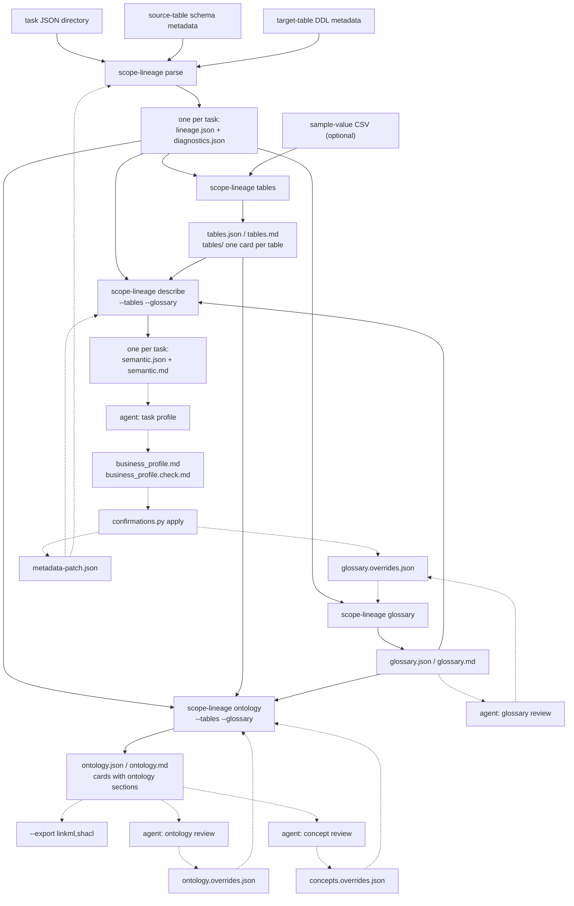

[中文](../zh-CN/workflow.md) | English

# End-to-end workflow: from task JSON to profiles and ontology

Every other document explains one artifact: `lineage.json` holds the proven facts,
`semantic.md` says what one task does, `tables.md` says what one table is, `ontology.md`
says how the tables relate. This page repeats none of them and answers a different
question: **in what order the commands run, what each step needs from the one before it,
and where a person or an agent enters.**

When you have finished it you should be able to say: given a batch of task JSON and a
schema export, which commands do I type, and who reads what each one writes.

## One picture



Solid arrows are data flowing between commands; dashed arrows are the write-back loops.
The loops have exactly four landing places: `glossary.overrides.json`,
`ontology.overrides.json`, `concepts.overrides.json` and `metadata-patch.json`. Write an
answer into one of them, run
the same command again, and that question is not asked a second time — that is the only
memory the whole pipeline has.

## Five minutes end to end

The sequence below runs as written from the repository root; every input is a
[synthetic sample under `examples/`](../../examples/README.md).

### 1. `parse`: turn SQL into facts

```bash
OUT=/tmp/scope-lineage-walkthrough

scope-lineage parse \
  --input-dir examples/tasks \
  --schema examples/metadata/schema_info.json \
  --schema-fallback examples/metadata/subscription_account_snapshot/source_tables \
  --target-ddl-metadata examples/metadata/target_tables \
  --out "$OUT/artifacts"
```

```text
Metadata gaps: 6 referenced table(s) have no schema metadata; list written to /tmp/scope-lineage-walkthrough/artifacts/metadata_gaps.json (run with --metadata-preflight to review before parsing)
Parsed 7 statement(s) from 5 input(s) into /tmp/scope-lineage-walkthrough/artifacts using contract 2.0 (tasks=5, modeled=6, failed=0, input_failed=0, partial_tasks=0, unsupported_mutations=0, root_gap_results=0, binding_fallbacks=0, recovered_syntax=0, binding_not_applicable=1)
```

The output mirrors the input tree, one directory per task, holding `lineage.json` and
`diagnostics.json`. The gap reported on the first line is about **source-table** schema
coverage: here every missing table is a target this batch writes, supplied separately
through `--target-ddl-metadata`, so there is nothing to fill in. When a genuine source
table is missing, fill the metadata before parsing — chaining `--metadata-preflight` in
front turns that into a gate.

Every command after this one reads only the `$OUT/artifacts` tree and never touches SQL
again.

### 2. `tables` and `glossary`: the two corpus-level ledgers

These two do not depend on each other and can run in parallel. Both answer what a single
task cannot: who writes a table and who reads it, and what one column name is called
elsewhere and which constants it has been compared against.

```bash
scope-lineage tables   --lineage "$OUT/artifacts" --out "$OUT/corpus"
scope-lineage glossary --lineage "$OUT/artifacts" --out "$OUT/corpus"
```

```text
Carded 31 table(s) from 5 task(s) (skipped_unknown_version=0, missing_diagnostics=0, skipped_unreadable=0)
Collected 214 term(s) and 62 value observation(s) from 5 task(s) (overrides terms=0, values=0, blank=0, unmatched=0, rejected=0, ignored_fields=0, skipped_unknown_version=0, missing_diagnostics=0, skipped_unreadable=0)
```

Once an ontology has been built, hang it on the dictionary (N6): the dictionary then
carries a **concept** layer -- one concept attribute is the same thing on each of its
representation tables, so terms, values and the fill-in form merge by attribute instead
of by table, and one `concept:<concept id>.<attribute>=<value>` answers the whole family.
Having no `ontology.json` on the first pass is normal: run the line above, build the
ontology in step 4, then come back and re-run this one.

```bash
scope-lineage glossary --lineage "$OUT/artifacts" --out "$OUT/corpus" \
  --ontology "$OUT/corpus/ontology.json"
```

### 3. `describe`: one semantic skeleton per task

```bash
scope-lineage describe \
  --lineage "$OUT/artifacts" \
  --tables   "$OUT/corpus/tables.json" \
  --glossary "$OUT/corpus/glossary.json"
```

```text
Described 5 task(s) (skipped_unknown_version=0, missing_diagnostics=0, skipped_unreadable=0)
```

`semantic.json` and `semantic.md` are written next to each `lineage.json`. The two
optional inputs each add one block: `--tables` gives every input table its own upstream
card and lists the target's downstream readers; `--glossary` fills
`fields[].value_domain[]` — which values a column has been seen holding, and which of them
somebody has confirmed a meaning for. Both are optional, and without them those blocks are
simply empty.

### 4. `ontology`: how the tables relate

```bash
scope-lineage ontology \
  --lineage "$OUT/artifacts" --out "$OUT/corpus" \
  --tables   "$OUT/corpus/tables.json" \
  --glossary "$OUT/corpus/glossary.json"
```

```text
Modelled 12 concept(s), 9 relation(s), 31 table(s), 21 table relation(s), 20 constraint(s) and 0 finding(s) from 5 task(s), concept files 12 (skipped_unknown_version=0, missing_diagnostics=0, skipped_unreadable=0)
```

This run writes `ontology.json`, `ontology.md` (the index), `concepts/<file>.md` (**one
per folded concept**), `appendix.md` (everything table-level) and `tables/<db.table>.md`
(the table card plus the five ontology sections).

Open `$OUT/corpus/ontology.md`: it starts with 「本体总览」 — how many concepts, broken down
by kind, how many concept relations, how many provisional concepts are still waiting to be
merged, and how many items are still open, how many groups they fold into and how many are
already confirmed. Then the concept table, where **each concept's name links to its own
file under `concepts/`** (its representations, its attributes, its constraints, its
relations, its open questions, what named it, and the review write-back key). The
provisional concepts are down to a count and the **top 20 by impact** in the index, with
the whole list in `appendix.md`. The table-level Mermaid ER, the table list, the table
relations and the whole folded open list live there too; the index keeps only 「附录索引」,
one line per section with its count and a link — they are the evidence the concept
relations were read off, not the model. That list has
one row per (kind, table family, question shape) group, each with a stable `open:group:`
id, an `影响` score, the number of items it holds and a write-back pattern that leaves the
table name as `<table>`, ranked by impact (a relation groups by its far side, so ten tasks
joining one dimension are one row); the item-by-item list is in `open_items[]` in
`ontology.json`. `--tables` / `--glossary` only save a recomputation — the bytes are
identical without them.

### 5. The second run: `--incremental`

When only a task or two changed, there is no reason to read every task again. All four
corpus-level commands accept `--incremental`:

```bash
scope-lineage tables --lineage "$OUT/artifacts" --out "$OUT/corpus" --incremental
scope-lineage tables --lineage "$OUT/artifacts" --out "$OUT/corpus" --incremental
```

```text
Carded 31 table(s) from 5 task(s) (..., reused=0, recomputed=5, removed=0)
Carded 31 table(s) from 5 task(s) (..., reused=5, recomputed=0, removed=0)
```

The first run has nothing to reuse and writes the index and the cache; the second reuses
everything. Only the half each task contributes on its own is reused — the merge still
runs in full, so an incremental run is byte-identical to a full one. If any option, the
content of an overrides file, or the tool version changes, the whole index is discarded
and everything is recomputed; `--no-cache` deletes both first and runs in full.

For a second corpus — the same tasks parsed into another directory, or a larger corpus
containing them — add a `--cache-from` pointing at the previous `--out`, and the tasks
whose bytes are unchanged are borrowed rather than re-derived:

```bash
scope-lineage tables --lineage "$OUT2/artifacts" --out "$OUT2/corpus" \
  --cache-from "$OUT/corpus"
```

```text
Carded 31 table(s) from 5 task(s) (..., reused=4 (borrowed=4), recomputed=1, removed=0)
```

### 6. One write-back round: `--overrides`

Up to here no value has a meaning — Core never guesses one from the spelling. Confirmed
meanings go into an overrides file, which lives in any directory outside the repository:

```bash
REVIEW=/tmp/scope-lineage-review
mkdir -p "$REVIEW"

cat > "$REVIEW/glossary.overrides.json" <<'JSON'
{"values": {"customer_level='HIGH'": {"meaning": "High-value customer", "confirmed_by": "owner", "date": "2026-09-21"},
            "pay_status='PAID'": {"meaning": "Payment settled", "confirmed_by": "owner", "date": "2026-09-21"}}}
JSON

scope-lineage glossary --lineage "$OUT/artifacts" --out "$OUT/corpus" \
  --overrides "$REVIEW/glossary.overrides.json"

scope-lineage describe --lineage "$OUT/artifacts" \
  --tables "$OUT/corpus/tables.json" --glossary "$OUT/corpus/glossary.json"
```

```text
Collected 214 term(s) and 62 value observation(s) from 5 task(s) (overrides terms=0, values=2, blank=0, unmatched=0, rejected=0, ignored_fields=0, ...)
Described 5 task(s) (skipped_unknown_version=0, missing_diagnostics=0, skipped_unreadable=0)
```

A key without a table name matches every column of that name, so these two lines land on
several tables at once. After the second `describe`, that column in
`customer_profile_daily`'s `semantic.md` changes from `'HIGH'（待确认）` to
`'HIGH'（High-value customer）`, while `'MEDIUM'` and `'STANDARD'` stay `（待确认）` — what
was answered is no longer asked, what was not still is.

Misspell the key (`customer_levl='HIGH'`) and it is not silently dropped: it is counted in
the summary line as `unmatched=1`.

## What each step needs, produces, and who reads it

| Step | Inputs | Outputs | Reader | Details |
| --- | --- | --- | --- | --- |
| `parse` | task JSON / SQL, `--schema`, `--target-ddl-metadata`, optional `--metadata-patch` | one directory per task: `lineage.json`, `diagnostics.json` | machine (the only input every later step has) | [Installation and usage guide](getting-started.md) |
| `render` (optional) | a `lineage.json` tree, `--field` / `--sections` | `mapping.md` (plus `warnings.md` when there are warnings) | analyst | [`mapping.md` field mapping document](mapping-doc.md) |
| `tables` | a `lineage.json` tree, optional `--samples`, `--merge` | `tables.json`, `tables.md`, `tables/<db.table>.md` | analyst; also fed to `describe` / `ontology` | [Corpus-level table cards](tables-doc.md) |
| `glossary` | a `lineage.json` tree, optional `--overrides`, `--ontology`, `--template` | `glossary.json`, `glossary.md`, optionally a fill-in form | business owner fills the form; machines read the JSON | [Term and value dictionary](glossary-doc.md) |
| `describe` | `lineage.json` + `--tables` + `--glossary` + optional `--metadata-patch` | one `semantic.json`, `semantic.md` per task | agent (raw material for a profile), analyst | [Task-semantic description](semantic-doc.md) |
| `ontology` | `lineage.json` + `--tables` + `--glossary` + optional `--overrides`, `--concept-overrides`, `--export` | `ontology.json`, `ontology.md`, cards with ontology sections | agent (turns open items into questions), analyst | [Corpus-level ontology candidate](ontology-doc.md) |
| agent task profile | `semantic.md` plus the skill's prompt and templates | `business_profile.md`, `business_profile.check.md` | business owner (reads the profile, answers the open list) | [AI agent skill](agent-skill.md) |
| `confirmations.py apply` | an answered `business_profile.md` | merged into `glossary.overrides.json`, `metadata-patch.json` | machine (the next round's input) | [AI agent skill](agent-skill.md) |

One hard constraint sits behind that table: **the last four commands read only what `parse`
wrote**. Change the SQL or the metadata and `parse` has to run again; add human
confirmations only, and `parse` never moves.

## Where people and agents come in

Core produces deterministic facts only; business names, meanings and entity relationships
are left to a person. Each of those three jobs has an agent workflow, and every prompt
lives under `skills/scope-lineage/references/` (paths relative to the
[skill directory](../../skills/scope-lineage/SKILL.md)):

| Workflow | Prompt file | Produces | Where the answers are filed | Re-run after the answers |
| --- | --- | --- | --- | --- |
| task profile | `semantic-profile-prompt.md`, with `business-profile-template.md` / `business-profile-check-template.md` | `business_profile.md` (semantic card + field dictionary + an open list capped at five items) and its QA record `business_profile.check.md` | the owner writes each answer on the item's `- 答案：` line; `confirmations.py apply` routes it by the same item's `- 回写目标：` line — `术语` / `值域` into `glossary.overrides.json`, `字段注释` / `表注释` into `metadata-patch.json` | `glossary --overrides`, then `describe --glossary --metadata-patch`; to land the comments in `lineage.json` itself, also `parse --metadata-patch` |
| glossary review | `glossary-review-prompt.md`, fed by the form `glossary --template` writes | the entries the agent may answer itself (each with a mandatory `basis`, signed `confirmed_by: "agent:<name>"`), plus at most eight questions left for a person | `glossary.overrides.json` | `glossary --overrides`, then `describe --glossary` |
| ontology review | `ontology-review-prompt.md`, fed by the open list in `ontology.md` plus each task's `semantic.md` | the confirmations the batch already proves (again with a `basis`), plus at most eight questions left for a person | `ontology.overrides.json`, keyed by the write-back string printed in the open list | `ontology --overrides` |
| concept review | `concept-review-prompt.md`, fed by 「本体总览」 and 「概念」 in `ontology.md` plus section 7 of each card; on a wide corpus, by the `batch-NN.md` worksheets `--review-batches` cut instead | one pass in a fixed order (kind → name → merges → splits → roles): self-answers carrying a `basis`, plus at most eight questions left for a person, written to `open-questions.md`; batched, eight per batch | `concepts.overrides.json`, keyed by `concept:<stem>`; batched, one file per batch | `ontology --concept-overrides` (repeatable, in batch order) |

What the four have in common: **an agent may not guess from spelling.** It may answer
from three kinds of evidence only — the column's own comment enumerates the value, a CASE
in the batch maps the value one-to-one onto a label, or the same value on the same column
name was confirmed elsewhere by a person. Everything else becomes a question for a human.
Every self-answer must record what it rests on; a confirmation without one is refused.

The last two rows are **two rounds over one corpus, and neither replaces the other**: the
ontology round asks about tables (is this table unique on these columns, how many rows does
this edge imply), the concept round about concepts (what kind of thing is this, what is it
called, are these two the same one). Their answers land in two different overrides files and
one command can carry both; running only one round leaves the other half of the questions
unasked.

On a wide corpus the concept round cannot be finished in one sitting: the provisional
concepts run to tens or hundreds while the budget for human questions is eight. **Work it
in batches** (N1; the full rules are in the
[corpus-level ontology candidate](ontology-doc.md) guide, section 「分批评审」):

```bash
# 1. Cut: the provisional concepts by table family into <review>/batches/
scope-lineage ontology --lineage "$OUT/artifacts" --out "$OUT/corpus" \
  --review-batches "$REVIEW" --review-batches-by family --review-batch-size 30

# 2. One batch at a time: read batch-NN.md, fill batch-NN.overrides.json, <= 8 questions

# 3. Write back: --concept-overrides repeats, in the order the batches were worked
scope-lineage ontology --lineage "$OUT/artifacts" --out "$OUT/corpus" \
  --concept-overrides "$REVIEW/batches/batch-01.overrides.json" \
  --concept-overrides "$REVIEW/batches/batch-02.overrides.json"
```

`index.md`'s order is the order to work them (the earlier the batch, the more edges its
answers unblock). Entries that do not collide accumulate; when two files name one target
key the later one wins and the pair is reported in
`concept_overrides_applied.conflicts[]` -- which means two batches gave two answers to one
question, so **a person settles it** rather than the command line order. `sources[]` says
how many entries each file won, which is how you check that the batch you just wrote
actually landed.

## What happens when something is wrong

The tool is built so that mistakes are visible: nearly every kind of slip gets a counter
rather than a silent drop. These are the ones worth knowing up front:

| Situation | Default behaviour | Where you see it |
| --- | --- | --- |
| a comment contains an email address, a phone number or an ID number | **redacted by default** to `<email>` / `<phone>` / `<id>`, with the rest of the text kept. `--no-redact-comments` publishes it as written; when no comment at all may leave the machine, use `--strip-comments` | the comment text in the artifacts |
| a confirmed key does not exist in the batch | never dropped: counted under `overrides_applied.unmatched` with a `reason` naming the unknown entity or column | the `glossary` / `ontology` summary line and the matching JSON |
| an agent's confirmation has no `basis` | refused, counted under `overrides_applied.rejected` with `reason: "missing_basis"` | same as above |
| a slot name in an overrides file is misspelled | not dropped silently: counted under `overrides_applied.ignored_fields` | same as above |
| a sample file names a table or column that does not match | counted under `samples_applied.unmatched` | the `tables` summary line and `tables.json` |
| an ontology assertion is not necessarily a fact | every assertion carries a tier: `proven`, `implied`, `hypothesis`, `conflict`, `confirmed`. **Only `confirmed` comes from a person**; the batch can never produce that tier by itself | each assertion in `ontology.md` and `tier` in `ontology.json` |
| a task is only partly modelled | the summary line prints `partial_tasks=N` and `partial_reasons=<reason>:<count>,…`, and what succeeded is still written | `analysis_status.blocking_reasons` in that task's `diagnostics.json`, and the [`diagnostics.json` output contract](diagnostics-json.md) |
| a source table has no schema | a `metadata_gaps.json` is written into `--out` with a one-line notice, without interrupting; `--metadata-preflight` turns it into a gate: non-zero on any gap, and no lineage artifacts | `metadata_gaps.json` |
| governance leads inside a semantic skeleton | each `confidence.findings[]` entry carries a `severity`: `warn` is a lead somebody has to act on, `info` is true and needs no action (a hardcoded partition date, for instance — one task instance covers one day by design) | section 6 of `semantic.md` |

In one sentence: **every `=0` in a summary line is proof that nothing went wrong there**,
and the non-zero ones are what to open the artifacts for.

## Going further

| What you want | What to add | Notes |
| --- | --- | --- |
| a table written by batch A and read by batch B | `tables --lineage B --merge A/tables.json --out …`, then `ontology --tables A/tables.json --tables B/tables.json` | cross-batch card merge: producers and consumers land on one card, and a uniqueness proven in one batch can settle a cardinality in the other, with every piece of evidence naming the batch it came from |
| real example values on the cards | `tables --samples <CSV or directory> --samples-top N` | shaped `table,column,value[,count]`; values are always masked for contact shapes and cut to length, and keys that match nothing go to `samples_applied.unmatched` |
| the ontology in an RDF toolchain | `ontology --export linkml,shacl` | writes `ontology.linkml.yaml` and `ontology.shacl.ttl` beside `ontology.json`, each element still carrying its tier |
| expressions nest so deep that `expanded_expression` is truncated | `parse --expansion-limit N` | how many upstream expressions may be inlined into one `expanded_expression` (default 2000); hitting the limit publishes the text with a truncation marker and records an `expansion_truncated` warning (it is an `expression_expansion_bounded` gap only where the sources did not resolve) |
| confirmed comments must land in the artifacts | `parse --metadata-patch <file>` | reads the same `metadata-patch/1` file as `describe --metadata-patch`; the former rewrites the artifacts, the latter applies it in memory only |
| no comment may leave the machine | `parse --strip-comments` | author comments (statement header, per output, per logic block) are collected by default, and redaction is shape matching — neither exhaustive nor certain |
| only some markdown sections | `describe --sections …`, `render --sections …` | a task with many fields can keep just the compact list section |
| the same tasks run again as part of another corpus | `--cache-from <the previous --out>` (all four corpus-level commands) | a task whose bytes and options digest match borrows the cached facts, and the summary reads `reused=N (borrowed=B)`; the borrowed file is copied into this run's own cache, and the published bytes are those of a full run |

Input formats, catalog prefixes, quality gates and the remaining flags are covered in
[Input formats](input-formats.md) and the
[installation and usage guide](getting-started.md).

## Next steps

- [Documentation map and question-to-field index](README.md)
- [`lineage.json` output contract](lineage-json.md)
- [`diagnostics.json` output contract](diagnostics-json.md)
- [Task Lineage 2.0](task-lineage-v2.md)
- [Statement level or task level? Choose by scenario](contract-selection.md)
