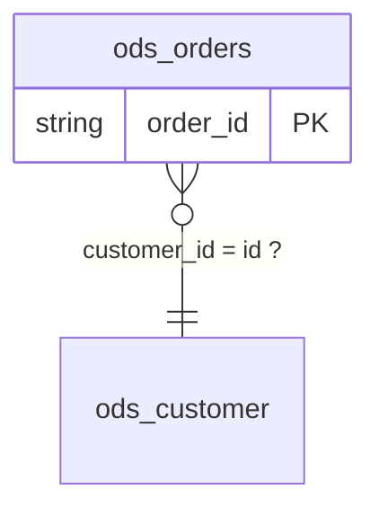

[English](../en/ontology-doc.md) | 中文

# ontology.json / ontology.md 语料级本体候选（ontology-json/1）

`scope-lineage ontology` 扫描一棵语料目录下的所有 `lineage.json`，在
[表卡](tables-doc.md) 与[值词典](glossary-doc.md)之上再回答一个单表回答不了的问题——
**这些表之间是什么关系**：实体（表 + 身份键）、属性（列 + 注释 + 观察到的角色 + 同义列）、
关系（JOIN 键对 + 可证明的基数）、约束（非空 / 枚举 / 每键唯一 / 分区）、以及跨任务的矛盾。

语料里每一个 JOIN 都是一句关于两个实体及其键的断言；每一次「先按 k 去重再关联」都是一句
关于那张表按 k 有多行的断言；每一个封闭 `IN` 列表都是一句关于列值域的断言。本产物把这些
断言收集起来，逐条标注置信层级与证据。

> **术语说明**：`entities[]` 是**表实体**——概念在仓库里的表现，一张表一条；`concepts[]` 才是
> **业务概念**（实体 / 事件 / 汇总），一个概念常常由好几张表表现。两者不是同一层东西：
> 「客户」是概念，`dwd.customer_df` 是它的一个表实体。`entities` 这个名字来自本产物的第一版，
> 名不副实，**0.4.0 会把它改名为 `tables`**（`concepts[]` 不改）。消费方现在就可以准备：读取时
> 两个键都认（先 `tables`，回落 `entities`），并且不要把 `entities[]` 当成业务实体清单。

## 定位：本体**候选**，不是业务本体

- 每条断言都带 `tier` 与 `evidence`，可按任务名、`statement_id`、`logic_block_id` 回链到
  某个具体语句；没有证据的断言根本不会被发布。
- Core 不给实体起业务名、不判断类型、不推断父子类、不做业务命名。`naming_hints` 只放元数据
  事实（表注释、业务域、项目、负责人），命名与建模交给懂业务的人或 Agent 确认。
- 槽位刻意对齐常见本体语言（entity ~ owl:Class、attribute ~ owl:DatatypeProperty、
  relation ~ owl:ObjectProperty、constraint ~ sh:NodeShape），`--export` 按这份对应导出
  LinkML 与 SHACL；不产 OWL。
- 稳定性分级与其他派生文档一致：`ontology-json/1` 内键名稳定，中文措辞可能微调，
  机器应读 JSON 而不是 Markdown。

## 用法

```bash
# 语料目录：递归查找 lineage.json，产物写到 --out
scope-lineage ontology --lineage /path/to/corpus --out /path/to/ontology

# 复用已经算好的表卡与值词典（不给就在内存里按同一份语料现场构建）；
# --overrides 合并表级人工确认，--concept-overrides 合并概念层的，
# 被确认的断言升到第五级 confirmed
scope-lineage ontology --lineage /path/to/corpus --out /path/to/ontology \
  --tables /path/to/tables/tables.json --glossary /path/to/glossary/glossary.json \
  --overrides /path/to/ontology.overrides.json \
  --concept-overrides /path/to/concepts.overrides.json

# 跨语料：--tables 可重复，几份表卡先合并再建本体
scope-lineage ontology --lineage /path/to/corpus --out /path/to/ontology \
  --tables /path/to/a/tables.json --tables /path/to/b/tables.json
```

产物三件：

| 文件 | 给谁读 | 内容 |
| --- | --- | --- |
| `ontology.json` | 机器 / RAG / 知识图谱入库 | 主产物，`doc_format: "ontology-json/1"` |
| `ontology.md` | 人 | 索引：概念层（概念图 + 概念表 + 临时概念表 + 概念关系表）+ Mermaid ER 总览 + 实体表 + 关系表 + 约束表 + 待人工判定表 + 待人工判定清单（后两者按表族折叠成组），`doc_format: "ontology-index-md/1"` |
| `tables/<db.table>.md` | 人 / RAG 按表切块 | 表卡的 6 节之后追加本体 5 节，`doc_format: "ontology-md/1"`；文件名规则与 `scope-lineage tables` 完全一致 |

Python API（消费契约文档，与文件写出同一条路径）：

```python
from scope_lineage import build_ontology, build_semantic_profile, build_table_cards
from scope_lineage import render_ontology_index_markdown, render_ontology_table_card_markdown

profiles = [build_semantic_profile(document) for document in documents]
cards = build_table_cards(profiles, artifact_root="/path/to/corpus")
ontology = build_ontology(documents, profiles, tables=cards, artifact_root="/path/to/corpus")
index = render_ontology_index_markdown(ontology)
card = render_ontology_table_card_markdown(cards["tables"][0], ontology)
```

- `--lineage` 与 `tables` / `glossary` 完全一致：一个 `lineage.json` 或一棵递归查找它的目录树；
  版本不认识的文档在目录模式下跳过并计数。
- `--tables` / `--glossary` 只是省一次重算：给与不给产出字节一致。给了 `--tables` 时，表卡
  以它为底本追加本体节；不给就在内存里按同一份语料构建同样的表卡。
- `--tables` **可重复**：多份先按[表卡的合并规则](tables-doc.md#跨语料合并--merge)合成一份，
  再交给本体构建——于是别的语料里已经证明的键，可以为这份语料里的一条关系作证。见下文
  「跨语料证据」。
- `--format` 取 `json`、`md` 或两者（默认 `json,md`）；只要 `md` 不在其中，`ontology.md` 与
  `tables/` 都不写。其他值直接报参数错误（退出码 2）。
- `--export` 取 `linkml`、`shacl` 或两者（可重复，也可写成逗号列表），默认什么都不导出；
  与 `--format` 相互独立，详见[导出 LinkML / SHACL](#导出-linkml--shacl)。
- 确定性：同一份语料无论以什么顺序被扫描，产出字节一致。

## 增量运行：`--incremental` / `--no-cache` / `--cache-from`

一份语料只改了一两个任务，重跑却要把每个任务重新读一遍、重新算一遍。`--incremental` 让这一遍
只落在指纹变了的任务上：

```bash
scope-lineage ontology --lineage /path/to/corpus --out /path/to/ontology --incremental
```

- 它在 `--out` 下写两样可丢弃的东西：`.scope-lineage-corpus-index.json`（每个任务
  `lineage.json` / `diagnostics.json` 的 sha256，加一份「影响推导的选项」的 sha256）与
  `.cache/`（每个任务在语料级合并之前贡献的那份事实）。
- 缓存里**只存语料级合并真正读的那些字段**：语义画像里给人看的那一半（`stages`、
  `confidence`、每个字段逐步的 `derivation` 等）合并从不读，也就不进缓存。哪些字段算数，
  由合并方自己那份清单说了算（`PROFILE_FIELDS_READ`，就写在读它的代码旁边）；清单改了，
  索引整份作废、全部重算。
- 存下来的那份事实**带版本号**：`payload_version`（当前 `corpus-cache/3`）。版本对不上的
  缓存文件与索引一律当没有、重算——旧版本里存的是另一种东西，不是少了几个字段。
- **语料级合并照样跑全量**：复用的只是每个任务自己贡献的那一半，所以增量跑出来的
  产物与全量跑逐字节一致。
- **换一份语料也能复用**（Q7）：`--cache-from <目录>` 再指一处事实缓存——另一次运行的
  `--out`，或它下面的 `.cache/`。同一个任务被解析到另一个目录下（重新解析、或是被一份更大的
  语料再走一遍），`lineage.json` / `diagnostics.json` 字节相同、选项摘要也相同时，就直接借用
  那份事实而不是重算；借来的文件会抄进本次运行自己的 `.cache/`，下次即本地命中，借出的那份
  目录可以删掉。可重复，按给出的顺序、在本地缓存之后依次尝试；它本身即蕴含 `--incremental`，
  `--no-cache` 仍然优先。语料路径**不进**选项摘要：同一个任务在哪个目录下解析，都该算出同一份事实。
- 事实文件按任务名存放，两份语料完全可能各有一个同名而内容不同的任务。能不能借用由文件里记着的
  指纹与选项摘要说了算，不由文件名说了算——同名不同内容的任务照样重算。
- 选项变了就整份作废、全部重算：`--overrides` 文件的**内容**、`--format`、读回来的
  `glossary.json` / `tables.json`、以及工具版本，任何一项对不上，索引就当没有。
  由别的子命令写下的索引或缓存（`command`、`doc_format` 对不上）同样当没有。
- 摘要行末尾多出 `reused=N, recomputed=M, removed=K`：复用了几个、重算了几个、语料里少了几个。
  给了 `--cache-from` 时第一项写成 `reused=N (borrowed=B)`，B 是从别处借来的那几个。
- 不给 `--incremental` 就是原来的全量跑，既不读也不写索引与缓存；`--no-cache` 先把这两样
  删掉再全量跑。

## 置信五级

| 层级 | md 上的中文 | 定义 | 例 |
| --- | --- | --- | --- |
| `proven` | 已证明 | SQL 里直接写着 | 连接键对存在；分区列；生产任务已证明的键；DIRECT 重命名 |
| `implied` | 可推得 | 由结构可证明的推论 | 任务在 JOIN 前按 k 去重 → 那张表按 k 有多行（否则作者不会去重）；UNION 列对齐 |
| `hypothesis` | 作者假设 | 作者假设，未被 SQL 证明 | 直接以 k 关联物理表 → 假设它按 k 唯一；过滤里出现过的取值集合是否完整 |
| `conflict` | 矛盾 | 跨任务证据矛盾 | T1 按 k 去重、T2 直接按 k 关联同一张表——这是治理发现，不是本体事实 |
| `confirmed` | 已确认 | **只来自人工回写**，语料自己永远产不出这一级 | 业务方在 `ontology.overrides.json` 里确认了某条关系的基数或某张表的身份键 |

## ontology.json 结构

```jsonc
{
  "doc_format": "ontology-json/1",
  "corpus": {"artifact_root": "…", "task_count": 12, "lineage_digests": {"task_a": "…"},
             "external_evidence_tables": 2},   // 只有合并进来的表卡带了本语料没碰过的表时才出现
  "entities": [
    {"id": "ods.customer", "kind": "physical_table",
     "family": "ods.customer",   // Q3：去掉 _di / _tmp / _mid01 一类后缀后的表族键
     "comment": null,
     "identity": {
       "candidate_keys": [{"columns": ["id"], "tier": "hypothesis",
                           "evidence": [{"task": "task_a", "statement_id": "stmt:001",
                                         "kind": "joined_as_right_without_dedup",
                                         "logic_block_id": "logic:ROOT:join:001"}]}],
       "declared_hints": [{"columns": ["id"], "evidence": "column_comment",
                           "text": "customer primary key"}],
       "multiplicity": [{"columns": ["driver_id"], "tier": "implied",
                         "claim": "multiple_rows_per_key", "evidence": [{"kind": "group_by"}]}],
       "partition_columns": ["dt"]},
     "attributes": [
       {"column": "state", "type": "string", "comment": null,
        "observed_roles": ["filter", "output"], "used_in_corpus": true,
        "not_null_observed": false,
        "synonyms": [{"entity": "mart.t", "column": "order_state", "tier": "proven",
                      "via": "direct_rename", "evidence": [{"task": "task_a"}]}],
        "samples": ["PAID", "NEW"]}],
     "naming_hints": {"table_comment": null, "domain": null, "project": null, "owner": null},
     "relation_hints": [{"from_column": "pay_id",
                         "to": {"entity": "ods.pay", "column": "id"},
                         "evidence": "column_comment", "text": "payment, references ods.pay.id"}]}
  ],
  "families": [
    {"family": "ods.pay", "tables": ["ods.pay_df", "ods.pay_di"], "size": 2}
  ],
  "concepts": [
    {"id": "concept:cust", "name": "客户", "name_tier": "hypothesis",
     "name_candidates": [
       {"text": "客户", "source": "key_column_comment", "count": 2,
        "name_evidence": [{"table": "ods.customer_base", "column": "cust_no"}]},
       {"text": "cust", "source": "key_stem", "count": 1, "name_evidence": []}],
     "possible_duplicate_of": ["concept:customer"],   // 另一个概念也叫「客户」，等人来判
     "kind": "entity", "kind_tier": "implied",
     "kind_evidence": [{"signal": "word_hint", "vote": "entity",
                        "table": "ods.customer_base",
                        "detail": "ods.customer_base 客户信息表"}],
     "identity": {"stem": "cust", "columns_seen": ["cust_no", "customer_id"]},
     "tables": [{"table": "dwd.customer_df", "role": "primary",
                 "membership_basis": "key:proven",
                 "key_columns": ["cust_no"], "grain": "group_by"},
                {"table": "ods.customer_base", "role": "primary",
                 "membership_basis": "declared_hint",
                 "key_columns": ["cust_no"], "grain": null},
                {"table": "dwd.message_send_di", "role": "reference",
                 "membership_basis": "reference",
                 "key_columns": ["cust_no"], "grain": null}],
     "attributes": [{"stem": "cust", "type": "string", "comment": "客户编号",
                     "sources": [{"table": "ods.customer_base", "column": "cust_no"}]}],
     "tier": "implied"},
    {"id": "concept:table:ods_staging_rows",       // M1：没归到任何业务键上的表，自成一个概念
     "name": "staging_rows", "name_tier": "stem_only",
     "name_candidates": [{"text": "staging_rows", "source": "key_stem",
                          "count": 1, "name_evidence": []}],
     "kind": "entity", "kind_tier": "hypothesis",
     "kind_evidence": [{"signal": "no_signal", "vote": "entity"}],
     "identity": {"stem": "ods_staging_rows", "columns_seen": ["id"]},
     "tables": [{"table": "ods.staging_rows", "role": "primary",
                 "membership_basis": "provisional",
                 "key_columns": ["id"], "grain": null}],
     "attributes": [{"stem": "id", "type": "string", "comment": null,
                     "sources": [{"table": "ods.staging_rows", "column": "id"}]}],
     "tier": "provisional", "origin": "provisional"}
  ],
  "provisional_count": 1,                        // M1：上面有几个是临时概念
  "unassigned_tables": [                         // M1 起恒为 []，保留一个发布周期
    {"table": "ods.staging_rows", "reason": "generic_key_only"}   // 只有 id 这类通用键
                                                                 // 既没有键与线索，也没有 JOIN 关联
  ],
  "retired_stems": [                             // K4c：被通用键规则挡下的键词根
    {"stem": "rowkey", "tables": [{"table": "ods.rows_a", "role": "primary",
                                   "key_columns": ["rowkey"]}]}
  ],
  "concept_overrides_applied": {"concepts": 0, "created": [],             // K4b / K4c
                                "tables_added": 0,
                                "merges": 0, "splits": 0,
                                "dissolved": [],                        // M1
                                "unmatched": [], "warnings": [],
                                "ignored_fields": []},
  "relations": [
    {"id": "rel:001",
     "from": {"entity": "ods.driver", "columns": ["id"]},
     "to": {"entity": "ods.pay", "columns": ["driver_id"]},
     "kind": "join_association",
     "cardinality": {"claim": "one_to_many", "tier": "implied", "basis": "group_by"},
     "join_types": ["LEFT_OUTER"], "task_count": 1,
     "evidence": [{"task": "task_a", "statement_id": "stmt:001",
                   "scope_id": "ROOT", "logic_block_id": "logic:ROOT:join:001"}]},
    {"id": "rel:002",
     "from": {"entity": "ods.driver", "columns": ["pay_id"]},
     "to": {"entity": "ods.pay", "columns": ["id"]},
     "kind": "hinted",
     "cardinality": {"claim": "many_to_one_assumed", "tier": "hypothesis",
                     "basis": "column_comment"},
     "join_types": [], "task_count": 0,
     "evidence": [{"kind": "column_comment", "column": "pay_id",
                   "text": "payment, references ods.pay.id"}]}
  ],
  "concept_relations": [
    {"from": "concept:msg", "to": "concept:cust", "type": "participation",
     "roles": ["发送方", "接收方"],          // 事件里客户扮演的角色，来自本端列注释
     "cardinality": {"claim": "many_to_one", "tier": "proven",
                     "basis": ["rel:003"]},  // 这条断言是哪几条表级关系给的
     "task_count": 2, "evidence": ["rel:003", "rel:004"]}
  ],
  "provisional_relations": 1,                // M1：至少一端是临时概念的概念关系条数
  "concept_representation_links": [          // 同一个概念的两份表被 JOIN 到一起
    {"concept": "concept:cust", "from_table": "dwd.customer_df",
     "to_table": "ods.customer_base", "evidence": ["rel:005"]}
  ],
  "concept_relations_unmapped": {"edges_total": 5, "mapped": 4,  // 固定分母，两次运行可比
     "total": 1,                              // 哪一端没答上来，分开计数
     "by_reason": {"from_table_unplaced": 1, "to_table_unplaced": 0,
                   "reference_only_edge": 0}},
  "constraints": [
    {"target": {"entity": "ods.orders", "column": "state"}, "kind": "in_set",
     "tier": "proven", "values": ["NEW", "PAID"], "completeness": "complete",
     "evidence": [{"task": "task_a", "statement_id": "stmt:001", "context": "filter_in"}]}
  ],
  "findings": [
    {"kind": "cardinality_conflict", "entity": "ods.pay", "columns": ["driver_id"],
     "tasks": {"multiple_rows_per_key": ["task_a"], "assumed_unique": ["task_b"]},
     "text": "…"},
    {"kind": "competing_candidate_keys", "entity": "ods.pay",
     "columns": ["driver_id", "dt"],
     "keys": [{"columns": ["driver_id"], "evidence": [{"task": "task_a"}]},
              {"columns": ["driver_id", "dt"], "evidence": [{"task": "task_b"}]}],
     "tasks": {"assumed_unique": ["task_a", "task_b"]}, "text": "…"}
  ],
  "finding_groups": [],   // open_item_groups 里 kind 为 finding 的那些组
  "open_items": [
    {"id": "open:key:ods.customer=id", "kind": "candidate_key",
     "entity": "ods.customer", "columns": ["id"], "tier": "hypothesis",
     "write_back": "键:ods.customer=id", "text": "…"}
  ],
  "open_item_groups": [
    {"group_id": "open:group:key:ods.customer=id", "kind": "candidate_key",
     "family": "ods.customer", "shape": "id",
     "representative": "open:key:ods.customer=id",
     "items": ["open:key:ods.customer=id"], "count": 1, "impact": 2,
     "write_back_pattern": "键:<table>=id"}
  ],
  "overrides_applied": {"relations": 0, "keys": 0, "unmatched": [],
                        "ignored_fields": []}
}
```

槽位说明（`ontology-json/1` 的全部槽位）：

| 槽位 | 取值 | 含义 |
| --- | --- | --- |
| `corpus` | `artifact_root` / `task_count` / `lineage_digests` / `external_evidence_tables` | 与表卡同一个语料块：扫描根、任务数、每个任务的 lineage 指纹；最后一个是只作为外部证据参与、未建实体的表数（P7，没有就不出现） |
| `entities[].kind` | `physical_table` / `produced_table` | 语料内有生产任务的是 `produced_table` |
| `entities[].family` | `<库>.<去掉副本后缀的表名>` | Q3：这张表属于哪个表族，只由表名派生（规则见下面「表族与待判定分组」）；同名不同库不是一族 |
| `entities[].comment`、`naming_hints` | 表注释 / 业务域 / 项目 / 负责人 | 元数据原样透传，Core 不据此推断任何业务语义 |
| `entities[].identity.candidate_keys[]` | `columns` + `tier` + `evidence` | 生产任务证明的键（`producer_key_confidence`）与消费任务假设的键（`joined_as_right_without_dedup`）并列，不合并成「主键」 |
| `entities[].identity.candidate_keys[].scope_columns` | 列名列表 | H2：该键只在这组列的同一取值内唯一（快照表的常态）；只可能来自人工确认 |
| `entities[].identity.declared_hints[]` | `columns` + `evidence: column_comment` + `text` | H3：列注释把某列称作主键/唯一键，原样透传；它是元数据线索而不是候选键，与某个候选键一致时把那个键从 `hypothesis` 抬到 `implied` |
| `entities[].relation_hints[]` | `from_column` + `to.entity` / `to.column` + `evidence: column_comment` + `text`（+ `unresolved`） | O9：列注释指向另一张表的某一列（「关联 <表>.<列>」一类），原样透传并解析到语料自己的实体；解析不了时带 `unresolved`（`unknown_entity: X` / `ambiguous_entity: X` / `unknown_column: X`）且不产生任何影响；那一列没有线索时这个键不出现 |
| `entities[].identity.multiplicity[]` | `claim: multiple_rows_per_key` | O3：某任务按这组键对该表做过 GROUP BY 或窗口 partition |
| `entities[].identity.partition_columns` | 列名列表 | 生产任务写入时的分区列（元数据事实） |
| `entities[].attributes[].type`、`comment` | 元数据 | 表卡里的列类型与列注释，原样透传 |
| `entities[].attributes[]` | 每个元数据声明的列一条 | 属性覆盖整张表，不只是语料读写过的那几列；表卡的 `columns[]` 是什么顺序，属性就是什么顺序 |
| `entities[].attributes[].observed_roles` | `filter`、`partition_filter`、`join_key`、`group_by`、`window_partition`、`window_order`、`output` | 表卡记录的消费用法，没人读过的列是空列表 |
| `entities[].attributes[].used_in_corpus` | `true` / `false` | 本语料有没有写过或读过这一列；`false` 配空 `observed_roles`，读作「元数据声明了、语料没碰过」 |
| `entities[].attributes[].not_null_observed` | `true` / `false` | 语料里有任务用 `NOT x IS NULL` 过滤过这一列 |
| `entities[].attributes[].synonyms[].via` | `direct_rename` / `union_alignment` | O5：同一个值的两个列名 |
| `entities[].attributes[].samples[]` | 字符串数组 | A6：表卡上的样例值原样带过来，只来自 `tables --samples` 传进来的文件（已脱敏、已截断）；那一列没有值时这个键不出现 |
| `families[]` | `family` + `tables[]` + `size` | Q3：语料里每个表族及其成员表，按 `family` 排序；答一个组之前用它确认这一族真的是同一张表的多份副本 |
| `concepts[]` | `id` / `name` / `kind` / `identity` / `tables[]` / `attributes[]` / `tier` | K1：把共用同一个业务键的表折成一个概念；`entities[]` 仍然是表级表现，概念只是指向它们（规则见下面「概念层」） |
| `concepts[].kind`、`kind_tier`、`kind_evidence[]` | `entity` / `event` / `summary`；五级之一；每个信号一条投票 | K1：信号一致 → `implied`，信号打架 → `hypothesis`，并把每个信号投了什么原样列出来 |
| `concepts[].tables[].role` | `primary` / `snapshot` / `detail` / `summary` / `intermediate` / `reference` | K1：这张表是这个概念的哪一份副本；`reference` 是它并不按这个键唯一、只是**带着**这个键（事件表参与「客户」就是这样） |
| `concepts[].tables[].membership_basis` | `key:<层级>` / `declared_hint` / `reference` / `override` | K1：这张表凭什么算这个概念的成员——读到的候选键（带它自己的层级）、元数据声明的主键线索，还是一条 JOIN；`override` 是 K4b 的第四种：评审用 `add_tables` 亲手放进来的，那一条成员还带 `role_tier: "confirmed"`。K4d：评审把角色写成 `reference` 的那一条**发布成 `reference`**，不是 `override`——「只是带着这个键」正是 `reference` 的意思，它不该反过来改变这张表本身是什么；这时基准已经说不出是谁放的，所以 `confirmed_by` / `confirmed_basis` 等确认字段直接留在那一条成员上 |
| `concepts[].identity` | `stem` + `columns_seen[]` (+ `merged_stems[]`) | K1：概念的键词根，以及语料里见过的、归到这个词根的键列。`merged_stems[]` 是这个概念**另外还答应**的词根：K4b 合并过来的那些，以及 K4c 新建概念时 `key_columns` 自己归到的词根（K4d）——`concept:slot` 的 id 里是 `slot`，而语料写的是 `ad_slot_code`，不把 `ad_slot` 也放进索引，这条边就永远找不到它。通用词根不进（`dt` 谁写下来都还是通用的） |
| `concepts[].name`、`name_tier`、`name_candidates[]` | 文本；`stem_only`（K2c：只有词根给了名字）/ `hypothesis` / （评审确认后）`confirmed`；`text` / `source` / `count` / `name_evidence[]`，以及 K2b 只在命中时才写的 `junk_reason` | K2：候选名按 `count` 降序、再按来源顺序（键列注释 → 表注释 → 键词根）排，`name` 是第一条；K2b 起，讲的是某个周期、某个度量或某个筛选（`junk_reason`）的候选一律排在所有干净候选之后；注释是元数据，会过期，所以语料自己永远给不出高于 `hypothesis` 的名字。K4b 确认之后 `name_tier` 升到 `confirmed`，被确认的那个名字排到候选第一条、`source` 写 `override`（语料也提过这个名字时，那一条保留它的 `name_evidence` 只换来源） |
| `concepts[].possible_duplicate_of[]` | 概念 id 列表 | K2：另有概念的首选名与本概念一字不差；**不合并**，两边互相指，留给评审那一轮判。没有同名时这个键不出现 |
| `concepts[].tier` | `implied` / `hypothesis` / `confirmed` / **`provisional`**（M1） | K1：概念自身的置信层级。`provisional` 是 M1 加的第四种，意思与前三种不同类——它不是「这个概念有多可信」，而是「这还不是一个概念，是一张等着被归并的表」 |
| `concepts[].origin` | `override`（K4c）/ `provisional`（M1） | 只在概念不是由语料的业务键长出来时出现：`override` 是评审新建的，`provisional` 是 M1 按表补的 |
| `provisional_count` | 整数 | M1：`concepts[]` 里有几个是临时概念。评审这一轮的进度就读它——归并一条少一个 |
| `unassigned_tables[]` | 恒为 `[]` | M1 起**由构造保证为空**：没归到任何业务键上的表不再被丢在外面，而是各自成为一个 `provisional` 概念。这个键保留一个发布周期，好让读它的消费方不至于因为键消失而崩；下一版删除 |
| `retired_stems[]` | `stem` + `tables[]`（`table` / `role` / `key_columns[]`） | K4c：被通用键规则（通用词根清单、日志与链路 id、注释规则）挡下的键词根——语料里确实有表按它做候选键，没有这条规则它就会长出一个概念。发布出来是为了让上一轮评审对 `concept:<词根>` 写下的答案在规则改动之后仍然找得到落点：`concepts.overrides.json` 里点它的名，就按这里记下的表与角色把概念建回来，这个词根同时离开本清单（K4d；见下面「概念确认回写」） |
| `relations[].id` | `rel:NNN` | 排序后编号，同一份语料稳定 |
| `relations[].kind` | `join_association` / `union_sibling` / `hinted` | JOIN 键对，或同一 UNION 的兄弟分支；`hinted` 是 O9 只由列注释提出、语料里没有任何任务写过的边（`task_count` 为 0，`join_types` 为空） |
| `relations[].cardinality.claim` | `one_to_many` / `many_to_one` / `many_to_one_assumed` / `one_to_one_assumed` / `unknown` | O2，方向为 `from` → `to`；`one_to_one_assumed` 只可能来自人工确认 |
| `relations[].cardinality.tier` | 五级之一 | 该基数断言的置信层级 |
| `relations[].cardinality.basis` | `group_by` / `ranking_window` / `producer_key_confidence` / `right_side_not_deduplicated` / `union_branch_alignment` / `no_uniqueness_evidence` / `human_confirmation` / `column_comment` | 该基数断言的依据 |
| `relations[].join_types`、`task_count` | JOIN 类型并集、任务数 | 同一对实体在不同任务里的 JOIN 类型合并 |
| `relations[].evidence[].left_via_scopes` | scope id 列表 | JOIN 某一侧是 CTE 时，穿透到物理表所经过的 scope（右侧为 `right_via_scopes`） |
| `concept_relations[]` | `from` / `to` / `type` / `cardinality` / `task_count` / `evidence[]` | K3：把上面的表级关系折到概念之间——`evidence[]` 是参与折叠的表级关系 id，`task_count` 是它们背后去重后的任务数（规则见下面「概念关系」） |
| `concept_relations[].from`、`to` | 概念 id | K3：两端问的是两个问题——`from` 是**这张表本身是什么**（它自己的键或元数据线索放进的那个概念，`reference` 不算，也不看这条边用了哪几列），`to` 是**它指向什么**（先看对端表自己的身份，没有身份才读对端列归到的词根；词根命中的正是 `from` 那张表本身的概念时，退回 JOIN 借给对端表的那个成员身份）。K4d：对端表被好几个概念收着时，**身份的那一条胜出**——恰好一条身份成员、外加任意多条 `reference` 成员，就按身份算；只有身份成员有好几条、或者一条都没有而 `reference` 有好几条，才把这个结让给词根规则 |
| `concept_relations[].type` | `association` / `participation` / `aggregation` / `derivation` / `self_reference` | K3：由两端概念的 `kind` 读出来，不看词 |
| `concept_relations[].roles[]` | 文本列表 | K3：仅 `participation`——实体在事件里扮演的角色，取自本端列注释（按键注释的规则掐后缀：发送方编号 → 发送方）；注释什么也没说时退到列**名**，但读成词而不是标识符（K4d）。键后缀只从**语料自己用 `_` 分出来的段**上掐（和 `key_stem` 同一条规则），剩下的段再按 camelCase 的驼峰拆成词：`collection_unit_id` → `collection unit`、`trace_node_code` → `trace node`，而 `openId` → `open id`——驼峰不是谁声明的分段，`openId` 是仓库写下的一个词，读成 `open` 等于扔掉一半。本来就是中文的列名原样用。**永远不会发布裸列名**——角色是业务说的词，把仓库的拼法写在那个位置，等于说业务就是这么叫的。「注释什么也没说」按最宽的读法算：空注释、只有一个键标记（「ID」），以及**注释里抄的就是列名本身**（元数据目录常这么填）——三种都退到列名，否则注释那一路会把 `openId` 原样发出去。一组里可能有好几个（发送方与接收方是同一对概念的两条边） |
| `concept_relations[].cardinality` | `claim` / `tier` / `basis[]` | K3：组内最强的那条表级断言——先比层级（`proven` > `confirmed` > `implied` > `hypothesis`），同级里确定的断言压过 `unknown`；`basis[]` 写明这条断言由哪几条表级关系给出 |
| `provisional_relations` | 整数 | M1：`concept_relations[]` 里至少有一端是临时概念的条数。这类边说的是「某张表参与了」，还不是「业务有这条关系」；这个数随着评审归并临时概念而下降 |
| `concept_representation_links[]` | `concept` + `from_table` + `to_table` + `evidence[]` | K3：两端落到同一个概念、而两张表都是它的表现（快照 JOIN 自己的主表）——那是 K1 折叠的接缝，不是业务关系，所以单独出一节 |
| `concept_relations_unmapped` | `edges_total` + `mapped` + `total` + `by_reason`（`from_table_unplaced` / `to_table_unplaced` / `reference_only_edge`） | K3：没能折下去的表级关系条数，按**哪一端**没答上来分开计；先问 `from`，所以两端都答不出来的边只记在 `from_table_unplaced` 上；两端都答上来、却从没走在那个键上的边记在 `reference_only_edge`。折错了比没折更糟。`edges_total` 是这次折叠读到的全部表级关系、`mapped` 是折下去的条数：**`by_reason` 会随着表被放进概念而移动**（一条 `from_table_unplaced` 在评审把那张表放好之后就变成一条折下去的边），所以分母跟着一起发布，两次运行才比得了 |
| `constraints[].kind` | `not_null` / `in_set` / `unique_per` / `partition` | O6 |
| `constraints[].values`、`completeness` | 取值列表、`complete` / `unknown` | 仅 `in_set`：只有封闭 `IN` 列表或穷尽 CASE 才是 `complete` |
| `constraints[].columns` | 列名列表 | 仅 `unique_per`：候选键 + 分区列 |
| `constraints[].note` | 一句话 | 仅 `not_null`：「任务用过滤丢弃了 NULL，源表本身可能仍含 NULL」 |
| `findings[].kind` | `cardinality_conflict` / `competing_candidate_keys` / `key_hint_conflict` / `relation_hint_conflict` / `producer_key_conflict` / `ambiguous_bare_name` | O7、O8 与 O9，最后两者由表卡透传 |
| `findings[].tasks` | 角色 → 任务名列表 | 矛盾的两边分别是哪些任务 |
| `findings[].keys[]` | 两组 `columns` + `evidence` | 仅 `competing_candidate_keys`：互相竞争的两组候选键各自的列与证据 |
| `open_items[]` | `id` / `kind` / `entity` / `relation` / `columns` / `tier` / `write_back` / `text` | H5：整份语料的待人工判定清单，一个 `hypothesis` 候选键、一条 `hypothesis` 关系或一条 finding 各一条；关系只出现一次，不按两端各一次 |
| `open_items[].id` | `open:key:<表>=<列+列>` / `open:rel:<关系回写键>` / `open:finding:<kind>:<表>=<列>` | 由内容派生，同一个问题在下一轮仍是同一个 id |
| `open_items[].kind` | `candidate_key` / `relation` / `finding` | 数组顺序就是建议的回答顺序：发现 → 关系（按 `task_count` 降序）→ 候选键 |
| `open_items[].write_back` | `键:<表>=<列+列>` / `关系:<回写键>` / `null` | 答案落回 `ontology.overrides.json` 的目标；跨任务矛盾没有单一目标，写 `null` |
| `open_item_groups[]` | `group_id` / `kind` / `family` / `shape` / `representative` / `items[]` / `count` / `impact` / `write_back_pattern` | Q3：把上面的清单按（类型，表族，问题形状）折叠，一组就是同一个问题问到一族表上；关系按**对端**归组，`family` 是对端表族；`items[]` 是组内全部条目 id，`representative` 是排名最高的那条 |
| `open_item_groups[].group_id` | `open:group:key:<族>=<列+列>` / `open:group:rel:<对端族>=<对端列+列>` / `open:group:finding:<族>=<kind>` | 同样由内容派生，两轮之间稳定；卡片第 11 节在条目 id 旁边引用它 |
| `open_item_groups[].impact` | 非负整数 | 答完这一组能解开多少东西：关系算关联对端的表数加任务数，候选键算确认后能升为已证明的边数，发现算组内条数；数组顺序就是 `impact` 降序 → `count` 降序 → 代表条目名次 |
| `open_item_groups[].write_back_pattern` | `键:<table>=<列+列>` / `关系:<本端>.<列+列>-><table>.<列+列>` / `null` | 这一组的回写键，`<table>` 是这一组问的那张表（关系是对端）；本端在组内不一致时写成 `<from_table>` / `<from_columns>`。答一次，再按族里的表逐个套用；没有单一回写目标的发现写 `null` |
| `finding_groups[]` | 与 `open_item_groups[]` 同形 | `open_item_groups[]` 中 `kind` 为 `finding` 的子集，单独发布是因为索引的「待人工判定」表只渲染它们 |
| `overrides_applied` | `relations` / `keys` / `unmatched` / `ignored_fields` | 本次合并了几条人工确认，哪些确认在语料里找不到对应项，以及哪些字段本版本读不懂 |
| `concept_overrides_applied` | `concepts` / `created[]` / `tables_added` / `merges` / `splits` / `dissolved[]` / `unmatched` / `warnings` / `ignored_fields` | K4b/K4c：`concepts.overrides.json` 这一轮生效了几条字段确认、新建了哪几个概念（`created[]` 一条一个 `{id, tables[]}`，被唤回的退役词根多一个 `revived: true`）、加进了几张成员表、几次合并、几次拆分，以及哪些 id、表名或字段名在语料里找不到对应项。`warnings[]`（K4d）是**应用下去了、但值得回头看一眼**的那些：每条 `{key, warning}`，目前只有 `merge_kept_two_primaries: <表1>, <表2>`——一次合并把两个各自有 `primary` 副本的概念折进了一个。`dissolved[]`（M1）是 `add_tables` / `new_concepts` 顺手解散掉的临时概念，每条 `{id, table, into}`：那张表被人放进了一个真概念，它就不再自成一个；`merge_into` 解散掉的记在 `merges` 里，不重复记 |

## 推断规则

| 规则 | 内容 |
| --- | --- |
| O1 关系边 | JOIN 的 `join_key_pairs` 按（左表, 右表）归组成边；CTE 侧用 R3 的驱动路径穿透到物理表并记录穿透路径；UNION 分支两两成 `union_sibling`，列按位置对齐 |
| O2 基数 | 右侧在 JOIN 前按连接键 GROUP BY / 排名窗口去重 → `one_to_many`（`implied`）；右侧物理表且某生产任务已证明该键唯一 → `many_to_one`（`proven`）；直接关联物理表 → `many_to_one_assumed`（`hypothesis`）；其余 `unknown` |
| O3 多行性 | 任一任务对表 T 按键集 K 做 GROUP BY 或窗口 partition → T 按 K 有多行（`implied`）；键集跨两张表时不做任何断言 |
| O5 同义 | `end_to_end_lineage` 的 DIRECT 且列名不同 → `direct_rename`（`proven`）；UNION 同位置列名不同 → `union_alignment`（`implied`）；两端互相登记 |
| O6 约束 | `NOT x IS NULL` 过滤 → `not_null`（`hypothesis`，附注「任务丢弃了 NULL，源表可能仍含 NULL」）；可枚举 code → `in_set`；分区列 → `partition`（`proven`）；产出表候选键 + 分区列 → `unique_per`（键置信 `proven` → `proven`，`candidate` → `hypothesis`）。**同一条断言只发一条**：（实体, kind, columns/values）相同的约束合并成一条，`tier` 取其中最强的一级、`evidence[]` 按语料顺序求并——一张表被两个任务按同一键集写出时，那是同一条约束被证明了两次，不是两条约束 |
| O7 冲突 | 同一（表, 键集）上「去重」与「直接关联」并存 → `cardinality_conflict`；同一张表上两组 `hypothesis` 候选键互为真子集或互不相交 → `competing_candidate_keys`（至多一组是身份键）；表卡的 `producer_key_conflict` 与 `ambiguous_bare_name` 原样透传 |
| O8 元数据键线索 | 列注释含 `主键` / `唯一键` / `唯一编号` / `主键id` / `primary key` / `unique`（忽略大小写）→ `declared_hints`；线索与某个 `hypothesis` 候选键一致（线索列 ⊆ 键列）→ 该键升到 `implied`（注释与结构两个独立来源指向同一列）；候选键全是 `hypothesis` 且都不含线索列 → `key_hint_conflict` |
| O9 注释关系线索 | 列注释以 `关联` / `对应` / `引用` / `见` / `外键` / `FK` / `references` / `->` 指向 `<表>.<列>` 或 `<表> 的 <列>`（忽略大小写，表名按表卡同一条规则折大小写后按点后缀匹配，裸表名只在唯一时解析）→ `relation_hints[]`；已有同一（from 实体, to 实体）与同一列对的 `hypothesis` 关系 → 抬到 `implied` 并追加一条 `column_comment` 证据；没有 → 新增一条 `kind: hinted` 的关系（`many_to_one_assumed` / `hypothesis` / `column_comment`，`task_count` 为 0），进待人工判定清单等人确认；与同一列上一条 `proven` 关系指向不同的表 → `relation_hint_conflict` |

## 概念层（实体 / 事件 / 汇总）

`entities[]` 回答的是「这张**表**是什么」。业务问的不是这个：业务问「客户」，而仓库把客户写成
`ods.customer_base`、`dwd.customer_df`、`dwd.customer_di` 和几张中间表；业务还问「消息发送」，
那不是一个东西，而是**发生过的事**，它与「客户」并列，不在「客户」之下。

K1/K2 就在表级本体之上折出这一层：**实体应该是「客户」，不是「客户信息表」；表是概念的表现。**
`entities[]` 一个字都不变，概念只是指向它们，而表级读法正是复核这次折叠的唯一办法。

### 种子：键词根

| # | 规则 |
| --- | --- |
| 1 | **键词根**：列名小写后按 `_` 切段，掐掉只表示「这是个键」的首尾整段（`_no` / `_id` / `_code` / `_cd` / `_num` / `_key`），最后一段永不掐——`cust_no`、`cust_id` 都是 `cust`。语料自己证过的同义列（O5）先折成同一个拼写，所以 `customer_id` 能走到 `cust`，靠的是某个任务证明过两列同值，而不是两个词长得像 |
| 2 | **通用词根**：`id` / `uuid` / `dt` / `etl` / `create` / `update` / `row` / `seq` / `rn` / `pk` 是封闭清单，再加上一组**日志与链路 id**（`rowkey` / `rowid` / `logid` / `log` / `traceid` / `trace` / `reqid` / `requestid` / `request` / `req` / `msgid` / `md5` / `hash` / `guid` / `snowflake` / `random` / `rand`）——三张互不相干的表共用 `rowkey`，共用的是一条日志管线，不是一件业务的东西。另有两条证据规则：键列的**注释**里出现 日志id / 日志编号 / 日志主键 / md5 / hash / 哈希 / 随机 / 雪花 / snowflake（忽略大小写）时，这一列与事件列一样从键里摘掉（它仍留在成员的 `key_columns` 里，因为它很可能正是这个概念内部一行的身份）；`uuid` / `guid` 作为注释**不算**，那是 `NAME_STOPLIST` 的词——「UUID」说的是这条注释什么也没命名，而 `cust_no` 哪怕装的是 uuid 也还是客户的键。还有一条老规则——归到同一词根的键列带了三条及以上**不同**的非空注释，而掐掉 编号/编码/代码 之后彼此没有任何共同的中文二字片段时，这个词根也是通用的（渠道编码 / 省份编码 / 状态编码 三者什么都没说好） |
| 3 | **发芽**：某实体的候选键（**任何**层级，仓库很少真的证明过自己的键，只读 `proven` 会把几乎所有表都落在外面）**去掉时间列与分区列**之后恰好归到一个非通用词根 → 这个词根长出一个概念，该实体以 `key:<层级>` 加入；层级跟着这条成员走 |
| 4 | **元数据线索**：一条候选键都落不下来时，看 `identity.declared_hints[]`——列注释把某列称作主键/唯一键，同样按词根发芽，成员基准写 `declared_hint` |
| 5 | **JOIN 参与**：一条关系（`join_association` / `hinted`）的**对端**列归到某个概念的词根 → 本端实体以 `reference` 加入那个概念。事件表永远不会按「客户」唯一，它只是**带着**客户号；那正是它参与「客户」的方式。`reference` 成员刻意是最弱的一种：既不给种类投票，也不贡献属性 |
| 6 | **临时概念**（M1）：第 3--5 条一条也没给这张表一个**身份**成员（键全是通用词根、键跨了两个词根、既没有键也没有线索，或者只被 JOIN 关联成了 `reference`）→ 这张表自成一个概念：id 是 `concept:table:<表名，点号换成 _>`、`tier` 与 `origin` 都是 `provisional`、唯一成员的 `membership_basis` 是 `provisional`、`identity.stem` 就是那个表名键、`identity.columns_seen` 是它的候选键列（通用的也照列）。名字、种类、角色一律按上面那几条现成的规则读：名字取表注释（同样掐后缀、排 junk、做回捞），没有注释就取表短名掐掉存储后缀并写 `name_tier: "stem_only"`；种类按信号读，平票落到 `entity` / `hypothesis`。通用词根**不挡**这一条——临时概念是这张表自己，不是一个键家族，所以 `retired_stems[]` 照旧 |
| 7 | **被挡下的词根记名**（K4c）：第 2 条挡下的词根若真的是某张表的候选键，它连同那几张表与角色进 `retired_stems[]`——判定是会改的，而上一轮评审对 `concept:<词根>` 写下的答案不该因为规则改了就变成 `unknown_concept`。点名它就能把概念建回来（见「概念确认回写」的 `new_concepts`） |

### 成员角色

判定按证据的具体程度从严到宽，命中即止：

| 角色 | 判定 |
| --- | --- |
| `intermediate` | 表名尾段是 `_tmp` / `_mid<数字>` / `_step<数字>` / `_stage<数字>` / `_bak`，或者只被同一个任务写、又只被同一个任务读 |
| `detail` | 键里除词根之外还带了时间列或事件列（且不是分区列）。K2d：**有效期窗口不算**——`start` / `end` / `begin` / `eff` / `effective` / `valid` / `expire` / `expiry` 加上 `dt` / `date` / `time` 的列（`end_dt`、`eff_date`、`valid_from`、`out_agent_start_dt`）说的是这一行**什么时候成立**，那是缓慢变化维的形状，不是发生了什么 |
| `primary` | 全量快照（`_df` / `_hf` / `_mf` / `_wf` / `_all`）或没有周期后缀，且键除分区列外就是词根本身 |
| `summary` | 生产语句的 `output_shape.grain.basis` 是 `group_by` 或 `single_row`；K2d 起**表名或注释里的汇总词**（汇总 / 日报 / 统计 / `report` / `agg`）也判到这里，而且只判到这里——「机构外包日报」说的是这张**表**是份日报，它没说这份日报是**关于什么**的 |
| `snapshot` | 周期增量（`_di` / `_hi` / `_mi` / `_wi`），键除分区列外就是词根本身，且没有事件时间 |
| `reference` | 不按这个键唯一，只是带着它——成员是由一条 JOIN 而不是由自己的键放进来的 |

### 概念种类

| 信号 | 投票 | 内容 |
| --- | --- | --- |
| `key_event_column` | `event` | 成员的键里有时间戳或事件 id 列（且不是分区列） |
| `driving_rows_over_log_source` | `event` | 生产粒度是「主表的一行」，而那张主表按名字或注释看像日志 |
| `increment_with_event_time` | `event` | 成员是 `_di` / `_hi` 这类增量，并且带了非分区的时间列 |
| `all_members_summary` | `summary` | 所有成员的角色都是 `summary`，**并且**概念自己的键里带着一个周期列（K2d）：`dt` / `date` / `month` 这类纯时间列，不含有效期窗口。汇总之所以是汇总，在于它的粒度——「客户日汇总」是按客户**按天**一行；只是看着像报表的不算，「机构外包日报」按机构加有效期窗口建的三张表就是机构的三份副本，把概念判成 `summary` 等于叫下游去聚合一件从没聚合过的东西 |
| `all_members_full_snapshot` | `entity` | K2b：所有非 `reference` 成员都是全量快照（没有 `_di` / `_hi` 这类周期增量后缀）、键里除分区列外没有时间列或事件列、谁的表名与注释都没有事件词，并且至少有一个成员自己说了「信息 / 档案 / 主数据 / 维 / dim / info」。这种形状下 `driving_rows_over_log_source` **不投票**：快照按变更日志一行一行重建，说的是它怎么建，不是它装了什么——一个 机构 形状的概念正是这样被判成 `event` 的。反过来，什么都没说的表没有声称自己是维度，那条日志证据仍然算数 |
| `word_hint` | 三种之一 | 名字与注释里的词，中文按**子串**命中：发送/回款/交易/日志/记录/流水/事件 → `event`；信息/档案/主数据/维 → `entity`；汇总/日报/统计 → `summary`。K2c 起英文按**整词**命中（不分大小写，表名与注释一视同仁，`.` `_` 空格都算分词）：log/event/hist/history/record/txn/transaction/send/sent/recv/click/expo/exposure/resp/response → `event`；agent/org/organization/dept/department/staff/user/customer/product/channel/dim/dimension/info/master → `entity`；agg/report → **不投概念种类**（K2d：汇总 / 日报 / 统计 / `report` / `agg` 判的是那张表的 `role`，见上面的角色表；这张表是份日报，不等于它记的那件事是一次汇总）。整词是关键——`catalogue` 不是一条 `log`，照子串读会把一张维表读成事件；英文词也跟着扩了，因为注释全是英文的语料原先一个维度词都命不中，`all_members_full_snapshot` 那一半就永远不成立。这是**次级证据**，结构信号说过话时它不做主 |

结构信号里出现 `event` → `event`，否则出现 `summary` → `summary`，都没有就看词提示，再没有就是 `entity`。
**所有**信号投的票一致 → `kind_tier` 为 `implied`；只要有两票不一样 → `hypothesis`，并且
`kind_evidence[]` 把每个信号投了什么、在哪张表上投的都列出来，复核的人一眼看见分歧在哪。

### 命名候选

| 来源 | 取法 | 反例 |
| --- | --- | --- |
| `key_column_comment` | 键列注释先掐掉**标注块**（`【…】` / `[…]`）与结尾括注，再掐掉**至多一个**结尾键标记——K2b 把这套标记扩成 编号/编码/代码/号码/标识/名称/号/名/键，外加没有 `_` 打头的拉丁 `ID`（不分大小写）：合同号 → 合同，交易流水号 → 交易流水，客户ID → 客户，机构名称 → 机构，合同键 → 合同；掐完再把两头的标点掐掉（空格、`_`、`-`、`—`、`:`、`：`、`/`、逗号顿号），客户-编号 → 客户，机构名称： → 机构；掐完剩不足两个汉字就什么都不产生（编号、客编号、姓名），`账号` / `卡号` / `型号` 一类整词里的 号 从不掐（贷款账号 还是 贷款账号） | K2b 起中文停用词按**子串**命中，分两档：主键 / 唯一 / 去重键 读**原注释**，命中就什么都不产生——逻辑主键、原始表主键、唯一去重键 说的是这是哪一种键，不是它键的是什么；标识 / 编号 / 编码 / 代码 / 序号 / 流水号 读**掐完剩下的那个名字**，所以 交易流水号 还是 交易流水、客户标识 还是 客户，而 业务标识码（标记还卡在中间）什么都不产生。英文停用词（id、unique、key、guid、uuid、pk、no、code）按整条命中，因为 `id` / `key` 开头的英文短语多半是真的；只剩一个汉字、或者不含中文且就等于词根 → 同样不产生候选 |
| `table_comment` | 先掐掉标注块（`【…】` / `[…]`）与结尾括注，再把 中间过程/过程表/临时/备份/backup/tmp 这类流水线用词从任意位置抠掉，最后掐 信息表/明细表/汇总表/临时表/记录表/快照/维表/日表/表 等存储用词；只读**最有代表性**的那一档成员（`primary` / `snapshot` → `detail` / `summary` → `intermediate` / `reference`，哪一档先给出候选就用哪一档），同档之内几个成员不一致时取最长公共前缀——K2d 起这条公共前缀**当一条注释重新读一遍**（掐两头标点、再掐存储后缀）：「UBS流量日志表-客户端日志」与「UBS流量日志表-服务端日志」折出来的是「UBS流量日志表-」，发布的是 `UBS流量日志` | 注释整条就是一个后缀（「信息表」）→ 不产生候选；折出来的前缀重读之后不足两个汉字（两条注释只在一段英文前缀上一致）→ 这一折不算数，几条注释各自成候选 |
| `key_stem` | 键词根本身（`cust`），兜底 | —— |

掐后缀是中文元数据的习惯，所以**只作用于含中文的文本**：英文 snake-case 注释原样保留，只有
已经被切好段的 `_id` / `_no` / `_df` 一类才会被掐掉——K2c 起 `-` 与 `_` 同样算分隔符
（`df` / `di` / `hf` / `hi` / `id` / `no` / `code` / `cd` 这几个词），因为语料写
「…日志表-DF」跟写「…日志表_df」一样随手，而这条尾巴杵在那儿，后面的 `表` 就没有任何后缀规则
看得见；没被声明成存储标记的尾巴照样留着（「客户信息表-v2」还是「客户信息表-v2」）。两头的标点
在**掐后缀之前和之后都掐一遍**，前面顶着一段英文也一样。排序先看**像不像表名**——掐完仍带着
`_`、`backup` 或 `tmp` 的候选一律沉到最后（不删掉：它仍然是证据，只是不配当名字）——再看
K2b 的 `junk_reason`，最后才按 `count` 降序、按上表顺序。

`junk_reason` 说的是这条候选讲的是概念的**某个侧面**，不是概念本身，三种：

| `junk_reason` | 命中 | 例 |
| --- | --- | --- |
| `names_a_period` | 以数字开头，或以 本月/当月/上月/本年/当年/本期/当期/当日/昨日/今日 开头 | `2月时段合同`、`2024年…` |
| `names_a_filter` | 里面带 已到期/未到期/已还/未还/已结清/未结清/首期/当日/本月 | `已到期合同欠款`、`未到期合同首期欠款` |
| `names_a_measure` | 以 欠款/金额/目标/分数据/统计/数量/次数/率 结尾 | `合同欠款`、`合同分数据` |

带 `junk_reason` 的候选排在**所有**干净候选之后（键列注释、普通表注释、词根都在它前面），
这样三张表共用一条「已到期…」的表注释也不会凭 `count` 压过那条唯一的键列注释。它仍然发布，
因为它确实是那几张表的证据，只是不配当这个概念的名字。

**排到最后只剩词根时还要再捞一次**（K2c）。`queue` / `key` 这种词根是仓库的写法，不是业务的
词；排第一的候选是 `key_stem` 时，把每条 junk 候选的周期头、筛选词与度量尾都掐掉再看一眼，
剩下 **两个以上汉字且自己不再是 junk** 的那些里取**最短**的一条，插到候选第一位当 `name`，
来源与 `name_evidence` 沿用它出自的那条候选：「2月时段队列欠款」说的从来不是 2月、也不是欠款，
是**队列**。原来那条注释仍然留在候选里，`junk_reason` 照写——它是证据，没被删掉。

捞不出来（一条中文都没有）就还用词根，但 `name_tier` 写成 **`stem_only`**，不是 `hypothesis`：
「猜它叫客户」和「没有任何东西给它起过名」是两回事，评审那一轮正是照着这个层级挑该问名字的
概念。`name_tier` 因此有三个取值：`stem_only`（只有词根）、`hypothesis`（注释提了个名字）、
`confirmed`（K4b 评审确认过）。`name` 就是第一条，`name_tier` 恒为 `hypothesis`，每条候选用
`name_evidence` 说清是哪张表的哪一列给的——元数据互相打架时看得见，而不是被平均掉。

两个概念的首选名撞成同一个词时（比如词根 `contr` 与 `contra` 都叫「合同」），**不合并**：
语料证明的是两个不同的键，「是同一个东西的两种写法，还是两个东西共用一个词」不是这一层
能答的问题。两边各写一条 `possible_duplicate_of` 指向对方，留给评审那一轮判。

### 概念关系

表级 `relations[]` 答的是「哪两张**表**被 JOIN 了、用哪几列、能推出多少行」。业务问的不是
这个：它问「消息发送」牵不牵涉「客户」、以什么身份（发送方还是接收方），问「客户日汇总」
汇总的是那个事件还是那个实体。K3 把每条表级边折到两个概念上，按（from 概念，to 概念）归组，
写成 `concept_relations[]`。

**一条边的两端问的是两个问题。** 两端用同一套规则读，几乎每条边都会折到自己身上：

| 端 | 问的是 | 怎么答 |
| --- | --- | --- |
| `from` | 这张表**本身是什么** | 它自己的候选键（任何层级）或元数据声明的主键线索把它放进的那个概念。**不看**这条边用了哪几列，也**不认** JOIN 借给它的 `reference` 成员身份——事件表 JOIN「客户」正是**用** `cust_no`，也正因此成了客户的 `reference` 成员，照着列读就会答出「客户 → 客户」。M1：这些都没答上来时，退到这张表自己的**临时概念**——语料说不出这张表是什么，但它总还是这张表 |
| `to` | 它**指向什么** | **先问对端表自己的身份**（它的键或元数据线索放进的那个概念）：那是语料对这张表通盘读出来的答案，而 JOIN 用的列只是某个任务对某个键的一种写法，两张表共用一个键正是这条边写得出来的原因。「申请」JOIN「合同」写在 `cust_no` 上指向的是「合同」，不是「客户」——照着列读会发布一条两端都不是的边。对端表没有自己身份时才读它的列归到的词根（还是 K1 发芽用的 `key_stem`，同样折过 O5 同义列）。**一个镜像的例外**：词根命中的若正是 `from` 那张表**本身**的概念，它就什么也没说，这时退回 JOIN 借给对端表的那个成员身份（有且只有一个时）——「客户」JOIN「消息发送」写在 `cust_no` 上是反过来写的 participation，不是「客户 → 客户」；对端表真的就是同一个概念（自连接，或它的一份快照）时没有别的可取，仍按词根算。列什么都没命中、表也没有身份时**才**退到对端表的临时概念（M1）——`reference` 成员仍然轮不上，折错了比没折更糟。临时概念刻意排在词根之后：它是「语料读不出这张表」，绝不该压过语料真读出来的东西 |

`concept_relations_unmapped` 仍然按**哪一端**没答上来分开计：`from_table_unplaced` 是本端表
没有任何成员身份，`to_table_unplaced` 是对端列没命中词根、对端表也没有身份。先问 `from`，
所以两端都答不出来的边只计一次。**M1 起，语料自己建出来的文档里这两个数恒为 0**：每张表都有
一个临时概念兜底，两端总有答案。它们仍然留在 `by_reason` 的键里（消费方读得到同一组键），并且
仍然可能非零——评审把同一张表用 `add_tables` 放进两个概念时，那张表的临时概念解散了，而两条身份
成员之间没有可选的，这时对端就又答不出来了。

两端都答上来也可能什么都没说：`reference_only_edge` 是**从没走在那个键上**的边（K4c）。
两种形状，一条规则——一张表 JOIN **它自己**（层级列自连、去重回连），或者本端表只是
**带着**对端概念的键（`reference` 成员，没有任何一条非 `reference` 的成员身份放它进去），
而这条边用的列又归不到那个概念的词根上。这种边不发布，计在 `reference_only_edge` 上：
它只是因为对端表恰好是那个概念的一份副本才够得着它。真的走在键上的自连接——上级客户 →
客户 写在 `cust_no` 上——两端有一端的列命中了词根，仍然是那条 `self_reference`。

`concept_relations_unmapped` 同时发布分母：`edges_total` 是这次折叠读到的全部表级关系，
`mapped` 是折下去的条数（含折成 `concept_representation_links[]` 的接缝），`total` 与
`by_reason` 是剩下的。**`by_reason` 会随着表被放进概念而移动**——一条 `from_table_unplaced`
在评审用 `add_tables` 或 `new_concepts` 把那张表放好之后就变成一条折下去的边——所以只有
带着固定分母读，两次运行的数字才比得了。

类型只看两端概念的 `kind`，不看词：

| 类型 | 两端 | 含义 |
| --- | --- | --- |
| `association` | 实体 ↔ 实体 | 两个实体之间的关联 |
| `participation` | 事件 ↔ 实体 | 实体参与了这个事件；`roles[]` 说明以什么身份（发送方 / 接收方 / 客户） |
| `aggregation` | 汇总 ↔ 事件、汇总 ↔ 实体 | 汇总是对那个事件或那个实体的聚合 |
| `derivation` | 事件 ↔ 事件、汇总 ↔ 汇总 | 同一种东西之间的派生 |
| `self_reference` | 两端是同一个概念 | 上级客户 → 客户 这类自指；业务真的有这条关系，所以留着 |

两端落到同一个概念、而那**两张表**又都是这个概念的表现（一份快照 JOIN 它自己的主表），那不
是一条业务关系，是 K1 那次折叠的接缝：这种边不进 `concept_relations[]`，单独写进
`concept_representation_links[]`——概念、本端表、对端表，以及给出它的表级关系 id。一张表
JOIN 它**自己**是另一回事，仍然是 `self_reference`。

`cardinality` 取组内**最强**的那条表级断言：先比层级（`proven` > `confirmed` > `implied` >
`hypothesis`——语料证明过的压过某一对表上人工确认过的，因为这一层折的是语料），同级里确定的
断言压过 `unknown`；`basis[]` 写明这条断言是哪几条表级关系给的。`evidence[]` 是组内全部表级
关系 id，`task_count` 是它们背后去重后的任务数（只算**写过**这条边的任务，与
`relations[].task_count` 一个口径）。

带 `possible_duplicate_of` 的概念**不合并**：它的关系仍然挂在它自己的 id 上。是不是同一个
东西留给评审那一轮判——在这里替它答了，只会把问题藏起来。

排序恒定：先按类型顺序（`association` → `participation` → `aggregation` → `derivation` →
`self_reference`），再按 from 的概念 id，再按 to 的概念 id；
`concept_representation_links[]` 按概念 id、本端表、对端表排。

### 概念层怎么渲染

`ontology.md` 一打开就是「概念层」，**在表级 ER 之前**——读这份文件的人问的是业务问题，下面
那张 ER 图是答案的依据而不是答案。四块，顺序固定：

| 块 | 内容 |
| --- | --- |
| 概念图 | 一个概念一个框，标签是 `<名字>（<种类>）`，底色按种类分（`classDef entity` / `event` / `summary`）。用 `flowchart LR` 而不是 `erDiagram`：Mermaid 的 ER 图没有 `classDef`，而这一层的框里装的是业务名与种类，种类正是要看的那一半。边来自 `concept_relations[]`，标签写成「类型：基数」，`?` 表示这条基数只是作者假设，`participation` 的参与身份写在括号里。`concept_representation_links[]` **不画**——那是 K1 折叠的接缝，不是业务关系。概念超过 40 个（`CONCEPT_MERMAID_LIMIT`）时按概念关系度数取前 40 个，并写明省略了几个。**临时概念一律不画**（M1）：它们有多少张表没归好就有多少个，画出来会把这张图该有的读法埋掉；图下面写一行「另有 N 个临时概念未画」，逐个见下面的「临时概念」表 |
| 概念表 | 一行一个概念：名字**与它的层级**（「授信合同（`confirmed`）」是评审确认过的，「合同（`hypothesis`）」是作者假设——两者读起来必须不一样）、种类与它的层级、表数（按 `role` 拆开计数，**不**逐个列表名）、前三个命名候选（`CONCEPT_NAME_CANDIDATES_SHOWN`）、`疑似重复` 指向的概念 id |
| 临时概念（每表一个，待归并） | M1 加的第二张概念表，紧跟在概念表之后：一行一个临时概念——名字与它的层级、种类、是哪张表，以及回写时要用的那个键（`concept:table:<…>` 的 `merge_into`）。开头一行说清这是评审的**第一步**，三条出路（并进已有概念 / 几个一起新建 / 确实自成一件事）各怎么写。一个都没有时这一节说「每张表都归到了某个业务键长出来的概念上」 |
| 概念关系表 | 一行一条：类型、两端的概念名、参与身份、基数与它的层级、证据条数。至少有一端是临时概念的那一行，类型后面标 `（临时）`——那一行是对语料的读法，还不是对业务的 |
| 被挡下的键词根 | 只在真的有的时候出现：多少个词根被通用键规则挡下、前三个是什么，以及**它们仍然可以被点名**——在 `concepts.overrides.json` 里写 `concept:<词根>` 就把概念建回来。逐条指回 `ontology.json` 的 `retired_stems[]` |

表卡第 7 节「身份（本体）」也跟着在开头多一行，说这张表是哪个概念的哪一份副本、凭什么进来：
「本表是「客户」（`concept:cust`，实体）的主表视图（`key:proven`）。」一张表可以同时是两个
概念的成员（被一个键定义，又带着另一个键），那就一个成员一行；没有任何键、线索或 JOIN 给它
身份的，那一行写成「本表暂自成概念「<名字>」（provisional），待评审归并（`concept:table:…`）。」
——M1 起这不是「我们分不出来」，而是一个写下了下一步的问题。

## 表族与待判定分组

一份仓库会把同一张逻辑表写成很多份：`_di` 是当天增量、`_df` 是全量快照、`_tmp` 与
`_mid01` 是搭出它的中间步骤。本体对每一份都问同一个问题，于是清单把同一个决定重复了十几
遍——诚实，但没人读得完。Q3 把清单按机械规则折叠：

| # | 规则 |
| --- | --- |
| 1 | **表族**：表名小写后按 `_` 切段，从尾部逐段剥掉周期后缀（`_di` / `_df` / `_hi` / `_hf` / `_mi` / `_mf` / `_wi` / `_wf` / `_all`）、阶段后缀（`_tmp` / `_mid<数字>` / `_step<数字>` / `_stage<数字>` / `_bak` / `_new` / `_old` / `_v<数字>`）与纯数字尾段，剥到不能再剥为止；剥的是**整段**，所以 `_dim` 不是 `_di`、`_info` 不是 `_i`，库名保留、最后一段永不剥（真叫 `tmp` 的表自成一族） |
| 2 | **分组键**：（类型，表族，问题形状）。候选键的形状是列集合；发现的形状是发现的 `kind`；**关系按对端归组**——一条边的未决问题是「对端那张表按这组列唯一吗」，谁来关联、用本端哪个列名都不影响答案，所以分组键是（对端表族，对端列集合），表族折叠只负责把对端那张表的多份副本并成一组 |
| 3 | **组内排序与代表**：组内条目保持清单原顺序，排第一的那条是 `representative`，`count` 是组内条数 |
| 4 | **影响**：`impact` 是答完这一组能解开多少东西——关系算「关联对端的表数 + 关联它的任务数」，候选键算「确认后能从 `hypothesis` 升为已证明的边数」，发现算组内条数 |
| 5 | **组间排序**：按 `impact` 降序，其次 `count` 降序，再按代表条目在清单里的名次。折叠之后仍然按条数排，读到的还是「最重复的」而不是「最该答的」；矛盾不再被强行排在最前，因为它们在上面的「待人工判定」表里本来就单独成节 |
| 6 | **回写模式**：这一组的回写键，`<table>` 是这一组**问的那张表**（候选键与发现是实体本身，关系是对端）；键里的其它部分只在组内不一致时才变成占位符（关系的本端表 → `<from_table>`，本端列 → `<from_columns>`），一致就保持原样——只能填一个值的占位符是噪声 |

折叠是**视图，不是合并**：`open_items[]` 里每个问题都还在，`ontology.overrides.json` 的答案
依然绑定具体的表。所以一个组答完之后，下一轮它会按已确认的条数变小甚至消失，而不是整组一起
消失——哪几张表确认过，看 `items[]` 与各自的卡片。

索引里这两节因此变成每组一行：「待人工判定（N 条，折叠为 G 组）」是发现，「待人工判定清单
（N 条，折叠为 G 组）」是全部未决项，后者带一列 `影响`，就是排序用的那个数；各自只印前 50
组（`OPEN_ITEM_GROUPS_SHOWN`），其余汇总成一行「另有 K 组 M 条」，指回 `ontology.json` 的
`open_item_groups[]` / `finding_groups[]`。逐条的平铺清单不再进 markdown，它在 JSON 里。

## 每表卡片：表卡之后追加的五节

`ontology --out <dir>` 写出的 `<dir>/tables/<db.table>.md` 就是 `scope-lineage tables` 的表卡
（1 这张表是什么 / 2 一行代表什么 / 3 字段 / 4 谁生产 / 5 谁消费 / 6 治理线索），在它之后追加：

| 节 | 内容 |
| --- | --- |
| 7. 身份（本体） | 开头先说这张表代表哪个概念的哪一份副本（「本表是「客户」（`concept:cust`，实体）的主表视图（`key:proven`）。」，成员多于一个就一行一条），一个都没落到就写「本表暂自成概念「<名字>」（provisional），待评审归并（`concept:table:…`）。」（M1）；随后一行「属性 N（语料用到 n）」，与 `ontology.md` 实体表的「属性」列同一口径；其后候选键、元数据键线索、多行性、分区列四者并列，逐条带中文层级与证据 id；已确认的键在同一行打印确认人、确认日期与依据，带 `scope_columns` 的键读作「在 `dt` 内唯一」；四者回答四个不同问题，永不合并成「主键」 |
| 8. 关系 | 出边、入边各一张表：对端（链到对端卡片）、键对、JOIN 类型、基数 claim、层级、依据 token 的人话翻译、任务数、证据 id；本表列注释里有指向时再追一个「注释线索」子块（O9）：本表列 → 对端表.列、原列注释，解析不了的写明原因；没有线索就没有这个子块 |
| 9. 约束 | SHACL 风格清单：约束种类、目标列或整表、值集与完整性、层级、证据 |
| 10. 属性同义 | 本表列 ↔ 同义列、依据（改名投影 / UNION 同位置）、层级、证据 |
| 11. 待人工判定 | 该表相关的 findings，加上所有 `hypothesis` 断言（候选键 / 基数 / 约束），每条标 `[待确认]`、给出回写目标字符串，并引用 `open_items[]` 里的清单 id 与 `open_item_groups[]` 里的组 id（「清单 `open:…`，组 `open:group:…`」——组 id 告诉答题的人这一答还覆盖同族的哪些表） |

文件名规则与 `tables` 完全一致（`<db.table>.md`，文件系统不接受的字符换成 `_`），因此一份语料
可以先跑 `tables` 再跑 `ontology`，后者原地覆盖前者的卡片目录，卡片之间的相对链接仍然成立。

## Mermaid ER 映射规则

`ontology.md` 的第一节是一个 `erDiagram` 代码块。实体名是 Mermaid 标识符，所以把实体 id 里
除 `[A-Za-z0-9_]` 以外的字符（包括 `.` 与 `-`）全部换成 `_`；两个不同实体压平成同一个名字时，
后者按语料自身的排序加数字后缀，绝不合并成一个框。实体表里的「图中 id」列给出这张对照表。
实体框里只列候选键列并标 `PK`，没有候选键的实体裸声明（不写空的 `{}`）。

| 基数 claim | ER 符号 | 读法 |
| --- | --- | --- |
| `one_to_many` | `\|\|--o{` | 左边一行对右边多行 |
| `many_to_one` | `}o--\|\|` | 左边多行对右边一行（已由某生产任务证明） |
| `many_to_one_assumed` | `}o--\|\|` | 同上，但只是作者假设 |
| `one_to_one_assumed` | `\|\|--\|\|` | 一对一，只可能来自人工确认 |
| `unknown` | `}o--o{` | 没有唯一性证据，也包括 `union_sibling` 边 |

边标签写连接键（`a = b`，多列逗号分隔）；`hypothesis` 层级的边在标签末尾加 `?`，命中
`cardinality_conflict` 的边加 `!`。实体数超过 60 时按「关系度数」取前 60 个实体，图上方写明
省略了多少个，完整清单仍在实体表里。



## 人工确认回写：ontology.overrides.json

`待人工判定` 里的每一条都是一个问题，问题答完就不该再被问第二遍。折叠成组之后答题的单位是
一个组：拿组里的 `write_back_pattern`，把 `<table>` 换成 `families[]` 里这一族的每张表，逐
张写成一条 override——**确认永远绑定具体的表**，没有「按族确认」这种写法。Agent 按
`skills/scope-lineage/references/ontology-review-prompt.md` 把这些项整理成业务方能答的问题
清单，答案合并进 `ontology.overrides.json`，再用 `--overrides` 跑一次：

```json
{
  "relations": {
    "ods.orders.customer_id->ods.customer.id": {
      "cardinality": "many_to_one",
      "basis": "two tasks join on this key set",
      "confirmed_by": "王某",
      "date": "2026-09-19"
    }
  },
  "keys": {
    "ods.customer": {
      "columns": ["id"],
      "scope_columns": ["dt"],
      "basis": "the column comment names it the primary key",
      "note": "a snapshot table: one full copy per partition",
      "confirmed_by": "王某",
      "date": "2026-09-19"
    }
  }
}
```

| 槽位 | 取值 | 含义 |
| --- | --- | --- |
| `relations` 的键 | `<from 实体>.<列+列>-><to 实体>.<列+列>` | 与卡片「待人工判定」里打印的回写目标字符串逐字一致，照抄即可 |
| `relations[].cardinality` | 五种 claim 之一 | 确认后的基数；不写就沿用语料原来的 claim，只把层级升到 `confirmed` |
| `keys` 的键 | 实体 id | 该表的身份键；语料没猜到的键也可以直接新增 |
| `keys[].columns` | 列名列表 | 构成身份的列集合，顺序即卡片上的展示顺序；每一列都必须是该实体的属性（声明的或语料用过的），否则整条不合并 |
| `keys[].scope_columns` | 列名列表 | 该键只在这组列的同一取值内唯一（快照表的常态）；卡片渲染成「在 `dt` 内唯一」 |
| `confirmed_by`、`date` | 自由文本 | 谁在什么时候确认的，原样写进证据 |
| `basis`、`note` | 自由文本 | 确认的依据与备注，与 `confirmed_by` / `date` 并列发布；`basis` 发布成 `confirmed_basis`——基数上的 `basis` 是机器 token，一个槽位不能同时装词表和句子 |
| `overrides_applied.unmatched` | `{"key": …, "reason": …}` 列表 | 在语料里找不到对应项的确认——不丢弃，列出来让复核的人看见；`reason` 取 `unknown_entity: X` / `unknown_column: X` / `missing_columns` / `unknown_relation` / `unparsable_key` |
| `overrides_applied.ignored_fields` | `{"key": …, "fields": ["…"]}` 列表 | 本版本读不懂的字段（多半是拼错的槽位名）——列出来而不是悄悄丢掉 |

合并后这些断言的 `tier` 变成 `confirmed`、`basis` 变成 `human_confirmation`，证据里多一条
`{"kind": "human_confirmation", "confirmed_by": …, "date": …, "confirmed_basis": …, "note": …}`。`confirmed` 是唯一一个语料
自己永远产不出的层级。语料本身的 `findings` 不会被确认消音：矛盾是否还存在，要等语料重新解析
后由 O7 重新判定。

## 概念确认回写：concepts.overrides.json

概念层发布的全是**候选**：名字永远是 `hypothesis`，种类由投票决定，两个词根像不像同一件事
这一层拒绝替人判。`concepts.overrides.json`（`doc_format: "concept-overrides/1"`）是这些
候选唯一能变成 `confirmed` 的路。Agent 按
`skills/scope-lineage/references/concept-review-prompt.md` 走一轮——**临时概念归并** → 种类 →
名字 → 合并 → 拆分 → 角色——把凭证据能自答的写进这份文件，把剩下的整理成问题，答案回来再合并
进去，然后用 `--concept-overrides` 跑一次。临时概念（M1）排在最前面是有原因的：不先把它们归并
掉，后面每一步都在对着一堆「其实是别人的一部分」的伪概念判种类、判名字、读关系。一个临时概念
的 id 写法与别的概念没有区别，`merge_into` / `name` / `kind` / `roles` 照常生效；`add_tables`
与 `new_concepts` 点到它的表时，它自己**解散**，报在 `concept_overrides_applied.dissolved[]`
里（写 `reference` 角色的那一条除外——「只是带着这个键」不回答「这张表是什么」）。

```json
{
  "doc_format": "concept-overrides/1",
  "concepts": {
    "concept:cust": {
      "name": "客户",
      "kind": "entity",
      "roles": {"tmp.cust_step01": "intermediate"},
      "add_tables": {"ods.cust_wide": "detail"},
      "basis": "the key column comment names it 客户编号",
      "note": "reviewed with the owner of the 客户 domain",
      "confirmed_by": "agent:concept-review",
      "date": "2026-09-22"
    },
    "concept:party": {
      "merge_into": "concept:cust",
      "basis": "O5 proved the two key columns hold the same value",
      "confirmed_by": "王某",
      "date": "2026-09-22"
    }
  },
  "new_concepts": [
    {
      "id": "concept:party",
      "name": "往来方",
      "kind": "entity",
      "tables": {"ods.party_base": "primary", "ods.cust_base": "reference"},
      "key_columns": ["party_no"],
      "basis": "no key seeded it; the card shows every table keyed by a surrogate",
      "confirmed_by": "agent:concept-review",
      "date": "2026-09-22"
    }
  ],
  "splits": [
    {
      "from": "concept:acct",
      "into": [
        {"name": "签约账户", "tables": ["ods.acct_base"]},
        {"name": "申请账户", "tables": ["ods.acct_apply"]}
      ]
    }
  ]
}
```

| 槽位 | 取值 | 含义 |
| --- | --- | --- |
| `concepts` 的键 | `concept:<词根>` | 概念 id，与「概念」表和卡片第 7 节印的那一串逐字一致 |
| `name` | 自由文本 | 确认后的业务名；`name_tier` 升到 `confirmed` |
| `kind` | `entity` / `event` / `summary` | 确认后的种类；`kind_tier` 升到 `confirmed`。其它取值报成 `unknown_kind: X`，该项不生效 |
| `roles` | `{"<表>": "<角色>"}` | 把某张成员表改成另一个角色，取值是 K1 的六个之一；那一条成员多一个 `role_tier: "confirmed"` |
| `add_tables` | `{"<表>": "<角色>"}` | 把一张本语料的表**加进**这个概念（`roles` 只能移动已经在册的成员）。那张表必须在 `entities[]` 里，角色仍是那六个之一；成员的 `membership_basis` 是 `override`、`role_tier` 是 `confirmed`，它的列并进概念的 `attributes[]`；那张表原本的**临时概念随之解散**（M1），报在 `concept_overrides_applied.dissolved[]` 里。**角色写 `reference` 的那一条例外**（K4d）：它发布成 `membership_basis: "reference"`，确认字段留在成员行上，这张表本身是什么完全不变——「只是带着这个键」不该反过来给出身份。一张表可以加进好几个概念（一张明细表同时带着两个键），但**身份只有一个**：已经被自己的键放在某个概念上的表，再被加到别的概念只是「带着这个键」，K3 折边时仍按它自己的那个概念算。这一步在概念关系折叠之前，所以从这张表出发的 JOIN 会折到评审点名的那个概念上 |
| `merge_into` | 另一个概念 id | 把本概念折进那一个：表、属性与键词根都并过去，本概念的 id 记进对方的 `merged_from[]`。K4d：同一张表两边都是成员时，按**较强**的那个角色留下（`primary` > `snapshot` > `detail` > `summary` > `intermediate` > `reference`），不再一律按留下来那一边的行算——被合掉那一边读出来的东西不该因为合并而丢掉。两边各有一个**不同**的 `primary` 副本时两条都留着（谁才是那一份只有业务答得了），并报一条 `warnings[] = {key, warning: "merge_kept_two_primaries: <表1>, <表2>"}`：合并是有方向的，把 `primary` 少的那一边合进多的那一边 |
| `new_concepts[]` | `{id, name, kind, tables, key_columns?, …}` | K4c：**新建**一个语料没能发芽的概念。`id` 必须没人用过、且形如 `concept:<小写词根>`（否则报 `already_a_concept: <id>` / `invalid_concept_id: <id>`）；`tables` 的键是本语料的表、值是它的角色，已经被别的概念**按身份**收下的表只能给 `reference` 角色（否则报 `already_a_member: <表>`）。建出来的概念 `tier` / `name_tier` / `kind_tier` 全是 `confirmed`、`origin` 是 `override`，`identity.stem` 取 id 里的词根，`identity.columns_seen` 取 `key_columns` 或那几张表共有的键列，属性来自成员表，被点名那几张表的**临时概念随之解散**（M1），报在 `dissolved[]` 里；临时概念不算「别的概念」，所以它们不会因此报 `already_a_member`。K4d：这些键列自己归到的词根（非通用的、且不等于 id 里那个）还会进 `identity.merged_stems[]`，也就是 K3 折边时读的那份词根索引——写在 `ad_slot_code` 上的边这才找得到 `concept:slot`。它在合并与拆分**之前**、也在概念关系折叠之前生效 |
| 被点名的退役词根 | `concepts` 里的键写 `concept:<retired_stems[] 里的词根>` | K4c：这个词根本轮没发芽，但它在 `retired_stems[]` 里——那一条就按记下的表与角色当成一条隐式的 `new_concepts` 执行，报在 `created[]` 里并带 `revived: true`，而不是报 `unknown_concept`；同一次运行里这个词根**随即离开 `retired_stems[]`**（K4d：一份文档不能既发布这个概念、又还在说这个词根被挡下了，概念层那一行也跟着不再点它的名）。**规则改了，上一轮评审的答案不作废**，靠的就是这一条 |
| `splits[]` | `{"from": …, "into": [{"name", "tables"}]}` | 把一个概念按表拆开，新概念 id 是 `concept:<词根>-<n>`，按 `into[]` 的顺序编号；没被点名的表留在原概念上，全被点走原概念就不再发布 |
| `confirmed_by`、`date` | 自由文本 | 谁在什么时候确认的；Agent 自答写 `agent:<名字>`，不冒充人 |
| `basis`、`note` | 自由文本 | 确认的依据与备注，发布在概念的 `confirmation` 里（`basis` 发布成 `confirmed_basis`——成员上的 `membership_basis` 是机器 token，一个词不能同时装词表和句子） |
| `concept_overrides_applied.concepts` / `created[]` / `tables_added` / `merges` / `splits` | 整数与列表 | 分别生效了几条字段确认、新建了哪几个概念（一条一个 `{id, tables[]}`，唤回的退役词根多一个 `revived: true`）、加进了几张成员表、几次合并、几次拆分 |
| `concept_overrides_applied.unmatched` | `{"key": …, "reason": …}` 列表 | 在语料里找不到对应项的确认——不丢弃，列出来；`reason` 取 `unknown_concept` / `unknown_concept: <id>` / `unknown_table: <表>` / `unknown_kind: <值>` / `unknown_role: <值>` / `already_a_member: <表>`（`add_tables` 或 `new_concepts` 点了一张已经被身份收下的表——用 `roles` 改它的角色，或给它 `reference`）/ `merge_into_self` / `already_a_concept: <id>` / `invalid_concept_id: <id>` / `no_tables`（`new_concepts` 的一条一张表都没点）。应用下去了但值得回头看的那些不在这里，在 `warnings[]` |
| `concept_overrides_applied.ignored_fields` | `{"key": …, "fields": ["…"]}` 列表 | 本版本读不懂的字段（多半是拼错的槽位名）——列出来而不是悄悄丢掉；文档自身的多余键记在 `(document)` 名下 |

**顺序是有意的**：先新建概念（`new_concepts` 与被点名的退役词根），再字段（名字、种类、角色、
加成员表），再合并，最后拆分——评审就是按这个顺序想的，而合并与拆分会改变成员表，新建的概念
则要先在册，后面几步才点得到它。整套**在 K3 折叠概念关系之前**执行，所以一次合并会把被合掉那个
概念的边一起搬过去，而不是把它们留在一个已经不再发布的 id 上，而从新建概念的表出发的那些 JOIN
也会折到评审新建的那个概念上。

## 与 OWL / SHACL / LinkML 的槽位对应

JSON 已带全部信息，导出器（`--export linkml,shacl`，见下一节）只是薄薄一层。槽位刻意按下表
对齐，就是为了那一层落地时不需要改本文件的结构；OWL 一列目前只是对应关系，没有导出器：

| ontology.json | OWL / RDFS | SHACL | LinkML |
| --- | --- | --- | --- |
| `entities[]` | `owl:Class` | `sh:NodeShape` | `class` |
| `entities[].attributes[]` | `owl:DatatypeProperty` | `sh:property` + `sh:datatype` | `attribute` / `slot` |
| `relations[]` | `owl:ObjectProperty`（+ 基数公理） | `sh:property` + `sh:class` + `sh:maxCount` | 带 `range` 的 slot |
| `constraints[].kind = in_set` / `not_null` | — | `sh:in` / `sh:minCount` | `enum` / `required` |
| `constraints[].kind = unique_per` | — | 无原生唯一约束，需 SPARQL 约束 | `unique_keys` |
| `tier` / `evidence` | 标注属性（`rdfs:comment` 或自定义 annotation） | 标注 | `annotations` |

## 导出 LinkML / SHACL

`--export` 把上表落地成文件。这一层是**改名，不是重新推断**：JSON 已经带全部信息，导出器只是
把槽位翻译成另一套词汇；导出里出现了 JSON 没有的话，那是 bug。

```bash
# 与 ontology.json 并排写出 ontology.linkml.yaml 和 ontology.shacl.ttl
scope-lineage ontology --lineage /path/to/corpus --out /path/to/ontology \
  --export linkml,shacl

# --export 可重复，且与 --format 相互独立：只写 json 也照样导出
scope-lineage ontology --lineage /path/to/corpus --out /path/to/ontology \
  --format json --export linkml --export shacl
```

| 文件 | 目标格式 | 内容 |
| --- | --- | --- |
| `ontology.linkml.yaml` | LinkML schema | 一个表实体一个 class，一个属性一个 slot，一个已封闭值集一个 enum；再加三个概念种类基类与一个概念一个 class |
| `ontology.shacl.ttl` | SHACL（Turtle） | 一个表实体一个 `sh:NodeShape`，一条断言一个 `sh:property`；再加一个概念一个节点形状 |

默认什么都不导出；`--export` 只认 `linkml` 与 `shacl`，其他值直接报参数错误（退出码 2）。
两种格式都由本仓库自己的确定性写出器直接生成文本，**不引入任何新的运行时依赖**；同一份语料
跑两次字节一致，与 `ontology.json` 的确定性同源。

### 槽位怎么落地

| ontology.json | LinkML | SHACL |
| --- | --- | --- |
| `entities[]` | `class`，id 与 Mermaid ER 用同一套安全标识符，原表名放 `title` | `sh:NodeShape` + `sh:targetClass`，原表名放 `rdfs:label` |
| `entities[].attributes[]` | `attributes` 下的 slot，`range` 按 SQL 类型映射，`description` 取列注释 | `sh:property` + `sh:path` + `sh:datatype` |
| 单列且 `proven` / `confirmed` 的候选键 | slot 上 `identifier: true` | 无原生形式，见下方限制 |
| 其余候选键（多列，或未被证明） | `unique_keys` 条目，层级放 `annotations.tier` | `sl:candidateKey` 注解块 |
| `relations[]` | 源 class 上的一个 slot，`range` 是目标 class，`multivalued` 由基数决定 | `sh:property` + `sh:class`（多对一再加 `sh:maxCount 1`） |
| `constraints[].kind = not_null` | slot 上 `required: true` | `sh:minCount 1` |
| `constraints[].kind = in_set`（已封闭） | 一个 `enum`，slot 的 `range` 指向它 | `sh:in ( … )` |
| `constraints[].kind = in_set`（未封闭） | 只写注解，不造 enum | 只写 `rdfs:comment` |
| `constraints[].kind = unique_per` | `unique_keys` 条目 | `sl:compositeKey` 注解块，见下方限制 |
| `constraints[].kind = partition` | slot 上的一条注解 | 只带 `rdfs:comment` 的 `sh:property` |
| `tier` | `annotations.tier` | `sl:tier` |
| `entities[].naming_hints` 的 `domain` / `project` / `owner` | class 上各一条注解 | 节点形状上的 `sl:domain` / `sl:project` / `sl:owner` |
| `entities[].identity.declared_hints[]` | 每条一个 `declared_hint_<列>` 注解，带列与注释原文 | 一个 `sl:declaredKeyHint` 注解块 |
| `entities[].relation_hints[]` | 每条一个 `relation_hint_<列>` 注解，带解析到的对端或未解析原因 | 一个 `sl:relationHint` 注解块 |
| `entities[].identity.multiplicity[]` | 一条 `multiplicity_<列>` 注解，带 claim 与层级 | 一个 `sl:multiplicity` 注解块 |
| `entities[].attributes[].synonyms[]` | slot 上的 `synonyms` 列表注解，每条带 `via` 与层级 | 一个 `sl:synonym` 注解块 |
| `findings[]` | schema 级的 `sl:finding_NNN` 注解 | `sl:Ontology` 节点上的 `sl:finding` 块 |
| `open_items[]` | schema 级的 `sl:open_item_<id>` 注解 | `sl:Ontology` 节点上的 `sl:openItem` 块 |
| `evidence[]` | `evidence_count` 加 `evidence_task`，不写整份列表 | `sl:evidenceCount` 加 `sl:evidenceTask` |
| 概念的三种种类 | `Entity` / `Event` / `Summary` 三个抽象基类，带 `category` 注解 | `sl:Entity` / `sl:Event` / `sl:Summary`，`rdfs:subClassOf sl:Concept` |
| `concepts[]` | 一个概念一个 class，`is_a` 指向种类基类，`title` 是 `name`，描述里列命名候选与种类层级，注解带 `kind_tier` / `name_tier` / `tables` / `possible_duplicate_of` | 一个 `sh:NodeShape`，`sh:targetClass` 指向概念类，`rdfs:subClassOf` 指向种类类，带 `sl:concept` / `sl:kindTier` / `sl:nameTier` / `sl:conceptTable` |
| `concepts[].attributes[]` | 概念 class 下的 slot，`range` 按来源列的类型映射，`description` 取注释，注解 `sources` 列出来源列 | `sh:property` + `sh:datatype`，每个来源一条 `sl:source` |
| `concept_relations[]` | `from` 概念 class 上的一个 slot，`range` 是 `to` 概念 class，`multivalued` 由基数决定，注解带 `relation_type` / `roles` / `tier` / `evidence_count` | `sh:property` + `sh:class`（多对一再加 `sh:maxCount 1`），带 `sl:relationType` / `sl:role` / `sl:evidenceCount` |
| `concepts[].tables[]` | 表 class 上的 `represents` 注解：`concept:<词根> (<角色>)` | 节点形状上的 `sl:represents` |
| `concept_representation_links[]` | 两张表的 class 上各一条 `representation_link` 注解 | 两个节点形状上各一条 `sl:representationLink` |
| 临时概念（M1） | 概念 class 上多一条注解 `provisional: true` | 概念 shape 上多一行 `sl:provisional true` |
| `unassigned_tables[]` | 这一段只在清单非空时才写，而 M1 起它恒为空，所以实际上不再出现 | 同左 |

概念层的元素带的是**折叠**的层级：概念 class 与它的属性 slot 带 `concepts[].tier`，概念关系带
它那条基数的层级。种类基类只在语料真的折出了概念时才写——一个没有子类的抽象基类，读起来就是
「这份语料有概念层」，而没折出概念的语料并没有。

SQL 类型按下表映射，带参数的类型只看头部：`decimal(18,2)` 当 `decimal`，`map<string,string>`
当 `map`。认不出来的类型落到 `string`，而不是把这一列丢掉——语料多半不知道物理表的类型。

| SQL 类型 | LinkML `range` | SHACL `sh:datatype` |
| --- | --- | --- |
| `string` / `varchar` / `char` / 其他 | `string` | `xsd:string` |
| `tinyint` / `smallint` / `int` / `bigint` | `integer` | `xsd:integer` |
| `decimal` / `numeric` | `float` | `xsd:decimal` |
| `float` / `double` / `real` | `float` | `xsd:double` |
| `date` | `date` | `xsd:date` |
| `timestamp` | `datetime` | `xsd:dateTime` |
| `boolean` | `boolean` | `xsd:boolean` |

### 层级不会在导出里丢失

每个由断言得到的元素都带着它的层级：LinkML 里是 `annotations.tier`，SHACL 里是 `sl:tier`。

```yaml
      channel_code:
        range: "string"
        annotations:
          tier: "proven"
          key_tier: "hypothesis"
```

```turtle
    sh:property [
        sh:path sl:rel_001 ;
        sh:class sl:dim_channel ;
        sh:maxCount 1 ;
        sl:relation "rel:001" ;
        sl:claim "many_to_one_assumed" ;
        sl:taskCount 2 ;
        sl:tier "hypothesis"
    ] ;
```

实体与属性本身带 `proven`：它们不是推断出来的，是语料从 SQL 里读到的名字。关系带的是它那条
基数的层级，约束带的是约束自己的层级。

### 限制：刻意不迁就目标格式

- **SHACL core 没有组合唯一约束。** `unique_per` 与候选键都是「这几列的组合唯一」，SHACL core
  没有对应的约束组件（要表达得上 `sh:sparql`，那是另一套方言、另一套运行时）。所以它们发布成
  `sl:compositeKey` / `sl:candidateKey` 注解块，并在 `rdfs:comment` 里把这条限制写明，而不是
  退一步去校验一个更弱的东西。
- **未封闭的值集不产 enum。** `completeness: "unknown"` 的意思是语料只观察到这些取值、没能
  证明集合封闭；把它写成 enum 就是把观察冒充成事实。两种格式都只写注解，并列出观察到的取值。
- **约束在导出里的 id 是位置号。** `ontology.json` 的约束没有自己的 id，导出按它在
  `constraints[]` 里的位置编号成 `cst:001`…；那个数组本来就是确定性排序的，所以位置就是稳定
  身份。
- **基 IRI 是占位符**（`https://example.org/scope-lineage/ontology#`）。语料没有自己的命名空间，
  编一个看起来权威的出来就是导出在编事实；入图的人把它换成自己的。
- **只有 `evidence` 是摘要导出，不写整份。** `ontology-json/1` 的其余槽位全部进两种导出：
  只读导出的下游工具，不该拿到一份比发布出来更小的语料；`findings` 与 `open_items` 是其中
  最要紧的一类——导出里没有它们，读起来就是「这份语料没有待判定的问题」，所以它们挂在 schema
  自己身上。`evidence` 是唯一的例外，理由是体量：每条断言带上证据条数与第一个任务名，具体语句
  留在 `ontology.json` 里。
- **元数据线索不带层级，因为 JSON 本来就没给。** 声明键线索与关系线索都是元数据写下的散文，
  不是语料的断言；导出带上它们的 `column_comment` 证据与一句「这是元数据线索」，而不是编一个
  层级出来。其余每一条导出的断言都带着自己的层级。
- **不产 OWL。** 三种目标里只有 OWL 需要为「基数公理」这类断言额外选一套本体论承诺，这件事
  不该由导出器替使用者决定。

## 跨语料证据：重复 `--tables`

一条 JOIN 到物理表的关系，只有当**别人**证明过那张表按连接键唯一时才可能是 `proven`
（`cardinality.basis` 为 `producer_key_confidence`）。证明它的那个任务不一定在本次 `--lineage`
走过的树里：

```bash
scope-lineage tables   --lineage /path/to/a --out /path/to/a-tables
scope-lineage ontology --lineage /path/to/b --out /path/to/onto \
  --tables /path/to/a-tables/tables.json --tables /path/to/b-tables/tables.json
```

- 几份 `--tables` 先合并（`merge_table_cards`），本体只面对一份表卡，所以「表卡怎么说」
  始终只有一个问法，与证据来自哪份语料无关。
- **只合并本语料用得上的那一部分**（Q6）。合并之前先把本语料在契约里写过的表名取出来，
  换算成它们的**桶名**（`table_key`，即最后一段不带库前缀的名字）；只有落进这些桶的表卡才进来。
  这不是抽样：`same_table` 只在最后一段相同的两个名字之间成立，分组因此从不跨桶，整桶取进来
  得到的就是全量合并会给出的同一批分组——包括那条「裸名歧义」的发现，它恰恰要求同桶里的
  几张限定名表卡都在场。于是内存、名字索引与逐表卡的扫描都跟着**本语料**的规模走，而不是
  跟着外来那份表卡的规模走；一份几个任务的语料借一整座仓库的表卡，代价不再是那座仓库。
- `corpus.external_evidence_tables` 仍然数**被提供的**表：没被合并进来的表是「压根没读」，
  不是「读了但不建实体」，这个数对读者的含义不能因为内部换了合并方式而变。合并后的文档因此
  多一个顶层 `cards_narrowed`（`tables_considered` / `tables_merged`），没收窄时不出现。
- 右侧被**外来表卡**证明的关系照常发 `proven`，并在 `evidence[]` 里多一条
  `{"task": …, "statement_id": …, "corpus": …, "kind": "producer_key_confidence"}`——
  本语料内的证明不加这一条：那个任务就在读者自己的产物里，`cardinality.producer` 已经点名了。
  跨语料就必须带 `corpus`，否则这行证据指向一个读者根本找不到的任务。
- `relations[].task_count` **只数写了这条 JOIN 的任务**。借来的证明是证据，不是这条边的另一个
  作者，因此外来证据不参与计数。
- 身份键与分区约束的 `evidence[]` 同理：来自合并表卡的生产者带 `corpus`，本语料的不带。
- `ontology.md` 的证据 id 相应写成 `` `<corpus>/<task>/<statement_id>` ``；没有 `corpus` 时
  与从前逐字节一致。
- **证据不等于范围**：实体只建在 `--lineage` 这份语料**读过或写过**的表上。合并进来的表卡里
  那些本语料没碰过的表，只把已证明的键、生产者与消费者借给上面的判定，不进 `entities[]`、
  不进 ER 图、不出约束与发现，也不写 `tables/<db.table>.md`——否则一份几个任务的语料会得到
  一张几千个实体的 ER 图，人读不了，也不是这份语料的模型。
- 唯一的例外是**被本语料的关系引用到**的表：关系的两端必须都是实体，否则 ER 图上会缺一个框，
  读者看到的是「漏了」而不是「有意不建」。
- 因此被排除的表数写在 `corpus.external_evidence_tables`（没有就不出现），`ontology.md`
  正文里对应一句「另有 N 张表仅作为外部证据参与，未建实体」。

## 与 tables / glossary 的关系

三个语料级产物层层叠加，回答三个不同的问题，不要互相替代：

- [`tables`](tables-doc.md) 回答「**这张表是什么**」：谁写它、一行代表什么、谁读它读了哪些列。
  本体的实体、属性、候选键、分区列全部来自表卡，所以 `--tables` 给与不给结果一致。
- [`glossary`](glossary-doc.md) 回答「**这个取值是什么意思**」：注释跨表归并、常量值域观察、
  已被证明封闭的枚举。本体的 `in_set` 约束就是词典的可枚举 code，`completeness` 直接沿用词典
  的 `closed_set` 判定，所以 `--glossary` 给与不给结果也一致。
- `ontology` 回答「**这些表之间是什么关系**」：关系边、基数、多行性、同义、跨任务矛盾。
  这是第一个必须跨任务才能得到的结论——单个任务的 `describe` 永远算不出来。

三者共用同一次语义 profile：CLI 里一份语料只解析一遍、只 profile 一遍。

## 确定性与 golden

- 同一份语料跑两次、以任意顺序跑，`ontology.json`、`ontology.md` 与每张卡片都字节一致；
  `tests/core/test_ontology_properties.py` 把这一条连同「没有编造的名字」「每条非 proven 断言
  都带层级与可解引用的证据」一起作为属性测试。
- `tests/core/fixtures/ontology/` 锁定一份 5 任务语料的完整产物（`ontology.json`、含 ER 的
  `ontology.md`、三张合并后的表卡），任何措辞或排序改动都会在 golden 上显形。

## 边界与后续

- `--export` 只产 LinkML 与 SHACL；OWL 仍然只有槽位对应，没有导出器。
- 不做向量化、不入库、不调 LLM、不含业务词表——那些属于下游项目。
- 语料内增量已经有了（`--incremental`，见「增量运行」一节）；**跨语料**复用也有了：
  `tables --merge` 把几份语料的表卡合成一份，`ontology --tables` 可重复并先行合并，
  外来证据一律带 `corpus`（见「跨语料证据」）。跨语料的**画像**复用同样有了——
  `--cache-from` 把一份语料的按任务事实缓存喂给另一份（Q7，见「增量运行」一节）。
- 借用只发生在按任务的那一半：语料级合并照样跑全量，所以带 `--cache-from` 的运行与全量跑
  逐字节一致。还没有的是一个跨语料的**索引**——几份语料共用一处缓存目录、按内容寻址，
  目前要靠调用方自己把 `--cache-from` 指对。
