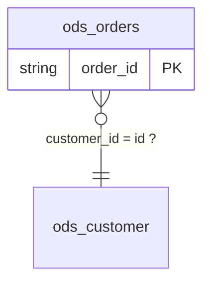

[English](../en/ontology-doc.md) | 中文

# ontology.json / ontology.md 语料级本体候选（ontology-json/1）

`scope-lineage ontology` 扫描一棵语料目录下的所有 `lineage.json`，在
[表卡](tables-doc.md) 与[值词典](glossary-doc.md)之上再回答一个单表回答不了的问题——
**这些表之间是什么关系**：实体（表 + 身份键）、属性（列 + 注释 + 观察到的角色 + 同义列）、
关系（JOIN 键对 + 可证明的基数）、约束（非空 / 枚举 / 每键唯一 / 分区）、以及跨任务的矛盾。

语料里每一个 JOIN 都是一句关于两个实体及其键的断言；每一次「先按 k 去重再关联」都是一句
关于那张表按 k 有多行的断言；每一个封闭 `IN` 列表都是一句关于列值域的断言。本产物把这些
断言收集起来，逐条标注置信层级与证据。

## 定位：本体**候选**，不是业务本体

- 每条断言都带 `tier` 与 `evidence`，可按任务名、`statement_id`、`logic_block_id` 回链到
  某个具体语句；没有证据的断言根本不会被发布。
- Core 不给实体起业务名、不判断类型、不推断父子类、不做业务命名。`naming_hints` 只放元数据
  事实（表注释、业务域、项目、负责人），命名与建模交给懂业务的人或 Agent 确认。
- 槽位刻意对齐常见本体语言（entity ~ owl:Class、attribute ~ owl:DatatypeProperty、
  relation ~ owl:ObjectProperty、constraint ~ sh:NodeShape），`--export` 按这份对应导出
  LinkML 与 SHACL；不产 OWL。
- 稳定性分级与其他派生文档一致：`ontology-json/1` 内键名稳定，中文措辞可能微调，
  机器应读 JSON 而不是 Markdown。

## 用法

```bash
# 语料目录：递归查找 lineage.json，产物写到 --out
scope-lineage ontology --lineage /path/to/corpus --out /path/to/ontology

# 复用已经算好的表卡与值词典（不给就在内存里按同一份语料现场构建）；
# --overrides 合并人工确认，被确认的断言升到第五级 confirmed
scope-lineage ontology --lineage /path/to/corpus --out /path/to/ontology \
  --tables /path/to/tables/tables.json --glossary /path/to/glossary/glossary.json \
  --overrides /path/to/ontology.overrides.json
```

产物三件：

| 文件 | 给谁读 | 内容 |
| --- | --- | --- |
| `ontology.json` | 机器 / RAG / 知识图谱入库 | 主产物，`doc_format: "ontology-json/1"` |
| `ontology.md` | 人 | 索引：Mermaid ER 总览 + 实体表 + 关系表 + 约束表 + 待人工判定表 + 待人工判定清单，`doc_format: "ontology-index-md/1"` |
| `tables/<db.table>.md` | 人 / RAG 按表切块 | 表卡的 6 节之后追加本体 5 节，`doc_format: "ontology-md/1"`；文件名规则与 `scope-lineage tables` 完全一致 |

Python API（消费契约文档，与文件写出同一条路径）：

```python
from scope_lineage import build_ontology, build_semantic_profile, build_table_cards
from scope_lineage import render_ontology_index_markdown, render_ontology_table_card_markdown

profiles = [build_semantic_profile(document) for document in documents]
cards = build_table_cards(profiles, artifact_root="/path/to/corpus")
ontology = build_ontology(documents, profiles, tables=cards, artifact_root="/path/to/corpus")
index = render_ontology_index_markdown(ontology)
card = render_ontology_table_card_markdown(cards["tables"][0], ontology)
```

- `--lineage` 与 `tables` / `glossary` 完全一致：一个 `lineage.json` 或一棵递归查找它的目录树；
  版本不认识的文档在目录模式下跳过并计数。
- `--tables` / `--glossary` 只是省一次重算：给与不给产出字节一致。给了 `--tables` 时，表卡
  以它为底本追加本体节；不给就在内存里按同一份语料构建同样的表卡。
- `--format` 取 `json`、`md` 或两者（默认 `json,md`）；只要 `md` 不在其中，`ontology.md` 与
  `tables/` 都不写。其他值直接报参数错误（退出码 2）。
- `--export` 取 `linkml`、`shacl` 或两者（可重复，也可写成逗号列表），默认什么都不导出；
  与 `--format` 相互独立，详见[导出 LinkML / SHACL](#导出-linkml--shacl)。
- 确定性：同一份语料无论以什么顺序被扫描，产出字节一致。

## 置信五级

| 层级 | md 上的中文 | 定义 | 例 |
| --- | --- | --- | --- |
| `proven` | 已证明 | SQL 里直接写着 | 连接键对存在；分区列；生产任务已证明的键；DIRECT 重命名 |
| `implied` | 可推得 | 由结构可证明的推论 | 任务在 JOIN 前按 k 去重 → 那张表按 k 有多行（否则作者不会去重）；UNION 列对齐 |
| `hypothesis` | 作者假设 | 作者假设，未被 SQL 证明 | 直接以 k 关联物理表 → 假设它按 k 唯一；过滤里出现过的取值集合是否完整 |
| `conflict` | 矛盾 | 跨任务证据矛盾 | T1 按 k 去重、T2 直接按 k 关联同一张表——这是治理发现，不是本体事实 |
| `confirmed` | 已确认 | **只来自人工回写**，语料自己永远产不出这一级 | 业务方在 `ontology.overrides.json` 里确认了某条关系的基数或某张表的身份键 |

## ontology.json 结构

```jsonc
{
  "doc_format": "ontology-json/1",
  "corpus": {"artifact_root": "…", "task_count": 12, "lineage_digests": {"task_a": "…"}},
  "entities": [
    {"id": "ods.customer", "kind": "physical_table",
     "comment": null,
     "identity": {
       "candidate_keys": [{"columns": ["id"], "tier": "hypothesis",
                           "evidence": [{"task": "task_a", "statement_id": "stmt:001",
                                         "kind": "joined_as_right_without_dedup",
                                         "logic_block_id": "logic:ROOT:join:001"}]}],
       "declared_hints": [{"columns": ["id"], "evidence": "column_comment",
                           "text": "customer primary key"}],
       "multiplicity": [{"columns": ["driver_id"], "tier": "implied",
                         "claim": "multiple_rows_per_key", "evidence": [{"kind": "group_by"}]}],
       "partition_columns": ["dt"]},
     "attributes": [
       {"column": "state", "type": "string", "comment": null,
        "observed_roles": ["filter", "output"], "used_in_corpus": true,
        "not_null_observed": false,
        "synonyms": [{"entity": "mart.t", "column": "order_state", "tier": "proven",
                      "via": "direct_rename", "evidence": [{"task": "task_a"}]}]}],
     "naming_hints": {"table_comment": null, "domain": null, "project": null, "owner": null}}
  ],
  "relations": [
    {"id": "rel:001",
     "from": {"entity": "ods.driver", "columns": ["id"]},
     "to": {"entity": "ods.pay", "columns": ["driver_id"]},
     "kind": "join_association",
     "cardinality": {"claim": "one_to_many", "tier": "implied", "basis": "group_by"},
     "join_types": ["LEFT_OUTER"], "task_count": 1,
     "evidence": [{"task": "task_a", "statement_id": "stmt:001",
                   "scope_id": "ROOT", "logic_block_id": "logic:ROOT:join:001"}]}
  ],
  "constraints": [
    {"target": {"entity": "ods.orders", "column": "state"}, "kind": "in_set",
     "tier": "proven", "values": ["NEW", "PAID"], "completeness": "complete",
     "evidence": [{"task": "task_a", "statement_id": "stmt:001", "context": "filter_in"}]}
  ],
  "findings": [
    {"kind": "cardinality_conflict", "entity": "ods.pay", "columns": ["driver_id"],
     "tasks": {"multiple_rows_per_key": ["task_a"], "assumed_unique": ["task_b"]},
     "text": "…"},
    {"kind": "competing_candidate_keys", "entity": "ods.pay",
     "columns": ["driver_id", "dt"],
     "keys": [{"columns": ["driver_id"], "evidence": [{"task": "task_a"}]},
              {"columns": ["driver_id", "dt"], "evidence": [{"task": "task_b"}]}],
     "tasks": {"assumed_unique": ["task_a", "task_b"]}, "text": "…"}
  ],
  "open_items": [
    {"id": "open:key:ods.customer=id", "kind": "candidate_key",
     "entity": "ods.customer", "columns": ["id"], "tier": "hypothesis",
     "write_back": "键:ods.customer=id", "text": "…"}
  ],
  "overrides_applied": {"relations": 0, "keys": 0, "unmatched": [],
                        "ignored_fields": []}
}
```

槽位说明（`ontology-json/1` 的全部槽位）：

| 槽位 | 取值 | 含义 |
| --- | --- | --- |
| `corpus` | `artifact_root` / `task_count` / `lineage_digests` | 与表卡同一个语料块：扫描根、任务数、每个任务的 lineage 指纹 |
| `entities[].kind` | `physical_table` / `produced_table` | 语料内有生产任务的是 `produced_table` |
| `entities[].comment`、`naming_hints` | 表注释 / 业务域 / 项目 / 负责人 | 元数据原样透传，Core 不据此推断任何业务语义 |
| `entities[].identity.candidate_keys[]` | `columns` + `tier` + `evidence` | 生产任务证明的键（`producer_key_confidence`）与消费任务假设的键（`joined_as_right_without_dedup`）并列，不合并成「主键」 |
| `entities[].identity.candidate_keys[].scope_columns` | 列名列表 | H2：该键只在这组列的同一取值内唯一（快照表的常态）；只可能来自人工确认 |
| `entities[].identity.declared_hints[]` | `columns` + `evidence: column_comment` + `text` | H3：列注释把某列称作主键/唯一键，原样透传；它是元数据线索而不是候选键，与某个候选键一致时把那个键从 `hypothesis` 抬到 `implied` |
| `entities[].identity.multiplicity[]` | `claim: multiple_rows_per_key` | O3：某任务按这组键对该表做过 GROUP BY 或窗口 partition |
| `entities[].identity.partition_columns` | 列名列表 | 生产任务写入时的分区列（元数据事实） |
| `entities[].attributes[].type`、`comment` | 元数据 | 表卡里的列类型与列注释，原样透传 |
| `entities[].attributes[]` | 每个元数据声明的列一条 | 属性覆盖整张表，不只是语料读写过的那几列；表卡的 `columns[]` 是什么顺序，属性就是什么顺序 |
| `entities[].attributes[].observed_roles` | `filter`、`partition_filter`、`join_key`、`group_by`、`window_partition`、`window_order`、`output` | 表卡记录的消费用法，没人读过的列是空列表 |
| `entities[].attributes[].used_in_corpus` | `true` / `false` | 本语料有没有写过或读过这一列；`false` 配空 `observed_roles`，读作「元数据声明了、语料没碰过」 |
| `entities[].attributes[].not_null_observed` | `true` / `false` | 语料里有任务用 `NOT x IS NULL` 过滤过这一列 |
| `entities[].attributes[].synonyms[].via` | `direct_rename` / `union_alignment` | O5：同一个值的两个列名 |
| `relations[].id` | `rel:NNN` | 排序后编号，同一份语料稳定 |
| `relations[].kind` | `join_association` / `union_sibling` | JOIN 键对，或同一 UNION 的兄弟分支 |
| `relations[].cardinality.claim` | `one_to_many` / `many_to_one` / `many_to_one_assumed` / `one_to_one_assumed` / `unknown` | O2，方向为 `from` → `to`；`one_to_one_assumed` 只可能来自人工确认 |
| `relations[].cardinality.tier` | 五级之一 | 该基数断言的置信层级 |
| `relations[].cardinality.basis` | `group_by` / `ranking_window` / `producer_key_confidence` / `right_side_not_deduplicated` / `union_branch_alignment` / `no_uniqueness_evidence` / `human_confirmation` | 该基数断言的依据 |
| `relations[].join_types`、`task_count` | JOIN 类型并集、任务数 | 同一对实体在不同任务里的 JOIN 类型合并 |
| `relations[].evidence[].left_via_scopes` | scope id 列表 | JOIN 某一侧是 CTE 时，穿透到物理表所经过的 scope（右侧为 `right_via_scopes`） |
| `constraints[].kind` | `not_null` / `in_set` / `unique_per` / `partition` | O6 |
| `constraints[].values`、`completeness` | 取值列表、`complete` / `unknown` | 仅 `in_set`：只有封闭 `IN` 列表或穷尽 CASE 才是 `complete` |
| `constraints[].columns` | 列名列表 | 仅 `unique_per`：候选键 + 分区列 |
| `constraints[].note` | 一句话 | 仅 `not_null`：「任务用过滤丢弃了 NULL，源表本身可能仍含 NULL」 |
| `findings[].kind` | `cardinality_conflict` / `competing_candidate_keys` / `key_hint_conflict` / `producer_key_conflict` / `ambiguous_bare_name` | O7 与 O8，最后两者由表卡透传 |
| `findings[].tasks` | 角色 → 任务名列表 | 矛盾的两边分别是哪些任务 |
| `findings[].keys[]` | 两组 `columns` + `evidence` | 仅 `competing_candidate_keys`：互相竞争的两组候选键各自的列与证据 |
| `open_items[]` | `id` / `kind` / `entity` / `relation` / `columns` / `tier` / `write_back` / `text` | H5：整份语料的待人工判定清单，一个 `hypothesis` 候选键、一条 `hypothesis` 关系或一条 finding 各一条；关系只出现一次，不按两端各一次 |
| `open_items[].id` | `open:key:<表>=<列+列>` / `open:rel:<关系回写键>` / `open:finding:<kind>:<表>=<列>` | 由内容派生，同一个问题在下一轮仍是同一个 id |
| `open_items[].kind` | `candidate_key` / `relation` / `finding` | 数组顺序就是建议的回答顺序：发现 → 关系（按 `task_count` 降序）→ 候选键 |
| `open_items[].write_back` | `键:<表>=<列+列>` / `关系:<回写键>` / `null` | 答案落回 `ontology.overrides.json` 的目标；跨任务矛盾没有单一目标，写 `null` |
| `overrides_applied` | `relations` / `keys` / `unmatched` / `ignored_fields` | 本次合并了几条人工确认，哪些确认在语料里找不到对应项，以及哪些字段本版本读不懂 |

## 推断规则

| 规则 | 内容 |
| --- | --- |
| O1 关系边 | JOIN 的 `join_key_pairs` 按（左表, 右表）归组成边；CTE 侧用 R3 的驱动路径穿透到物理表并记录穿透路径；UNION 分支两两成 `union_sibling`，列按位置对齐 |
| O2 基数 | 右侧在 JOIN 前按连接键 GROUP BY / 排名窗口去重 → `one_to_many`（`implied`）；右侧物理表且某生产任务已证明该键唯一 → `many_to_one`（`proven`）；直接关联物理表 → `many_to_one_assumed`（`hypothesis`）；其余 `unknown` |
| O3 多行性 | 任一任务对表 T 按键集 K 做 GROUP BY 或窗口 partition → T 按 K 有多行（`implied`）；键集跨两张表时不做任何断言 |
| O5 同义 | `end_to_end_lineage` 的 DIRECT 且列名不同 → `direct_rename`（`proven`）；UNION 同位置列名不同 → `union_alignment`（`implied`）；两端互相登记 |
| O6 约束 | `NOT x IS NULL` 过滤 → `not_null`（`hypothesis`，附注「任务丢弃了 NULL，源表可能仍含 NULL」）；可枚举 code → `in_set`；分区列 → `partition`（`proven`）；产出表候选键 + 分区列 → `unique_per`（键置信 `proven` → `proven`，`candidate` → `hypothesis`）。**同一条断言只发一条**：（实体, kind, columns/values）相同的约束合并成一条，`tier` 取其中最强的一级、`evidence[]` 按语料顺序求并——一张表被两个任务按同一键集写出时，那是同一条约束被证明了两次，不是两条约束 |
| O7 冲突 | 同一（表, 键集）上「去重」与「直接关联」并存 → `cardinality_conflict`；同一张表上两组 `hypothesis` 候选键互为真子集或互不相交 → `competing_candidate_keys`（至多一组是身份键）；表卡的 `producer_key_conflict` 与 `ambiguous_bare_name` 原样透传 |
| O8 元数据键线索 | 列注释含 `主键` / `唯一键` / `唯一编号` / `主键id` / `primary key` / `unique`（忽略大小写）→ `declared_hints`；线索与某个 `hypothesis` 候选键一致（线索列 ⊆ 键列）→ 该键升到 `implied`（注释与结构两个独立来源指向同一列）；候选键全是 `hypothesis` 且都不含线索列 → `key_hint_conflict` |

## 每表卡片：表卡之后追加的五节

`ontology --out <dir>` 写出的 `<dir>/tables/<db.table>.md` 就是 `scope-lineage tables` 的表卡
（1 这张表是什么 / 2 一行代表什么 / 3 字段 / 4 谁生产 / 5 谁消费 / 6 治理线索），在它之后追加：

| 节 | 内容 |
| --- | --- |
| 7. 身份（本体） | 开头一行「属性 N（语料用到 n）」，与 `ontology.md` 实体表的「属性」列同一口径；其后候选键、元数据键线索、多行性、分区列四者并列，逐条带中文层级与证据 id；已确认的键在同一行打印确认人、确认日期与依据，带 `scope_columns` 的键读作「在 `dt` 内唯一」；四者回答四个不同问题，永不合并成「主键」 |
| 8. 关系 | 出边、入边各一张表：对端（链到对端卡片）、键对、JOIN 类型、基数 claim、层级、依据 token 的人话翻译、任务数、证据 id |
| 9. 约束 | SHACL 风格清单：约束种类、目标列或整表、值集与完整性、层级、证据 |
| 10. 属性同义 | 本表列 ↔ 同义列、依据（改名投影 / UNION 同位置）、层级、证据 |
| 11. 待人工判定 | 该表相关的 findings，加上所有 `hypothesis` 断言（候选键 / 基数 / 约束），每条标 `[待确认]`、给出回写目标字符串，并引用 `open_items[]` 里的清单 id |

文件名规则与 `tables` 完全一致（`<db.table>.md`，文件系统不接受的字符换成 `_`），因此一份语料
可以先跑 `tables` 再跑 `ontology`，后者原地覆盖前者的卡片目录，卡片之间的相对链接仍然成立。

## Mermaid ER 映射规则

`ontology.md` 的第一节是一个 `erDiagram` 代码块。实体名是 Mermaid 标识符，所以把实体 id 里
除 `[A-Za-z0-9_]` 以外的字符（包括 `.` 与 `-`）全部换成 `_`；两个不同实体压平成同一个名字时，
后者按语料自身的排序加数字后缀，绝不合并成一个框。实体表里的「图中 id」列给出这张对照表。
实体框里只列候选键列并标 `PK`，没有候选键的实体裸声明（不写空的 `{}`）。

| 基数 claim | ER 符号 | 读法 |
| --- | --- | --- |
| `one_to_many` | `\|\|--o{` | 左边一行对右边多行 |
| `many_to_one` | `}o--\|\|` | 左边多行对右边一行（已由某生产任务证明） |
| `many_to_one_assumed` | `}o--\|\|` | 同上，但只是作者假设 |
| `one_to_one_assumed` | `\|\|--\|\|` | 一对一，只可能来自人工确认 |
| `unknown` | `}o--o{` | 没有唯一性证据，也包括 `union_sibling` 边 |

边标签写连接键（`a = b`，多列逗号分隔）；`hypothesis` 层级的边在标签末尾加 `?`，命中
`cardinality_conflict` 的边加 `!`。实体数超过 60 时按「关系度数」取前 60 个实体，图上方写明
省略了多少个，完整清单仍在实体表里。



## 人工确认回写：ontology.overrides.json

`待人工判定` 里的每一条都是一个问题，问题答完就不该再被问第二遍。Agent 按
`skills/scope-lineage/references/ontology-review-prompt.md` 把这些项整理成业务方能答的问题
清单，答案合并进 `ontology.overrides.json`，再用 `--overrides` 跑一次：

```json
{
  "relations": {
    "ods.orders.customer_id->ods.customer.id": {
      "cardinality": "many_to_one",
      "basis": "two tasks join on this key set",
      "confirmed_by": "王某",
      "date": "2026-09-19"
    }
  },
  "keys": {
    "ods.customer": {
      "columns": ["id"],
      "scope_columns": ["dt"],
      "basis": "the column comment names it the primary key",
      "note": "a snapshot table: one full copy per partition",
      "confirmed_by": "王某",
      "date": "2026-09-19"
    }
  }
}
```

| 槽位 | 取值 | 含义 |
| --- | --- | --- |
| `relations` 的键 | `<from 实体>.<列+列>-><to 实体>.<列+列>` | 与卡片「待人工判定」里打印的回写目标字符串逐字一致，照抄即可 |
| `relations[].cardinality` | 五种 claim 之一 | 确认后的基数；不写就沿用语料原来的 claim，只把层级升到 `confirmed` |
| `keys` 的键 | 实体 id | 该表的身份键；语料没猜到的键也可以直接新增 |
| `keys[].columns` | 列名列表 | 构成身份的列集合，顺序即卡片上的展示顺序；每一列都必须是该实体的属性（声明的或语料用过的），否则整条不合并 |
| `keys[].scope_columns` | 列名列表 | 该键只在这组列的同一取值内唯一（快照表的常态）；卡片渲染成「在 `dt` 内唯一」 |
| `confirmed_by`、`date` | 自由文本 | 谁在什么时候确认的，原样写进证据 |
| `basis`、`note` | 自由文本 | 确认的依据与备注，与 `confirmed_by` / `date` 并列发布；`basis` 发布成 `confirmed_basis`——基数上的 `basis` 是机器 token，一个槽位不能同时装词表和句子 |
| `overrides_applied.unmatched` | `{"key": …, "reason": …}` 列表 | 在语料里找不到对应项的确认——不丢弃，列出来让复核的人看见；`reason` 取 `unknown_entity: X` / `unknown_column: X` / `missing_columns` / `unknown_relation` / `unparsable_key` |
| `overrides_applied.ignored_fields` | `{"key": …, "fields": ["…"]}` 列表 | 本版本读不懂的字段（多半是拼错的槽位名）——列出来而不是悄悄丢掉 |

合并后这些断言的 `tier` 变成 `confirmed`、`basis` 变成 `human_confirmation`，证据里多一条
`{"kind": "human_confirmation", "confirmed_by": …, "date": …, "confirmed_basis": …, "note": …}`。`confirmed` 是唯一一个语料
自己永远产不出的层级。语料本身的 `findings` 不会被确认消音：矛盾是否还存在，要等语料重新解析
后由 O7 重新判定。

## 与 OWL / SHACL / LinkML 的槽位对应

JSON 已带全部信息，导出器（`--export linkml,shacl`，见下一节）只是薄薄一层。槽位刻意按下表
对齐，就是为了那一层落地时不需要改本文件的结构；OWL 一列目前只是对应关系，没有导出器：

| ontology.json | OWL / RDFS | SHACL | LinkML |
| --- | --- | --- | --- |
| `entities[]` | `owl:Class` | `sh:NodeShape` | `class` |
| `entities[].attributes[]` | `owl:DatatypeProperty` | `sh:property` + `sh:datatype` | `attribute` / `slot` |
| `relations[]` | `owl:ObjectProperty`（+ 基数公理） | `sh:property` + `sh:class` + `sh:maxCount` | 带 `range` 的 slot |
| `constraints[].kind = in_set` / `not_null` | — | `sh:in` / `sh:minCount` | `enum` / `required` |
| `constraints[].kind = unique_per` | — | 无原生唯一约束，需 SPARQL 约束 | `unique_keys` |
| `tier` / `evidence` | 标注属性（`rdfs:comment` 或自定义 annotation） | 标注 | `annotations` |

## 导出 LinkML / SHACL

`--export` 把上表落地成文件。这一层是**改名，不是重新推断**：JSON 已经带全部信息，导出器只是
把槽位翻译成另一套词汇；导出里出现了 JSON 没有的话，那是 bug。

```bash
# 与 ontology.json 并排写出 ontology.linkml.yaml 和 ontology.shacl.ttl
scope-lineage ontology --lineage /path/to/corpus --out /path/to/ontology \
  --export linkml,shacl

# --export 可重复，且与 --format 相互独立：只写 json 也照样导出
scope-lineage ontology --lineage /path/to/corpus --out /path/to/ontology \
  --format json --export linkml --export shacl
```

| 文件 | 目标格式 | 内容 |
| --- | --- | --- |
| `ontology.linkml.yaml` | LinkML schema | 一个实体一个 class，一个属性一个 slot，一个已封闭值集一个 enum |
| `ontology.shacl.ttl` | SHACL（Turtle） | 一个实体一个 `sh:NodeShape`，一条断言一个 `sh:property` |

默认什么都不导出；`--export` 只认 `linkml` 与 `shacl`，其他值直接报参数错误（退出码 2）。
两种格式都由本仓库自己的确定性写出器直接生成文本，**不引入任何新的运行时依赖**；同一份语料
跑两次字节一致，与 `ontology.json` 的确定性同源。

### 槽位怎么落地

| ontology.json | LinkML | SHACL |
| --- | --- | --- |
| `entities[]` | `class`，id 与 Mermaid ER 用同一套安全标识符，原表名放 `title` | `sh:NodeShape` + `sh:targetClass`，原表名放 `rdfs:label` |
| `entities[].attributes[]` | `attributes` 下的 slot，`range` 按 SQL 类型映射，`description` 取列注释 | `sh:property` + `sh:path` + `sh:datatype` |
| 单列且 `proven` / `confirmed` 的候选键 | slot 上 `identifier: true` | 无原生形式，见下方限制 |
| 其余候选键（多列，或未被证明） | `unique_keys` 条目，层级放 `annotations.tier` | `sl:candidateKey` 注解块 |
| `relations[]` | 源 class 上的一个 slot，`range` 是目标 class，`multivalued` 由基数决定 | `sh:property` + `sh:class`（多对一再加 `sh:maxCount 1`） |
| `constraints[].kind = not_null` | slot 上 `required: true` | `sh:minCount 1` |
| `constraints[].kind = in_set`（已封闭） | 一个 `enum`，slot 的 `range` 指向它 | `sh:in ( … )` |
| `constraints[].kind = in_set`（未封闭） | 只写注解，不造 enum | 只写 `rdfs:comment` |
| `constraints[].kind = unique_per` | `unique_keys` 条目 | `sl:compositeKey` 注解块，见下方限制 |
| `constraints[].kind = partition` | slot 上的一条注解 | 只带 `rdfs:comment` 的 `sh:property` |
| `tier` | `annotations.tier` | `sl:tier` |

SQL 类型按下表映射，带参数的类型只看头部：`decimal(18,2)` 当 `decimal`，`map<string,string>`
当 `map`。认不出来的类型落到 `string`，而不是把这一列丢掉——语料多半不知道物理表的类型。

| SQL 类型 | LinkML `range` | SHACL `sh:datatype` |
| --- | --- | --- |
| `string` / `varchar` / `char` / 其他 | `string` | `xsd:string` |
| `tinyint` / `smallint` / `int` / `bigint` | `integer` | `xsd:integer` |
| `decimal` / `numeric` | `float` | `xsd:decimal` |
| `float` / `double` / `real` | `float` | `xsd:double` |
| `date` | `date` | `xsd:date` |
| `timestamp` | `datetime` | `xsd:dateTime` |
| `boolean` | `boolean` | `xsd:boolean` |

### 层级不会在导出里丢失

每个由断言得到的元素都带着它的层级：LinkML 里是 `annotations.tier`，SHACL 里是 `sl:tier`。

```yaml
      channel_code:
        range: "string"
        annotations:
          tier: "proven"
          key_tier: "hypothesis"
```

```turtle
    sh:property [
        sh:path sl:rel_001 ;
        sh:class sl:dim_channel ;
        sh:maxCount 1 ;
        sl:relation "rel:001" ;
        sl:claim "many_to_one_assumed" ;
        sl:taskCount 2 ;
        sl:tier "hypothesis"
    ] ;
```

实体与属性本身带 `proven`：它们不是推断出来的，是语料从 SQL 里读到的名字。关系带的是它那条
基数的层级，约束带的是约束自己的层级。

### 限制：刻意不迁就目标格式

- **SHACL core 没有组合唯一约束。** `unique_per` 与候选键都是「这几列的组合唯一」，SHACL core
  没有对应的约束组件（要表达得上 `sh:sparql`，那是另一套方言、另一套运行时）。所以它们发布成
  `sl:compositeKey` / `sl:candidateKey` 注解块，并在 `rdfs:comment` 里把这条限制写明，而不是
  退一步去校验一个更弱的东西。
- **未封闭的值集不产 enum。** `completeness: "unknown"` 的意思是语料只观察到这些取值、没能
  证明集合封闭；把它写成 enum 就是把观察冒充成事实。两种格式都只写注解，并列出观察到的取值。
- **约束在导出里的 id 是位置号。** `ontology.json` 的约束没有自己的 id，导出按它在
  `constraints[]` 里的位置编号成 `cst:001`…；那个数组本来就是确定性排序的，所以位置就是稳定
  身份。
- **基 IRI 是占位符**（`https://example.org/scope-lineage/ontology#`）。语料没有自己的命名空间，
  编一个看起来权威的出来就是导出在编事实；入图的人把它换成自己的。
- **不导出的部分**：`findings`、`open_items`、`evidence`、`naming_hints` 的
  `domain` / `project` / `owner`，以及 `identity.declared_hints`、`identity.multiplicity`
  和属性的 `synonyms`，都留在 `ontology.json` 里——它们是给人复核的治理与元数据信息，
  不是 schema。
- **不产 OWL。** 三种目标里只有 OWL 需要为「基数公理」这类断言额外选一套本体论承诺，这件事
  不该由导出器替使用者决定。

## 与 tables / glossary 的关系

三个语料级产物层层叠加，回答三个不同的问题，不要互相替代：

- [`tables`](tables-doc.md) 回答「**这张表是什么**」：谁写它、一行代表什么、谁读它读了哪些列。
  本体的实体、属性、候选键、分区列全部来自表卡，所以 `--tables` 给与不给结果一致。
- [`glossary`](glossary-doc.md) 回答「**这个取值是什么意思**」：注释跨表归并、常量值域观察、
  已被证明封闭的枚举。本体的 `in_set` 约束就是词典的可枚举 code，`completeness` 直接沿用词典
  的 `closed_set` 判定，所以 `--glossary` 给与不给结果也一致。
- `ontology` 回答「**这些表之间是什么关系**」：关系边、基数、多行性、同义、跨任务矛盾。
  这是第一个必须跨任务才能得到的结论——单个任务的 `describe` 永远算不出来。

三者共用同一次语义 profile：CLI 里一份语料只解析一遍、只 profile 一遍。

## 确定性与 golden

- 同一份语料跑两次、以任意顺序跑，`ontology.json`、`ontology.md` 与每张卡片都字节一致；
  `tests/core/test_ontology_properties.py` 把这一条连同「没有编造的名字」「每条非 proven 断言
  都带层级与可解引用的证据」一起作为属性测试。
- `tests/core/fixtures/ontology/` 锁定一份 5 任务语料的完整产物（`ontology.json`、含 ER 的
  `ontology.md`、三张合并后的表卡），任何措辞或排序改动都会在 golden 上显形。

## 边界与后续

- `--export` 只产 LinkML 与 SHACL；OWL 仍然只有槽位对应，没有导出器。
- 不做向量化、不入库、不调 LLM、不含业务词表——那些属于下游项目。
- 跨语料增量（复用 `.scope-lineage-index.json` 指纹）是后续工作，本轮每次都是全量重算。
