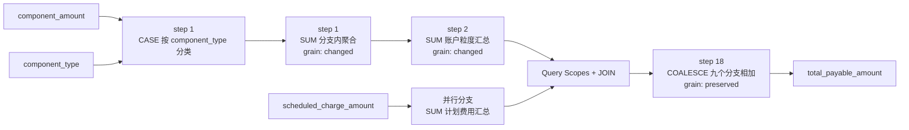
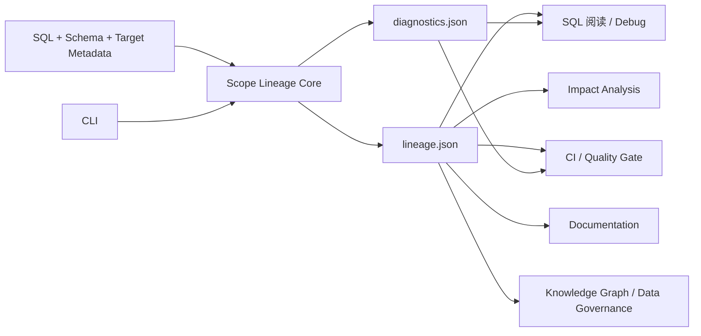

# Scope Lineage：把复杂 SQL 还原成可验证的字段加工链

Scope Lineage 追踪字段来源，也还原字段经过的查询层、`JOIN`、`CASE`、聚合和表达式。每条血缘结论都带有可回查的证据、完整性状态和诊断信息。

> SQL lineage you can inspect, trace, and verify.

## 1. 复杂 SQL 真正难回答的问题

仓库中有一份经过完整脱敏的数仓任务。它保留了真实任务的复杂结构，所有表名、字段名、常量、注释、任务信息和样例数据均为公开的合成内容。

完整 SQL 已公开在 GitHub：[`examples/sql/subscription_account_snapshot.sql`](https://github.com/realyin/scope-lineage/blob/main/examples/sql/subscription_account_snapshot.sql)（604 行，约 24 KB）。下面的复杂度统计、字段加工链和 JSON 片段都来自这份 SQL 的实际解析结果。

| 结构 | 数量 |
| --- | ---: |
| 物理源表 | 19 |
| JOIN | 20 |
| 子查询 | 23 |
| 聚合函数 | 57 |
| CASE WHEN | 10 |
| 窗口函数 | 1 |
| 目标字段 | 112 |

现在有一个很具体的问题：

> 目标表里的 `total_payable_amount` 数值异常，它到底由哪些原始字段计算出来，中间经过了什么，应该从哪里开始查？

在根查询中，只能看到九个中间字段相加：

```sql
COALESCE(t7.upcoming_base_charge, 0)
+ COALESCE(t7.past_due_base_charge, 0)
+ COALESCE(t7.open_receivable_amount, 0)
+ COALESCE(t17.subscription_scheduled_charge, 0)
+ ...
```

继续进入 `t7`，其中一个中间字段又来自两层聚合：

```sql
-- 第一层：按费用类型分类
SUM(
  CASE WHEN component_type IN ('PENDING_BASE_CHARGE')
       THEN component_amount END
) AS accrued_base_charge

-- 第二层：回到账户粒度再次汇总
SUM(b.accrued_base_charge) AS accrued_base_charge
```

另一个分支来自 `t17`：

```sql
SUM(scheduled_charge_amount) AS subscription_scheduled_charge
```

人工分析需要同时回答六个问题：

1. `t7`、`t17` 最终对应哪些物理表；
2. 九个中间字段分别来自哪些原始字段；
3. 每个字段穿过了哪些子查询和别名；
4. 哪些 `CASE` 条件决定金额进入某个分支；
5. 两层 `SUM` 和后续 `JOIN` 是否改变数据粒度；
6. 当前 Schema 是否足以证明整条路径，解析过程中有没有证据缺口。

普通表级血缘只能回答任务读了哪些表。简单的字段依赖边可以回答最终字段引用了哪些字段。真正的排查还需要查询层、表达式、聚合粒度和完整性证据。

## 2. 工具直接输出什么

Scope Lineage 解析任务后直接生成两个文件：

```text
lineage.json       # SQL 已经证明的血缘和加工事实
diagnostics.json   # 完整性、告警和证据缺口
```

与这个字段有关的内容主要位于：

```text
lineage.json
└── statement_lineage.<statement-id>
    ├── end_to_end_lineage[]
    └── field_mapping_chains[]
        └── ordered_steps[]

diagnostics.json
├── analysis_status
├── warnings[]
├── lineage_fact_gaps[]
└── metadata_coverage
```

下面的 JSON 均来自这份脱敏任务的真实产物。为了控制篇幅，示例删除了与当前字段无关的同级字段，保留的字段名和字段值没有改写。

### `lineage.json`：目标字段和根物理字段

`end_to_end_lineage` 直接给出目标字段、最终表达式、根物理字段和追踪完整性：

```json
{
  "column": "total_payable_amount",
  "transform": "EXPRESSION",
  "expression": "COALESCE(`t7`.`upcoming_base_charge`, 0) + COALESCE(`t7`.`past_due_base_charge`, 0) + COALESCE(`t7`.`open_receivable_amount`, 0) + COALESCE(`t7`.`accrued_penalty_charge`, 0) + COALESCE(`t7`.`accrued_late_charge`, 0) + COALESCE(`t17`.`subscription_scheduled_charge`, 0) + COALESCE(`t7`.`accrued_service_charge`, 0) + COALESCE(`t7`.`accrued_support_charge`, 0) + COALESCE(`t7`.`accrued_base_charge`, 0)",
  "trace_complete": true,
  "physical_sources": [
    {
      "table": "demo_ods.billing_balance_component",
      "column": "component_amount",
      "transform": "AGGREGATE"
    },
    {
      "table": "demo_ods.billing_balance_component",
      "column": "component_type",
      "transform": "AGGREGATE"
    },
    {
      "table": "demo_ods.subscription_charge_schedule",
      "column": "scheduled_charge_amount",
      "transform": "AGGREGATE"
    }
  ],
  "target_field_resolution": "ddl_position",
  "target_field_corrected": false
}
```

这段输出直接回答了两个问题：最终值依赖三个物理字段，整条追踪已经完成。`component_type` 也出现在根字段中，因为它决定 `component_amount` 进入哪个费用分支。

### `lineage.json`：字段加工步骤

`field_mapping_chains` 保存完整加工链。下面先展示链本身的状态：

```json
{
  "chain_id": "chain:ROOT:total_payable_amount:position:92",
  "target_field": "total_payable_amount",
  "chain_status": "resolved",
  "trace_status": "complete",
  "source_kind": "physical",
  "root_source_fields": [
    "demo_ods.billing_balance_component.component_amount",
    "demo_ods.billing_balance_component.component_type",
    "demo_ods.subscription_charge_schedule.scheduled_charge_amount"
  ],
  "missing_reasons": []
}
```

同一条链的 `ordered_steps` 一共有 18 项。下面抽取第 1、2、18 步，字段和值均来自原始数组：

```json
[
  {
    "step_no": 1,
    "scope_id": "subq:b_2",
    "step_type": "aggregate",
    "input_fields": [
      "demo_ods.billing_balance_component.component_amount",
      "demo_ods.billing_balance_component.component_type"
    ],
    "output_field": "subq:b_2.accrued_base_charge",
    "expression_sql": "SUM(CASE WHEN `billing_balance_component`.`component_type` IN ('PENDING_BASE_CHARGE') THEN `billing_balance_component`.`component_amount` END)",
    "transform": "AGGREGATE",
    "grain_effect": "changed"
  },
  {
    "step_no": 2,
    "scope_id": "subq:t7",
    "step_type": "aggregate",
    "input_fields": [
      "subq:b_2.accrued_base_charge"
    ],
    "output_field": "subq:t7.accrued_base_charge",
    "expression_sql": "SUM(`b`.`accrued_base_charge`)",
    "expanded_expression": "SUM((SUM(CASE WHEN `demo_ods.billing_balance_component`.`component_type` IN ('PENDING_BASE_CHARGE') THEN `demo_ods.billing_balance_component`.`component_amount` END)))",
    "transform": "AGGREGATE",
    "grain_effect": "changed"
  },
  {
    "step_no": 18,
    "scope_id": "ROOT",
    "step_type": "expression",
    "input_fields": [
      "subq:t7.accrued_base_charge",
      "subq:t7.accrued_support_charge",
      "subq:t7.accrued_service_charge",
      "subq:t17.subscription_scheduled_charge",
      "subq:t7.accrued_late_charge",
      "subq:t7.accrued_penalty_charge",
      "subq:t7.open_receivable_amount",
      "subq:t7.upcoming_base_charge",
      "subq:t7.past_due_base_charge"
    ],
    "output_field": "demo_mart.subscription_account_snapshot.total_payable_amount",
    "transform": "EXPRESSION",
    "grain_effect": "preserved"
  }
]
```

这里已经能看到加工过程的关键事实：第一层按费用类型做条件聚合，第二层跨查询作用域再次聚合，根查询最后合并九个中间字段。`scope_id` 用来定位查询块，`expanded_expression` 把中间别名展开回物理字段，`grain_effect` 标记这一层是否改变粒度。

### `diagnostics.json`：这条结果能否使用

```json
{
  "analysis_status": {
    "status": "complete",
    "blocking_reasons": []
  },
  "warnings": [],
  "lineage_fact_gaps": [],
  "metadata_coverage": {
    "referenced_table_count": 20,
    "covered_table_count": 20,
    "missing_table_count": 0,
    "metadata_conflicts": []
  }
}
```

这份诊断说明任务分析完整，20 张被引用的表全部有元数据覆盖，没有告警、事实缺口和元数据冲突。这里的 20 张表包含 19 张源表和 1 张目标表。

## 3. 从直接产物到可读的加工链

上一节的 JSON 是工具直接输出的契约产物。下面的图是依据 `physical_sources` 和 `ordered_steps` 生成的可读展示，用来帮助人快速理解。当前 CLI 输出 JSON，不直接生成这张图。



JSON 字段与使用者问题之间的关系如下：

| 使用者要回答的问题 | 直接读取的输出字段 | 当前案例的答案 |
| --- | --- | --- |
| 最终值来自哪里 | `end_to_end_lineage[].physical_sources` | 3 个根物理字段 |
| 最终表达式是什么 | `end_to_end_lineage[].expression` | 9 个费用分支经过 `COALESCE` 后相加 |
| 中间经过哪些查询层 | `field_mapping_chains[].ordered_steps[].scope_id` | `subq:b_2 → subq:t7 → ROOT` 等并行路径 |
| 每层做了什么 | `step_type`、`expression_sql`、`expanded_expression` | 条件聚合、再次汇总、根查询表达式 |
| 哪一层改变了粒度 | `grain_effect` | 两层聚合为 `changed`，最终表达式为 `preserved` |
| 路径是否完整 | `trace_complete`、`trace_status`、`missing_reasons` | `true`、`complete`、空数组 |
| 整个任务有没有证据问题 | `diagnostics.json` | 0 warning、0 fact gap、元数据覆盖 20/20 |

这类结果属于 **Transformation Lineage（加工血缘）**：字段来源、查询作用域、转换表达式和粒度变化共同组成完整路径。

它也属于 **Verifiable Lineage（可验证血缘）**。每个结论都有四部分：

```text
Claim + Evidence + Completeness + Diagnostics
结论  + 证据     + 完整性       + 诊断
```

当 SQL 或元数据无法证明某个关系时，工具会把缺少的事实、受影响字段和最终影响写入 diagnostics。候选关系不会被直接记录为确定事实。

| 常见的字段血缘结果 | Scope Lineage |
| --- | --- |
| 输出 `A.a → B.b` | 保留根字段、查询层和完整加工步骤 |
| 关注最终依赖关系 | 同时记录中间字段和跨作用域传递 |
| 提供最终关系 | 同时提供原始表达式、展开表达式和粒度变化 |
| 可信度需要自行判断 | 提供完整性状态、缺失原因和 diagnostics |
| 主要描述字段值 | 还能描述行存在性和多语句表状态 |

## 4. 这些输出怎样帮助排查

假设 `total_payable_amount` 的数值出现异常，可以把排查动作直接对应到产物中的证据：

| 排查动作 | 依据的直接输出 | 能定位的问题 |
| --- | --- | --- |
| 检查原始金额 | `physical_sources` 中的 `component_amount`、`scheduled_charge_amount` | 源数据金额异常 |
| 检查费用分类 | step 1 的 `expression_sql` | `component_type` 是否进入正确分支 |
| 检查第一层聚合 | step 1 的 `scope_id`、`grain_effect=changed` | 分支内遗漏、重复或分组错误 |
| 检查第二层汇总 | step 2 的 `input_fields`、`expanded_expression` | 中间别名实际展开成什么、是否重复汇总 |
| 检查查询层关联 | `scopes.*.logic_blocks[].join_relation_detail` | JOIN key 或关联粒度是否造成重复和丢失 |
| 检查最终加总 | step 18 的 `input_fields` 和 `expression` | 九个分支是否缺项、重复、空值处理错误 |
| 判断血缘能否作为证据 | `trace_status`、`missing_reasons`、`diagnostics.json` | 路径是否完整、还缺什么元数据 |

这张表也说明了加工血缘的实际价值。一条最终依赖边只能把排查人员带到源表；`ordered_steps` 可以继续把人带到具体查询块和具体表达式。

当前案例中，`chain_status=resolved`、`trace_status=complete`、`missing_reasons=[]`，任务级 diagnostics 也没有告警和事实缺口。因此这条路径可以直接用于排查。

如果 `trace_status` 为 `partial`，处理顺序会发生变化：先读取 `missing_reasons` 和 `lineage_fact_gaps`，补充缺少的 Schema 或目标 DDL，再使用加工链做结论。工具把这个限制明确写进产物，使用者能够区分“SQL 已经证明的事实”和“仍需补充证据的部分”。

## 5. 这些 SQL 事实还能用来做什么

解释字段和排查数据是最直接的使用方式。稳定的 JSON 产物还可以进入工程化流程。

### 影响分析

批量解析任务后，可以按物理表、物理字段、字段用途和任务依赖建立反向索引。上游字段改名、类型调整或表下线时，平台可以找到直接使用该字段计算、关联、过滤和分组的任务。

**一个具体场景：** 上游准备调整 `demo_ods.subscription_charge_schedule.scheduled_charge_amount` 的类型或计算口径。查询这份样例的解析结果，可以立即找到 4 个直接受影响的目标字段：

```text
past_due_amount
special_charge_balance
subscription_due_balance
total_payable_amount
```

评审人员可以据此确定需要回归的字段和任务，再沿每个字段的加工链检查类型转换、聚合和空值处理。

Core 提供建立索引所需的事实。跨任务查询和可视化界面由上层系统实现。

### SQL 变更评审

分别解析修改前后的 SQL，可以比较源表、根字段、JOIN key、过滤条件、分组字段、窗口定义、写入方式和新增诊断。稳定 ID、规范化表达式和指纹可以作为版本对比依据。

**一个具体场景：** 开发人员把费用分类条件从 `component_type LIKE 'PAYABLE%'` 改成一组固定枚举。两次解析结果会显示 `open_receivable_amount` 的条件表达式发生变化，并继续沿加工链指出 `total_payable_amount` 使用了这个中间字段。评审重点由“修改了哪几行 SQL”收敛到“哪条分类规则和哪些下游字段发生了变化”。

当前 Core 没有单独的 `diff` 命令，上层流水线可以根据两份 JSON 完成对比。

### CI 与质量门禁

严格质量策略可以拦截语法恢复、影响最终字段的事实缺口和目标字段绑定回退。团队可以把解析质量加入发布流程，避免不完整血缘悄悄进入知识库或影响分析。

**一个具体场景：** 样例 SQL 中有一个投影名是 `request_date`，目标 DDL 在位置索引 65 上的字段名是 `request_recorded_date`。解析结果会同时保留原始名称和纠正后的目标名称：

```text
parsed_column:           request_date
column:                  request_recorded_date
target_column_ordinal:   65
target_field_resolution: ddl_position
target_field_corrected:  true
```

这次绑定有完整的 DDL 证据，严格模式可以通过。如果投影数量与目标 DDL 不一致并触发绑定回退，命令会返回非零状态，发布流水线可以直接停止后续步骤。

### 自动文档

目标表、源表、写入方式、分区策略、JOIN、过滤、聚合和字段加工链都能稳定读取，可用于生成任务说明卡和字段口径页。每条说明都可以回到 SQL 表达式和诊断证据。

**一个具体场景：** 平台可以从当前产物自动生成下面这张字段说明卡：

```text
字段：total_payable_amount
目标表：demo_mart.subscription_account_snapshot
根字段：component_amount、component_type、scheduled_charge_amount
加工摘要：费用分类 → 分支聚合 → 账户汇总 → JOIN → COALESCE 加总
证据步骤：18
完整性：trace_complete = true
诊断：0 warning，0 lineage fact gap
```

新接手任务的工程师先看说明卡，再按需进入某一个查询块，不必从头通读整份 SQL。

### 搜索索引与知识图谱

结构化血缘事实可以写入搜索引擎或图存储，为数据目录、知识图谱、数据治理平台和上层 Agent 提供可回查的事实来源。

**一个具体场景：** 用户在数据目录中搜索“哪些字段使用了 `scheduled_charge_amount`”，上层系统可以返回前面列出的 4 个目标字段，并展示其中一条可展开路径：

```text
subscription_charge_schedule.scheduled_charge_amount
  → t17.subscription_scheduled_charge
  → ROOT.total_payable_amount
  → subscription_account_snapshot.total_payable_amount
```

同一份解析结果既能支持关键词搜索，也能形成“物理字段—查询块—目标字段”的图关系。

## 6. Scope Lineage 的核心能力

### Scope-aware lineage

工具按 CTE、子查询、UNION 分支和根查询建立稳定的查询作用域，保留字段在不同查询层之间的传递关系。

### Transformation chain

字段映射链记录原始表达式、展开表达式、转换类型、聚合和粒度变化，让加工过程能够逐步回放。

### Evidence and diagnostics

解析结果同时携带证据、完整性状态和事实缺口。工具会明确标记无法确定的来源、缺少的元数据及其对最终字段的影响。

### Row-existence lineage and table state

字段值来源无法完整表达 `DELETE`、`TRUNCATE`、`UPDATE` 和 `MERGE` 的影响。v2 会继续记录：

- 哪些条件决定一行被保留、删除或更新；
- 每条语句执行前后的表状态；
- 脚本结束后每张表的最终状态。

例如 `TRUNCATE; INSERT` 会留下两个连续状态：表先被清空，后续写入再形成新的内容。最终状态会包含后续 INSERT 的血缘事实。

### CLI 工具与 Lineage Engine

Scope Lineage 可以直接作为命令行工具使用，也可以作为上层数据系统的血缘引擎。



个人开发者可以使用 CLI 阅读和排查 SQL；平台团队可以消费版本化 JSON，把相同的解析事实接入影响分析、发布门禁、文档和治理系统。

## 7. 它的工作边界

Scope Lineage 专注于 SQL 静态分析，负责回答“SQL 本身能够证明什么”。以下工作需要其他系统或业务人员完成：

| Scope Lineage 不执行的工作 | 原因 |
| --- | --- |
| 执行 SQL | 工具离线工作，无需连接 Spark、Hive 或数据库。 |
| 判断运行时数据值是否正确 | 数据值验证需要查询结果和数据质量规则。 |
| 根据字段名称推测业务语义 | 业务口径需要领域知识和人工确认。 |

清晰的边界能够保护结果可信度：SQL 可以证明的事实会进入血缘，证据不足的位置会进入诊断，业务含义留给熟悉数据的人确认。

## 8. Quick Start

安装后，在项目根目录运行这份复杂脱敏样例：

```bash
scope-lineage parse \
  --task-file examples/tasks/subscription/subscription_account_snapshot.json \
  --schema examples/metadata/subscription_account_snapshot/source_tables \
  --schema-fallback examples/metadata/target_tables/demo_mart.subscription_account_snapshot_metadata.json \
  --target-ddl-metadata examples/metadata/target_tables/demo_mart.subscription_account_snapshot_metadata.json \
  --contract-version 2.0 \
  --quality-policy strict \
  --out /tmp/scope-lineage/subscription-account
```

命令会生成两个文件：

```text
/tmp/scope-lineage/subscription-account/subscription_account_snapshot/
├── lineage.json       # 字段来源、加工链、查询作用域和表状态
└── diagnostics.json   # 完整性、告警和事实缺口
```

样例文件：

- [复杂脱敏 SQL](../../examples/sql/subscription_account_snapshot.sql)
- [任务文件](../../examples/tasks/subscription/subscription_account_snapshot.json)
- [源表元数据](../../examples/metadata/subscription_account_snapshot/source_tables/)
- [目标表元数据](../../examples/metadata/target_tables/demo_mart.subscription_account_snapshot_metadata.json)
- [合成样例数据](../../examples/sample_data/subscription_account_snapshot/)

Core 只读取 SQL 和元数据。合成行数据用于帮助读者理解费用分类、聚合和空值处理。

## 9. Learn More

- [安装与使用指南](getting-started.md)：安装方式、输入准备、v1/v2 选择和常用命令。
- [lineage.json 输出契约](lineage-json.md)：字段血缘、加工链、查询作用域和表状态的完整结构。
- [diagnostics.json 输出契约](diagnostics-json.md)：告警、证据缺口和质量门禁。
- [常见问题](getting-started.md#9-常见问题)：解析失败或结果不完整时的排查方法。
