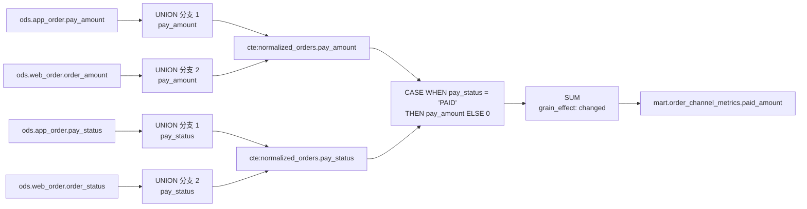
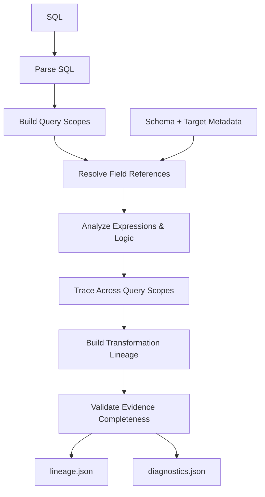
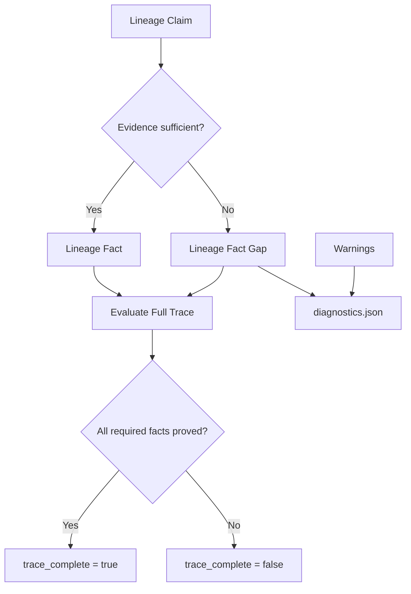
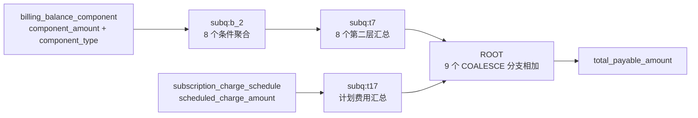
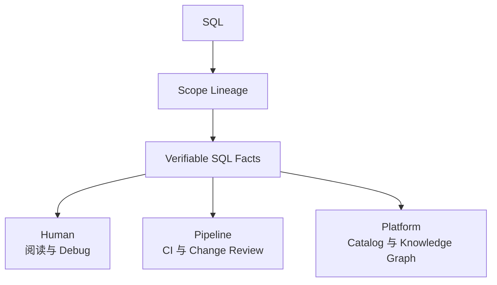
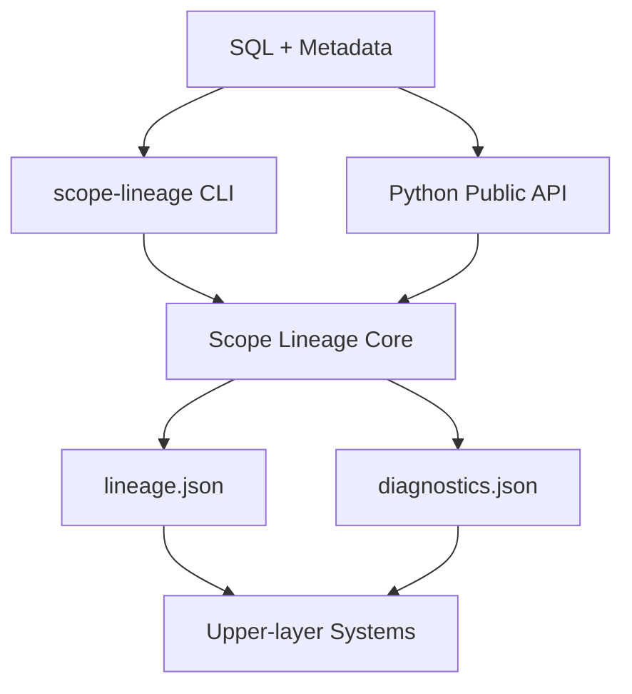

# Scope Lineage：把复杂 SQL 还原成可验证的字段加工链

Scope Lineage 是一个开源的 Spark/Hive SQL 离线静态分析工具。它读取 SQL，以及可选的源表 Schema 和目标表元数据，把藏在 CTE、子查询、`UNION`、`JOIN`、`CASE`、聚合和窗口函数中的字段关系还原成可以查询、追踪和验证的结构化事实。

它主要帮助数据开发、数据治理和平台工程师回答三个问题：

- 一个目标字段最终来自哪些物理表和物理字段？
- 它穿过了哪些查询层，经历了哪些表达式、条件判断和粒度变化？
- 当前血缘是否已经完整证明，还有哪些信息需要补充？

每次解析都会生成 `lineage.json` 和 `diagnostics.json`。前者记录表级血缘、字段级血缘、加工步骤和 SQL 证据，后者说明解析过程中发现的风险与信息缺口。整个过程不需要连接 Spark 集群或数据库，也不依赖大模型。

> SQL lineage you can inspect, trace, and verify.

## 1. 一个字段到底是怎么算出来的？

先从一段容易看懂、又足以体现问题的 SQL 开始。

任务需要把 App 和 Web 两个渠道的订单归一到同一个 CTE，再计算每个渠道的已支付金额。下面是与 `paid_amount` 有关的部分：

```sql
WITH normalized_orders AS (
    SELECT
        pay_amount,
        pay_status
    FROM ods.app_order

    UNION ALL

    SELECT
        order_amount AS pay_amount,
        order_status AS pay_status
    FROM ods.web_order
)
SELECT
    SUM(
        CASE WHEN pay_status = 'PAID'
             THEN pay_amount
             ELSE 0 END
    ) AS paid_amount
FROM normalized_orders;
```

完整示例位于 [`examples/sql/order_channel_metrics.sql`](../../examples/sql/order_channel_metrics.sql)。

如果只看最终字段，问题似乎很简单：`paid_amount` 来自 `pay_amount`。继续追下去，才会发现这里至少要回答四个问题：

1. `normalized_orders.pay_amount` 来自 App 的 `pay_amount`，还是 Web 的 `order_amount`？
2. `pay_status` 是否也属于血缘来源？它没有提供金额，却决定哪些金额能够进入结果。
3. 两个 UNION 分支怎样对齐成统一的 `pay_amount` 和 `pay_status`？
4. 从物理字段到 `CASE`，再到 `SUM`，中间经过了哪些查询层？

传统的字段依赖边通常会把它压缩成几条 source-to-target 关系。排查指标口径时，工程师仍然需要回到 SQL，重新拼出 UNION、条件和聚合过程。

## 2. Scope Lineage 给出的答案

Scope Lineage 解析这份任务后，可以直接得到下面这份结果摘要：

```text
Target field:
  mart.order_channel_metrics.paid_amount

Upstream physical tables: 2
  - ods.app_order
  - ods.web_order

Physical dependencies (`root_source_fields`): 4
  - ods.app_order.pay_amount
  - ods.web_order.order_amount
  - ods.app_order.pay_status
  - ods.web_order.order_status

Scopes in chain (`ordered_steps[].scope_id`): 5
Transformation steps (`ordered_steps`): 9
chain_status: resolved
trace_status: complete
missing_reasons: []
```

工具确认 `paid_amount` 依赖 2 张上游物理表中的 4 个物理字段。`pay_amount` 和 `order_amount` 参与金额计算，`pay_status` 和 `order_status` 参与条件判断。

当前 v1 契约通过 `root_source_fields` 平铺记录这 4 个已经证明的物理依赖字段，没有为它们标注 value 或 condition role。上面的角色说明来自同一条链路保存的表达式证据。

9 个 `ordered_steps` 还原出的加工过程如下：



这张图是对 `ordered_steps` 的可视化。Scope Lineage 找到了最终物理依赖，也保留了 UNION 对齐、条件判断和聚合过程。

## 3. 为什么普通字段血缘还不够？

一条字段血缘可以逐层回答三个问题：它来自哪里、它怎样加工、为什么可以相信这条结论。

| 层次 | 回答的问题 | Scope Lineage 提供的信息 |
| --- | --- | --- |
| 字段血缘（Lineage） | Where did it come from? | Physical Dependencies |
| 加工血缘（Transformation Lineage） | How was it transformed? | Scope + Expression + Logic + Grain |
| 可验证血缘（Verifiable Lineage） | Why can I trust the result? | Evidence + Completeness + Diagnostics |

### 3.1 Where：它来自哪里？

普通字段血缘通常输出若干条“源字段 → 目标字段”的关系。在简单案例中，这一层能够告诉使用者：`paid_amount` 依赖两个渠道的 4 个物理字段。

知道来源以后，仍然无法解释状态字段怎样影响金额，也看不到 UNION、`CASE` 和 `SUM`。这些问题需要进入下一层。

### 3.2 How：它怎样加工？

Scope Lineage 在字段依赖之上保留查询作用域、转换表达式、条件逻辑和粒度变化，把 Source 与 Target 之间的加工过程连接起来。项目将这一层称为 **加工血缘（Transformation Lineage）**。

加工血缘解决了普通字段血缘看不到中间加工过程的问题。只看到一条完整的加工链仍然不够：字段绑定是否唯一？`SELECT *` 是否展开？Schema 是否足够？所有中间 Scope 是否解析成功？有没有只能推测、无法证明的关系？这些不确定性把问题自然带到第三层。

### 3.3 Why trust：为什么可以相信这条结果？

普通字段血缘关注“血缘关系是什么”；可验证血缘进一步回答“这条关系有哪些证据，以及当前证据能够支持到什么程度”。为此，Scope Lineage 同时保存血缘结论、支撑证据、完整性状态和诊断信息。

**在 Scope Lineage 中，我们把这四部分共同构成的结果模型定义为可验证血缘（Verifiable Lineage）。** 这是项目对自身结果模型的命名。

```text
Lineage Claim
      +
Evidence
      +
Completeness
      +
Diagnostics
      ↓
Verifiable Lineage
```

在 `paid_amount` 案例中：

- Claim：目标字段依赖两个渠道的金额和状态字段；
- Evidence：9 个加工步骤保留字段绑定、UNION 对齐、`CASE` 和 `SUM` 表达式；
- Completeness：`chain_status=resolved`、`trace_status=complete`、`missing_reasons=[]`；
- Diagnostics：工具产生 1 条 `complex_aggregate_with_case` warning，提醒使用者关注条件指标逻辑；当前事实缺口为 0。

Diagnostics 不等于解析失败。`warnings` 可以记录字段绑定风险和需要人工关注的复杂 SQL 模式；`lineage_fact_gaps` 记录无法建立确定关系的证据缺口。这个案例虽然有 1 条 warning，血缘仍然是 complete。

文中出现的几个状态字段属于不同的 Contract 层级：

| 状态字段 | 所属层级 | 本文中的含义 |
| --- | --- | --- |
| `analysis_status` | Task Lineage 2.0 任务级结果 | 整个任务分析是 `complete` 还是 `partial`；warning 数量本身不决定该状态。 |
| `chain_status` | `field_mapping_chains[]` | 当前字段加工链是否完成解析；简单案例为 `resolved`。 |
| `trace_status` | `field_mapping_chains[]` | 当前字段加工链的追踪证据是否完整，取值为 `complete` 或 `incomplete`。 |
| `trace_complete` | `end_to_end_lineage[]` | 当前目标字段的端到端来源是否完整，是布尔值。 |

这些状态描述的对象不同。使用时应先确认 JSON 路径，再判断对应层级是否完整。

这些事实在 `lineage.json` 和 `diagnostics.json` 中都有稳定的数据结构。字段含义和消费规则见 [`lineage.json` 输出契约](lineage-json.md)与 [`diagnostics.json` 输出契约](diagnostics-json.md)。

## 4. Scope Lineage 是怎么工作的？

Scope Lineage 的核心思想可以概括成一句话：先恢复查询作用域，在每个作用域中完成字段绑定，再沿表达式和 Scope 边界递归追踪到物理来源。

整体过程如下：



### 4.1 建立查询作用域（Query Scope）

根查询、CTE、子查询和 UNION 分支都有各自的输入、输出与字段可见范围。工具先把这些结构恢复成 Scope，并建立它们之间的引用关系。后续字段解析始终在明确的 Scope 中进行，避免同名字段、别名和嵌套查询互相混淆。

### 4.2 在 Scope 中完成字段绑定

工具解析一个字段引用时，会确认当前 Scope、输入别名、候选来源以及上游输出位置。遇到 UNION 时，还会按照输出位置对齐各分支。字段能够唯一绑定时形成确定事实；存在多个候选或缺少 Schema 时保留歧义与缺失原因。

### 4.3 分析表达式和加工逻辑

字段绑定完成后，工具继续分析直接投影、条件表达式、聚合、窗口函数和普通运算，并记录输入、输出、原始表达式、展开表达式与粒度变化。JOIN、过滤和分组等逻辑块也会保留引用字段及 SQL 证据。

### 4.4 跨 Scope 追踪到物理来源

端到端血缘来自逐层追踪：

```text
Target
  → Expression
  → Scope Output
  → Upstream Scope
  → Upstream Expression
  → Scope Input
  → Physical Source
```

`physical_sources` 是端到端追踪的摘要，`ordered_steps` 保留摘要背后的加工过程。两者分别支持快速查询与逐步回查。

### 4.5 验证证据完整性

SQL 提供查询结构，Schema 和目标表元数据为字段绑定提供额外证据。Scope Lineage 根据这些证据分别判断当前 Claim 能否成为确定事实，以及构成端到端血缘所需的全部事实是否完整。



当前关系有充分证据，只能说明它可以成为一条 Lineage Fact。构成端到端血缘所需的全部关键事实都得到证明后，`trace_complete` 才能设为 `true`。Warning 独立进入 `diagnostics.json`，它提示需要关注的问题，但不直接决定 Trace 是否完整。

例如，SQL 使用 `SELECT *`，同时没有提供源表 Schema。默认 v1 契约会记录 `star_not_expanded` warning，并将对应端到端字段的 `trace_complete` 设为 `false`。Task Lineage 2.0 还会生成 `projection_wildcard_unexpanded` fact gap，写明缺少的 Schema 事实。候选字段不会被写成确定来源。

Scope Lineage 只把有充分证据支持的关系写成确定事实。证据不足时保留已经证明的部分，通过 Lineage Fact Gap 和 Completeness 明确当前证据边界；其他需要关注、但不一定影响血缘完整性的问题，通过 Diagnostics 中的 warning 单独记录。

**无法证明，不等于可以猜测。** 这就是第 3 节定义的可验证血缘在工具中的实现原则。

## 5. 从简单案例到 604 行复杂 SQL

简单案例用来理解方法。接下来用一份结构保真的复杂脱敏任务验证同一套分析模型。

完整 SQL：[`examples/sql/subscription_account_snapshot.sql`](../../examples/sql/subscription_account_snapshot.sql)（604 行，约 24 KB）。

| 结构 | 数量 |
| --- | ---: |
| 物理源表 | 19 |
| JOIN | 20 |
| 子查询 | 23 |
| 聚合函数 | 57 |
| CASE WHEN | 10 |
| 窗口函数 | 1 |
| 目标字段 | 112 |

这份 SQL 中的 `total_payable_amount` 跨越两条金额路径：



按照[示例文档](../../examples/README.zh-CN.md)中的 Task Lineage 2.0 命令解析，结果为：

```text
3 physical dependencies
  → 4 query scopes
  → 18 transformation steps
  → demo_mart.subscription_account_snapshot.total_payable_amount

chain_status: resolved
trace_status: complete
analysis_status: complete
warnings: 48
lineage_fact_gaps: 0
metadata_coverage: 20 / 20
```

18 个加工步骤中，`subq:b_2` 负责 8 个条件聚合，`subq:t7` 负责 8 个第二层汇总，`subq:t17` 负责计划费用聚合，最后一步在 ROOT 合并九个费用分支。48 条 warning 包含 43 条复杂条件聚合提醒和 5 条 magic number 提醒；它们没有形成事实缺口，也没有影响 `total_payable_amount` 的完整追踪。

这个案例的作用很明确：简单案例中的 Scope、字段绑定、加工逻辑、跨 Scope 追踪和完整性验证，在 604 行 SQL 上仍然使用同一套模型。

## 6. 这些结构化事实还能做什么？

对数据工程师来说，Scope Lineage 把复杂 SQL 还原成可以核查的字段加工链。对平台开发者来说，它把 SQL 转换成版本化、可追溯、可被程序消费的 **Verifiable SQL Facts**。

这里的 Verifiable SQL Facts 是更上层的统称，包括查询作用域、字段绑定、加工逻辑、JOIN、过滤、聚合、表状态等由 SQL 与元数据证明的结构化事实。Verifiable Lineage 是其中的重要组成部分；Evidence、Completeness 和 Diagnostics 进一步描述这些事实的依据和可信边界。这些结构化结果通过版本化 JSON Contract 提供给上层系统消费。

同一组事实可以同时服务人、流水线和平台：



这些应用的基础是一组可查询、可比较、带有证据边界的结构化 SQL Facts。它们提供的信息超出了“源字段 → 目标字段”关系本身。

### 影响分析

假设上游准备调整 `demo_ods.subscription_charge_schedule.scheduled_charge_amount`。复杂案例的解析结果可以直接找到 4 个受影响的目标字段：

```text
past_due_amount
special_charge_balance
subscription_due_balance
total_payable_amount
```

平台可以进一步区分字段用于计算、过滤、关联还是分组，帮助评审人员确定回归范围。影响结果因而包含“是否受影响”和“通过什么逻辑受影响”两个层次。

### SQL 变更评审

开发人员把 `component_type LIKE 'PAYABLE%'` 改成固定枚举后，修改前后的事实可以显示 `open_receivable_amount` 条件表达式发生变化，并沿加工链指出 `total_payable_amount` 使用了这个中间字段。

当前 Core 没有单独的 `diff` 命令。上层流水线可以比较稳定 ID、规范化表达式、物理依赖字段、JOIN、过滤、聚合和新增诊断。

与 SQL 文本 Diff 相比，这类比较能够指出血缘关系、转换逻辑、过滤条件或粒度发生了什么语义变化。

### CI 与质量门禁

严格质量策略可以拦截语法恢复、影响最终字段的事实缺口和目标字段绑定回退。解析结果进入知识库或影响分析前，流水线可以确认关键字段是否仍然 trace complete、是否新增 Fact Gap，并按 warning 类型执行项目自己的审查策略。

复杂案例还展示了目标 DDL 绑定：SQL 投影 `request_date` 根据位置索引 65 绑定为 `request_recorded_date`。原始名称、目标名称和纠正证据都会保留。

### 自动文档

平台可以从产物生成字段说明卡：

```text
字段：total_payable_amount
目标表：demo_mart.subscription_account_snapshot
物理依赖字段：component_amount、component_type、scheduled_charge_amount
加工摘要：费用分类 → 分支聚合 → 账户汇总 → 最终加总
证据步骤：18
完整性：complete
```

说明卡中的每一项都能回到 SQL 表达式、Scope 和 `diagnostics.json`。加工步骤和完整性状态让这份说明同时具备解释依据与审计入口。

### 搜索索引与知识图谱

结构化事实可以形成“物理字段—查询作用域—目标字段”的图关系。例如：

```text
subscription_charge_schedule.scheduled_charge_amount
  → subq:t17.subscription_scheduled_charge
  → ROOT.total_payable_amount
  → subscription_account_snapshot.total_payable_amount
```

同一份结果可以支持字段搜索、数据目录、知识图谱和数据治理平台。图谱可以同时包含 Column、Scope、Transformation 和 Logic 节点，保留字段之间的加工语义。

## 7. 字段值之外（Beyond Value Lineage）

字段加工链回答“这个值怎样产生”。数据变更语句还会带来记录存在性和表状态问题。

```sql
DELETE FROM account
WHERE status = 'CANCELLED';
```

`status` 没有写入任何目标字段，却决定哪些记录消失。因此 Task Lineage 2.0 会区分：

| 模型 | 回答的问题 |
| --- | --- |
| Value Lineage | 字段值为什么是这个值？ |
| Row-existence Lineage | 一条记录为什么存在、更新或消失？ |
| Table State | 多条语句执行后，表最终处于什么状态？ |

这套模型用于描述 `DELETE`、`TRUNCATE`、`UPDATE`、`MERGE` 和多语句任务。具体契约见 [Task Lineage 2.0](task-lineage-v2.md)。

## 8. Scope Lineage 能力全景

前文介绍的能力可以汇总成下面这张产品地图：

| 能力层次 | 能力 | 提供的价值 |
| --- | --- | --- |
| 字段血缘 | Scope-aware Lineage | 还原 CTE、子查询、UNION 分支和根查询之间的字段传递。 |
| 字段血缘 | Transformation Lineage | 保留表达式、转换类型、中间字段和粒度变化。 |
| 字段血缘 | Verifiable Lineage | 同时保留血缘结论、支撑证据、完整性状态和诊断信息，明确当前结论的证据边界。 |
| SQL 影响 | Row-existence Lineage | 记录哪些条件决定记录存在、更新或消失。 |
| SQL 影响 | Table State | 描述多条写入和变更语句执行后的最终表状态。 |
| 工程能力 | Versioned JSON Contract | 让上层系统在明确的版本边界内消费解析结果。 |
| 工程能力 | Offline Static Analysis | 无需 Spark 集群、数据库连接或大模型。 |

命令行适合本地阅读和调试，版本化 JSON 适合进入上层系统。实际调用关系如下：



Core 同时提供受支持的 Python 公共 API；程序可以直接调用 Core，获得与 CLI 相同的契约结果。

## 9. 工作边界

Scope Lineage 专注于 SQL 本身能够证明的事实。

| 工具范围外的工作 | 需要什么 |
| --- | --- |
| 执行 SQL | Spark、Hive 或其他计算引擎。 |
| 判断运行时数据值是否正确 | 查询结果和数据质量规则。 |
| 根据字段名称推测业务语义 | 领域知识和人工确认。 |

SQL 能够证明的关系进入 `lineage.json`；证据不足的位置进入 `diagnostics.json`；业务含义由熟悉数据的人确认。

## 10. Quick Start

安装命令行工具：

```bash
pipx install scope-lineage
```

在项目根目录解析简单案例：

```bash
scope-lineage parse \
  --task-file examples/tasks/order/order_channel_metrics.json \
  --schema examples/metadata/schema_info.json \
  --target-ddl-metadata examples/metadata/target_tables/mart.order_channel_metrics_metadata.json \
  --out /tmp/scope-lineage/order-channel
```

输出：

```text
/tmp/scope-lineage/order-channel/order_channel_metrics/
├── lineage.json
└── diagnostics.json
```

完整安装、输入方式、字段查询和质量策略请阅读[安装与使用指南](getting-started.md)。输出字段的查询方式请阅读 [`lineage.json` 输出契约](lineage-json.md)。

## 11. Learn More

- [安装与使用指南](getting-started.md)：安装、输入准备、批量解析和常用命令。
- [输入格式](input-formats.md)：任务 JSON、SQL、Schema 和目标表元数据。
- [`lineage.json` 输出契约](lineage-json.md)：查询作用域、加工链和端到端血缘。
- [`diagnostics.json` 输出契约](diagnostics-json.md)：告警、事实缺口和完整性。
- [Task Lineage 2.0](task-lineage-v2.md)：Row-existence Lineage 和 Table State。

Scope Lineage 是一个采用 Apache-2.0 许可证的开源项目。项目地址：[github.com/realyin/scope-lineage](https://github.com/realyin/scope-lineage)。如果它对你的 SQL 排查、血缘治理或数据平台建设有帮助，欢迎在 GitHub 点一个 Star。你的支持也会让更多需要处理复杂数仓 SQL 的人找到它。
