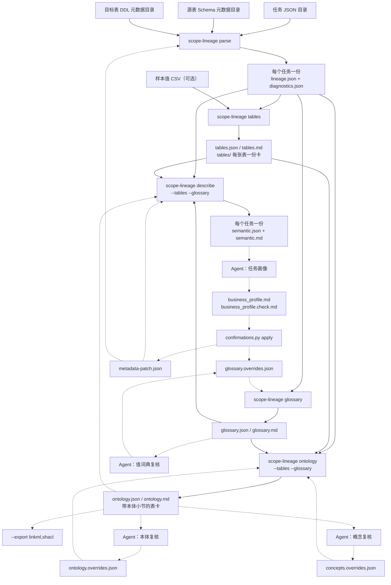

[English](../en/workflow.md) | 中文

# 端到端工作流：从任务 JSON 到画像与本体

每份文档各讲一种产物：`lineage.json` 讲已证明的事实，`semantic.md` 讲一个任务在做什么，
`tables.md` 讲一张表是什么，`ontology.md` 讲表与表的关系。这一篇不重复它们，只回答另一个问题：
**这些命令按什么顺序跑，每一步要上一步的什么，人和 Agent 从哪里插进来。**

读完你应该能回答：手上有一批任务 JSON 和一份 Schema，接下来敲哪几条命令、每条的产物给谁看。

## 一张图



实线是命令之间的数据流，虚线是回写环。回写环只有四个落点：`glossary.overrides.json`、
`ontology.overrides.json`、`concepts.overrides.json`、`metadata-patch.json`。答案写进去、
同一条命令再跑一遍，答过的问题就不会被问第二遍——这是整套流程唯一的"记忆"。

## 五分钟走一遍

下面这一串在本仓库根目录可以原样跑通，输入全部是
[`examples/` 下的合成样例](../../examples/README.zh-CN.md)。

### 1. `parse`：把 SQL 变成事实

```bash
OUT=/tmp/scope-lineage-walkthrough

scope-lineage parse \
  --input-dir examples/tasks \
  --schema examples/metadata/schema_info.json \
  --schema-fallback examples/metadata/subscription_account_snapshot/source_tables \
  --target-ddl-metadata examples/metadata/target_tables \
  --out "$OUT/artifacts"
```

```text
Metadata gaps: 6 referenced table(s) have no schema metadata; list written to /tmp/scope-lineage-walkthrough/artifacts/metadata_gaps.json (run with --metadata-preflight to review before parsing)
Parsed 7 statement(s) from 5 input(s) into /tmp/scope-lineage-walkthrough/artifacts using contract 2.0 (tasks=5, modeled=6, failed=0, input_failed=0, partial_tasks=0, unsupported_mutations=0, root_gap_results=0, binding_fallbacks=0, recovered_syntax=0, binding_not_applicable=1)
```

产物按输入目录结构镜像出来，一个任务一个目录，里面是 `lineage.json` 与 `diagnostics.json`。
第一行提示的缺口是**源表** Schema 的覆盖情况：这里缺的全是本批任务自己写入的目标表，它们由
`--target-ddl-metadata` 单独提供，所以不用补。真正缺源表时应该先补元数据再解析，
把 `--metadata-preflight` 串在前面就能变成门禁。

后面每条命令都只读 `$OUT/artifacts` 这棵树，不再碰 SQL。

### 2. `tables` 与 `glossary`：语料级的两本账

这两条互不依赖，可以并行跑。它们回答的都是单个任务答不出的问题——一张表被谁写、被谁读，
一个列名在别处是什么说法、被哪些常量比较过。

```bash
scope-lineage tables   --lineage "$OUT/artifacts" --out "$OUT/corpus"
scope-lineage glossary --lineage "$OUT/artifacts" --out "$OUT/corpus"
```

```text
Carded 31 table(s) from 5 task(s) (skipped_unknown_version=0, missing_diagnostics=0, skipped_unreadable=0)
Collected 214 term(s) and 62 value observation(s) from 5 task(s) (overrides terms=0, values=0, blank=0, unmatched=0, rejected=0, ignored_fields=0, skipped_unknown_version=0, missing_diagnostics=0, skipped_unreadable=0)
```

本体已经跑过一轮的话，把它挂给字典（N6）：字典就多一层**概念**——同一个概念属性在它的几张
表示表上是同一件事，于是术语、取值与待填表都按属性而不是按表归并，一条
`concept:<概念 id>.<属性>=<取值>` 答完整族。第一轮还没有 `ontology.json` 很正常：
先按上面跑一遍，第 4 步跑完本体之后再回来重跑这一条即可。

```bash
scope-lineage glossary --lineage "$OUT/artifacts" --out "$OUT/corpus" \
  --ontology "$OUT/corpus/ontology.json"
```

### 3. `describe`：每个任务一份语义骨架

```bash
scope-lineage describe \
  --lineage "$OUT/artifacts" \
  --tables   "$OUT/corpus/tables.json" \
  --glossary "$OUT/corpus/glossary.json"
```

```text
Described 5 task(s) (skipped_unknown_version=0, missing_diagnostics=0, skipped_unreadable=0)
```

`semantic.json` 与 `semantic.md` 写在每份 `lineage.json` 旁边。两个可选输入各补一块内容：
`--tables` 让输入表带上它自己的上游表卡、让目标表列出下游读者；`--glossary` 填
`fields[].value_domain[]`，也就是"这个列见过哪些取值、哪个取值有人确认过含义"。
不传也能跑，只是这两块是空的。

还有第三个可选输入 `--ontology`，它读的是**下一步**才写出来的 `ontology.json`
（只接受 `ontology-json/2`）：传了之后，任务、输入表、字段与粒度都会带上语料概念层给出的
业务对象——`task.concepts[]` / `task.output_concept`、`inputs[].concept`、
`fields[].concept_attribute`、`output_shape.grain.concept_text`，粒度那行随之写成
「一行 = 一个客户 × 日期」。所以它照例是**第 4 步跑完之后再回头重跑一次 `describe`**：
`scope-lineage describe --lineage "$OUT/artifacts" --tables … --glossary … --ontology
"$OUT/corpus/ontology.json"`。不传时这些键一个都不出现，产物与概念层上线之前逐字节一致。

### 4. `ontology`：表与表的关系

```bash
scope-lineage ontology \
  --lineage "$OUT/artifacts" --out "$OUT/corpus" \
  --tables   "$OUT/corpus/tables.json" \
  --glossary "$OUT/corpus/glossary.json"
```

```text
Modelled 12 concept(s), 9 relation(s), 31 table(s), 21 table relation(s), 20 constraint(s) and 0 finding(s) from 5 task(s), concept files 12 (skipped_unknown_version=0, missing_diagnostics=0, skipped_unreadable=0)
```

这一次写出的是：`ontology.json`、`ontology.md`（索引）、`concepts/<文件>.md`（**每个折出的
概念一份**）、`appendix.md`（表一级的全部内容）、`tables/<db.table>.md`（表卡 + 本体五节）。

打开 `$OUT/corpus/ontology.md`：开头是「本体总览」——几个概念、按种类拆开、几条概念关系、
还有几个临时概念等着归并，以及还有多少条待人工判定、折叠成多少组、已确认多少条；随后是
概念表，**每个概念的名字就链到 `concepts/` 下它自己那份文件**（表现 / 属性 / 约束 / 关系 /
待人工判定 / 命名与类别依据 / 评审回写键）。临时概念在索引里只剩计数与**影响最大的 20 个**，
完整清单在 `appendix.md` 里。表级的 Mermaid ER、表清单、表级关系与折叠后的完整待判定清单
也都在 `appendix.md` 里，索引只留「附录索引」——每节一行，数量加链接；它们是
概念关系被读出来的证据，不是模型本身。清单每组一行，带一个稳定的 `open:group:` id、
`影响`、组内条数和一个把表名留成 `<table>` 的回写模式，按 `影响` 降序排好（关系按对端归组，
所以十个任务关联同一张维表是一行）；逐条的清单在 `ontology.json` 的 `open_items[]` 里。
`--tables` / `--glossary` 只是省一次重算，不传时产物逐字节相同。

### 5. 第二次跑：`--incremental`

语料只改了一两个任务时，没必要把每个任务重新读一遍。四条语料级命令都支持 `--incremental`：

```bash
scope-lineage tables --lineage "$OUT/artifacts" --out "$OUT/corpus" --incremental
scope-lineage tables --lineage "$OUT/artifacts" --out "$OUT/corpus" --incremental
```

```text
Carded 31 table(s) from 5 task(s) (..., reused=0, recomputed=5, removed=0)
Carded 31 table(s) from 5 task(s) (..., reused=5, recomputed=0, removed=0)
```

第一次没有可复用的东西，它写下索引与缓存；第二次全部复用。复用的只是每个任务自己贡献的那半，
合并照样跑全量，所以增量跑出来的产物与全量跑逐字节一致。选项、overrides 内容或工具版本
任何一项变了，索引整份作废、全部重算；`--no-cache` 先删掉这两样再全量跑。

换一份语料（同样那些任务解析到另一个目录下，或是一份更大的语料）时，再加一个
`--cache-from` 指向前一次的 `--out`，字节相同的任务就直接借用，不必重算：

```bash
scope-lineage tables --lineage "$OUT2/artifacts" --out "$OUT2/corpus" \
  --cache-from "$OUT/corpus"
```

```text
Carded 31 table(s) from 5 task(s) (..., reused=4 (borrowed=4), recomputed=1, removed=0)
```

### 6. 人工确认回写一轮：`--overrides`

到这里所有取值的含义都还是空的——Core 不从拼写猜含义。人确认过的含义写进一份
overrides 文件，放在仓库外面的任意目录：

```bash
REVIEW=/tmp/scope-lineage-review
mkdir -p "$REVIEW"

cat > "$REVIEW/glossary.overrides.json" <<'JSON'
{"values": {"customer_level='HIGH'": {"meaning": "高价值客户", "confirmed_by": "owner", "date": "2026-09-21"},
            "pay_status='PAID'": {"meaning": "已支付", "confirmed_by": "owner", "date": "2026-09-21"}}}
JSON

scope-lineage glossary --lineage "$OUT/artifacts" --out "$OUT/corpus" \
  --overrides "$REVIEW/glossary.overrides.json"

scope-lineage describe --lineage "$OUT/artifacts" \
  --tables "$OUT/corpus/tables.json" --glossary "$OUT/corpus/glossary.json"
```

```text
Collected 214 term(s) and 62 value observation(s) from 5 task(s) (overrides terms=0, values=2, blank=0, unmatched=0, rejected=0, ignored_fields=0, ...)
Described 5 task(s) (skipped_unknown_version=0, missing_diagnostics=0, skipped_unreadable=0)
```

键不带表名时命中所有同名列，所以这两行同时落到多张表上。重跑 `describe` 之后，
`customer_profile_daily` 的 `semantic.md` 里那一列从
`'HIGH'（待确认）` 变成 `'HIGH'（高价值客户）`，`'MEDIUM'` 与 `'STANDARD'` 仍然是
`（待确认）`——确认过的不再问，没确认的照样问。

把键拼错（`customer_levl='HIGH'`）不会被静默丢掉，而是计进摘要行的 `unmatched=1`。

## 每一步要什么、产出什么、谁读

| 步骤 | 输入 | 产出 | 谁读 | 细节文档 |
| --- | --- | --- | --- | --- |
| `parse` | 任务 JSON / SQL、`--schema`、`--target-ddl-metadata`、可选 `--metadata-patch` | 每任务一目录：`lineage.json`、`diagnostics.json` | 机器（后面每一步的唯一输入） | [安装与使用指南](getting-started.md) |
| `render`（可选） | 一棵 `lineage.json` 树、`--field` / `--sections` | `mapping.md`（有警告时另出 `warnings.md`） | 分析师 | [mapping.md 字段映射文档](mapping-doc.md) |
| `tables` | 一棵 `lineage.json` 树、可选 `--samples`、`--merge` | `tables.json`、`tables.md`、`tables/<db.table>.md` | 分析师；同时喂给 `describe` / `ontology` | [语料级表卡](tables-doc.md) |
| `glossary` | 一棵 `lineage.json` 树、可选 `--overrides`、`--ontology`、`--template` | `glossary.json`、`glossary.md`、可选待填模板 | 业务负责人填模板；机器读 JSON | [术语与值域字典](glossary-doc.md) |
| `describe` | `lineage.json` + `--tables` + `--glossary` + 可选 `--ontology` / `--metadata-patch` | 每任务一份 `semantic.json`、`semantic.md` | Agent（写画像的原料）、分析师 | [任务语义描述](semantic-doc.md) |
| `ontology` | `lineage.json` + `--tables` + `--glossary` + 可选 `--overrides`、`--concept-overrides`、`--export` | `ontology.json`、`ontology.md`、带本体小节的表卡 | Agent（整理待判定项）、分析师 | [语料级本体候选](ontology-doc.md) |
| `catalog validate` / `catalog build` | 人维护的目录文件夹（`catalog.yaml`、概念、标识符、映射……） | 文本或 `--json` 报告；`ontology.json`（`ontology-json/3`） | 目录的 owner；构建结果给机器读 | [本体目录](ontology-catalog.md) |
| `semantic packet` / `validate` / `confirm` | `lineage.json` 目录、任务 JSON 目录、`--schema`；之后是写好的 `table-semantics/1` 文档与 `semantic-confirmations/1` 文件 | `<db.table>/packet.md` + `packet.json`；文本或 `--json` 校验报告；确认后的文档 | 模型依据材料包为每张表写文档；owner 回答其中的问题 | [表语义](table-semantics.md) |
| Agent 任务画像 | `semantic.md` + 技能里的提示词与模板 | `business_profile.md`、`business_profile.check.md` | 业务负责人（读画像、答待确认清单） | [AI agent 技能](agent-skill.md) |
| `confirmations.py apply` | 答完的 `business_profile.md` | 合并进 `glossary.overrides.json`、`metadata-patch.json` | 机器（下一轮的输入） | [AI agent 技能](agent-skill.md) |

表格之外还有一条硬约束：**后四条命令只读 `parse` 的产物**。改了 SQL 或元数据要重跑 `parse`；
只是补了人工确认，就不用动 `parse`。

## 人和 Agent 在哪里介入

Core 只产确定性事实，业务命名、含义与实体关系的判断留给人。这三件事各有一个 Agent 工作流，
提示词都在 `skills/scope-lineage/references/` 下（路径相对
[技能目录](../../skills/scope-lineage/SKILL.md)）：

| 工作流 | 提示词文件 | 产出 | 答案写回哪 | 答完重跑什么 |
| --- | --- | --- | --- | --- |
| 任务画像 | `semantic-profile-prompt.md`，模板 `business-profile-template.md` / `business-profile-check-template.md` | `business_profile.md`（任务语义卡 + 字段词典 + 待确认清单，清单最多五条）与它的质检记录 `business_profile.check.md` | 业务负责人把答案写在每条的 `- 答案：` 行上，`confirmations.py apply` 按同一条的 `- 回写目标：` 行路由：`术语` / `值域` 进 `glossary.overrides.json`，`字段注释` / `表注释` 进 `metadata-patch.json` | `glossary --overrides`，然后 `describe --glossary --metadata-patch`；要让注释落进 `lineage.json` 本身，再 `parse --metadata-patch` |
| 值词典复核 | `glossary-review-prompt.md`，输入是 `glossary --template` 写出的待填表 | Agent 自己能答的条目（必须带 `basis`，签 `confirmed_by: "agent:<name>"`），加上最多八条留给人的问题 | `glossary.overrides.json` | `glossary --overrides`，然后 `describe --glossary` |
| 本体复核 | `ontology-review-prompt.md`，输入是 `ontology.md` 的「待人工判定清单」加各任务 `semantic.md` | 语料已经能证明的确认项（同样带 `basis`），加上最多八条留给人的问题 | `ontology.overrides.json`，键照抄清单里的「回写目标」字符串 | `ontology --overrides` |
| 概念复核 | `concept-review-prompt.md`，输入是 `ontology.md` 的「本体总览」与「概念」两部分加各表卡第 7 节；语料宽时改读 `--review-batches` 切出来的 `batch-NN.md` | 按「种类 → 名字 → 合并 → 拆分 → 角色」走一遍，自答项带 `basis`，加上最多八条留给人的问题（写在 `open-questions.md`）；分批做时每批各自八条 | `concepts.overrides.json`，键是 `concept:<词根>`；分批做时一批一份 | `ontology --concept-overrides`（可重复，按批次顺序给） |

四个工作流的共同点：**Agent 不许凭字面猜**。它只能从三类证据里自答——列注释把取值枚举了出来、
语料里有 CASE 把取值一对一地映射成标签、同名列在别处已被人确认过；剩下的整理成问题交给人。
每条自答都要写下依据，没写依据的确认会被拒绝。

最后两行是**同一份语料的两轮，互不替代**：本体复核问的是表（这张表按这组列唯一吗、这条边
是几对几），概念复核问的是概念（这是一件什么东西、它叫什么、这两个是不是同一个）。答案落在
两份不同的 overrides 文件里，一条命令可以同时带上它们；只跑一轮是把另一半问题留着不答。

语料一宽，概念复核那一轮就一次做不完：临时概念动辄几十上百个，而问人的额度是 8 条。
**这时候分批做**（N1，详见[语料级本体候选](ontology-doc.md)的「分批评审」一节）：

```bash
# 1. 切批：把临时概念按表族切成 <review>/batches/batch-NN.{md,overrides.json} 加一份 index.md
scope-lineage ontology --lineage "$OUT/artifacts" --out "$OUT/corpus" \
  --review-batches "$REVIEW" --review-batches-by family --review-batch-size 30

# 2. 一次做一批：读 batch-NN.md，填 batch-NN.overrides.json，每批最多 8 条去问人的问题

# 3. 回写：--concept-overrides 可重复，按做批次的顺序给
scope-lineage ontology --lineage "$OUT/artifacts" --out "$OUT/corpus" \
  --concept-overrides "$REVIEW/batches/batch-01.overrides.json" \
  --concept-overrides "$REVIEW/batches/batch-02.overrides.json"
```

`index.md` 的顺序就是该做的顺序（越靠前，答完解开的边越多）。不冲突的条目累加；两份文件点到
同一个目标键时后给的那份生效，并报进 `concept_overrides_applied.conflicts[]` ——看到它说明两批
对同一个问题给了两个答案，**回头由人定夺**，别靠调换顺序蒙混。`sources[]` 说每份文件赢下了几
条，用来核对刚写的那一批真的落进去了。

## 做错了会怎样

这套工具的设计假设是"错误要被看见"，所以几乎每种失误都有一个计数器而不是一次静默丢弃。
值得先知道这几条：

| 情况 | 默认行为 | 在哪看见 |
| --- | --- | --- |
| 注释里混进了邮箱、电话或证件号 | **默认脱敏**成 `<email>` / `<phone>` / `<id>`，其余文字保留。`--no-redact-comments` 原样发布；一条注释都不能外流时用 `--strip-comments` | 产物里的注释文本 |
| 人工确认的键在语料里不存在 | 不丢弃，计进 `overrides_applied.unmatched`，带 `reason` 说明是哪个实体或列不认识 | `glossary` / `ontology` 的摘要行与对应 JSON |
| Agent 的确认没写 `basis` | 拒绝合并，计进 `overrides_applied.rejected`，`reason: "missing_basis"` | 同上 |
| overrides 里的槽位名拼错了 | 不静默丢掉，计进 `overrides_applied.ignored_fields` | 同上 |
| 样本值文件里的表名或列名对不上 | 计进 `samples_applied.unmatched` | `tables` 的摘要行与 `tables.json` |
| 本体里的断言不一定是事实 | 每条断言都带层级：`proven` 已证明、`implied` 可推得、`hypothesis` 作者假设、`conflict` 矛盾、`confirmed` 已确认。**只有 `confirmed` 来自人工**，语料自己永远产不出这一级 | `ontology.md` 的每条断言与 `ontology.json` 的 `tier` |
| 任务只解析出一部分 | 摘要行打出 `partial_tasks=N` 与 `partial_reasons=<原因>:<个数>,…`，成功的部分照常写盘 | 该任务 `diagnostics.json` 的 `analysis_status.blocking_reasons`，以及 [`diagnostics.json` 输出契约](diagnostics-json.md) |
| 有源表没给 Schema | 写一份 `metadata_gaps.json` 到 `--out` 并提示一行，但不中断；`--metadata-preflight` 把它变成门禁：有缺口就返回非 0、不产血缘 | `metadata_gaps.json` |
| 语义骨架里的治理线索 | `confidence.findings[]` 每条带 `severity`：`warn` 是要人处理的线索，`info` 是真但不用处理（例如分区日期写死——一个任务实例本来就对应某一天） | `semantic.md` 第 6 节 |

一句总结：**摘要行的每个 `=0` 都是一次"没出问题"的证明**，非零的那几项才是要去翻产物的地方。

## 进阶

| 想做的事 | 加什么 | 说明 |
| --- | --- | --- |
| 一张表在 A 批任务里被写、在 B 批里被读 | `tables --lineage B --merge A/tables.json --out …`，再 `ontology --tables A/tables.json --tables B/tables.json` | 跨语料合卡：两批的生产者与消费者并到同一张卡上，另一批证明的唯一性可以给这一批的关系定基数，每条证据注明来自哪一批 |
| 卡片上想看到真实取值样例 | `tables --samples <CSV 或目录> --samples-top N` | `table,column,value[,count]` 形状；取值一律按联系方式形状打码并截断，对不上的键进 `samples_applied.unmatched` |
| 把本体交给 RDF 工具链 | `ontology --export linkml,shacl` | 在 `ontology.json` 旁另写 `ontology.linkml.yaml` 与 `ontology.shacl.ttl`，每个元素仍带层级 |
| 表达式嵌套太深、`expanded_expression` 被截断 | `parse --expansion-limit N` | 一条 `expanded_expression` 最多内联多少个上游表达式（默认 2000）；撞上限时文本带截断标记发布，并记一条 `expansion_truncated` warning（来源未解析时才是 `expression_expansion_bounded` 缺口） |
| 人工确认的注释要进产物本身 | `parse --metadata-patch <file>` | 与 `describe --metadata-patch` 读同一份 `metadata-patch/1` 文件；前者重写产物，后者只在内存里套用 |
| 一条注释都不能离开机器 | `parse --strip-comments` | 默认收集作者注释（语句头、每个输出、每个逻辑块），脱敏是形状匹配、既不穷尽也不保证 |
| 只要某几节 markdown | `describe --sections …`、`render --sections …` | 字段很多的大任务可以只留紧凑清单那一节 |
| 同一批任务要在另一份语料里再跑一次 | `--cache-from <上一次的 --out>`（四条语料级命令都支持） | 字节相同、选项摘要相同的任务借用已缓存的事实，摘要行报 `reused=N (borrowed=B)`；借来的抄进本次自己的缓存，产物与全量跑逐字节一致 |

输入格式、catalog 前缀、质量门禁等参数见[输入格式](input-formats.md)与
[安装与使用指南](getting-started.md)。

## 下一步

- [文档导航与问题—字段索引](README.md)
- [`lineage.json` 输出契约](lineage-json.md)
- [`diagnostics.json` 输出契约](diagnostics-json.md)
- [Task Lineage 2.0](task-lineage-v2.md)
- [读语句级还是任务级？按业务场景选层次](contract-selection.md)
