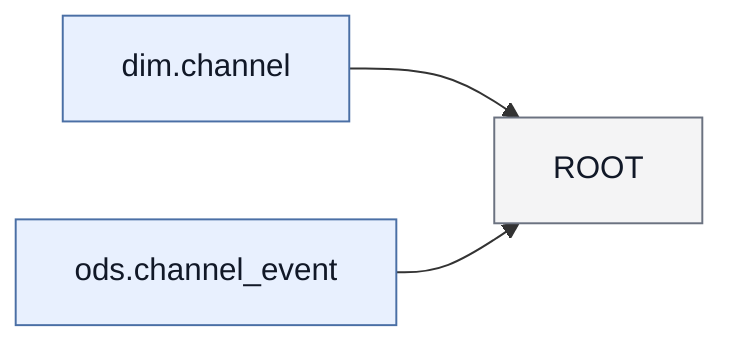

# 字段映射文档 mart.channel_summary

## 1. 概览

- 任务名：golden_commented_insert
- 目标：mart.channel_summary
- 语句类型：INSERT_OVERWRITE
- 解析状态：ok；语法状态：strict_ok
- 分区：spec=`{"dt": "${bizdate}"}`；模式=static；分区列=dt
- 目标绑定：未做（调用方未提供 --target-ddl-metadata）

## 2. 来源表

| 表 | 表列数（元数据） | 使用列数 | 元数据完整 |
| --- | --- | --- | --- |
| dim.channel | 2 | 1 | 是 |
| ods.channel_event | 4 | 4 | 是 |

- 过滤条件（WHERE / JOIN ON 中作用于来源表列的谓词，按表归并；HAVING 见第 6 节）：
- dim.channel：无直接过滤条件
- ods.channel_event
  - `` `s`.`status` = 'ACTIVE' /* 仅生效状态 */ ``（WHERE @ ROOT）

## 3. 来源表关系

| 左表 | 关系 | 右表 | 连接键 | 出现 |
| --- | --- | --- | --- | --- |
| ods.channel_event | LEFT_OUTER JOIN | dim.channel | channel_code | 1 处 |

## 4. 字段映射总表

| # | 目标字段 | 加工类型 | 来源物理字段 | 状态 |
| --- | --- | --- | --- | --- |
| 1 | customer_id | DIRECT | ods.channel_event.customer_id | ✓ |
| 2 | channel_name | CONDITIONAL | ods.channel_event.channel_code | ✓ |
| 3 | total_amount | AGGREGATE | ods.channel_event.amount | ✓ |

## 5. 加工步骤明细

### 字段 mart.channel_summary.customer_id

- 来源字段：`ods.channel_event.customer_id`
- 加工路径：1 步；direct_projection
- 步骤 1/1：`ods.channel_event.customer_id` → `mart.channel_summary.customer_id`；direct_projection；粒度=preserved；表达式：`` `customer_id` ``
- 证据：mapping_chain_id=mc:001；chain=chain:ROOT:customer_id:position:0

### 字段 mart.channel_summary.channel_name

- 来源字段：`ods.channel_event.channel_code`
- 加工路径：1 步；case_when
- 步骤 1/1：`ods.channel_event.channel_code` → `mart.channel_summary.channel_name`；case_when；粒度=preserved；表达式：`` CASE WHEN `channel_code` = 'A' THEN 'ONLINE' ELSE 'OFFLINE' END ``
- 证据：mapping_chain_id=mc:002；chain=chain:ROOT:channel_name:position:1

### 字段 mart.channel_summary.total_amount

- 来源字段：`ods.channel_event.amount`
- 加工路径：1 步；aggregate
- 步骤 1/1：`ods.channel_event.amount` → `mart.channel_summary.total_amount`；aggregate；粒度=changed；表达式：`` SUM(`amount`) ``
- 证据：mapping_chain_id=mc:003；chain=chain:ROOT:total_amount:position:2

## 6. 加工逻辑汇总

### scope `ROOT`（root，角色 aggregate）

- 概要：读取 dim.channel、ods.channel_event；关联 1 个上游；按过滤条件保留记录；聚合生成指标；通过 CASE WHEN 派生字段
- 输入（均为物理表）：dim.channel、ods.channel_event
- 逻辑：join 1、filter 1、聚合 1、窗口 0、union 分支 0、distinct 否
  - 过滤：`` WHERE `s`.`status` = 'ACTIVE' /* 仅生效状态 */ ``
- LEFT_OUTER JOIN：`ods.channel_event` ⋈ `dim.channel`（@ ROOT；logic_block_id=logic:ROOT:join:001）
  - 等值键：channel_code（物理：`ods.channel_event.channel_code = dim.channel.channel_code`）

## 7. scope 结构图

- 图例：蓝底=物理表，灰底=scope

## 8. 任务依赖

- 无声明的任务依赖

## 9. 不确定性与缺口

- 字段追溯：全部完整
- 缺口：无（diagnostics 未记录 lineage_fact_gaps）
- 解析警告：无
