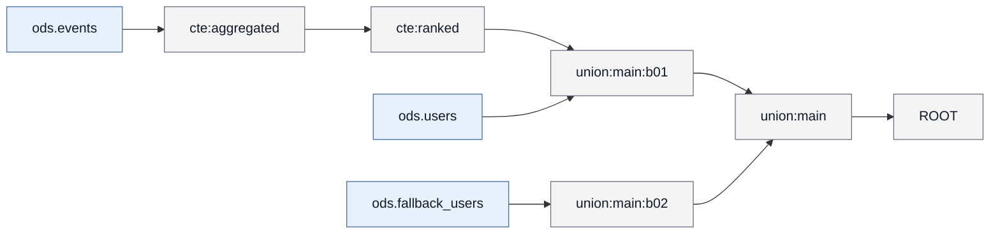

# 字段映射文档 mart.user_value

## 1. 概览

- 任务名：golden_complex_scope
- 目标：mart.user_value
- 语句类型：INSERT_OVERWRITE
- 解析状态：ok；语法状态：strict_ok
- 目标绑定：未做（调用方未提供 --target-ddl-metadata）

## 2. 来源表

| 表 | 表列数（元数据） | 使用列数 | 元数据完整 |
| --- | --- | --- | --- |
| ods.events | 2 | 2 | 是 |
| ods.fallback_users | 1 | 1 | 是 |
| ods.users | 1 | 1 | 是 |

## 3. 来源表关系

| 左表 | 关系 | 右表 | 连接键 | 出现 |
| --- | --- | --- | --- | --- |
| ods.events | INNER JOIN | ods.users | user_id | 1 处 |

- UNION：union:main（UNION_ALL，2 分支）；union:main:b01 ← ods.events、ods.users；union:main:b02 ← ods.fallback_users

## 4. 字段映射总表

| # | 目标字段 | 加工类型 | 来源物理字段 | 状态 |
| --- | --- | --- | --- | --- |
| 1 | user_id | UNION | ods.events.user_id、ods.fallback_users.user_id | ✓ |

## 5. 加工步骤明细

### 字段 mart.user_value.user_id

- 来源字段：`ods.events.user_id`、`ods.fallback_users.user_id`
- 加工路径：6 步；direct_projection, union
- 步骤 1/6：`ods.events.user_id` → `cte:aggregated.user_id`；direct_projection；粒度=preserved；表达式：`` `user_id` ``
- 步骤 2/6：`cte:aggregated.user_id` → `cte:ranked.user_id`；direct_projection；粒度=preserved；表达式：`` `user_id` ``
- 步骤 3/6：`cte:ranked.user_id` → `union:main:b01.user_id`；direct_projection；粒度=preserved；表达式：`` `user_id` ``
- 步骤 4/6：`ods.fallback_users.user_id` → `union:main:b02.user_id`；direct_projection；粒度=preserved；表达式：`` `user_id` ``
- 步骤 5/6：`union:main:b01.user_id`、`union:main:b02.user_id` → `union:main.user_id`；union；粒度=preserved；表达式：`user_id`
- 步骤 6/6：`union:main.user_id` → `mart.user_value.user_id`；union；粒度=preserved；表达式：`user_id`
- 证据：mapping_chain_id=mc:001；chain=chain:ROOT:user_id:position:0

## 6. 加工逻辑汇总

### scope `cte:aggregated`（cte，角色 aggregate）

- 概要：读取 ods.events；聚合生成指标
- 输入（均为物理表）：ods.events
- 逻辑：join 0、filter 0、聚合 1、窗口 0、union 分支 0、distinct 否

### scope `cte:ranked`（cte，角色 dedup）

- 概要：基于 cte:aggregated；使用窗口函数排序/去重/取值；上游可追溯至 ods.events
- 输入：cte:aggregated；物理上游：ods.events
- 逻辑：join 0、filter 0、聚合 0、窗口 1、union 分支 0、distinct 否

### scope `union:main`（union，角色 union）

- 概要：基于 union:main:b01、union:main:b02；合并 2 个分支；上游可追溯至 ods.events、ods.fallback_users、ods.users
- 输入：union:main:b01、union:main:b02；物理上游：ods.events、ods.fallback_users、ods.users
- 逻辑：join 0、filter 0、聚合 0、窗口 0、union 分支 2、distinct 否
- INNER JOIN：`cte:ranked` ⋈ `ods.users`（@ union:main:b01；logic_block_id=logic:union:main:b01:join:001）
  - 等值键：user_id（物理：`ods.events.user_id = ods.users.user_id`）

### scope `ROOT`（root，角色 transform）

- 概要：基于 union:main；上游可追溯至 ods.events、ods.fallback_users、ods.users
- 输入：union:main；物理上游：ods.events、ods.fallback_users、ods.users
- 逻辑：join 0、filter 0、聚合 0、窗口 0、union 分支 0、distinct 否

## 7. scope 结构图

- 图例：蓝底=物理表，灰底=scope

## 8. 任务依赖

- 无声明的任务依赖

## 9. 不确定性与缺口

- 字段追溯：全部完整
- 缺口：无（diagnostics 未记录 lineage_fact_gaps）
- 解析警告：无
