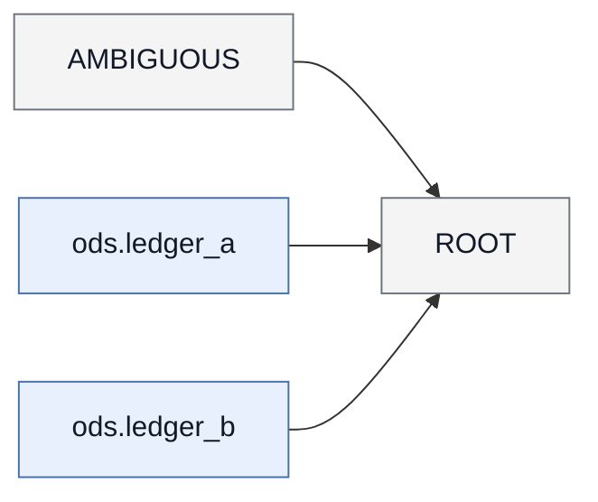

# 字段映射文档 mart.amounts

## 1. 概览

- 任务名：golden_fact_gap
- 目标：mart.amounts
- 语句类型：INSERT
- 解析状态：ok；语法状态：strict_ok
- 目标绑定：未做（调用方未提供 --target-ddl-metadata）

## 2. 来源表

| 表 | 列数（元数据） | 元数据完整 |
| --- | --- | --- |
| ods.ledger_a | 1 | 否 |
| ods.ledger_b | 1 | 否 |

## 3. 来源表关系

| 左表 | 关系 | 右表 | 连接键 | 出现 |
| --- | --- | --- | --- | --- |
| ods.ledger_a | INNER JOIN | ods.ledger_b | entry_id | 1 处 |

## 4. 字段映射总表

| # | 目标字段 | 加工类型 | 来源物理字段 | 状态 |
| --- | --- | --- | --- | --- |
| 1 | amount | DIRECT | — | ⚠ trace_incomplete |

## 5. 加工步骤明细

### 字段 mart.amounts.amount

- 来源字段：`AMBIGUOUS.amount`
- 加工路径：1 步；direct_projection
- ⚠ trace_status=incomplete: no_physical_source_fields
- 步骤 1/1：`AMBIGUOUS.amount` → `mart.amounts.amount`；direct_projection；粒度=preserved；表达式：`` `amount` ``
- 证据：mapping_chain_id=mc:001；chain=chain:ROOT:amount:position:0

## 6. 加工逻辑汇总

### scope `ROOT`（root，角色 join）

- 概要：读取 ods.ledger_a, ods.ledger_b；关联 1 个上游
- 输入：AMBIGUOUS、ods.ledger_a、ods.ledger_b；物理上游：ods.ledger_a、ods.ledger_b
- 逻辑：join 1、filter 0、聚合 0、窗口 0、union 分支 0、distinct 否
- INNER JOIN：`ods.ledger_a` ⋈ `ods.ledger_b`（@ ROOT；logic_block_id=logic:ROOT:join:001）
  - 等值键：entry_id（物理：`ods.ledger_a.entry_id = ods.ledger_b.entry_id`）

## 7. scope 结构图

- 图例：蓝底=物理表，灰底=scope

## 8. 任务依赖

- 无声明的任务依赖

## 9. 不确定性与缺口

- ⚠ 追溯不完整字段：amount
- ⚠ 缺口：evidence_path=lineage.scopes.ROOT.outputs[0]；expression_resolution_status=unresolved；expression_sql=`amount`；gap_bucket=bare_unqualified_field；gap_id=lineage_gap:0001；gap_sub_bucket=root_bare_no_unique_input；gap_type=expression_source_unresolved；needed_fact=physical or generated expression source；object_name=amount；object_type=output；owner_hint=parser_fact_backfill；root_impact=True；scope_id=ROOT；source_kind=unresolved
- 解析警告：1 条（ambiguous_unqualified 1；语义提示见同目录 warnings.md）
