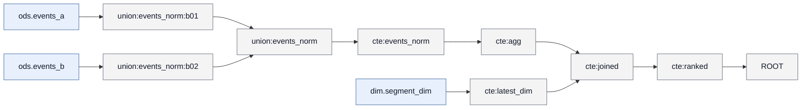

# 字段映射文档 mart.metric_by_segment

## 1. 概览

- 任务名：golden_grouped_dedup_join
- 目标：mart.metric_by_segment
- 语句类型：INSERT_OVERWRITE
- 解析状态：ok；语法状态：strict_ok
- 分区：spec=`{"dt": "20260101"}`；模式=static；分区列=dt
- 目标绑定：applied；方法=ddl_position；投影 6 → 目标列 6；纠正列 0

## 2. 来源表

| 表 | 表列数（元数据） | 使用列数 | 元数据完整 |
| --- | --- | --- | --- |
| dim.segment_dim | 3 | 3 | 是 |
| ods.events_a | 2 | 2 | 是 |
| ods.events_b | 2 | 2 | 是 |

- 过滤条件（WHERE / JOIN ON 中作用于来源表列的谓词，按表归并；HAVING 见第 6 节）：
- dim.segment_dim：无直接过滤条件
- ods.events_a：无直接过滤条件
- ods.events_b：无直接过滤条件
- 其他过滤（作用于中间结果列，未直传到物理表）：
  - `` `d`.`rn` = 1 ``（cte:latest_dim.rn；JOIN ON @ cte:joined）

## 3. 来源表关系

| 左表 | 关系 | 右表 | 连接键 | 出现 |
| --- | --- | --- | --- | --- |
| ods.events_a | LEFT_OUTER JOIN | dim.segment_dim | segment | 1 处 |
| ods.events_b | LEFT_OUTER JOIN | dim.segment_dim | seg_code = segment | 1 处 |

- UNION：union:events_norm（UNION_ALL，2 分支）；union:events_norm:b01 ← ods.events_a；union:events_norm:b02 ← ods.events_b

## 4. 字段映射总表

| # | 目标字段 | 加工类型 | 来源物理字段 | 状态 |
| --- | --- | --- | --- | --- |
| 1 | segment | DIRECT | ods.events_a.segment、ods.events_b.seg_code | ✓ |
| 2 | band | DIRECT | ods.events_a.amount、ods.events_b.amount | ✓ |
| 3 | total | DIRECT | ods.events_a.amount、ods.events_b.amount | ✓ |
| 4 | cnt | DIRECT | — | ✓ |
| 5 | band_total | DIRECT | ods.events_a.amount、ods.events_b.amount、ods.events_a.amount、ods.events_b.amount | ✓ |
| 6 | segment_name | DIRECT | dim.segment_dim.segment_name | ✓ |

## 5. 加工步骤明细

### 字段 mart.metric_by_segment.segment

- 来源字段：`ods.events_a.segment`、`ods.events_b.seg_code`
- 加工路径：8 步；direct_projection, union
- 步骤 1/8：`ods.events_a.segment` → `union:events_norm:b01.segment`；direct_projection；粒度=preserved；表达式：`` `segment` ``
- 步骤 2/8：`ods.events_b.seg_code` → `union:events_norm:b02.segment`；direct_projection；粒度=preserved；表达式：`` `seg_code` ``
- 步骤 3/8：`union:events_norm:b01.segment`、`union:events_norm:b02.segment` → `union:events_norm.segment`；union；粒度=preserved；表达式：`segment`
- 步骤 4/8：`union:events_norm.segment` → `cte:events_norm.segment`；union；粒度=preserved；表达式：`segment`
- 步骤 5/8：`cte:events_norm.segment` → `cte:agg.segment`；direct_projection；粒度=preserved；表达式：`` `segment` ``
- 步骤 6/8：`cte:agg.segment` → `cte:joined.segment`；direct_projection；粒度=preserved；表达式：`` `segment` ``
- 步骤 7/8：`cte:joined.segment` → `cte:ranked.segment`；direct_projection；粒度=preserved；表达式：`` `segment` ``
- 步骤 8/8：`cte:ranked.segment` → `mart.metric_by_segment.segment`；direct_projection；粒度=preserved；表达式：`` `segment` ``
- 证据：mapping_chain_id=mc:001；chain=chain:ROOT:segment:position:0

### 字段 mart.metric_by_segment.band

- 来源字段：`ods.events_a.amount`、`ods.events_b.amount`
- 加工路径：8 步；direct_projection, union, case_when
- 步骤 1/8：`ods.events_a.amount` → `union:events_norm:b01.amount`；direct_projection；粒度=preserved；表达式：`` `amount` ``
- 步骤 2/8：`ods.events_b.amount` → `union:events_norm:b02.amount`；direct_projection；粒度=preserved；表达式：`` `amount` ``
- 步骤 3/8：`union:events_norm:b01.amount`、`union:events_norm:b02.amount` → `union:events_norm.amount`；union；粒度=preserved；表达式：`amount`
- 步骤 4/8：`union:events_norm.amount` → `cte:events_norm.amount`；union；粒度=preserved；表达式：`amount`
- 步骤 5/8：`cte:events_norm.amount` → `cte:agg.band`；case_when；粒度=preserved；表达式：`` CASE WHEN `amount` >= 100 THEN 'HIGH' ELSE 'LOW' END ``
- 步骤 6/8：`cte:agg.band` → `cte:joined.band`；direct_projection；粒度=preserved；表达式：`` `band` ``
- 步骤 7/8：`cte:joined.band` → `cte:ranked.band`；direct_projection；粒度=preserved；表达式：`` `band` ``
- 步骤 8/8：`cte:ranked.band` → `mart.metric_by_segment.band`；direct_projection；粒度=preserved；表达式：`` `band` ``
- 证据：mapping_chain_id=mc:002；chain=chain:ROOT:band:position:1

### 字段 mart.metric_by_segment.total

- 来源字段：`ods.events_a.amount`、`ods.events_b.amount`
- 加工路径：8 步；direct_projection, union, aggregate
- 步骤 1/8：`ods.events_a.amount` → `union:events_norm:b01.amount`；direct_projection；粒度=preserved；表达式：`` `amount` ``
- 步骤 2/8：`ods.events_b.amount` → `union:events_norm:b02.amount`；direct_projection；粒度=preserved；表达式：`` `amount` ``
- 步骤 3/8：`union:events_norm:b01.amount`、`union:events_norm:b02.amount` → `union:events_norm.amount`；union；粒度=preserved；表达式：`amount`
- 步骤 4/8：`union:events_norm.amount` → `cte:events_norm.amount`；union；粒度=preserved；表达式：`amount`
- 步骤 5/8：`cte:events_norm.amount` → `cte:agg.total`；aggregate；粒度=changed；表达式：`` SUM(`amount`) ``
- 步骤 6/8：`cte:agg.total` → `cte:joined.total`；direct_projection；粒度=preserved；表达式：`` `total` ``
- 步骤 7/8：`cte:joined.total` → `cte:ranked.total`；direct_projection；粒度=preserved；表达式：`` `total` ``
- 步骤 8/8：`cte:ranked.total` → `mart.metric_by_segment.total`；direct_projection；粒度=preserved；表达式：`` `total` ``
- 证据：mapping_chain_id=mc:003；chain=chain:ROOT:total:position:2

### 字段 mart.metric_by_segment.cnt

- 来源字段：`cte:events_norm.*`
- 加工路径：4 步；aggregate, direct_projection
- 步骤 1/4：`cte:events_norm.*` → `cte:agg.cnt`；aggregate；粒度=changed；表达式：`COUNT(1)`
- 步骤 2/4：`cte:agg.cnt` → `cte:joined.cnt`；direct_projection；粒度=preserved；表达式：`` `cnt` ``
- 步骤 3/4：`cte:joined.cnt` → `cte:ranked.cnt`；direct_projection；粒度=preserved；表达式：`` `cnt` ``
- 步骤 4/4：`cte:ranked.cnt` → `mart.metric_by_segment.cnt`；direct_projection；粒度=preserved；表达式：`` `cnt` ``
- 证据：mapping_chain_id=mc:004；chain=chain:ROOT:cnt:position:3

### 字段 mart.metric_by_segment.band_total

- 来源字段：`ods.events_a.amount`、`ods.events_b.amount`
- 加工路径：10 步；direct_projection, union, case_when, aggregate, window
- 步骤 1/10：`ods.events_a.amount` → `union:events_norm:b01.amount`；direct_projection；粒度=preserved；表达式：`` `amount` ``
- 步骤 2/10：`ods.events_b.amount` → `union:events_norm:b02.amount`；direct_projection；粒度=preserved；表达式：`` `amount` ``
- 步骤 3/10：`union:events_norm:b01.amount`、`union:events_norm:b02.amount` → `union:events_norm.amount`；union；粒度=preserved；表达式：`amount`
- 步骤 4/10：`union:events_norm.amount` → `cte:events_norm.amount`；union；粒度=preserved；表达式：`amount`
- 步骤 5/10：`cte:events_norm.amount` → `cte:agg.band`；case_when；粒度=preserved；表达式：`` CASE WHEN `amount` >= 100 THEN 'HIGH' ELSE 'LOW' END ``
- 步骤 6/10：`cte:agg.band` → `cte:joined.band`；direct_projection；粒度=preserved；表达式：`` `band` ``
- 步骤 7/10：`cte:events_norm.amount` → `cte:agg.total`；aggregate；粒度=changed；表达式：`` SUM(`amount`) ``
- 步骤 8/10：`cte:agg.total` → `cte:joined.total`；direct_projection；粒度=preserved；表达式：`` `total` ``
- 步骤 9/10：`cte:joined.band`、`cte:joined.total` → `cte:ranked.band_total`；window；粒度=preserved；表达式：`` SUM(`total`) OVER (PARTITION BY `band`) ``
- 步骤 10/10：`cte:ranked.band_total` → `mart.metric_by_segment.band_total`；direct_projection；粒度=preserved；表达式：`` `band_total` ``
- 证据：mapping_chain_id=mc:005；chain=chain:ROOT:band_total:position:4

### 字段 mart.metric_by_segment.segment_name

- 来源字段：`dim.segment_dim.segment_name`
- 加工路径：4 步；direct_projection
- 步骤 1/4：`dim.segment_dim.segment_name` → `cte:latest_dim.segment_name`；direct_projection；粒度=preserved；表达式：`` `segment_name` ``
- 步骤 2/4：`cte:latest_dim.segment_name` → `cte:joined.segment_name`；direct_projection；粒度=preserved；表达式：`` `segment_name` ``
- 步骤 3/4：`cte:joined.segment_name` → `cte:ranked.segment_name`；direct_projection；粒度=preserved；表达式：`` `segment_name` ``
- 步骤 4/4：`cte:ranked.segment_name` → `mart.metric_by_segment.segment_name`；direct_projection；粒度=preserved；表达式：`` `segment_name` ``
- 证据：mapping_chain_id=mc:006；chain=chain:ROOT:segment_name:position:5

## 6. 加工逻辑汇总

### scope `cte:latest_dim`（cte，角色 dedup）

- 概要：读取 dim.segment_dim；使用窗口函数排序/去重/取值
- 输入（均为物理表）：dim.segment_dim
- 逻辑：join 0、filter 0、聚合 0、窗口 1、union 分支 0、distinct 否

### scope `union:events_norm`（union，角色 union）

- 概要：基于 union:events_norm:b01、union:events_norm:b02；合并 2 个分支；上游可追溯至 ods.events_a、ods.events_b
- 输入：union:events_norm:b01、union:events_norm:b02；物理上游：ods.events_a、ods.events_b
- 逻辑：join 0、filter 0、聚合 0、窗口 0、union 分支 2、distinct 否

### scope `cte:agg`（cte，角色 aggregate）

- 概要：基于 cte:events_norm；聚合生成指标；通过 CASE WHEN 派生字段；上游可追溯至 ods.events_a、ods.events_b
- 输入：cte:events_norm；物理上游：ods.events_a、ods.events_b
- 逻辑：join 0、filter 0、聚合 2、窗口 0、union 分支 0、distinct 否

### scope `cte:joined`（cte，角色 join）

- 概要：基于 cte:agg、cte:latest_dim；关联 1 个上游；上游可追溯至 dim.segment_dim、ods.events_a、ods.events_b
- 输入：cte:agg、cte:latest_dim；物理上游：dim.segment_dim、ods.events_a、ods.events_b
- 逻辑：join 1、filter 0、聚合 0、窗口 0、union 分支 0、distinct 否
- LEFT_OUTER JOIN：`cte:agg` ⋈ `cte:latest_dim`（@ cte:joined；logic_block_id=logic:cte:joined:join:001）
  - 等值键：segment（物理：`ods.events_a.segment = dim.segment_dim.segment`、`ods.events_b.seg_code = dim.segment_dim.segment`）
  - 附加条件：`` `d`.`rn` = 1 ``

### scope `cte:ranked`（cte，角色 window）

- 概要：基于 cte:joined；使用窗口函数排序/去重/取值；上游可追溯至 dim.segment_dim、ods.events_a、ods.events_b
- 输入：cte:joined；物理上游：dim.segment_dim、ods.events_a、ods.events_b
- 逻辑：join 0、filter 0、聚合 0、窗口 1、union 分支 0、distinct 否

### scope `ROOT`（root，角色 pass_through）

- 概要：基于 cte:ranked；上游可追溯至 dim.segment_dim、ods.events_a、ods.events_b
- 输入：cte:ranked；物理上游：dim.segment_dim、ods.events_a、ods.events_b
- 逻辑：join 0、filter 0、聚合 0、窗口 0、union 分支 0、distinct 否

## 7. scope 结构图

- 图例：蓝底=物理表，灰底=scope

## 8. 任务依赖

- 无声明的任务依赖

## 9. 不确定性与缺口

- 字段追溯：全部完整
- 缺口：无（diagnostics 未记录 lineage_fact_gaps）
- 解析警告：1 条（filter_in_join_on_clause 1；语义提示见同目录 warnings.md）
