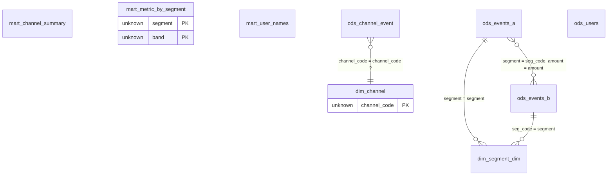

# 语料本体候选索引

共 5 个任务、9 个实体、4 条关系、5 条约束、0 条待人工判定的发现。

每条断言都带置信层级：`proven`（已证明，SQL 直接写着）、`implied`（可推得，由结构证明的推论）、`hypothesis`（作者假设，未被证明）、`conflict`（矛盾，跨任务证据打架）、`confirmed`（已确认，只来自人工回写的 `ontology.overrides.json`）。

## 实体关系总览

实体框里只列候选键列（标 `PK`），完整字段见每张表的卡片。边上的 `?` 表示这条基数只是作者假设、未被证明，`!` 表示语料里对这组键存在矛盾证据。

## 实体

| 实体 | 图中 id | 类型 | 注释 | 键置信 | 出边 | 入边 | 约束数 |
| --- | --- | --- | --- | --- | --- | --- | --- |
| [`dim.channel`](tables/dim.channel.md) | `dim_channel` | physical_table | 渠道维表（合成） | 作者假设（hypothesis） | 0 | 1 | 0 |
| [`dim.segment_dim`](tables/dim.segment_dim.md) | `dim_segment_dim` | physical_table | — | 无候选键 | 0 | 2 | 0 |
| [`mart.channel_summary`](tables/mart.channel_summary.md) | `mart_channel_summary` | produced_table | — | 无候选键 | 0 | 0 | 2 |
| [`mart.metric_by_segment`](tables/mart.metric_by_segment.md) | `mart_metric_by_segment` | produced_table | — | 已证明（proven） | 0 | 0 | 2 |
| [`mart.user_names`](tables/mart.user_names.md) | `mart_user_names` | produced_table | — | 无候选键 | 0 | 0 | 0 |
| [`ods.channel_event`](tables/ods.channel_event.md) | `ods_channel_event` | physical_table | 渠道事件明细（合成） | 无候选键 | 1 | 0 | 1 |
| [`ods.events_a`](tables/ods.events_a.md) | `ods_events_a` | physical_table | — | 无候选键 | 2 | 0 | 0 |
| [`ods.events_b`](tables/ods.events_b.md) | `ods_events_b` | physical_table | — | 无候选键 | 1 | 1 | 0 |
| [`ods.users`](tables/ods.users.md) | `ods_users` | physical_table | — | 无候选键 | 0 | 0 | 0 |

## 关系

| 关系 | 从 | 到 | 类型 | 基数 | 层级 | 依据 | 任务数 |
| --- | --- | --- | --- | --- | --- | --- | --- |
| rel:001 | `ods.channel_event`.`channel_code` | `dim.channel`.`channel_code` | join_association | many_to_one_assumed | hypothesis | right_side_not_deduplicated | 2 |
| rel:002 | `ods.events_a`.`segment` | `dim.segment_dim`.`segment` | join_association | one_to_many | implied | ranking_window | 1 |
| rel:003 | `ods.events_a`.`segment`、`amount` | `ods.events_b`.`seg_code`、`amount` | union_sibling | unknown | implied | union_branch_alignment | 1 |
| rel:004 | `ods.events_b`.`seg_code` | `dim.segment_dim`.`segment` | join_association | one_to_many | implied | ranking_window | 1 |

## 约束

| 实体 | 目标 | 约束 | 内容 | 层级 |
| --- | --- | --- | --- | --- |
| `mart.channel_summary` | `channel_name` | 取值集合（in_set） | `OFFLINE`、`ONLINE`（已封闭） | 已证明（`proven`） |
| `mart.channel_summary` | `dt` | 分区列（partition） | — | 已证明（`proven`） |
| `mart.metric_by_segment` | 整表 | 每键唯一（unique_per） | `segment`、`band`、`dt` | 已证明（`proven`） |
| `mart.metric_by_segment` | `dt` | 分区列（partition） | — | 已证明（`proven`） |
| `ods.channel_event` | `status` | 取值集合（in_set） | `ACTIVE`（是否完整未知） | 作者假设（`hypothesis`） |

## 待人工判定

本语料没有发现矛盾证据。
