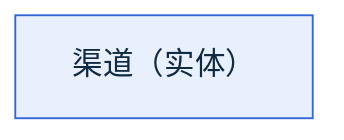
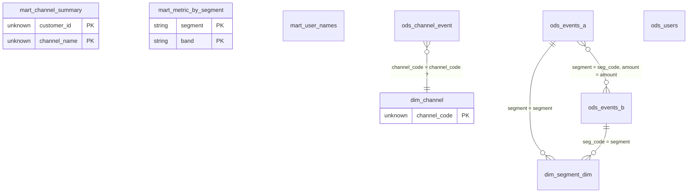

# 语料本体候选索引

共 5 个任务、9 个实体、4 条关系、6 条约束、0 条矛盾发现；待人工判定 2 条 / 2 组（已确认 0 条）。

每条断言都带置信层级：`proven`（已证明，SQL 直接写着）、`implied`（可推得，由结构证明的推论）、`hypothesis`（作者假设，未被证明）、`conflict`（矛盾，跨任务证据打架）、`confirmed`（已确认，只来自人工回写的 `ontology.overrides.json`）。

## 概念层

1 个概念、4 条概念关系，另有 8 个**临时概念**（M1：语料没能把它归到任何业务键上的表，暂时各自成一个概念，其中 4 条概念关系至少有一端是临时的）。概念是**候选**：名字永远是作者假设，种类由 `kind_evidence[]` 的投票决定，两个词根是不是同一件事留给评审那一轮判（见 `concepts.overrides.json`）。

另有 8 个临时概念未画，逐个见下面的「临时概念」表。

框里是概念名与它的种类，底色按种类分；边上的 `?` 表示这条基数只是作者假设、未被证明，括号里是实体在事件里的身份。同一个概念的两张表之间那条 JOIN 是 K1 折叠的接缝、不是业务关系，它在 `concept_representation_links[]` 里，图上不画。

### 概念

| 概念 | 种类 | 表数 | 命名候选 | 疑似重复 |
| --- | --- | --- | --- | --- |
| 渠道（`hypothesis`） | 实体（`implied`） | 2（主表 1、引用 1） | 渠道 / channel | — |

### 临时概念（每表一个，待归并）

8 张表没有归到任何业务键上，暂时各自成一个概念（`tier: "provisional"`）。评审这一轮的**第一步**就是把它们归并掉：在 `concepts.overrides.json` 里按下面的回写键写一条 `merge_into`，或者用 `new_concepts` 把几张一起收成一个新概念；确实自成一件事的，改名并确认。

| 概念 | 种类 | 表 | 回写 |
| --- | --- | --- | --- |
| segment_dim（`stem_only`） | 实体 | `dim.segment_dim` | `concept:table:dim_segment_dim` 的 `merge_into` |
| channel_summary（`stem_only`） | 实体 | `mart.channel_summary` | `concept:table:mart_channel_summary` 的 `merge_into` |
| metric_by_segment（`stem_only`） | 实体 | `mart.metric_by_segment` | `concept:table:mart_metric_by_segment` 的 `merge_into` |
| user_names（`stem_only`） | 实体 | `mart.user_names` | `concept:table:mart_user_names` 的 `merge_into` |
| 渠道事件（`hypothesis`） | 实体 | `ods.channel_event` | `concept:table:ods_channel_event` 的 `merge_into` |
| events_a（`stem_only`） | 实体 | `ods.events_a` | `concept:table:ods_events_a` 的 `merge_into` |
| events_b（`stem_only`） | 实体 | `ods.events_b` | `concept:table:ods_events_b` 的 `merge_into` |
| users（`stem_only`） | 实体 | `ods.users` | `concept:table:ods_users` 的 `merge_into` |

### 概念关系

| 类型 | 从 | 到 | 角色 | 基数 | 层级 | 证据数 |
| --- | --- | --- | --- | --- | --- | --- |
| 关联（临时） | 渠道事件 | 渠道 | — | 多对一，作者假设 | `hypothesis` | 1 |
| 关联（临时） | events_a | segment_dim | — | 一对多 | `implied` | 1 |
| 关联（临时） | events_a | events_b | — | 未知 | `implied` | 1 |
| 关联（临时） | events_b | segment_dim | — | 一对多 | `implied` | 1 |

## 实体关系总览

实体框里只列候选键列（标 `PK`），完整字段见每张表的卡片。边上的 `?` 表示这条基数只是作者假设、未被证明，`!` 表示语料里对这组键存在矛盾证据。

## 实体

| 实体 | 图中 id | 类型 | 注释 | 键置信 | 属性 | 出边 | 入边 | 约束数 |
| --- | --- | --- | --- | --- | --- | --- | --- | --- |
| [`dim.channel`](tables/dim.channel.md) | `dim_channel` | physical_table | 渠道维表（合成） | 作者假设（hypothesis） | 2（语料用到 1） | 0 | 1 | 0 |
| [`dim.segment_dim`](tables/dim.segment_dim.md) | `dim_segment_dim` | physical_table | — | 无候选键 | 3（语料用到 3） | 0 | 2 | 0 |
| [`mart.channel_summary`](tables/mart.channel_summary.md) | `mart_channel_summary` | produced_table | — | 已证明（proven） | 3（语料用到 3） | 0 | 0 | 3 |
| [`mart.metric_by_segment`](tables/mart.metric_by_segment.md) | `mart_metric_by_segment` | produced_table | — | 已证明（proven） | 7（语料用到 6） | 0 | 0 | 2 |
| [`mart.user_names`](tables/mart.user_names.md) | `mart_user_names` | produced_table | — | 无候选键 | 2（语料用到 2） | 0 | 0 | 0 |
| [`ods.channel_event`](tables/ods.channel_event.md) | `ods_channel_event` | physical_table | 渠道事件明细（合成） | 无候选键 | 4（语料用到 4） | 1 | 0 | 1 |
| [`ods.events_a`](tables/ods.events_a.md) | `ods_events_a` | physical_table | — | 无候选键 | 2（语料用到 2） | 2 | 0 | 0 |
| [`ods.events_b`](tables/ods.events_b.md) | `ods_events_b` | physical_table | — | 无候选键 | 2（语料用到 2） | 1 | 1 | 0 |
| [`ods.users`](tables/ods.users.md) | `ods_users` | physical_table | — | 无候选键 | 3（语料用到 3） | 0 | 0 | 0 |

## 关系

| 关系 | 从 | 到 | 类型 | 基数 | 层级 | 依据 | 任务数 |
| --- | --- | --- | --- | --- | --- | --- | --- |
| rel:001 | `ods.channel_event`.`channel_code` | `dim.channel`.`channel_code` | join_association | many_to_one_assumed | hypothesis | right_side_not_deduplicated | 2 |
| rel:002 | `ods.events_a`.`segment` | `dim.segment_dim`.`segment` | join_association | one_to_many | implied | ranking_window | 1 |
| rel:003 | `ods.events_a`.`segment`、`amount` | `ods.events_b`.`seg_code`、`amount` | union_sibling | unknown | implied | union_branch_alignment | 1 |
| rel:004 | `ods.events_b`.`seg_code` | `dim.segment_dim`.`segment` | join_association | one_to_many | implied | ranking_window | 1 |

## 约束

| 实体 | 目标 | 约束 | 内容 | 层级 |
| --- | --- | --- | --- | --- |
| `mart.channel_summary` | 整表 | 每键唯一（unique_per） | `customer_id`、`channel_name`、`dt` | 已证明（`proven`） |
| `mart.channel_summary` | `channel_name` | 取值集合（in_set） | `OFFLINE`、`ONLINE`（已封闭） | 已证明（`proven`） |
| `mart.channel_summary` | `dt` | 分区列（partition） | — | 已证明（`proven`） |
| `mart.metric_by_segment` | 整表 | 每键唯一（unique_per） | `segment`、`band`、`dt` | 已证明（`proven`） |
| `mart.metric_by_segment` | `dt` | 分区列（partition） | — | 已证明（`proven`） |
| `ods.channel_event` | `status` | 取值集合（in_set） | `ACTIVE`（是否完整未知） | 作者假设（`hypothesis`） |

## 待人工判定

本语料没有发现矛盾证据。

## 待人工判定清单（2 条，折叠为 2 组）

按（类型，表族，问题形状）折叠：一组是同一个问题问到一族表上，答一次即可；关系问的是「对端那张表按这组列唯一吗」，所以按对端归组，谁来关联它不进分组键。`影响` 是答完这一组能解开多少东西——关系算关联它的表数加任务数，候选键算确认后能升为已证明的边数，发现算组内条数——排序就按影响降序、其次条数、最后代表条目的原顺序。`回写模式` 里的 `<table>` 换成该族里的具体表名，就是照抄进 `ontology.overrides.json` 的键，族里有哪些表见 `families[]`，组里有哪些条目见 `open_item_groups[]`。

| # | 组 id | 类型 | 表族 | 影响 | 条数 | 代表条目 | 回写模式 | 说明 |
| --- | --- | --- | --- | --- | --- | --- | --- | --- |
| 1 | `open:group:rel:dim.channel=channel_code` | 关系基数 | `dim.channel` | 3 | 1 | `open:rel:ods.channel_event.channel_code->dim.channel.channel_code` | `关系:ods.channel_event.channel_code-><table>.channel_code` | 关系 `ods.channel_event` → `dim.channel` 的基数写作「多对一，作者假设」，依据只是直接关联未去重，作者假设对端按该键唯一。 |
| 2 | `open:group:key:dim.channel=channel_code` | 候选键 | `dim.channel` | 1 | 1 | `open:key:dim.channel=channel_code` | `键:<table>=channel_code` | 候选键 `channel_code`：只有任务直接关联时的假设，语料没有证明它唯一。 |
